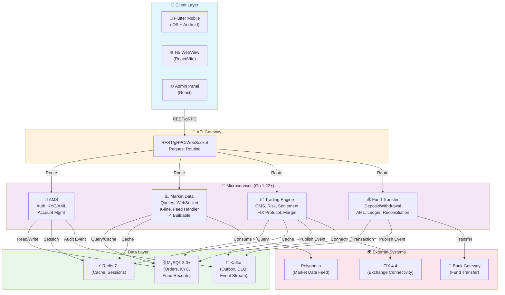

# Brokerage Trading App — Human-AI Collaborative Engineering

A cross-border securities brokerage trading application for US and Hong Kong stock markets, **developed through collaborative iteration between a human engineer and 15 specialized AI agents** powered by Claude Code.

This project demonstrates **Harness Engineering** — how a single developer can effectively orchestrate, guide, and validate work from a full AI agent team to design, architect, and implement a production-grade financial trading system. Rather than rigid process adherence (SDD/waterfall), the actual workflow emphasizes **feedback-driven iteration**, where unsatisfactory artifacts at any phase trigger re-work with adjusted guidance and context.

## What This Project Is

A mobile trading platform that enables retail investors to trade US (NYSE/NASDAQ) and HK (HKEX) equities, featuring:

- Real-time market data with WebSocket streaming
- Order management with smart order routing
- Pre-trade risk controls and margin calculation
- Fund deposit/withdrawal with AML/KYC compliance
- Cross-platform mobile app (Flutter, iOS + Android)
- H5 WebView pages for compliance forms and marketing
- Internal admin panel for operations and compliance review


## Tech Stack

- **Mobile**: Flutter 3.41.4 / Dart 3.7.x (shared UI for iOS & Android)
- **H5 WebView**: React 18+ / TypeScript 5.x / Vite / Tailwind CSS
- **Backend**: Go 1.22+ (AMS, trading engine, market data, fund transfer)
- **Admin Panel**: React 19+ / TypeScript 5.x / Ant Design Pro 6.x
- **Database**: MySQL 8.0+ / Redis 7+
- **Messaging**: Kafka
- **Protocol**: gRPC + REST, WebSocket (market data), FIX 4.4 (exchange connectivity)

## Project Structure

```
.
├── CLAUDE.md                          # Orchestration guide (routing table)
├── .claude/
│   ├── agents/                        # 8 global cross-cutting agents
│   ├── rules/                         # Financial coding standards, compliance rules
│   └── skills/                        # Custom slash commands
│
├── mobile/                            # ═══ Mobile Domain (Flutter) ═══
│   ├── CLAUDE.md                      # Domain context
│   ├── .claude/agents/                # mobile-engineer, h5-engineer
│   ├── docs/
│   │   ├── prd/                       # Surface PRDs (9 modules)
│   │   ├── design/                    # UI/UX design specs (v1–v3)
│   │   ├── specs/                     # Technical specs (JSBridge, Flutter arch)
│   │   └── threads/                   # Review threads and decisions
│   └── prototypes/                    # Interactive HTML prototypes (13 pages)
│
├── services/
│   ├── ams/                           # ═══ Account Management Service ═══
│   │   ├── CLAUDE.md
│   │   ├── .claude/agents/            # ams-engineer
│   │   └── docs/
│   │
│   ├── trading-engine/                # ═══ Trading Engine ═══
│   │   ├── CLAUDE.md
│   │   ├── .claude/agents/            # trading-engineer
│   │   ├── docs/specs/                # Trading system architecture
│   │   ├── api/grpc/                  # gRPC proto definitions
│   │   ├── internal/                  # OMS, risk, settlement, FIX, margin
│   │   └── migrations/
│   │
│   ├── market-data/                   # ═══ Market Data Service ═══ (most mature)
│   │   ├── CLAUDE.md
│   │   ├── .claude/agents/            # market-data-engineer
│   │   ├── docs/specs/                # Architecture, API spec, data flow
│   │   ├── api/grpc/                  # gRPC proto definitions
│   │   ├── cmd/server/                # Entry point
│   │   ├── internal/                  # API, service, repository, WebSocket
│   │   ├── pkg/                       # Database, cache, Kafka, Polygon client
│   │   └── go.mod                     # ✓ Buildable Go module
│   │
│   ├── fund-transfer/                 # ═══ Fund Transfer (出入金) ═══
│   │   ├── CLAUDE.md
│   │   ├── .claude/agents/            # fund-engineer
│   │   ├── docs/specs/                # Fund transfer architecture
│   │   ├── api/grpc/                  # gRPC proto definitions
│   │   ├── internal/                  # Bank, compliance, ledger, reconciliation
│   │   └── migrations/
│   │
│   └── admin-panel/                   # ═══ Admin Panel ═══
│       ├── CLAUDE.md
│       ├── .claude/agents/            # admin-panel-engineer
│       └── docs/prd/                  # Admin panel PRD
│
├── docs/                              # Cross-domain resources
│   ├── SPEC-ORGANIZATION.md           # SDD spec for repo structure
│   ├── references/                    # Industry research
│   ├── compliance/                    # Cross-jurisdiction compliance
│   ├── contracts/                     # Domain-to-domain API contracts
│   └── threads/                       # Cross-domain discussion threads
│
└── archive/                           # Frozen historical artifacts
    ├── mobile-kotlin-v3/              # Obsolete KMP mobile code
    ├── reviews-legacy/                # Stale platform-specific reviews
    ├── session-reports/               # Agent session delivery reports
    └── skills-metabot/                # Archived MetaBot skills
```

## System Architecture



## How It Works: Collaborative Iteration

Unlike traditional software development or pure AI automation, this project uses **Harness Engineering** — a hybrid approach where:

1. **Human provides direction** — high-level task, domain knowledge, strategic constraints, and quality standards
2. **AI agents execute** — break down tasks, generate specs/code/tests, work autonomously within domain boundaries
3. **Human reviews and refines** — evaluate outputs against acceptance criteria, identify gaps, and iterate
4. **Feedback loops** — unsatisfactory work at any phase (PRD, design, spec, code) triggers re-work with:
   - Clarified context or constraints
   - Example patterns or references
   - Specific acceptance criteria for next iteration
   - Adjusted agent composition (different specialist or additional context)

### Example: Trading Engine Order Lifecycle

Real workflow progression:
- **Initial attempt**: Product manager drafted order lifecycle PRD
- **Issue discovered**: Missing edge cases (GTC orders, corporate actions, cost basis tracking)
- **Iteration 1**: PM re-worked with compliance research + trading-engineer feedback on implementation feasibility
- **Iteration 2**: Domain PRD extracted from surface PRD to clarify Trading Engine responsibilities vs. Mobile UI responsibilities
- **Iteration 3**: Contract specs refined based on Trading-Mobile API gap analysis (1697-line implementation plan)
- **Result**: Stable, implementation-ready spec ready for engineering

This cycle typically repeats 2–4 times per major feature, depending on complexity. **There is no fixed SDD → Design → Code waterfall; instead, phases loop based on discovered gaps.**

### Feedback Mechanisms

Feedback is captured and preserved:

- **Active threads** (`docs/threads/`) — asynchronous discussion of open questions, research findings, and decisions
- **Spec gaps identified** — PRD checklists, alignment audits, contract gap reports
- **Decision logs** — why a design choice was made, constraints discovered, tradeoffs accepted
- **Revision history** — git commits capture "why" this iteration was necessary

## The AI Agent Team

The project is driven by **15 specialized Claude Code agents** — 8 global cross-cutting agents and 7 domain-scoped agents:

### Global Agents (`.claude/agents/`)

| Agent | Role | Typical Iteration Trigger |
|-------|------|---------------------------|
| **product-manager** | PRDs, user stories, regulatory compliance specs | Spec gaps, missing edge cases, compliance research needed |
| **ui-designer** | Screen layouts, design system, interaction patterns | UX feedback, prototype refinement, component inconsistencies |
| **qa-engineer** | Test plans, automated testing, compliance verification | Test failures, coverage gaps, missing test scenarios |
| **devops-engineer** | CI/CD, Kubernetes, monitoring | Build failures, deployment issues, scaling constraints |
| **security-engineer** | Threat modeling, encryption, audit, compliance | Security review feedback, new threat vectors, regulatory changes |
| **code-reviewer** | Mandatory quality gate for all code changes | Quality issues, arch violations, performance concerns |
| **data-analyst** | Trading analytics, regulatory reporting | New metrics needed, anomaly detection gaps, reporting requirements |
| **sdd-expert** | Spec taxonomy, repo structure, doc organization | Structure debt, cross-domain navigation issues, spec organization |

### Domain Agents (scoped to their service directory)

| Agent | Location | Role | Scope |
|-------|----------|------|-------|
| **mobile-engineer** | `mobile/.claude/agents/` | Flutter/Dart, real-time UI, biometrics | All mobile app implementation |
| **h5-engineer** | `mobile/.claude/agents/` | React/TS WebView pages, JSBridge | Compliance forms, marketing pages, cross-app navigation |
| **ams-engineer** | `services/ams/.claude/agents/` | Go auth, KYC/AML, account lifecycle | User accounts, identity verification, regulatory compliance |
| **trading-engineer** | `services/trading-engine/.claude/agents/` | Go OMS, risk, settlement, FIX protocol | Order routing, pre-trade risk, margin, post-trade settlement |
| **market-data-engineer** | `services/market-data/.claude/agents/` | Go quotes, WebSocket, feed handlers | Real-time quotes, K-line data, exchange connectors |
| **fund-engineer** | `services/fund-transfer/.claude/agents/` | Go deposit/withdrawal, AML, ledger | Bank connectivity, fund reconciliation, AML screening |
| **admin-panel-engineer** | `services/admin-panel/.claude/agents/` | React admin dashboard | Compliance review, risk monitoring, operations tooling |

### The Orchestrator

The main Claude session acts as **tech lead / orchestrator**:
- Routes tasks to appropriate agents based on domain and expertise
- Preserves context across agent handoffs via shared CLAUDE.md files and decision logs
- Reviews agent outputs against project standards and acceptance criteria
- Identifies gaps and determines whether to iterate with the same agent or escalate/delegate differently
- Maintains cross-domain consistency through contract reviews and alignment audits

## Compliance

The system is designed to comply with:

- **US**: SEC/FINRA rules (Reg NMS, PDT, Rule 17a-4)
- **Hong Kong**: SFC/AMLO requirements (KYC, Travel Rule)
- **Cross-border**: FATCA, dual-jurisdiction KYC, data residency

Compliance rules are enforced at the agent level via `.claude/rules/`.

## Status

> **This is an actively evolving project.** The directory structure, system architecture, tech choices, and agent configurations will continue to change as development progresses.

### Current Achievements

**Specification & Design (Complete)**
- [x] Product design specs (v1–v3) with interactive prototypes across 9 modules
- [x] 15 AI agents organized by domain with dedicated CLAUDE.md context files
- [x] System architecture docs (trading, market data, fund transfer, AMS)
- [x] Domain PRDs extracted from surface PRDs — clear service boundaries
- [x] Trading-Mobile contract gap analysis with 1697-line implementation plan
- [x] Domain-isolated repo structure with per-service CLAUDE.md and agent teams
- [x] Cross-domain API contracts (6 service-to-mobile, service-to-service)
- [x] Compliance specs (AML, KYC, fund transfer, audit logging)
- [x] Type definitions and error response catalogs

**Implementation (Partial)**
- [x] Market data service (Go, with WebSocket, MySQL, Redis) — **buildable**
- [x] Database migrations (goose, MySQL with financial-services compliance rules)
- [ ] Trading engine implementation (OMS, risk, settlement ready for dev)
- [ ] Fund transfer service implementation (ledger, AML, reconciliation ready)
- [ ] AMS service implementation (auth, KYC, accounts ready)
- [ ] Admin panel implementation (React, Ant Design Pro)

**Mobile/Frontend (Partial)**
- [x] High-fidelity prototypes for all 9 modules (interactive HTML)
- [x] Design system (colors, typography, components)
- [x] Low-fidelity to high-fidelity alignment audit complete
- [ ] Flutter mobile app implementation
- [ ] H5 WebView pages (compliance forms, marketing)

**Testing & Quality (Not Started)**
- [ ] Unit test suites (backend, frontend)
- [ ] Integration tests (API contracts)
- [ ] End-to-end tests (order lifecycle, fund transfer)
- [ ] Performance testing (WebSocket, Kafka load)
- [ ] Security testing (auth, encryption, compliance)

**Operations (Not Started)**
- [ ] Full backend API integration
- [ ] CI/CD pipeline (GitHub Actions)
- [ ] Kubernetes deployment manifests
- [ ] Monitoring & alerting (Prometheus, Grafana)
- [ ] Production deployment

## Iteration & Learning Artifacts

The project preserves all feedback loops and design decisions:

### Active Threads (`docs/threads/`)

Asynchronous discussion of open questions, research findings, and design decisions:

- **2026-03-domain-prd-missing** — Identified gaps in domain PRDs, triggered PRD extractions
- **2026-03-position-cost-basis** — Cost basis tracking complexity, multiple accounting methods, iteration loop
- **2026-03-trading-mobile-contract-gaps** — 19-document analysis revealing API misalignments, implementation roadmap (1697 lines)

### Audit Reports

Checkpoints to verify specification completeness:

- **PRD-COMPLETION-CHECKLIST.md** — Trading engine PRD spec coverage (549 lines, detailed acceptance criteria)
- **PRD-SPEC-ALIGNMENT-CHECK.md** — Trading engine PRD vs. system architecture alignment
- **TRADING-CONTRACT-ALIGNMENT-CHECK.md** — Cross-domain API contract validation (507 lines)
- **PROTOTYPE-PRD-INCONSISTENCY-REPORT.md** — Mobile prototype vs. PRD alignment audit (293 lines)

### Decision Logs

Preserved in commit messages and PR descriptions:

- Why a particular design was chosen (tradeoffs accepted)
- What constraints were discovered during implementation
- How feedback triggered re-work and what changed
- Example: "Extract Domain PRD from Surface PRD — clarify responsibilities" (commit `db33f73`)

## How to Navigate This Project

1. **Start here**: Read the top-level [CLAUDE.md](CLAUDE.md) — routing table for all domains and agents
2. **Pick a domain**: e.g., [services/trading-engine/CLAUDE.md](services/trading-engine/CLAUDE.md)
3. **Review specs**: Explore PRDs, domain specs, and API contracts in `docs/prd/` or `docs/specs/`
4. **Understand gaps**: Check active threads and audit reports to see current work and discovered issues
5. **Explore code**: `services/*/internal/` contains implementation (market-data is most advanced)
6. **See prototypes**: [mobile/prototypes/](mobile/prototypes/) has interactive HTML mockups for all modules

## Key Principles

This project enforces three non-negotiable principles across all code and design:

1. **No floating-point for money** — all financial calculations use `Decimal` types
2. **All timestamps UTC** — stored in UTC, converted only at display layer
3. **Audit everything** — immutable audit trails, 7-year retention (SEC Rule 17a-4)

See `.claude/rules/` for detailed financial coding standards, compliance rules, and security requirements.

## License

MIT
