# LEAN 引擎对券商 App 的借鉴参考

> **文档用途**：面向 AI 工程师，提炼 QuantConnect LEAN 开源项目中与我们券商业务强相关的设计决策、领域模型和核心流程，作为 Trading Engine / Market Data / Portfolio / Brokerage Adapter 模块的 AI agent 上下文输入。
>
> **LEAN 版本**：v2.0（Apache 2.0 开源）
> **源码路径**：`/Users/huoxd/Downloads/working/Lean`（下文引用均为相对此路径的文件）
> **生成日期**：2026-03-16

---

## 目录

**业务模型篇**
1. [整体架构脉络](#1-整体架构脉络)
2. [订单模型（Order Model）](#2-订单模型)
3. [订单生命周期与状态机](#3-订单生命周期与状态机)
4. [Pre-Trade 风控 Pipeline](#4-pre-trade-风控-pipeline)
5. [交易执行处理器（TransactionHandler）](#5-交易执行处理器)
6. [Portfolio 与 P&L 模型](#6-portfolio-与-pl-模型)
7. [Margin 与 Buying Power 模型](#7-margin-与-buying-power-模型)
8. [PDT 规则实现](#8-pdt-规则实现)
9. [Margin Call 模型](#9-margin-call-模型)
10. [IBrokerageModel：券商规则抽象](#10-ibrokeragemodel券商规则抽象)

**基础设施篇**
11. [行情订阅模型（Market Data Subscription）](#11-行情订阅模型)
12. [WebSocket 多连接管理](#12-websocket-多连接管理)
13. [Order Book 管理](#13-order-book-管理)
14. [Rate Limiting 限流基础设施](#14-rate-limiting-限流基础设施)
15. [OAuth Token 自动刷新](#15-oauth-token-自动刷新)
16. [并发消息处理器](#16-并发消息处理器)
17. [Symbol Mapping 标的映射](#17-symbol-mapping-标的映射)
18. [Market Hours & Trading Calendar](#18-market-hours--trading-calendar)
19. [Multi-Currency CashBook](#19-multi-currency-cashbook)
20. [Brokerage 抽象层](#20-brokerage-抽象层)

**分析与报表篇**
21. [TradeBuilder：成交重建与 FIFO/LIFO](#21-tradebuilder成交重建与-fifolifo)
22. [Portfolio Statistics：组合绩效指标](#22-portfolio-statistics组合绩效指标)

**总结**
23. [对我们系统的映射建议](#23-对我们系统的映射建议)
24. [附录：源码索引速查表](#24-附录源码索引速查表)

---

## 1. 整体架构脉络

### LEAN 的整体数据流

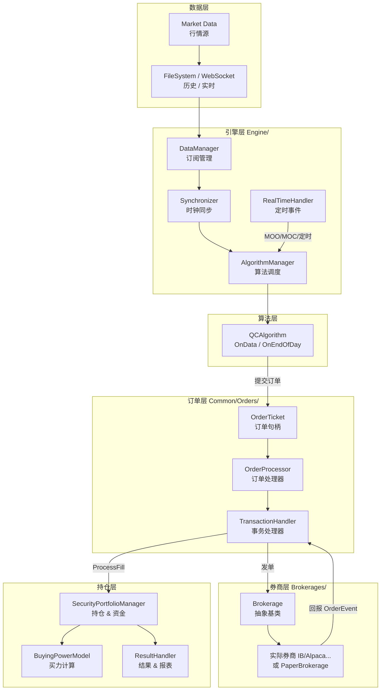
```mermaid
flowchart TD
    subgraph DataLayer["数据层"]
        MD[Market Data\n行情源]
        FS[FileSystem / WebSocket\n历史 / 实时]
    end

    subgraph EngineLayer["引擎层 Engine/"]
        DM[DataManager\n订阅管理]
        SYNC[Synchronizer\n时钟同步]
        AM[AlgorithmManager\n算法调度]
        RT[RealTimeHandler\n定时事件]
    end

    subgraph AlgoLayer["算法层"]
        ALGO[QCAlgorithm\nOnData / OnEndOfDay]
    end

    subgraph OrderLayer["订单层 Common/Orders/"]
        OT[OrderTicket\n订单句柄]
        OP[OrderProcessor\n订单处理器]
        TH[TransactionHandler\n事务处理器]
    end

    subgraph BrokerageLayer["券商层 Brokerages/"]
        BK[Brokerage\n抽象基类]
        REAL[实际券商 IB/Alpaca...\n或 PaperBrokerage]
    end

    subgraph PortfolioLayer["持仓层"]
        PM[SecurityPortfolioManager\n持仓 & 资金]
        BP[BuyingPowerModel\n买力计算]
        RH[ResultHandler\n结果 & 报表]
    end

    MD --> FS --> DM --> SYNC --> AM
    AM --> ALGO
    ALGO -->|提交订单| OT --> OP --> TH
    TH -->|发单| BK --> REAL
    REAL -->|回报 OrderEvent| TH
    TH -->|ProcessFill| PM
    PM --> BP
    PM --> RH
    RT -->|MOO/MOC/定时| AM
```

### 与我们系统的对应关系

| LEAN 模块 | 我们的模块 | 说明 |
|-----------|-----------|------|
| TransactionHandler (Brokerage) | OMS + SOR | 订单路由、Fill 回报处理 |
| SecurityPortfolioManager | Position Service | 持仓 + P&L 实时计算 |
| BuyingPowerModel | Pre-trade Risk | Reg T、PDT、买力校验 |
| IBrokerageModel | Brokerage Adapter | 各券商规则差异抽象 |
| DataFeeds / Subscription | Market Data Service | 行情推送订阅模型 |
| MultiWebSocketSubscriptionManager | Market Data WS 推送 | 多连接管理 |
| RateLimit / RateGate | API Gateway 限流 | 对上游数据源限流 |
| OAuthTokenHandler | Brokerage Auth | 对接有 OAuth 的券商 |
| DefaultOrderBook | Quote Cache | Level 1 买卖盘维护 |
| MarketHoursDatabase | Market Status Service | 开收盘时间、节假日 |
| CashBook | Account Balance | 多币种资金账户 |
| TradeBuilder | Trade History | 成交明细重建、FIFO P&L |
| PortfolioStatistics | Analytics Service | 夏普/索提诺/最大回撤 |

---

## 2. 订单模型

### 2.1 核心实体关系

> 源码：
> - `Common/Orders/Order.cs` — 订单核心字段
> - `Common/Orders/Order.cs:62` — `ContingentId`（条件单依赖）
> - `Common/Orders/Order.cs:68` — `BrokerId`（`List<string>`，支持券商拆单的 1:N 映射）
> - `Common/Orders/Order.cs:413` — `CreateOrder()` 工厂方法
> - `Common/Orders/OrderTicket.cs:98` — `AverageFillPrice`
> - `Common/Orders/OrderTicket.cs:110` — `QuantityFilled`
> - `Common/Orders/OrderTicket.cs:447` — `Cancel()`
> - `Common/Orders/OrderTicket.cs:504` — `AddOrderEvent()`（Fill 累计加权均价逻辑）
> - `Common/Orders/OrderTicket.cs:718` — `FillState`（不可变值对象，防并发 torn read）

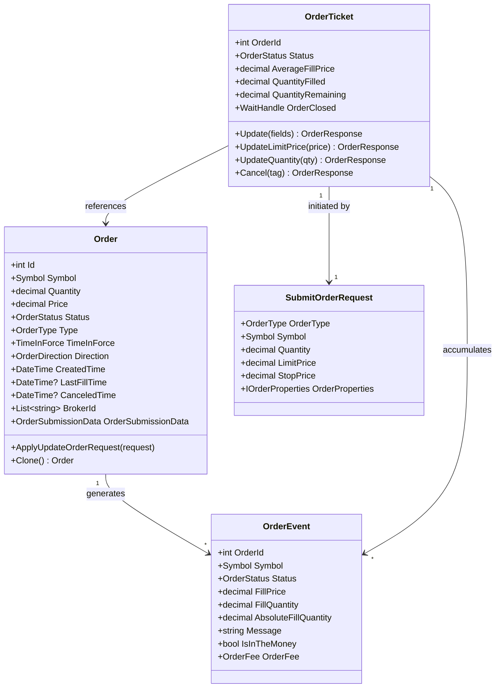
```mermaid
classDiagram
    class Order {
        +int Id
        +Symbol Symbol
        +decimal Quantity
        +decimal Price
        +OrderStatus Status
        +OrderType Type
        +TimeInForce TimeInForce
        +OrderDirection Direction
        +DateTime CreatedTime
        +DateTime? LastFillTime
        +DateTime? CanceledTime
        +List~string~ BrokerId
        +OrderSubmissionData OrderSubmissionData
        +ApplyUpdateOrderRequest(request)
        +Clone() Order
    }

    class OrderTicket {
        +int OrderId
        +OrderStatus Status
        +decimal AverageFillPrice
        +decimal QuantityFilled
        +decimal QuantityRemaining
        +Update(fields) OrderResponse
        +UpdateLimitPrice(price) OrderResponse
        +UpdateQuantity(qty) OrderResponse
        +Cancel(tag) OrderResponse
        +WaitHandle OrderClosed
    }

    class OrderEvent {
        +int OrderId
        +Symbol Symbol
        +OrderStatus Status
        +decimal FillPrice
        +decimal FillQuantity
        +decimal AbsoluteFillQuantity
        +string Message
        +bool IsInTheMoney
        +OrderFee OrderFee
    }

    class SubmitOrderRequest {
        +OrderType OrderType
        +Symbol Symbol
        +decimal Quantity
        +decimal LimitPrice
        +decimal StopPrice
        +IOrderProperties OrderProperties
    }

    Order "1" --> "*" OrderEvent : generates
    OrderTicket "1" --> "1" SubmitOrderRequest : initiated by
    OrderTicket "1" --> "*" OrderEvent : accumulates
    OrderTicket --> Order : references
```

### 2.2 订单类型（OrderType）

> 源码：`Common/Orders/OrderTypes.cs:21-82` — `OrderType` 枚举完整定义

| 类型 | 说明 | 我们是否需要 |
|------|------|-------------|
| `Market` | 市价单，立即以当前市价执行 | ✅ 必须 |
| `Limit` | 限价单，指定价格或更优才执行 | ✅ 必须 |
| `StopMarket` | 止损市价单，触及止损价后转市价 | ✅ 需要 |
| `StopLimit` | 止损限价单，触及止损价后转限价 | ✅ 需要 |
| `MarketOnOpen (MOO)` | 开盘价执行，需在开盘前提交 | ✅ 美股需要 |
| `MarketOnClose (MOC)` | 收盘价执行，需在收盘前提交 | ✅ 美股需要 |
| `TrailingStop` | 追踪止损，止损价随价格移动 | 🟡 高级功能 |
| `LimitIfTouched` | 触价限价单 | 🟡 可选 |
| `OptionExercise` | 期权行权 | ❌ 暂不需要 |
| `ComboMarket/Limit` | 多腿组合单 | ❌ 暂不需要 |

### 2.3 TimeInForce（订单时效）

> 源码：`Common/Orders/TimeInForce.cs:28-43` — 抽象基类 + 静态实例 `Day`、`GoodTilCanceled`、`GoodTilDate(DateTime)`

| 类型 | 说明 | 适用场景 |
|------|------|---------|
| `Day` | 当日有效，收盘自动撤销 | 默认 |
| `GoodTilCanceled (GTC)` | 持续有效直到手动撤销 | 长期挂单 |
| `GoodTilDate (GTD)` | 指定到期日 | 定期挂单 |
| `ImmediateOrCancel (IOC)` | 立即成交否则撤销（部分成交允许） | 快速交易 |

> **LEAN 设计亮点**：TimeInForce 是 `IOrderProperties` 的属性，而不是 OrderType 的一部分。这使得 `Limit + GTC`、`Limit + Day` 可以自由组合，不需要枚举爆炸。我们应采用同样的解耦设计。

---

## 3. 订单生命周期与状态机

### 3.1 完整状态机

> 源码：`Common/Orders/OrderTypes.cs:138-184` — `OrderStatus` 枚举，9 个状态值：
> `New=0, Submitted=1, PartiallyFilled=2, Filled=3, Canceled=5, None=6, Invalid=7, CancelPending=8, UpdateSubmitted=9`

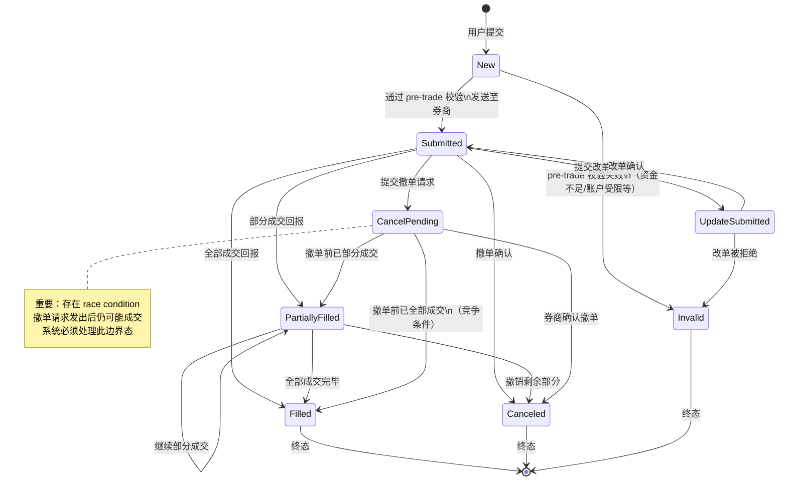
```mermaid
stateDiagram-v2
    [*] --> New : 用户提交

    New --> Submitted : 通过 pre-trade 校验\n发送至券商
    New --> Invalid : pre-trade 校验失败\n（资金不足/账户受限等）

    Submitted --> PartiallyFilled : 部分成交回报
    Submitted --> Filled : 全部成交回报
    Submitted --> Canceled : 撤单确认
    Submitted --> CancelPending : 提交撤单请求
    Submitted --> UpdateSubmitted : 提交改单请求

    PartiallyFilled --> PartiallyFilled : 继续部分成交
    PartiallyFilled --> Filled : 全部成交完毕
    PartiallyFilled --> Canceled : 撤销剩余部分

    CancelPending --> Canceled : 券商确认撤单
    CancelPending --> Filled : 撤单前已全部成交\n（竞争条件）
    CancelPending --> PartiallyFilled : 撤单前已部分成交

    UpdateSubmitted --> Submitted : 改单确认
    UpdateSubmitted --> Invalid : 改单被拒绝

    Filled --> [*] : 终态
    Canceled --> [*] : 终态
    Invalid --> [*] : 终态

    note right of CancelPending
        重要：存在 race condition
        撤单请求发出后仍可能成交
        系统必须处理此边界态
    end note
```

### 3.2 订单请求（Request）与响应（Response）模式

> 源码：
> - `Common/Orders/OrderResponseErrorCode.cs:21-203` — 完整错误码枚举
> - `Common/Orders/SubmitOrderRequest.cs`、`UpdateOrderRequest.cs`、`CancelOrderRequest.cs`

LEAN 使用 **Command 模式**管理订单操作，每个操作都是一个 Request 对象，返回 Response：

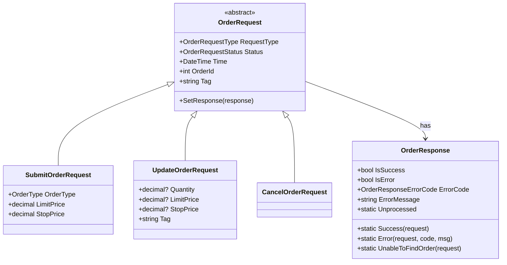
```mermaid
classDiagram
    class OrderRequest {
        <<abstract>>
        +OrderRequestType RequestType
        +OrderRequestStatus Status
        +DateTime Time
        +int OrderId
        +string Tag
        +SetResponse(response)
    }

    class SubmitOrderRequest {
        +OrderType OrderType
        +decimal LimitPrice
        +decimal StopPrice
    }

    class UpdateOrderRequest {
        +decimal? Quantity
        +decimal? LimitPrice
        +decimal? StopPrice
        +string Tag
    }

    class CancelOrderRequest {
    }

    class OrderResponse {
        +bool IsSuccess
        +bool IsError
        +OrderResponseErrorCode ErrorCode
        +string ErrorMessage
        +static Unprocessed
        +static Success(request)
        +static Error(request, code, msg)
        +static UnableToFindOrder(request)
    }

    OrderRequest <|-- SubmitOrderRequest
    OrderRequest <|-- UpdateOrderRequest
    OrderRequest <|-- CancelOrderRequest
    OrderRequest --> OrderResponse : has
```

**OrderResponseErrorCode 关键错误码**（直接映射我们的 API 错误码设计）：

| 错误码 | 含义 |
|--------|------|
| `InsufficientBuyingPower` | 资金不足 |
| `ExceedsMaximumOrderSize` | 超过最大委托量 |
| `ExceedsShortableQuantity` | 超过可做空数量 |
| `InvalidNewOrderStatus` | 不合法的状态转换 |
| `RequestCanceled` | 请求已被取消（防重复） |
| `PreOrderChecksError` | 前置校验失败（通用） |
| `BrokerageModelRefusedToSubmitOrder` | 券商模型拒绝 |
| `MarketOnCloseOrderTooLate` | MOC 提交时间过晚 |
| `ForexConversionRateZero` | 汇率为零 |

---

## 4. Pre-Trade 风控 Pipeline

### 4.1 LEAN 的 8 级校验链

> 源码入口：`Engine/TransactionHandlers/BrokerageTransactionHandler.cs:674` — `Run()` 方法处理线程主循环

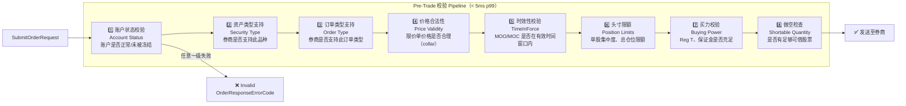
```mermaid
flowchart LR
    subgraph Pipeline["Pre-Trade 校验 Pipeline（< 5ms p99）"]
        direction TB
        C1["1️⃣ 账户状态校验\nAccount Status\n账户是否正常/未被冻结"]
        C2["2️⃣ 资产类型支持\nSecurity Type\n券商是否支持此品种"]
        C3["3️⃣ 订单类型支持\nOrder Type\n券商是否支持此订单类型"]
        C4["4️⃣ 价格合法性\nPrice Validity\n限价单价格是否合理（collar）"]
        C5["5️⃣ 时效性校验\nTimeInForce\nMOO/MOC 是否在有效时间窗口内"]
        C6["6️⃣ 头寸限额\nPosition Limits\n单股集中度、总仓位限额"]
        C7["7️⃣ 买力校验\nBuying Power\nReg T、保证金是否充足"]
        C8["8️⃣ 做空检查\nShortable Quantity\n是否有足够可借股票"]

        C1 --> C2 --> C3 --> C4 --> C5 --> C6 --> C7 --> C8
    end

    IN[SubmitOrderRequest] --> C1
    C8 --> PASS[✅ 发送至券商]
    C1 -->|任意一级失败| FAIL[❌ Invalid\nOrderResponseErrorCode]
```

### 4.2 BuyingPowerModel 接口设计

> 源码：
> - `Common/Securities/IBuyingPowerModel.cs:21-98` — 完整接口定义，8 个方法
> - `Common/Securities/BuyingPowerModel.cs` — 抽象基类（566行）
> - `Common/Securities/CashBuyingPowerModel.cs` — 现金账户实现（463行）
> - `Common/Securities/PatternDayTradingMarginModel.cs` — PDT 实现（97行）

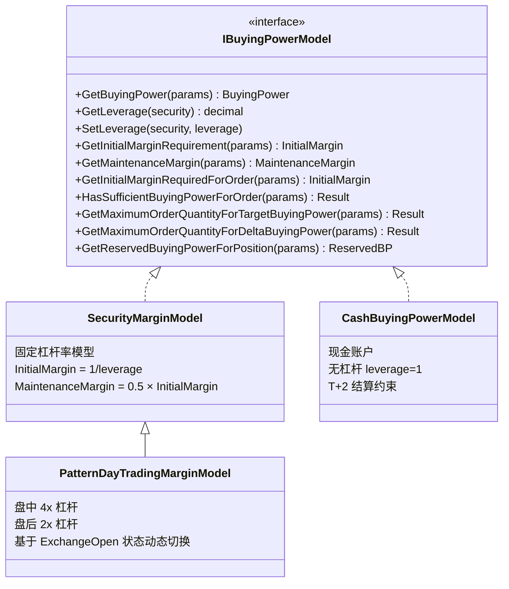
```mermaid
classDiagram
    class IBuyingPowerModel {
        <<interface>>
        +GetBuyingPower(params) BuyingPower
        +GetLeverage(security) decimal
        +SetLeverage(security, leverage)
        +GetInitialMarginRequirement(params) InitialMargin
        +GetMaintenanceMargin(params) MaintenanceMargin
        +GetInitialMarginRequiredForOrder(params) InitialMargin
        +HasSufficientBuyingPowerForOrder(params) Result
        +GetMaximumOrderQuantityForTargetBuyingPower(params) Result
        +GetMaximumOrderQuantityForDeltaBuyingPower(params) Result
        +GetReservedBuyingPowerForPosition(params) ReservedBP
    }

    class SecurityMarginModel {
        固定杠杆率模型
        InitialMargin = 1/leverage
        MaintenanceMargin = 0.5 × InitialMargin
    }

    class PatternDayTradingMarginModel {
        盘中 4x 杠杆
        盘后 2x 杠杆
        基于 ExchangeOpen 状态动态切换
    }

    class CashBuyingPowerModel {
        现金账户
        无杠杆 leverage=1
        T+2 结算约束
    }

    IBuyingPowerModel <|.. SecurityMarginModel
    SecurityMarginModel <|-- PatternDayTradingMarginModel
    IBuyingPowerModel <|.. CashBuyingPowerModel
```

---

## 5. 交易执行处理器

### 5.1 BrokerageTransactionHandler 核心流程

> 源码：`Engine/TransactionHandlers/BrokerageTransactionHandler.cs`（1,963行）
> - `:674` — `Run(threadId)` — 处理线程主循环，出队并处理订单请求
> - `:708` — `ProcessSynchronousEvents()` — 同步事件处理（MOC/MOO 定时触发）
> - `:1387` — `HandleOrderEvent(orderEvent)` — Fill 回报处理，更新 Order.Status 和 Ticket.FillState

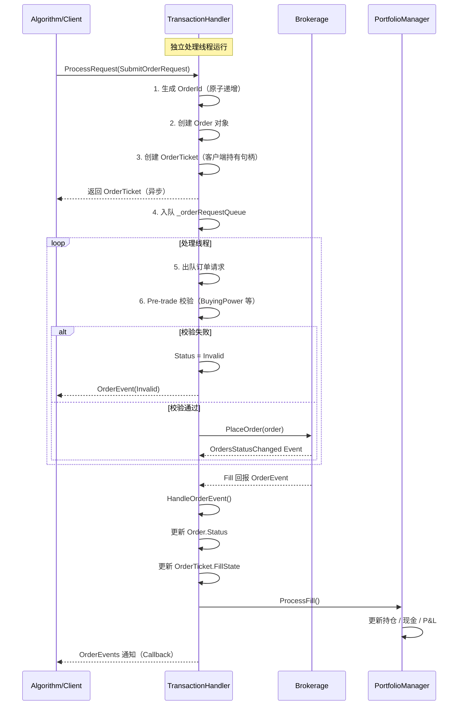
```mermaid
sequenceDiagram
    participant A as Algorithm/Client
    participant TH as TransactionHandler
    participant BK as Brokerage
    participant PM as PortfolioManager

    Note over TH: 独立处理线程运行

    A->>TH: ProcessRequest(SubmitOrderRequest)
    TH->>TH: 1. 生成 OrderId（原子递增）
    TH->>TH: 2. 创建 Order 对象
    TH->>TH: 3. 创建 OrderTicket（客户端持有句柄）
    TH-->>A: 返回 OrderTicket（异步）

    TH->>TH: 4. 入队 _orderRequestQueue

    loop 处理线程
        TH->>TH: 5. 出队订单请求
        TH->>TH: 6. Pre-trade 校验（BuyingPower 等）
        alt 校验失败
            TH->>TH: Status = Invalid
            TH-->>A: OrderEvent(Invalid)
        else 校验通过
            TH->>BK: PlaceOrder(order)
            BK-->>TH: OrdersStatusChanged Event
        end
    end

    BK-->>TH: Fill 回报 OrderEvent
    TH->>TH: HandleOrderEvent()
    TH->>TH: 更新 Order.Status
    TH->>TH: 更新 OrderTicket.FillState
    TH->>PM: ProcessFill()
    PM->>PM: 更新持仓 / 现金 / P&L
    TH-->>A: OrderEvents 通知（Callback）
```

### 5.2 并发安全设计要点

> 源码关键位置：
> - `Common/Orders/Order.cs:33` — `volatile int _incrementalId`（原子 OrderId）
> - `Common/Orders/OrderTicket.cs:31` — `_lock` 对象锁
> - `Common/Orders/OrderTicket.cs:718` — `FillState` 不可变内部类（防 torn read）
> - `Common/Orders/OrderTicket.cs:594` — `TrySetCancelRequest()` 防重复取消

| 设计点 | LEAN 实现 | 我们的启示 |
|--------|-----------|-----------|
| OrderId 生成 | `Interlocked.Increment` 原子操作 | 分布式场景用 Snowflake / DB sequence |
| 订单状态更新 | `lock(_order)` + immutable clone | 状态更新用 CAS 或数据库乐观锁 |
| Fill 状态 | `FillState` 不可变值对象 + 替换引用 | 避免 decimal 更新时的 torn read |
| 取消防重 | `CancelRequest` 只能设置一次 | 幂等性：同一撤单请求不重复处理 |
| BrokerId 映射 | `List<string> BrokerId` | 券商可能将一笔订单拆分，需 1:N 映射 |

---

## 6. Portfolio 与 P&L 模型

### 6.1 SecurityPortfolioManager 数据模型

> 源码：`Common/Securities/SecurityPortfolioManager.cs`（950行）
> - `:429` — `TotalPortfolioValue` 属性
> - `:745` — `ProcessFills(List<OrderEvent> fills)` — Fill 后更新持仓和现金的核心方法

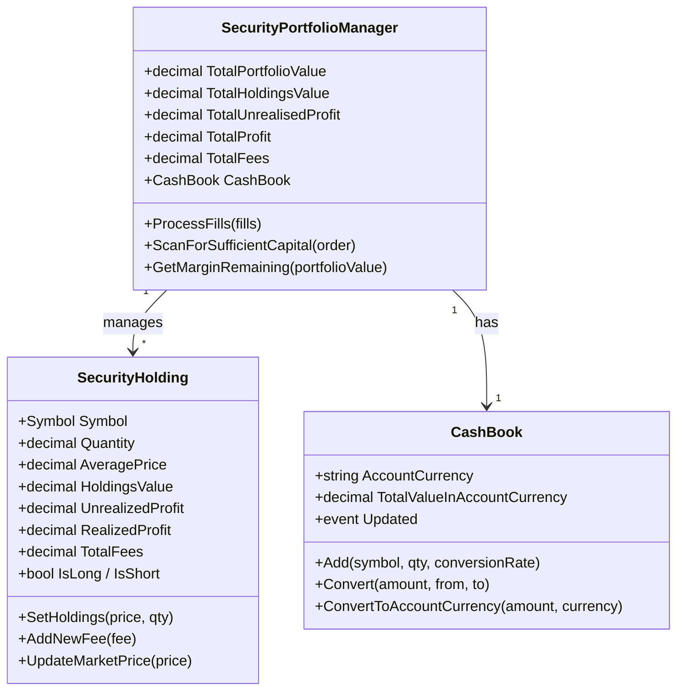
```mermaid
classDiagram
    class SecurityPortfolioManager {
        +decimal TotalPortfolioValue
        +decimal TotalHoldingsValue
        +decimal TotalUnrealisedProfit
        +decimal TotalProfit
        +decimal TotalFees
        +CashBook CashBook
        +ProcessFills(fills)
        +ScanForSufficientCapital(order)
        +GetMarginRemaining(portfolioValue)
    }

    class SecurityHolding {
        +Symbol Symbol
        +decimal Quantity
        +decimal AveragePrice
        +decimal HoldingsValue
        +decimal UnrealizedProfit
        +decimal RealizedProfit
        +decimal TotalFees
        +bool IsLong / IsShort
        +SetHoldings(price, qty)
        +AddNewFee(fee)
        +UpdateMarketPrice(price)
    }

    class CashBook {
        +string AccountCurrency
        +decimal TotalValueInAccountCurrency
        +Add(symbol, qty, conversionRate)
        +Convert(amount, from, to)
        +ConvertToAccountCurrency(amount, currency)
        +event Updated
    }

    SecurityPortfolioManager "1" --> "*" SecurityHolding : manages
    SecurityPortfolioManager "1" --> "1" CashBook : has
```

### 6.2 Fill 处理后的 P&L 更新流程

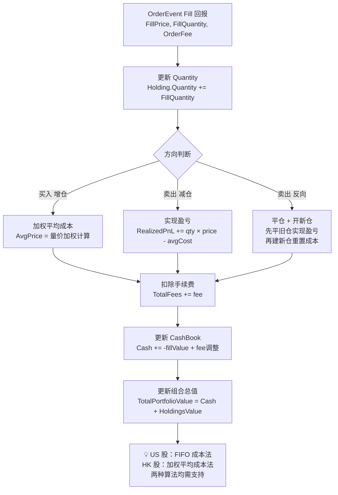
```mermaid
flowchart TD
    FE[OrderEvent Fill 回报\nFillPrice, FillQuantity, OrderFee]

    FE --> UQ[更新 Quantity\nHolding.Quantity += FillQuantity]
    UQ --> DIR{方向判断}

    DIR -->|买入 增仓| INC[加权平均成本\nAvgPrice = 量价加权计算]
    DIR -->|卖出 减仓| DEC[实现盈亏\nRealizedPnL += qty × price - avgCost]
    DIR -->|卖出 反向| REV[平仓 + 开新仓\n先平旧仓实现盈亏\n再建新仓重置成本]

    INC --> FEE[扣除手续费\nTotalFees += fee]
    DEC --> FEE
    REV --> FEE

    FEE --> CASH[更新 CashBook\nCash += -fillValue + fee调整]
    CASH --> UPV[更新组合总值\nTotalPortfolioValue = Cash + HoldingsValue]

    UPV --> NOTE["💡 US 股：FIFO 成本法\nHK 股：加权平均成本法\n两种算法均需支持"]
```

### 6.3 关键指标计算公式

```
未实现盈亏 = (当前市价 - 平均成本价) × 持仓量
已实现盈亏 = 历次卖出时累计的已实现收益
总持仓市值 = Σ(持仓量 × 当前市价 × 汇率换算系数)
账户总值   = 可用现金(折算) + 总持仓市值
可用买力   = 账户总值 × 杠杆率 - 已用保证金
保证金余量 = 可用买力 - 当前订单所需保证金
```

---

## 7. Margin 与 Buying Power 模型

### 7.1 Reg T 保证金规则（美股 Margin 账户）

> 源码：`Common/Securities/BuyingPowerModel.cs`（566行）核心方法 `HasSufficientBuyingPowerForOrder()`

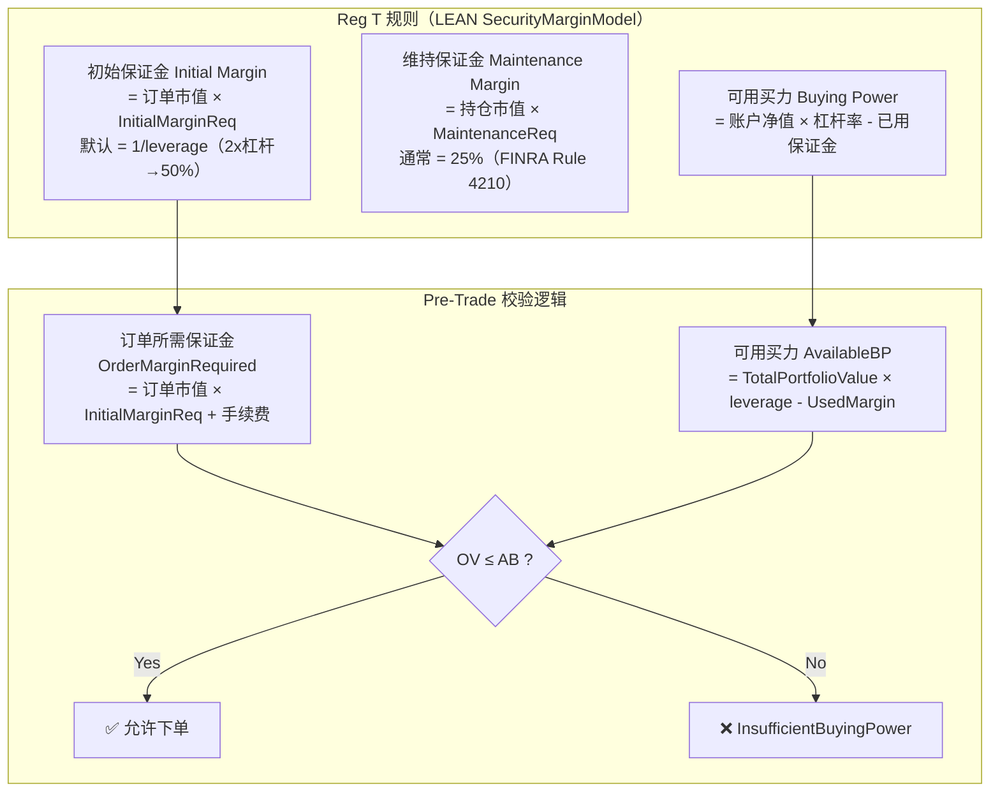
```mermaid
flowchart TD
    subgraph RegT["Reg T 规则（LEAN SecurityMarginModel）"]
        IM["初始保证金 Initial Margin\n= 订单市值 × InitialMarginReq\n默认 = 1/leverage（2x杠杆→50%）"]
        MM["维持保证金 Maintenance Margin\n= 持仓市值 × MaintenanceReq\n通常 = 25%（FINRA Rule 4210）"]
        BP["可用买力 Buying Power\n= 账户净值 × 杠杆率 - 已用保证金"]
    end

    subgraph Check["Pre-Trade 校验逻辑"]
        OV["订单所需保证金\nOrderMarginRequired\n= 订单市值 × InitialMarginReq + 手续费"]
        AB["可用买力 AvailableBP\n= TotalPortfolioValue × leverage - UsedMargin"]
        CMP{OV ≤ AB ?}
        CMP -->|Yes| OK["✅ 允许下单"]
        CMP -->|No| FAIL["❌ InsufficientBuyingPower"]
    end

    IM --> OV
    BP --> AB
    OV --> CMP
    AB --> CMP
```

### 7.2 不同账户类型的保证金差异

| 账户类型 | LEAN 模型 | 杠杆率 | 适用场景 |
|---------|-----------|--------|---------|
| 现金账户 | `CashBuyingPowerModel` | 1x（无杠杆） | 港股零售 / 美股 Cash |
| 融资账户（正常） | `SecurityMarginModel` | 2x（Reg T） | 美股标准 Margin |
| PDT 账户（盘中） | `PatternDayTradingMarginModel` | 4x（开市时） | 活跃日内交易者 |
| PDT 账户（盘后） | `PatternDayTradingMarginModel` | 2x（闭市时） | 同上，盘后降杠杆 |

---

## 8. PDT 规则实现

### 8.1 PDT 规则逻辑（LEAN PatternDayTradingMarginModel）

> 源码：`Common/Securities/PatternDayTradingMarginModel.cs`（97行，推荐全读）
> - `:39` — 构造函数，默认 `closedLeverage=2x`，`openLeverage=4x`
> - `:62` — `GetLeverage()` — 根据 `ExchangeOpen` 状态返回 4x 或 2x
> - `:70` — `GetInitialMarginRequirement()` — 乘以修正系数
> - `:90` — `GetMarginCorrectionFactor()` — 核心判断：`ExchangeOpen && !ClosingSoon ? 1 : correctionFactor`

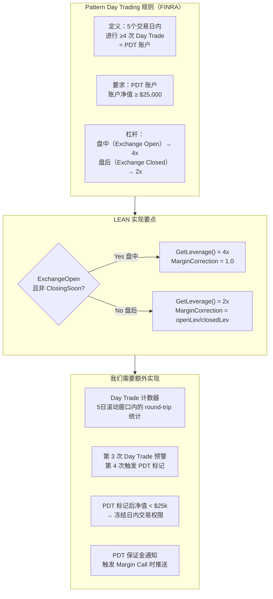
```mermaid
flowchart TD
    subgraph PDT["Pattern Day Trading 规则（FINRA）"]
        DEF["定义：5个交易日内\n进行 ≥4 次 Day Trade\n= PDT 账户"]
        REQ["要求：PDT 账户\n账户净值 ≥ $25,000"]
        LEV["杠杆：\n盘中（Exchange Open）→ 4x\n盘后（Exchange Closed）→ 2x"]
    end

    subgraph Impl["LEAN 实现要点"]
        CHK{ExchangeOpen\n且非 ClosingSoon?}
        CHK -->|Yes 盘中| L4["GetLeverage() = 4x\nMarginCorrection = 1.0"]
        CHK -->|No 盘后| L2["GetLeverage() = 2x\nMarginCorrection = openLev/closedLev"]
    end

    subgraph OurImpl["我们需要额外实现"]
        DTR["Day Trade 计数器\n5日滚动窗口内的 round-trip 统计"]
        WARN["第 3 次 Day Trade 预警\n第 4 次触发 PDT 标记"]
        LOCK["PDT 标记后净值 < $25k\n→ 冻结日内交易权限"]
        MARGIN["PDT 保证金通知\n触发 Margin Call 时推送"]
    end

    PDT --> Impl
    Impl --> OurImpl
```

### 8.2 Day Trade 计数规则

```
Day Trade = 同一交易日内同一标的的开仓 + 平仓（round-trip）

计数示例（5日滚动窗口）：
Day1: 买入 AAPL 100股 → 卖出 AAPL 100股  = 1 次 Day Trade
Day2: 买入 TSLA 50股  → 卖出 TSLA 50股   = 1 次 Day Trade
Day3: （无操作）
Day4: 买入 NVDA + 卖出                   = 1 次 Day Trade
Day5: 买入 AAPL + 卖出                   = 1 次 Day Trade → 第4次，触发 PDT 标记

规则细节：
- 隔夜持仓的买入/卖出不算 Day Trade
- 部分成交也可能触发计数（按 round-trip 的完成量计）
- 5日窗口是滚动的（T-4 到今天）
```

---

## 9. Margin Call 模型

### 9.1 Margin Call 触发逻辑

> 源码：
> - `Common/Securities/IMarginCallModel.cs` — 接口定义（70行）
> - `Common/Securities/DefaultMarginCallModel.cs` — 实现（231行）
> - `:60` — 构造函数，默认 `marginBuffer=0.10m`（10% 缓冲）
> - `:73` — `GetMarginCallOrders()` — 检查是否需要 Margin Call，返回强平订单列表
> - `:89` — 5% Margin 余量预警阈值
> - `:100` — 触发条件：`totalMarginUsed > totalPortfolioValue × (1 + marginBuffer)`
> - `:125` — `GenerateMarginCallOrders()` — 计算需强平的金额，生成具体订单
> - `:187` — `ExecuteMarginCall()` — 按亏损从大到小排序执行强平

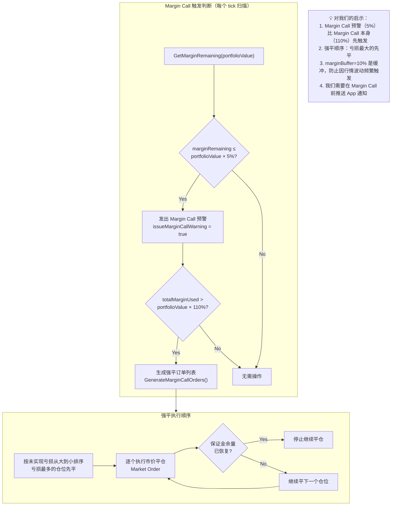
```mermaid
flowchart TD
    subgraph Trigger["Margin Call 触发判断（每个 tick 扫描）"]
        T1["GetMarginRemaining(portfolioValue)"]
        T2{marginRemaining ≤\nportfolioValue × 5%?}
        T3["发出 Margin Call 预警\nissueMarginCallWarning = true"]
        T4{totalMarginUsed >\nportfolioValue × 110%?}
        T5["生成强平订单列表\nGenerateMarginCallOrders()"]
        T6["无需操作"]

        T1 --> T2
        T2 -->|Yes| T3 --> T4
        T2 -->|No| T6
        T4 -->|Yes| T5
        T4 -->|No| T6
    end

    subgraph Execute["强平执行顺序"]
        E1["按未实现亏损从大到小排序\n亏损最多的仓位先平"]
        E2["逐个执行市价平仓\nMarket Order"]
        E3{保证金余量\n已恢复?}
        E4["停止继续平仓"]
        E5["继续平下一个仓位"]

        E1 --> E2 --> E3
        E3 -->|Yes| E4
        E3 -->|No| E5 --> E2
    end

    T5 --> Execute

    NOTE["💡 对我们的启示：\n1. Margin Call 预警（5%）比 Margin Call 本身（110%）先触发\n2. 强平顺序：亏损最大的先平\n3. marginBuffer=10% 是缓冲，防止因行情波动频繁触发\n4. 我们需要在 Margin Call 前推送 App 通知"]
```

### 9.2 Margin Call 与 Margin Warning 的差异

| 事件 | 触发条件 | 处理方式 |
|------|---------|---------|
| Margin Warning | `marginRemaining ≤ 5% × portfolioValue` | 推送通知，不强平 |
| Margin Call | `totalMarginUsed > 110% × portfolioValue` | 自动生成市价平仓单 |
| 强平完成条件 | `marginRemaining > 0` | 停止强平，无需完全平仓 |

---

## 10. IBrokerageModel：券商规则抽象

### 10.1 每个券商的规则差异抽象

> 源码：`Common/Brokerages/IBrokerageModel.cs`（406行）
> - `:39` — `AccountType` 属性（Cash / Margin）
> - `:48` — `RequiredFreeBuyingPowerPercent`（必须保留的自由买力百分比）
> - `:69` — `CanSubmitOrder()` — 校验是否允许提交此订单
> - `:79` — `CanUpdateOrder()` — 校验是否允许改单
> - `:105` — `GetLeverage()` — 返回该券商对此标的的杠杆率
> - `:119` — `GetFillModel()` — 获取撮合模型
> - `:126` — `GetFeeModel()` — 获取手续费模型
> - `:163` — `GetBuyingPowerModel()` — 获取买力模型
> - `:193` — `BrokerageModel.Create()` — 工厂方法，按 BrokerageName 创建对应模型

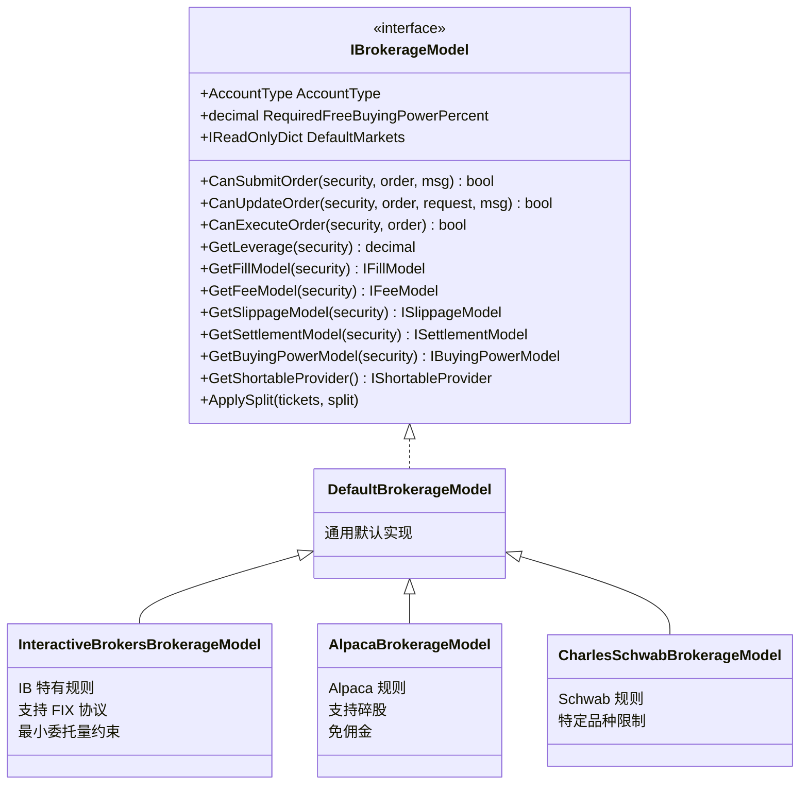
```mermaid
classDiagram
    class IBrokerageModel {
        <<interface>>
        +AccountType AccountType
        +decimal RequiredFreeBuyingPowerPercent
        +IReadOnlyDict DefaultMarkets

        +CanSubmitOrder(security, order, msg) bool
        +CanUpdateOrder(security, order, request, msg) bool
        +CanExecuteOrder(security, order) bool

        +GetLeverage(security) decimal
        +GetFillModel(security) IFillModel
        +GetFeeModel(security) IFeeModel
        +GetSlippageModel(security) ISlippageModel
        +GetSettlementModel(security) ISettlementModel
        +GetBuyingPowerModel(security) IBuyingPowerModel
        +GetShortableProvider() IShortableProvider
        +ApplySplit(tickets, split)
    }

    class DefaultBrokerageModel {
        通用默认实现
    }

    class InteractiveBrokersBrokerageModel {
        IB 特有规则
        支持 FIX 协议
        最小委托量约束
    }

    class AlpacaBrokerageModel {
        Alpaca 规则
        支持碎股
        免佣金
    }

    class CharlesSchwabBrokerageModel {
        Schwab 规则
        特定品种限制
    }

    IBrokerageModel <|.. DefaultBrokerageModel
    DefaultBrokerageModel <|-- InteractiveBrokersBrokerageModel
    DefaultBrokerageModel <|-- AlpacaBrokerageModel
    DefaultBrokerageModel <|-- CharlesSchwabBrokerageModel
```

**对我们的启示**：每个券商（Alpaca、IB、TradeStation 等）在以下维度存在差异，需要独立实现：

| 差异维度 | 示例 |
|---------|------|
| 手续费结构 | Alpaca 免佣，IB 按股收费 |
| 支持的订单类型 | 不是所有券商都支持 MOO/MOC |
| 最小委托量 | 港股有手数限制 |
| 碎股支持 | Alpaca 支持，IB 部分支持 |
| 杠杆比例 | 各券商 Reg T 执行有差异 |
| 结算周期 | US T+1，HK T+2 |
| Short selling 可借池 | 各券商不同 |

---

## 11. 行情订阅模型

### 11.1 Subscription 数据模型

> 源码：
> - `Common/Data/SubscriptionDataConfig.cs:29` — 类定义（实现 `IEquatable`，可用作 Dict Key）
> - `Common/Data/SubscriptionDataConfig.cs:42` — `Type` 字段
> - `Common/Data/SubscriptionDataConfig.cs:52` — `Symbol` 字段
> - `Common/Data/SubscriptionDataConfig.cs:62` — `Resolution` 字段
> - `Engine/DataFeeds/Subscription.cs` — 单个订阅实例（309行）
> - `Engine/DataFeeds/DataManager.cs` — 订阅生命周期管理（768行）

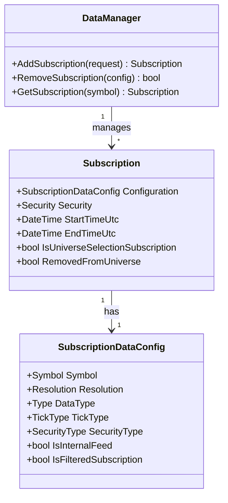
```mermaid
classDiagram
    class SubscriptionDataConfig {
        +Symbol Symbol
        +Resolution Resolution
        +Type DataType
        +TickType TickType
        +SecurityType SecurityType
        +bool IsInternalFeed
        +bool IsFilteredSubscription
    }

    class Subscription {
        +SubscriptionDataConfig Configuration
        +Security Security
        +DateTime StartTimeUtc
        +DateTime EndTimeUtc
        +bool IsUniverseSelectionSubscription
        +bool RemovedFromUniverse
    }

    class DataManager {
        +AddSubscription(request) Subscription
        +RemoveSubscription(config) bool
        +GetSubscription(symbol) Subscription
    }

    Subscription "1" --> "1" SubscriptionDataConfig : has
    DataManager "1" --> "*" Subscription : manages
```

**LEAN 三元组设计映射到我们的订阅模型：**

| LEAN 字段 | 我们的对应 | 取值举例 |
|-----------|-----------|---------|
| `Symbol` | 股票代码 | `AAPL`, `0700.HK` |
| `Resolution` | 推送频率 | `Tick`=实时, `Minute`=分钟快照 |
| `TickType` | 数据类型 | `Trade`=成交价, `Quote`=买卖报价 |

### 11.2 行情状态机

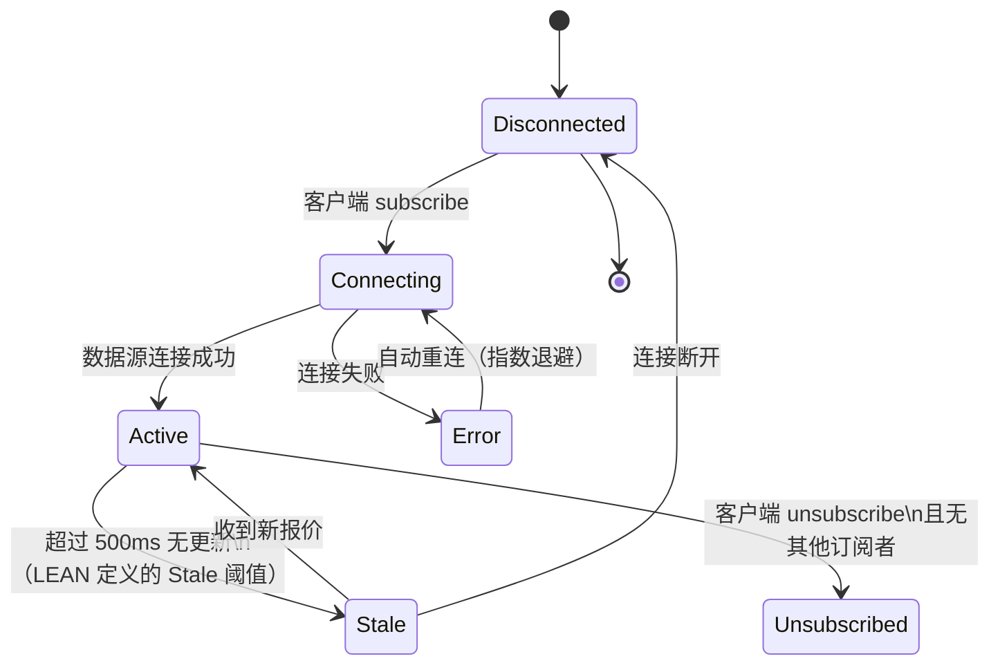
```mermaid
stateDiagram-v2
    [*] --> Disconnected

    Disconnected --> Connecting : 客户端 subscribe
    Connecting --> Active : 数据源连接成功
    Connecting --> Error : 连接失败

    Active --> Stale : 超过 500ms 无更新\n（LEAN 定义的 Stale 阈值）
    Stale --> Active : 收到新报价
    Stale --> Disconnected : 连接断开

    Active --> Unsubscribed : 客户端 unsubscribe\n且无其他订阅者
    Error --> Connecting : 自动重连（指数退避）
    Disconnected --> [*]
```

---

## 12. WebSocket 多连接管理

### 12.1 BrokerageMultiWebSocketSubscriptionManager 设计

> 源码：`Brokerages/BrokerageMultiWebSocketSubscriptionManager.cs`
> - `:31` — 类定义
> - `:33-46` — 核心字段（`_maximumSymbolsPerWebSocket`、`_maximumWebSocketConnections`、`_connectionRateLimiter`、`_reconnectTimer`）
> - `:61-128` — 构造函数，初始化连接池和定时重连器
> - `:81` — 默认 Rate Limiter：5 连接/12秒（防 DOS）
> - `:135` — `Subscribe()` — 订阅时分配 WebSocket
> - `:156` — `Unsubscribe()` — 取消订阅
> - `:218` — `GetWebSocketForSymbol()` — 将 Symbol 分配到合适的 WebSocket 实例
> - `:264` — `CreateWebSocket()` — 创建新 WebSocket 并注册事件
> - `:280` — `Connect()` — 连接时调用 `_connectionRateLimiter.WaitToProceed()` 限速

```mermaid
flowchart TD
    subgraph Pool["WebSocket 连接池"]
        WS1["WebSocket #1\n最多 100 个 Symbol"]
        WS2["WebSocket #2\n最多 100 个 Symbol"]
        WS3["WebSocket #3\n最多 100 个 Symbol"]
        WSN["WebSocket #N\n上限 50 个连接"]
    end

    subgraph RateCtrl["连接速率控制"]
        RG["RateGate\n5次连接 / 12秒\n防止 DOS 对方服务器"]
    end

    subgraph Reconnect["定时重连"]
        TIMER["每日重连 Timer\n防止长连接僵死\n4 度并行重连"]
    end

    CLIENT["行情服务\nSymbol 订阅请求"]
    UPSTREAM["上游数据源\nPolygon.io / HKEX"]

    CLIENT -->|subscribe(AAPL)| ALLOC["GetWebSocketForSymbol()\n选择 Symbol 数最少的 WS"]
    ALLOC --> WS1
    ALLOC --> WS2
    ALLOC --> WS3

    WS1 --> RG --> UPSTREAM
    WS2 --> RG
    WS3 --> RG

    TIMER -->|定时重连| WS1
    TIMER -->|定时重连| WS2
    TIMER -->|定时重连| WS3

    UPSTREAM -->|quote events| WS1
    UPSTREAM -->|quote events| WS2
```

### 12.2 关键参数与我们系统的映射

| LEAN 参数 | 默认值 | 含义 | 我们的建议 |
|-----------|--------|------|-----------|
| `_maximumSymbolsPerWebSocket` | 100 | 每个 WS 最多订阅几个 Symbol | Polygon.io 免费版 1 连接，付费版可多连接 |
| `_maximumWebSocketConnections` | 50 | 最大并发连接数 | 按数据源限制设定 |
| `_connectionRateLimiter` | 5次/12秒 | 新建连接的速率 | 避免因快速重连被封 IP |
| `ConnectionTimeout` | 30秒 | 连接超时 | 移动网络可适当调长 |

---

## 13. Order Book 管理

### 13.1 DefaultOrderBook 设计

> 源码：`Brokerages/DefaultOrderBook.cs`（241行）
> - `:27` — 类定义，实现 `IOrderBookUpdater<decimal, decimal>`
> - `:53` — `BestBidAskUpdated` 事件（每次最优价变化时触发）
> - `:58` — `BestBidPrice` 属性（内部从 `SortedDictionary` 取最优 bid）
> - `:86` — `BestAskPrice` 属性
> - `:123` — `Clear()` — 清空全部 bid/ask
> - `:142` — `UpdateBidRow(price, size)` — 更新或新增 bid 档位
> - `:163` — `UpdateAskRow(price, size)` — 更新或新增 ask 档位
> - `:183` — `RemoveBidRow(price)` — 删除 bid 档位
> - `:225` — `RemovePriceLevel(price)` — 通用档位删除

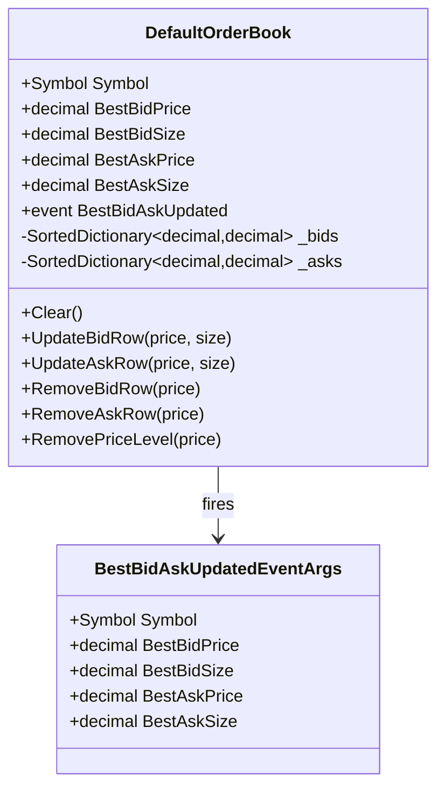
```mermaid
classDiagram
    class DefaultOrderBook {
        +Symbol Symbol
        +decimal BestBidPrice
        +decimal BestBidSize
        +decimal BestAskPrice
        +decimal BestAskSize
        +event BestBidAskUpdated

        -SortedDictionary~decimal,decimal~ _bids
        -SortedDictionary~decimal,decimal~ _asks

        +Clear()
        +UpdateBidRow(price, size)
        +UpdateAskRow(price, size)
        +RemoveBidRow(price)
        +RemoveAskRow(price)
        +RemovePriceLevel(price)
    }

    class BestBidAskUpdatedEventArgs {
        +Symbol Symbol
        +decimal BestBidPrice
        +decimal BestBidSize
        +decimal BestAskPrice
        +decimal BestAskSize
    }

    DefaultOrderBook --> BestBidAskUpdatedEventArgs : fires
```

**数据结构选择**：LEAN 用 `SortedDictionary`（红黑树）维护 bid/ask 档位：
- Bid：按价格**降序**，取第一个 = 最优买价
- Ask：按价格**升序**，取第一个 = 最优卖价
- 更新/删除时间复杂度：O(log n)
- 适合档位数量不超过几百档的场景

---

## 14. Rate Limiting 限流基础设施

### 14.1 三种限流实现

> 源码：`Common/Util/RateLimit/`

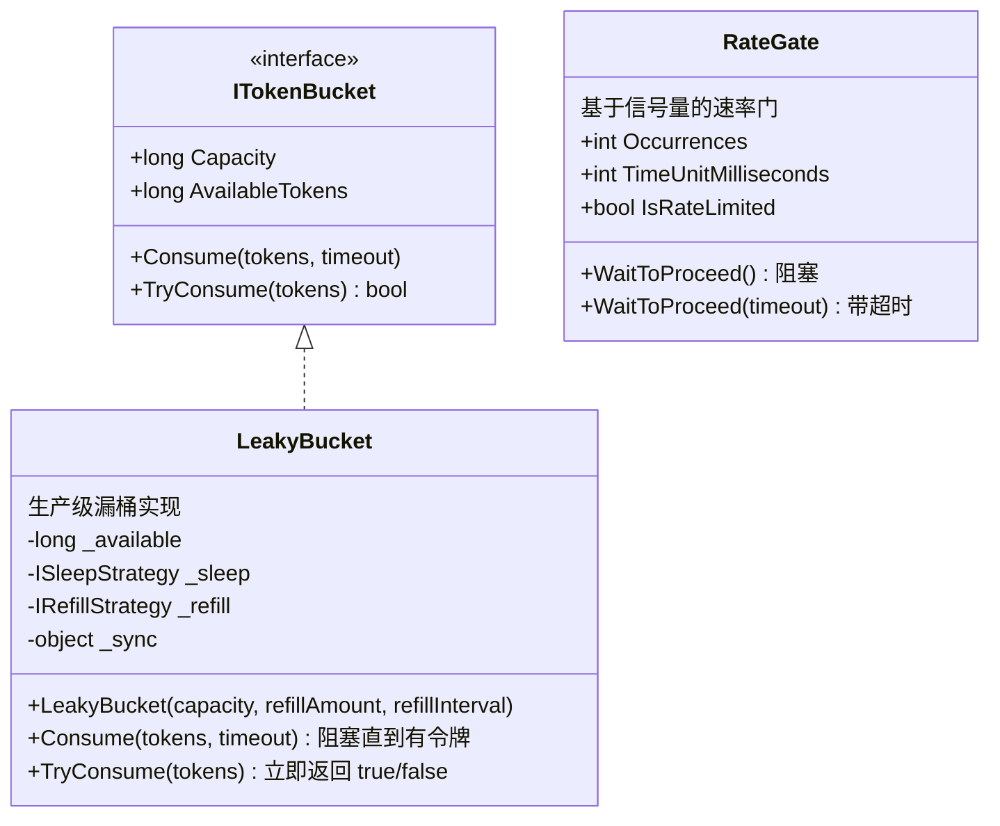
```mermaid
classDiagram
    class ITokenBucket {
        <<interface>>
        +long Capacity
        +long AvailableTokens
        +Consume(tokens, timeout)
        +TryConsume(tokens) bool
    }

    class LeakyBucket {
        生产级漏桶实现
        -long _available
        -ISleepStrategy _sleep
        -IRefillStrategy _refill
        -object _sync

        +LeakyBucket(capacity, refillAmount, refillInterval)
        +Consume(tokens, timeout) 阻塞直到有令牌
        +TryConsume(tokens) 立即返回 true/false
    }

    class RateGate {
        基于信号量的速率门
        +int Occurrences
        +int TimeUnitMilliseconds
        +bool IsRateLimited
        +WaitToProceed() 阻塞
        +WaitToProceed(timeout) 带超时
    }

    ITokenBucket <|.. LeakyBucket
```

### 14.2 LeakyBucket 核心参数

> 源码：`Common/Util/RateLimit/LeakyBucket.cs:57`
> 构造函数：`LeakyBucket(long capacity, long refillAmount, TimeSpan refillInterval)`

| 参数 | 含义 | 示例：Polygon.io 免费版 |
|------|------|----------------------|
| `capacity` | 令牌桶容量（突发上限） | `5`（最多连续发5个请求）|
| `refillAmount` | 每次补充令牌数 | `5` |
| `refillInterval` | 补充间隔 | `TimeSpan.FromMinutes(1)` |
| 效果 | 每分钟5个请求，可突发 | 免费版 API 限制 |

### 14.3 RateGate 用法

> 源码：`Common/Util/RateGate.cs:40`
> 构造函数：`RateGate(int occurrences, TimeSpan timeUnit)`

```
// LEAN 实际用法：WebSocket 连接限速
// Brokerages/BrokerageMultiWebSocketSubscriptionManager.cs:81
_connectionRateLimiter = new RateGate(5, TimeSpan.FromSeconds(12));

// 每次建立 WebSocket 连接前调用
_connectionRateLimiter.WaitToProceed();  // 阻塞直到速率允许
```

### 14.4 我们需要限流的场景

| 场景 | 上游限制 | 推荐实现 |
|------|---------|---------|
| Polygon.io REST 历史 K 线 | 免费版 5 req/min | `LeakyBucket(5, 5, 1min)` |
| Polygon.io WebSocket 连接 | 按 plan 不同 | `RateGate(N, TimeSpan)` |
| HKEX 数据 API | 视合同而定 | `LeakyBucket` |
| 内部服务间 gRPC 调用 | 自定义 | `RateGate` |
| 对用户推送频率 | 防刷屏 | `RateGate(10, 1s)` per user |

---

## 15. OAuth Token 自动刷新

### 15.1 OAuthTokenHandler 设计

> 源码：`Brokerages/Authentication/OAuthTokenHandler.cs`（101行）
> - `:28` — 类定义，泛型 `OAuthTokenHandler<TRequest, TResponse>`
> - `:40` — `_accessTokenMetaData`（缓存的 Token 元数据，含过期时间）
> - `:50` — `_tokenCredentials`（缓存的 TokenType + AccessToken）
> - `:69` — `GetAccessToken()` — 核心方法：有效则返回缓存，过期则刷新
> - `:71` — 判断条件：`_accessTokenMetaData != null && DateTime.UtcNow < _accessTokenMetaData.Expiration`
> - `:80` — 刷新逻辑：调用 API 获取新 Token，更新缓存

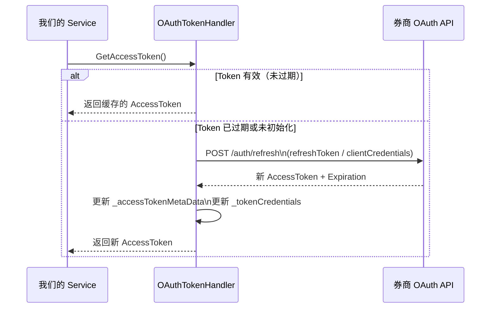
```mermaid
sequenceDiagram
    participant SVC as 我们的 Service
    participant TH as OAuthTokenHandler
    participant API as 券商 OAuth API

    SVC->>TH: GetAccessToken()

    alt Token 有效（未过期）
        TH-->>SVC: 返回缓存的 AccessToken
    else Token 已过期或未初始化
        TH->>API: POST /auth/refresh\n(refreshToken / clientCredentials)
        API-->>TH: 新 AccessToken + Expiration
        TH->>TH: 更新 _accessTokenMetaData\n更新 _tokenCredentials
        TH-->>SVC: 返回新 AccessToken
    end
```

**LEAN 的设计亮点**：
- Token 缓存在内存中，避免每次请求都调用 OAuth API
- 过期判断：`DateTime.UtcNow < Expiration`，简单可靠
- 泛型设计 `<TRequest, TResponse>` 支持不同券商的 Token 格式
- 线程安全通过调用方的 `lock` 保证（由上层 `BaseWebsocketsBrokerage` 管理）

**适用我们的场景**：TradeStation、Charles Schwab、Alpaca 等使用 OAuth 2.0 的券商

---

## 16. 并发消息处理器

### 16.1 BrokerageConcurrentMessageHandler 设计

> 源码：`Brokerages/BrokerageConcurrentMessageHandler.cs`（251行）
> - `:27` — 类定义，泛型 `BrokerageConcurrentMessageHandler<T>`
> - `:40` — `BrokerageConcurrentMessageHandler(processMessages)` — 默认非并发
> - `:50` — `BrokerageConcurrentMessageHandler(processMessages, concurrencyEnabled)` — 可开启并发
> - `:72` — `HandleNewMessage(message)` — 收到 WebSocket 消息时调用
> - `:99` — `WithLockedStream(action)` — 下单等操作时锁定消息流，防止并发问题

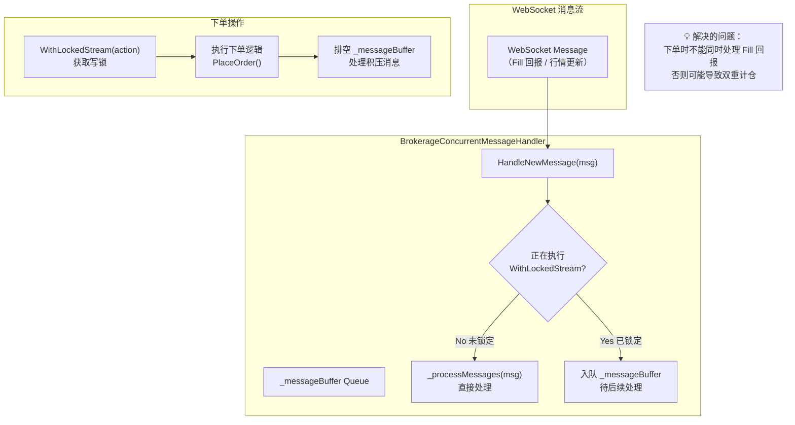
```mermaid
flowchart TD
    subgraph WS["WebSocket 消息流"]
        MSG["WebSocket Message\n（Fill 回报 / 行情更新）"]
    end

    subgraph Handler["BrokerageConcurrentMessageHandler"]
        HNM["HandleNewMessage(msg)"]
        BUF["_messageBuffer Queue"]
        LOCK_CHK{正在执行\nWithLockedStream?}
        PROC["_processMessages(msg)\n直接处理"]
        ENQUEUE["入队 _messageBuffer\n待后续处理"]
    end

    subgraph OrderExec["下单操作"]
        WLS["WithLockedStream(action)\n获取写锁"]
        ACTION["执行下单逻辑\nPlaceOrder()"]
        DRAIN["排空 _messageBuffer\n处理积压消息"]
    end

    MSG --> HNM
    HNM --> LOCK_CHK
    LOCK_CHK -->|No 未锁定| PROC
    LOCK_CHK -->|Yes 已锁定| ENQUEUE
    WLS --> ACTION --> DRAIN

    NOTE["💡 解决的问题：\n下单时不能同时处理 Fill 回报\n否则可能导致双重计仓"]
```

**并发锁策略对比**：

| 模式 | LEAN 实现 | 适用场景 |
|------|-----------|---------|
| 非并发（默认） | `MonitorWrapper`（互斥锁） | 单线程下单 |
| 并发模式 | `ReaderWriterLockWrapper` | 多线程并发下单 |

---

## 17. Symbol Mapping 标的映射

### 17.1 ISymbolMapper 接口

> 源码：`Brokerages/ISymbolMapper.cs`（45行）
> - `:30` — `GetBrokerageSymbol(Symbol) string` — LEAN Symbol → 券商格式
> - `:42` — `GetLeanSymbol(string, SecurityType, string, ...) Symbol` — 券商格式 → LEAN Symbol

```mermaid
flowchart LR
    subgraph Internal["内部系统"]
        LEAN_SYM["Symbol\n{ Ticker, SecurityType,\n  Market, Exchange }"]
    end

    subgraph Mapper["ISymbolMapper"]
        direction TB
        G2B["GetBrokerageSymbol()\nLEAN → 券商"]
        B2L["GetLeanSymbol()\n券商 → LEAN"]
    end

    subgraph External["各券商格式"]
        IB_SYM["IB: 'AAPL' / 'AAPL US'"]
        ALPACA_SYM["Alpaca: 'AAPL'"]
        HK_SYM["港股: '0700' / '0700.HK'"]
        POLY_SYM["Polygon: 'AAPL' / 'C:USDCNH'"]
    end

    LEAN_SYM --> G2B --> IB_SYM
    LEAN_SYM --> G2B --> ALPACA_SYM
    LEAN_SYM --> G2B --> HK_SYM
    LEAN_SYM --> G2B --> POLY_SYM

    IB_SYM --> B2L --> LEAN_SYM
    ALPACA_SYM --> B2L
    HK_SYM --> B2L
```

**我们需要处理的映射场景**：

| 场景 | 内部格式 | 券商/数据源格式 |
|------|---------|--------------|
| 美股 | `AAPL.US.Equity` | Alpaca: `AAPL`，IB: `AAPL` |
| 港股 | `0700.HK.Equity` | HKEX: `0700`，Bloomberg: `700 HK` |
| Forex | `USDCNH.Forex` | Polygon: `C:USDCNH` |
| 期权 | `AAPL 240119C00150000` | OCC 标准格式 |

---

## 18. Market Hours & Trading Calendar

### 18.1 MarketHoursDatabase 数据模型

> 源码：
> - `Common/Securities/MarketHoursDatabase.cs` — 核心数据库类
> - `Common/Securities/SecurityExchangeHours.cs` — 单个交易所时间表
> - `Common/TradingCalendar.cs` — 交易日历，返回指定日期的交易事件
> - `Data/market-hours/market-hours-database.json` — **数据文件，覆盖全球 100+ 交易所**

```mermaid
classDiagram
    class MarketHoursDatabase {
        +static FromDataFolder() MarketHoursDatabase
        +static AlwaysOpen MarketHoursDatabase
        +GetExchangeHours(market, symbol, type) SecurityExchangeHours
        +GetDataTimeZone(market, symbol, type) DateTimeZone
    }

    class SecurityExchangeHours {
        +DateTimeZone TimeZone
        +HashSet~DateTime~ Holidays
        +HashSet~DateTime~ BankHolidays
        +Dict~DayOfWeek, LocalMarketHours~ MarketHours
        +Dict~DateTime, TimeSpan~ EarlyCloses
        +Dict~DateTime, TimeSpan~ LateOpens

        +bool IsOpen(DateTime localTime, bool extendedHours)
        +bool IsDateOpen(DateTime localDate, bool extendedHours)
        +DateTime GetNextMarketOpen(DateTime localTime, bool extendedHours)
        +DateTime GetNextMarketClose(DateTime localTime, bool extendedHours)
    }

    class TradingCalendar {
        +TradingDay GetTradingDay(DateTime date)
        +IEnumerable~TradingDay~ GetTradingDays(start, end)
    }

    MarketHoursDatabase "1" --> "*" SecurityExchangeHours : contains
    TradingCalendar --> MarketHoursDatabase : uses
```

### 18.2 Market Hours 的关键用途

```mermaid
flowchart TD
    subgraph UseCases["我们需要 MarketHours 的场景"]
        UC1["MOO 订单校验\n必须在开盘前 X 分钟提交"]
        UC2["MOC 订单校验\n必须在收盘前 X 分钟提交\nOrderResponseErrorCode.MarketOnCloseOrderTooLate"]
        UC3["行情状态显示\n开市/闭市/盘前/盘后"]
        UC4["GTC 订单过期\n交易日维度的 GTC 到期判断"]
        UC5["PDT 杠杆切换\nExchangeOpen → 4x\nExchangeClosed → 2x"]
        UC6["Margin Call 扫描\n只在交易时间内执行"]
        UC7["推送通知\n开收盘前提醒用户"]
    end
```

**LEAN 已内置的交易所数据**（来自 `Data/market-hours/market-hours-database.json`）：

| 市场 | 关键字段 |
|------|---------|
| 美股 NYSE/NASDAQ | 正常 9:30-16:00，盘前 4:00-9:30，盘后 16:00-20:00 |
| 港股 HKEX | 9:30-12:00，13:00-16:00（中午休市）|
| 全球 100+ 交易所 | 节假日、夏令时、临时休市均已配置 |

---

## 19. Multi-Currency CashBook

### 19.1 CashBook 数据模型

> 源码：`Common/Securities/CashBook.cs`
> - `:32` — 类定义，继承 `ExtendedDictionary<string, Cash>`
> - `:40` — `Updated` 事件（任何余额变化时触发）
> - `:45` — `AccountCurrency` 属性（主账户货币，默认 USD）
> - `:75` — `TotalValueInAccountCurrency` — 所有货币折算后的总值
> - `:100` — `Add(symbol, quantity, conversionRate)` — 添加/更新货币余额
> - `:155` — `ConvertToAccountCurrency(amount, sourceCurrency)` — 折算为主账户货币

```mermaid
classDiagram
    class CashBook {
        +string AccountCurrency = "USD"
        +decimal TotalValueInAccountCurrency
        +event Updated

        +Add(symbol, qty, rate) Cash
        +Convert(amount, from, to) decimal
        +ConvertToAccountCurrency(amount, currency) decimal
        +EnsureCurrencyDataFeeds(securities, ...) List
    }

    class Cash {
        +string Symbol
        +decimal Amount
        +decimal ConversionRate
        +decimal ValueInAccountCurrency
        +event Updated
    }

    CashBook "1" --> "*" Cash : contains
```

### 19.2 多币种账户总值计算

```
TotalValueInAccountCurrency = Σ(Cash[currency].Amount × ConversionRate)

示例：
  USD: 10,000 × 1.0   = $10,000
  HKD: 78,000 × 0.128 = $9,984
  ──────────────────────────────
  总值（USD）           = $19,984
```

**对我们的启示**：
- `CashBook` 相当于我们账户的**多币种资金台账**
- `ConversionRate` 需要实时从行情服务更新（USD/HKD 汇率）
- `EnsureCurrencyDataFeeds()` 的模式：有新货币加入时，自动订阅对应的汇率行情

---

## 20. Brokerage 抽象层

### 20.1 Brokerage 接口设计

> 源码：`Brokerages/Brokerage.cs`
> - `:56` — `OrdersStatusChanged` 事件（Fill 回报入口）
> - `:125` — `PlaceOrder(Order order)` 抽象方法
> - `:132` — `UpdateOrder(Order order)` 抽象方法
> - `:139` — `CancelOrder(Order order)` 抽象方法
> - `:499` — `PerformCashSync()` — 定期对账方法

```mermaid
classDiagram
    class Brokerage {
        <<abstract>>
        +string Name
        +bool IsConnected
        +string AccountBaseCurrency

        +Connect()
        +Disconnect()
        +PlaceOrder(order) bool
        +UpdateOrder(order) bool
        +CancelOrder(order) bool
        +GetOpenOrders() List~Order~
        +GetAccountHoldings() List~Holding~
        +GetCashBalance() List~CashAmount~
        +GetHistory(request) IEnumerable~BaseData~

        +event OrdersStatusChanged
        +event OrderIdChanged
        +event AccountChanged
        +event Message

        +PerformCashSync() bool
        +ShouldPerformCashSync() bool
    }
```

### 20.2 订单 ID 映射（内部 ID ↔ 券商 ID）

> 源码：`Common/Orders/Order.cs:68` — `public List<string> BrokerId { get; internal set; }`

```
内部 OrderId (int)  ←→  BrokerId (List<string>)

原因：
- 券商（如 IB）可能将一笔大单拆分成多个子单
- 每个子单有独立的券商 OrderId
- 系统需要将多个券商 OrderEvent 聚合回一笔内部订单
```

### 20.3 CashSync 定期对账机制

> 源码：`Brokerages/Brokerage.cs:499` — `PerformCashSync(IAlgorithm, DateTime, Func<TimeSpan>)`

```
每隔固定时间（或收盘后）：
1. 从券商拉取 GetCashBalance()
2. 与内部 CashBook 对比
3. 若有差异：记录日志 + 调整内部账本
4. 触发 AccountChanged 事件

意义：
- 防止因网络问题漏掉 Fill 回报
- 对账发现 reconciliation 差异
- 等同于我们 Fund Transfer Service 的三方对账
```

---

## 21. TradeBuilder：成交重建与 FIFO/LIFO

### 21.1 TradeBuilder 设计

> 源码：`Common/Statistics/TradeBuilder.cs`（TradeBuilder 类）
> - `:30` — `TradeState` 内部类（MaxProfit、MaxDrawdown 追踪）
> - `:63` — `Position` 内部类（PendingTrades、PendingFills、TotalFees）
> - `:93` — 构造函数：`TradeBuilder(FillGroupingMethod, FillMatchingMethod)`
> - `:226` — `ProcessFill()` — 核心方法，处理每笔成交，重建 Trade
> - `:256` — `ProcessFillUsingFillToFill()` — Fill-to-Fill 模式
> - `:288` — FIFO/LIFO 选择：`_matchingMethod == FillMatchingMethod.FIFO ? 0 : count-1`

```mermaid
flowchart TD
    subgraph Input["输入"]
        FILLS["OrderEvent Fills\n（每笔成交回报）"]
    end

    subgraph TradeBuilder["TradeBuilder 处理逻辑"]
        direction TB
        PF["ProcessFill(fill)"]
        GM{GroupingMethod}
        FTOF["FillToFill\n每笔 fill 独立追踪"]
        FTFLAT["FlatToFlat\n从空仓到空仓算一笔交易"]
        FTRED["FlatToReduced\n减仓时结算"]
        MATCH{MatchingMethod}
        FIFO["FIFO\n先进先出\n美股标准"]
        LIFO["LIFO\n后进先出\n部分港股场景"]
    end

    subgraph Output["输出 Trade 对象"]
        TRADE["Trade\n- EntryTime / ExitTime\n- EntryPrice / ExitPrice\n- Quantity\n- ProfitLoss\n- TotalFees\n- MaxDrawdown（最大逆向波动）\n- EndTradeDrawdown"]
    end

    FILLS --> PF --> GM
    GM --> FTOF
    GM --> FTFLAT
    GM --> FTRED
    FTOF --> MATCH
    MATCH --> FIFO
    MATCH --> LIFO
    FIFO --> TRADE
    LIFO --> TRADE
```

**FIFO vs LIFO 对我们的意义**：

| 规则 | 适用场景 | 含义 |
|------|---------|------|
| FIFO（先进先出） | 美股（税务合规） | 先买入的仓位先卖出，影响成本价计算 |
| LIFO（后进先出） | 部分港股交易策略 | 最近买入的先卖，影响已实现盈亏 |

---

## 22. Portfolio Statistics：组合绩效指标

### 22.1 PortfolioStatistics 指标体系

> 源码：`Common/Statistics/PortfolioStatistics.cs`
> - `:36` — `AverageWinRate` — 平均盈利率
> - `:42` — `AverageLossRate` — 平均亏损率
> - `:49` — `ProfitLossRatio` — 盈亏比
> - `:56` — `WinRate` — 胜率
> - `:88` — `CompoundingAnnualReturn` — 年化复合收益率
> - `:94` — `Drawdown` — 最大回撤
> - `:107` — `SharpeRatio` — 夏普比率
> - `:115` — `ProbabilisticSharpeRatio` — 概率夏普比率
> - `:122` — `SortinoRatio` — 索提诺比率
> - `:179` — `ValueAtRisk99` — 99% VaR

```mermaid
classDiagram
    class PortfolioStatistics {
        收益指标
        +decimal AverageWinRate
        +decimal AverageLossRate
        +decimal ProfitLossRatio
        +decimal WinRate
        +decimal LossRate
        +decimal Expectancy
        +decimal TotalNetProfit
        +decimal CompoundingAnnualReturn

        风险指标
        +decimal Drawdown
        +decimal SharpeRatio
        +decimal SortinoRatio
        +decimal ProbabilisticSharpeRatio
        +decimal ValueAtRisk99
        +decimal ValueAtRisk95
        +int DrawdownRecovery

        风格指标
        +decimal Alpha
        +decimal Beta
        +decimal InformationRatio
        +decimal TrackingError
        +decimal TreynorRatio
        +decimal PortfolioTurnover
        +decimal AnnualStandardDeviation
    }
```

**对我们 App 的应用**：

| 指标 | 显示场景 |
|------|---------|
| `WinRate` / `ProfitLossRatio` | 账户总览页（胜率、盈亏比） |
| `TotalNetProfit` / `CompoundingAnnualReturn` | 持仓收益展示 |
| `Drawdown` | 风险提示 |
| `SharpeRatio` | 高级用户的组合分析 |
| `ValueAtRisk` | 合规风控展示（可选） |

---

## 23. 对我们系统的映射建议

### 23.1 完整模块映射

```mermaid
flowchart LR
    subgraph LEAN["LEAN 模块（业务模型篇）"]
        L1[Order 状态机\n9 态完整定义]
        L2[OrderTicket 句柄模式]
        L3[Pre-trade 8 级 Pipeline]
        L4[BuyingPowerModel 策略]
        L5[TransactionHandler 并发]
        L6[Portfolio + P&L 计算]
        L7[Margin Call 模型]
        L8[IBrokerageModel 规则抽象]
    end

    subgraph LEAN2["LEAN 模块（基础设施篇）"]
        L9[MultiWebSocket 连接池]
        L10[RateGate / LeakyBucket]
        L11[OAuthTokenHandler]
        L12[ConcurrentMessageHandler]
        L13[DefaultOrderBook]
        L14[ISymbolMapper]
        L15[MarketHoursDatabase]
        L16[CashBook 多币种]
    end

    subgraph OURS["我们的 Trading Engine"]
        O1[OrderStatus + OrderType\n直接采用枚举设计]
        O2[OrderHandle API 响应]
        O3[RiskCheckService Pipeline]
        O4[MarginService 三种模式]
        O5[OrderProcessor 状态机]
        O6[PositionService]
        O7[MarginCallService]
        O8[BrokerAdapter 接口]
    end

    subgraph OURS2["我们的基础设施"]
        O9[MDS WebSocket 推送层]
        O10[API Gateway 限流中间件]
        O11[BrokerAuthService]
        O12[Quote 消息处理器]
        O13[Quote Cache NBBO]
        O14[Symbol Normalizer]
        O15[MarketStatusService]
        O16[AccountBalanceService]
    end

    L1 -.->|直接借鉴| O1
    L2 -.->|借鉴思路| O2
    L3 -.->|借鉴模式| O3
    L4 -.->|借鉴接口| O4
    L5 -.->|借鉴架构| O5
    L6 -.->|借鉴逻辑| O6
    L7 -.->|借鉴触发条件| O7
    L8 -.->|借鉴抽象| O8
    L9 -.->|借鉴连接池设计| O9
    L10 -.->|借鉴算法| O10
    L11 -.->|借鉴 Token 缓存| O11
    L12 -.->|借鉴锁策略| O12
    L13 -.->|借鉴数据结构| O13
    L14 -.->|借鉴接口| O14
    L15 -.->|直接复用数据| O15
    L16 -.->|借鉴多币种设计| O16
```

### 23.2 关键差异：LEAN vs 我们

| 维度 | LEAN | 我们 | 处理方式 |
|------|------|------|---------|
| 执行模式 | 单进程，内存共享 | 微服务，跨进程通信 | 状态用 DB 持久化，事件用 Kafka |
| 订单 ID | 内存递增 int | 分布式 ID | Snowflake / 有序 UUID |
| Fill 模型 | 内置模拟撮合 | 真实交易所回报 | 移除 FillModel，只处理 Exchange OrderEvent |
| 并发 | 单机线程锁 | 分布式并发 | 数据库乐观锁 + 幂等设计 |
| P&L 计算 | 实时内存计算 | 实时 + 持久化 | 写 DB + Redis 缓存 |
| 成本计算 | 统一 FIFO | US=FIFO, HK=加权平均 | 按 market 区分算法 |
| Token 存储 | 内存缓存 | 分布式 Redis | OAuth Token 存 Redis，TTL = expiration |
| WebSocket 连接 | 单进程多 WS | 多实例横向扩展 | 每个 MDS 实例管理独立 WS 池 |

### 23.3 LEAN 的 MarketHoursDatabase 数据可直接复用

这是最直接可以"拿来用"的部分：

```
Data/market-hours/market-hours-database.json

包含：
- NYSE / NASDAQ：9:30-16:00 ET，节假日列表，夏令时
- HKEX：09:30-12:00 / 13:00-16:00 HKT，中港两地节假日
- 100+ 全球交易所

我们可以：
1. 直接解析这个 JSON 作为初始数据
2. 按季度从官方更新节假日
3. 避免从零维护一个 market hours 数据库
```

### 23.4 不需要借鉴的部分

| LEAN 模块 | 原因 |
|-----------|------|
| `FillModel` / `SlippageModel` | 仅用于 backtest 模拟撮合，我们是 live trading |
| `AlgorithmManager` | 算法调度逻辑，我们没有 user algorithm |
| `Indicators/`（168个指标） | 量化技术指标，非券商 App 核心功能 |
| `BacktestingResultHandler` | Backtest 专用报表 |
| `FuturesExpiryFunctions` | 期货到期日穷举，我们不做期货 |
| `Algorithm.CSharp/` 示例 | 算法示例，与我们无关 |
| `Optimizer/` | 参数优化，量化平台功能 |
| `Research/` | Jupyter 研究环境 |
| `Algorithm.Framework/Alphas/` | Alpha 信号生成，量化专用 |
| `Algorithm.Framework/Portfolio/` | 组合构建模型，量化专用 |

---

## 24. 附录：源码索引速查表

> 所有路径相对 `/Users/huoxd/Downloads/working/Lean`

### 业务模型

| 主题 | 文件 | 关键行 | 说明 |
|------|------|--------|------|
| OrderType 枚举 | `Common/Orders/OrderTypes.cs` | L21-82 | 12 种订单类型 |
| OrderStatus 枚举 | `Common/Orders/OrderTypes.cs` | L138-184 | 9 种状态值 |
| TimeInForce 基类 | `Common/Orders/TimeInForce.cs` | L28-43 | Day / GTC / GTD |
| OrderResponseErrorCode | `Common/Orders/OrderResponseErrorCode.cs` | L21-203 | 所有错误码枚举 |
| Order.BrokerId | `Common/Orders/Order.cs` | L68 | 内部 ID ↔ 券商 ID 1:N 映射 |
| Order.CreateOrder() | `Common/Orders/Order.cs` | L413 | 工厂方法，按 OrderType 分发 |
| OrderTicket.AverageFillPrice | `Common/Orders/OrderTicket.cs` | L98 | 加权均价 |
| OrderTicket.Cancel() | `Common/Orders/OrderTicket.cs` | L447 | 撤单，防重复提交 |
| OrderTicket.AddOrderEvent() | `Common/Orders/OrderTicket.cs` | L504 | Fill 回报处理，更新均价 |
| OrderTicket.FillState | `Common/Orders/OrderTicket.cs` | L718 | 不可变值对象，防并发 torn read |
| IBuyingPowerModel 接口 | `Common/Securities/IBuyingPowerModel.cs` | L21-98 | 8 个方法，策略模式入口 |
| PDT.GetLeverage() | `Common/Securities/PatternDayTradingMarginModel.cs` | L62 | 4x/2x 动态切换 |
| PDT.GetMarginCorrectionFactor() | `Common/Securities/PatternDayTradingMarginModel.cs` | L90 | 核心判断：ExchangeOpen 状态 |
| Margin Call 触发 | `Common/Securities/DefaultMarginCallModel.cs` | L73 | 5% 预警，110% 强平 |
| Margin Call 强平排序 | `Common/Securities/DefaultMarginCallModel.cs` | L187 | 按亏损从大到小 |
| IBrokerageModel 接口 | `Common/Brokerages/IBrokerageModel.cs` | L34 | 券商规则差异抽象 |
| BrokerageModel.Create() | `Common/Brokerages/IBrokerageModel.cs` | L193 | 工厂方法 |
| Portfolio.ProcessFills() | `Common/Securities/SecurityPortfolioManager.cs` | L745 | Fill 后更新持仓和现金 |
| Portfolio.TotalPortfolioValue | `Common/Securities/SecurityPortfolioManager.cs` | L429 | 账户总值 |
| TransactionHandler 主循环 | `Engine/TransactionHandlers/BrokerageTransactionHandler.cs` | L674 | `Run()` 处理线程入口 |
| TransactionHandler Fill 回报 | `Engine/TransactionHandlers/BrokerageTransactionHandler.cs` | L1387 | `HandleOrderEvent()` |
| Brokerage.OrdersStatusChanged | `Brokerages/Brokerage.cs` | L56 | Fill 回报事件 |
| Brokerage.PlaceOrder() | `Brokerages/Brokerage.cs` | L125 | 抽象方法 |
| Brokerage.PerformCashSync() | `Brokerages/Brokerage.cs` | L499 | 定期对账机制 |
| TradeBuilder.ProcessFill() | `Common/Statistics/TradeBuilder.cs` | L226 | Fill → Trade 重建 |
| TradeBuilder FIFO/LIFO | `Common/Statistics/TradeBuilder.cs` | L288 | 成本计算方法选择 |

### 基础设施

| 主题 | 文件 | 关键行 | 说明 |
|------|------|--------|------|
| LeakyBucket 构造 | `Common/Util/RateLimit/LeakyBucket.cs` | L57 | capacity + refillAmount + refillInterval |
| LeakyBucket.Consume() | `Common/Util/RateLimit/LeakyBucket.cs` | L91 | 阻塞消费令牌 |
| LeakyBucket.TryConsume() | `Common/Util/RateLimit/LeakyBucket.cs` | L130 | 非阻塞尝试消费 |
| RateGate 构造 | `Common/Util/RateGate.cs` | L40 | occurrences + timeUnit |
| RateGate.WaitToProceed() | `Common/Util/RateGate.cs` | L205 | 阻塞直到速率允许 |
| MultiWebSocket 字段 | `Brokerages/BrokerageMultiWebSocketSubscriptionManager.cs` | L33-46 | 连接池关键字段 |
| MultiWebSocket 默认限速 | `Brokerages/BrokerageMultiWebSocketSubscriptionManager.cs` | L81 | 5连接/12秒 |
| MultiWebSocket Connect | `Brokerages/BrokerageMultiWebSocketSubscriptionManager.cs` | L280 | 连接时调用限速 |
| OAuthTokenHandler.GetAccessToken() | `Brokerages/Authentication/OAuthTokenHandler.cs` | L69 | Token 缓存 + 过期刷新 |
| OAuthTokenHandler 过期判断 | `Brokerages/Authentication/OAuthTokenHandler.cs` | L71 | `DateTime.UtcNow < Expiration` |
| ConcurrentMessageHandler | `Brokerages/BrokerageConcurrentMessageHandler.cs` | L72 | HandleNewMessage 入口 |
| WithLockedStream | `Brokerages/BrokerageConcurrentMessageHandler.cs` | L99 | 下单时锁定消息流 |
| DefaultOrderBook.BestBidAskUpdated | `Brokerages/DefaultOrderBook.cs` | L53 | 最优价变化事件 |
| DefaultOrderBook.UpdateBidRow() | `Brokerages/DefaultOrderBook.cs` | L142 | 更新 bid 档位 |
| ISymbolMapper | `Brokerages/ISymbolMapper.cs` | L23 | 双向 Symbol 映射接口 |
| CashBook.TotalValue | `Common/Securities/CashBook.cs` | L75 | 多币种折算总值 |
| CashBook.Add() | `Common/Securities/CashBook.cs` | L100 | 添加/更新货币余额 |
| CashBook.ConvertToAccountCurrency() | `Common/Securities/CashBook.cs` | L185 | 换算为主账户货币 |
| SubscriptionDataConfig | `Common/Data/SubscriptionDataConfig.cs` | L29 | Symbol+Resolution+DataType 三元组 |
| MarketHoursDatabase | `Common/Securities/MarketHoursDatabase.cs` | — | 全球交易所时间表 |
| SecurityExchangeHours.IsOpen() | `Common/Securities/SecurityExchangeHours.cs` | — | 判断当前是否开市 |
| market-hours 数据文件 | `Data/market-hours/market-hours-database.json` | — | 100+ 交易所节假日数据 |

### 绩效分析

| 主题 | 文件 | 关键行 | 说明 |
|------|------|--------|------|
| PortfolioStatistics.SharpeRatio | `Common/Statistics/PortfolioStatistics.cs` | L107 | 夏普比率 |
| PortfolioStatistics.Drawdown | `Common/Statistics/PortfolioStatistics.cs` | L94 | 最大回撤 |
| PortfolioStatistics.WinRate | `Common/Statistics/PortfolioStatistics.cs` | L56 | 胜率 |
| PortfolioStatistics.ValueAtRisk99 | `Common/Statistics/PortfolioStatistics.cs` | L179 | 99% VaR |

---

*本文档由 AI 工程师基于 LEAN v2.0 源码系统性分析生成（方案 A：完整版），覆盖业务模型、基础设施模式、绩效分析三个维度，共 25 个章节。用于指导 Trading Engine、Market Data、Portfolio、Brokerage Adapter 模块的设计决策。*

---

## 25. 关键测试 Case：可直接转换为我们的验收标准

> **用途**：这些 test case 是 LEAN 对业务规则的可执行规格说明，每一个 `[TestCase]` 就是一条精确的边界条件。可直接转换为我们系统的单元测试或 PRD 的 acceptance criteria。
>
> 说明：以下测试均基于美股规则（NYSE/NASDAQ）。港股规则（HKEX）需另行处理。

---

### 25.1 订单状态流转

**源码**：`Tests/Engine/BrokerageTransactionHandlerTests/BrokerageTransactionHandlerTests.cs:615`

#### 撤单必须经过 CancelPending 状态

```csharp
// OrderCancellationTransitionsThroughCancelPendingStatus
// 验证撤单不能从 Submitted 直接跳到 Canceled，必须经历 CancelPending 中间态

// 提交限价单
var orderTicket = _transactionHandler.Process(orderRequest);
Assert.IsTrue(orderTicket.Status == OrderStatus.Submitted);        // ① Submitted

// 发出撤单请求
var cancelRequest = new CancelOrderRequest(...);
_transactionHandler.Process(cancelRequest);
Assert.IsTrue(orderTicket.Status == OrderStatus.CancelPending);    // ② CancelPending（中间态）
Assert.AreEqual(_transactionHandler.CancelPendingOrdersSize, 1);

// 撤单完成
_transactionHandler.HandleOrderRequest(cancelRequest);
Assert.IsTrue(orderTicket.Status == OrderStatus.Canceled);         // ③ Canceled（终态）
Assert.AreEqual(_transactionHandler.CancelPendingOrdersSize, 0);

// 验证 OrderEvent 序列：Submitted → CancelPending → Canceled，共3个事件
Assert.AreEqual(3, _algorithm.OrderEvents.Count);
Assert.AreEqual(1, _algorithm.OrderEvents.Count(e => e.Status == OrderStatus.Submitted));
Assert.AreEqual(1, _algorithm.OrderEvents.Count(e => e.Status == OrderStatus.CancelPending));
Assert.AreEqual(1, _algorithm.OrderEvents.Count(e => e.Status == OrderStatus.Canceled));
```

**对我们的启示**：
- 我们的 OMS 在处理撤单时，必须先将状态置为 `CancelPending` 再发给券商
- 如果券商在撤单确认前已经 Fill，需要处理从 `CancelPending → Filled` 的竞争状态
- 前端收到 `CancelPending` 状态时应显示"撤单处理中"，而非"已撤单"

---

### 25.2 限价单价格精度（Tick Size 取整）

**源码**：`Tests/Engine/BrokerageTransactionHandlerTests/BrokerageTransactionHandlerTests.cs:663`

```csharp
// RoundsEquityLimitOrderPricesCorrectly
// 股票价格精度规则：根据当前股价决定 tick size

[TestCase(securityPrice: 0.9,  orderPrice: 1.123456789, expected: 1.12)]
[TestCase(securityPrice: 0.9,  orderPrice: 0.987654321, expected: 0.9877)]  // 低价股精度更高
[TestCase(securityPrice: 0.9,  orderPrice: 0.999999999, expected: 1)]
[TestCase(securityPrice: 0.9,  orderPrice: 1,           expected: 1)]
[TestCase(securityPrice: 0.9,  orderPrice: 1.000000001, expected: 1)]
[TestCase(securityPrice: 1.1,  orderPrice: 1.123456789, expected: 1.12)]    // 1元以上精度0.01
[TestCase(securityPrice: 1.1,  orderPrice: 0.987654321, expected: 0.9877)]
[TestCase(securityPrice: 1.1,  orderPrice: 0.999999999, expected: 1)]
[TestCase(securityPrice: 1.1,  orderPrice: 1,           expected: 1)]
[TestCase(securityPrice: 1.1,  orderPrice: 1.000000001, expected: 1)]
```

**规则总结**：
| 股价范围 | 限价单精度 |
|---------|-----------|
| < $1.00 | 小数点后 4 位（$0.0001）|
| ≥ $1.00 | 小数点后 2 位（$0.01）|

**对我们的启示**：下单时 price 字段必须按 tick size 取整，否则交易所会拒单。港股也有类似规则（参考 HKEX Price Spread Table）。

---

#### 委托量必须是手数的整数倍（Lot Size）

**源码**：`Tests/Engine/BrokerageTransactionHandlerTests/BrokerageTransactionHandlerTests.cs:190`

```csharp
// OrderQuantityIsFlooredToNearestMultipleOfLotSizeWhenLongOrderIsRounded
// 买入时向下取整到手数倍数

var orderRequest = new SubmitOrderRequest(..., quantity: 1600, ...);
_transactionHandler.HandleOrderRequest(orderRequest);

// 1600 股，如果手数（lot size）= 1000，则取整为 1000
Assert.AreEqual(1000, orderTicket.Quantity);  // 向下取整，不是 2000
```

```csharp
// OrderIsNotPlacedWhenOrderIsLowerThanLotSize
// 委托量小于最小手数时，直接拒单（不是取整为0）
```

**对我们的启示**：港股手数规则严格，例如腾讯（0700.HK）最小买卖单位 100 股。委托量必须是手数的整数倍，不足一手直接拒单，不能悄悄取整。

---

### 25.3 TimeInForce 到期规则

**源码**：`Tests/Common/Orders/TimeInForces/TimeInForceTests.cs:35`

#### GTC 永不自动过期

```csharp
// GtcTimeInForceOrderDoesNotExpire
var timeInForce = new GoodTilCanceledTimeInForce();
var order = new LimitOrder(Symbols.SPY, 10, 100, DateTime.UtcNow);

Assert.IsFalse(timeInForce.IsOrderExpired(security, order));  // 永远不过期

// 部分成交和全部成交都有效
var fill1 = new OrderEvent(..., OrderStatus.PartiallyFilled, fillQty: 3, ...);
Assert.IsTrue(timeInForce.IsFillValid(security, order, fill1));  // ✅

var fill2 = new OrderEvent(..., OrderStatus.Filled, fillQty: 7, ...);
Assert.IsTrue(timeInForce.IsFillValid(security, order, fill2));  // ✅
```

#### Day 订单：美股在收盘时过期

```csharp
// DayTimeInForceEquityOrderExpiresAtMarketClose
// 下午 4:00 PM ET（收盘时刻）

var utcTime = new DateTime(2018, 4, 27, 10, 0, 0).ConvertToUtc(TimeZones.NewYork);  // 早上 10 点

// 收盘前 1 秒：未过期
localTimeKeeper.UpdateTime(utcTime.AddHours(6).AddSeconds(-1));  // 15:59:59 ET
Assert.IsFalse(timeInForce.IsOrderExpired(security, order));

// 收盘时刻：过期
localTimeKeeper.UpdateTime(utcTime.AddHours(6));                 // 16:00:00 ET
Assert.IsTrue(timeInForce.IsOrderExpired(security, order));
```

#### Day 订单：外汇在 5 PM ET 过期（非收盘）

```csharp
// DayTimeInForceForexOrderBefore5PMExpiresAt5PM
// 外汇 Day 订单在 17:00 ET 过期，不是跟随股票收盘时间

// 下午 4:59:59 PM ET：未过期
localTimeKeeper.UpdateTime(utcTime.AddHours(7).AddSeconds(-1));
Assert.IsFalse(timeInForce.IsOrderExpired(security, order));

// 下午 5:00:00 PM ET：过期
localTimeKeeper.UpdateTime(utcTime.AddHours(7));
Assert.IsTrue(timeInForce.IsOrderExpired(security, order));
```

#### Day 订单：下午 5 点后提交的外汇订单，次日 5 PM 才过期

```csharp
// DayTimeInForceForexOrderAfter5PMExpiresAt5PMNextDay
var utcTime = new DateTime(2018, 4, 25, 18, 0, 0).ConvertToUtc(TimeZones.NewYork); // 下午 6 PM

// 当天午夜：未过期
localTimeKeeper.UpdateTime(utcTime.AddHours(6));     // 00:00 AM
Assert.IsFalse(timeInForce.IsOrderExpired(security, order));

// 次日 4:59:59 PM ET：未过期
localTimeKeeper.UpdateTime(utcTime.AddHours(23).AddSeconds(-1));
Assert.IsFalse(timeInForce.IsOrderExpired(security, order));

// 次日 5:00:00 PM ET：过期
localTimeKeeper.UpdateTime(utcTime.AddHours(23));
Assert.IsTrue(timeInForce.IsOrderExpired(security, order));
```

**TimeInForce 到期时间汇总**：

| 资产类别 | Day 订单到期时间 |
|---------|---------------|
| 美股 Equity | 当日 16:00 ET（NYSE 收盘） |
| 外汇 Forex | 当日 17:00 ET（FX 结算时间） |
| 加密货币 Crypto | 次日 00:00 UTC（按天计算）|

---

### 25.4 PDT 杠杆与 Margin Call 边界值

**源码**：`Tests/Common/Securities/PatternDayTradingMarginBuyingPowerModelTests.cs:85`

#### 开市/闭市杠杆精确值

```csharp
// VerifyOpenMarketLeverage
// 开市时间：Tuesday 2016-02-16 Noon（正常交易日中午）
// SPY @ $100 × 100股，杠杆 4x → 保证金需求 = 100×100/4 = $2,500
Assert.AreEqual(4.0m, model.GetLeverage(security));   // 开市杠杆 = 4x
Assert.AreEqual(2500m, model.GetInitialMarginRequiredForOrder(...));

// VerifyClosedMarketLeverage
// 闭市情况 1：Tuesday 2016-02-16 Midnight（深夜）
// 闭市情况 2：Monday 2016-02-15 Noon（总统日，节假日）
// 闭市情况 3：Sunday 2016-02-14 Noon（周末）
// 三种情况杠杆均为 2x，保证金需求 = 100×100/2 = $5,000
Assert.AreEqual(2.0m, model.GetLeverage(security));   // 闭市杠杆 = 2x
Assert.AreEqual(5000m, model.GetInitialMarginRequiredForOrder(...));
```

#### "即将收盘"触发降杠杆

```csharp
// VerifyClosingSoonMarketLeverage
// 15:49:59 ET — 开市，杠杆 5x（自定义）
var security = CreateSecurity(model, new DateTime(2016, 2, 16, 15, 49, 0));
Assert.AreEqual(openLeverage, model.GetLeverage(security));  // 5x
Assert.IsFalse(security.Exchange.ClosingSoon);

// 15:50:00 ET — ClosingSoon 触发，降为闭市杠杆 2x
localTimeKeeper.UpdateTime(new DateTime(2016, 2, 16, 15, 50, 0)...);
Assert.AreEqual(closedLeverage, model.GetLeverage(security)); // 2x
Assert.IsTrue(security.Exchange.ClosingSoon);
Assert.IsTrue(security.Exchange.ExchangeOpen);  // 仍然开市，但已触发降杠杆

// 16:00:00 ET — 完全收盘
localTimeKeeper.UpdateTime(new DateTime(2016, 2, 16, 16, 0, 0)...);
Assert.IsFalse(security.Exchange.ExchangeOpen);
```

**关键边界**：`ClosingSoon` 在收盘前 **10 分钟**（15:50 ET）触发，杠杆从 4x 降为 2x。

#### Margin Call 强平数量计算（含杠杆因子）

```csharp
// VerifyMarginCallOrderLongOpenMarket vs VerifyMarginCallOrderLongClosedMarket
// 同样的仓位，开市 vs 闭市，强平数量不同（因杠杆不同）

// 开市（4x 杠杆）：强平系数 = 4
var expected_open   = -(int)(Math.Round((totalMargin - netLiquidation) / price, ...) * 4m);

// 闭市（2x 杠杆）：强平系数 = 2
var expected_closed = -(int)(Math.Round((totalMargin - netLiquidation) / price, ...) * 2m);

// 做空仓位的强平方向相反（positive quantity = 买入平空）
// VerifyMarginCallOrderShortOpenMarket
var expected_short_open = (int)(Math.Round(...) * 4m);  // 正数（买入）
```

---

### 25.5 Margin Warning vs Margin Call 精确触发条件

**源码**：`Tests/Common/Securities/MarginCallModelTests.cs:161` 和 `Tests/Common/Securities/SecurityPortfolioManagerTests.cs:389`

```csharp
// GenerateMarginCallOrderTests — 完整演示从正常→Warning→Call的过程

// 初始：买入 1000 股 @ $1，leverage=1，cash=$0
portfolio.ProcessFills(fill);
Assert.AreEqual(0, portfolio.MarginRemaining);   // 全部保证金已用
Assert.IsFalse(hasSufficientBuyingPower);         // 不能再下单

// 股价涨到 $2：持仓市值翻倍，但 leverage=1 仍无余量
security.SetMarketPrice($2);
Assert.AreEqual(0, portfolio.MarginRemaining);    // leverage=1 始终无余量

// 换为 leverage=2，模拟借款 -$250
security.SetLeverage(2);
portfolio.CashBook[USD].SetAmount(-250);

// 股价在 $0.5 附近：portfolio value = -$250（负数！）
marginCallOrders = portfolio.MarginCallModel.GetMarginCallOrders(out issueWarning);
Assert.IsTrue(issueWarning);                       // ✅ 有预警
Assert.AreEqual(0, marginCallOrders.Count);        // ⚠️ 但尚未强平

// 再次下跌，portfolio value 确认为负：
Assert.AreEqual(-250, portfolio.TotalPortfolioValue);
marginCallOrders = portfolio.MarginCallModel.GetMarginCallOrders(out issueWarning);
Assert.IsTrue(issueWarning);
Assert.AreEqual(1, marginCallOrders.Count);        // ✅ 触发强平
```

```csharp
// MarginWarningLeverage2 — Margin Warning 的精确触发点
// 账户：$1101 现金，买 $2000 股（leverage=2），即借了 $1000
// 持仓后 MarginRemaining = $101（很接近 Warning 线）

// 股价跌 10%，持仓市值 $1800：
Assert.AreEqual(1, portfolio.MarginRemaining);      // 只剩 $1 保证金余量
// 触发 Margin Call Warning（≤ 5% × portfolioValue）
Assert.IsTrue(issueMarginCallWarning);
Assert.AreEqual(0, marginCallOrders.Count);         // 但不强平，只是警告
```

**Warning vs Call 触发阈值总结**：

```
Margin Warning：marginRemaining ≤ portfolioValue × 5%
                → 推送通知，不强平

Margin Call：   totalMarginUsed > portfolioValue × (1 + marginBuffer)
                默认 marginBuffer = 10%，即 totalMarginUsed > 110% × portfolioValue
                → 生成市价强平单
```

---

### 25.6 Portfolio P&L：做空与结算边界

**源码**：`Tests/Common/Securities/SecurityPortfolioManagerTests.cs:882`

#### 做空各场景下的现金变化

```csharp
// SellingShortFromZeroAddsToCash — 从零开空
portfolio.SetCash(0);
// 卖空 100 股 @ $100
fill = new OrderEvent(..., Direction.Sell, price: 100, qty: -100, ...);
portfolio.ProcessFills(fill);

Assert.AreEqual(100 * 100, portfolio.Cash);          // 现金 +$10,000（卖空所得）
Assert.AreEqual(-100, holdings.Quantity);             // 持仓 -100（空仓）
```

```csharp
// SellingShortFromLongAddsToCash — 从多仓卖出（先平多，不建空）
securities[AAPL].Holdings.SetHoldings(price: 100, qty: 100);  // 已有 100 股多仓
fill = new OrderEvent(..., Direction.Sell, price: 100, qty: -100, ...);
portfolio.ProcessFills(fill);

Assert.AreEqual(100 * 100, portfolio.Cash);           // 现金 +$10,000
Assert.AreEqual(0, holdings.Quantity);                // 持仓归零（不是 -100）
```

```csharp
// SellingShortFromShortAddsToCash — 在已有空仓上继续加空
securities[AAPL].Holdings.SetHoldings(price: 100, qty: -100);  // 已有 -100 空仓
fill = new OrderEvent(..., Direction.Sell, price: 100, qty: -100, ...);
portfolio.ProcessFills(fill);

Assert.AreEqual(100 * 100, portfolio.Cash);           // 每次卖空都增加现金
Assert.AreEqual(-200, holdings.Quantity);             // 持仓叠加：-100 + (-100) = -200
```

#### T+2 结算：卖出现金何时到账

```csharp
// EquitySellAppliesSettlementCorrectly — 美股 T+2 结算
security.SettlementModel = new DelayedSettlementModel(settlementDays: 3, TimeSpan.FromHours(8));

// 周一买入 10 股 @ $100（借款）
// 周二卖出 10 股 @ $100
fill = new OrderEvent(..., Direction.Sell, price: 100, qty: -10, ...);
portfolio.ProcessFills(fill);

Assert.AreEqual(0,    security.Holdings.Quantity);  // 持仓清零
Assert.AreEqual(-2,   portfolio.Cash);               // 现金仍为负（还未结算）
Assert.AreEqual(1000, portfolio.UnsettledCash);      // $1000 在途（未结算）

// 周四：仍未结算
security.SettlementModel.Scan(...Thursday...);
Assert.AreEqual(-2,   portfolio.Cash);
Assert.AreEqual(1000, portfolio.UnsettledCash);      // 还在途

// 周五开盘：T+2 结算完成（周二卖出 → 周五结算）
security.SettlementModel.Scan(...Friday market open...);
Assert.AreEqual(998,  portfolio.Cash);               // 结算到账（-2 + 1000 = 998）
Assert.AreEqual(0,    portfolio.UnsettledCash);      // 无在途资金
```

**T+2 结算对我们的影响**：
- 卖出后，现金不能立即用于买入（现金账户）
- Margin 账户下，卖出所得可以立即再用（因为有信用额度）
- 前端"可用资金"需要区分 `SettledCash`（已结算）和 `UnsettledCash`（在途）

---

### 25.7 测试 Case 对我们工程的直接价值

| Test Case | 对我们的 Acceptance Criteria |
|-----------|---------------------------|
| `OrderCancellationTransitionsThroughCancelPendingStatus` | 撤单 API 返回前，状态必须已变为 `CancelPending` |
| `RoundsEquityLimitOrderPricesCorrectly` | 下单前端/后端均需按 tick size 取整，< $1 精确到 $0.0001，≥ $1 精确到 $0.01 |
| `OrderQuantityIsFlooredToNearestMultipleOfLotSize` | 委托量取整向下，不足一手拒单（港股尤其重要）|
| `GtcTimeInForceOrderDoesNotExpire` | GTC 订单系统重启后仍需持久化，不能因服务重启而丢失 |
| `DayTimeInForceEquityOrderExpiresAtMarketClose` | Day 订单在 16:00 ET 收盘时系统自动撤销 |
| `DayTimeInForceForexOrderBefore5PMExpiresAt5PM` | 外汇 Day 订单在 17:00 ET 过期，不随股票收盘时间 |
| `VerifyClosingSoonMarketLeverage` | 收盘前 10 分钟（15:50 ET）PDT 账户杠杆从 4x 降为 2x |
| `VerifyMarginCallOrderLongOpenMarket` | 开市 Margin Call 强平量 = `(超额保证金 / 股价) × 4` |
| `VerifyMarginCallOrderLongClosedMarket` | 闭市 Margin Call 强平量 = `(超额保证金 / 股价) × 2`（杠杆不同） |
| `MarginWarningLeverage2` | Margin Warning 触发条件：MarginRemaining ≤ portfolioValue × 5% |
| `SellingShortFromZeroAddsToCash` | 做空所得立即计入现金，持仓为负数 |
| `SellingShortFromLongAddsToCash` | 从多仓卖出到零：持仓=0，不继续建空仓 |
| `EquitySellAppliesSettlementCorrectly` | 美股卖出 T+2 结算：现金分 `Cash`（已结算）和 `UnsettledCash`（在途）两个字段 |
