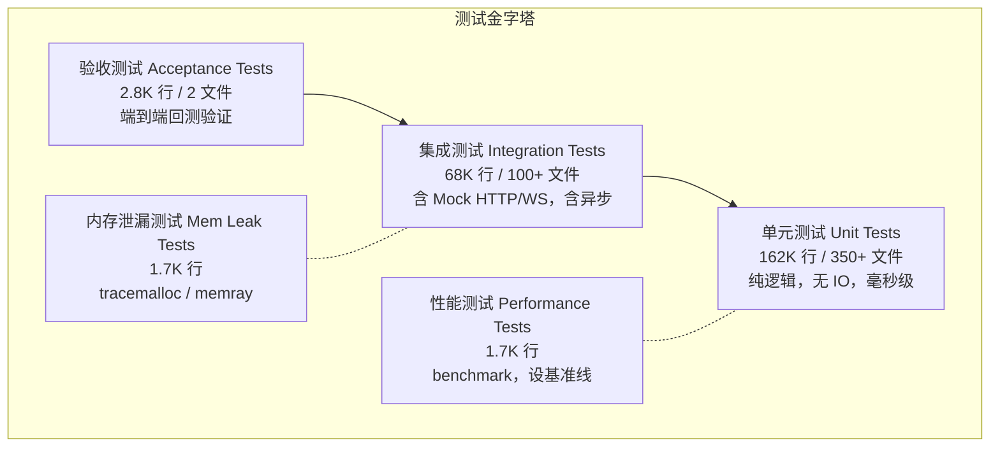
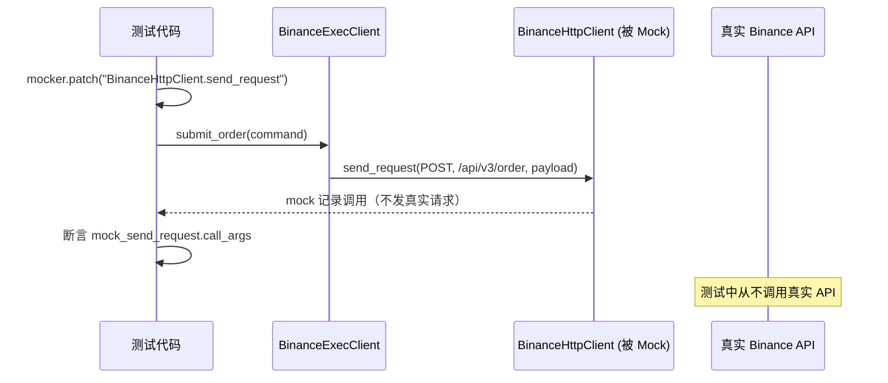
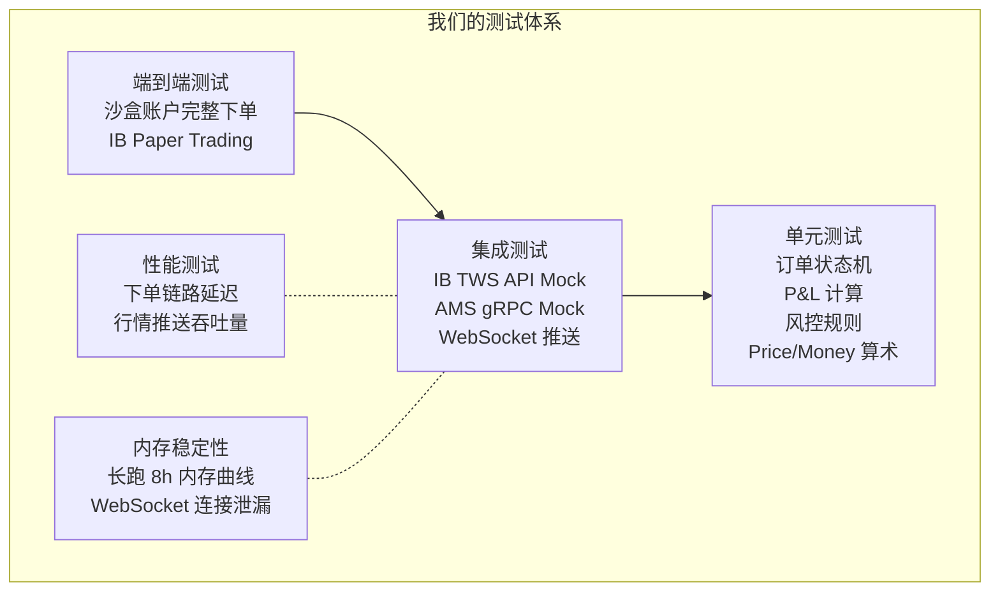

# 交易系统测试策略深度剖析
## 面向零售美港股券商系统的测试参考文档

> **文档定位**: 以 NautilusTrader 测试代码为一手参考，系统梳理交易系统测试的分层体系、核心测试模式、测试基础设施设计，以及与我们券商系统的适配建议。
>
> **源码基准**: `tests/` 目录，共 513 个文件，~237K 行

---

## 目录

1. [为什么交易系统的测试尤其重要](#1-为什么交易系统的测试尤其重要)
2. [测试分层体系](#2-测试分层体系)
3. [测试基础设施：Test Kit 模式](#3-测试基础设施test-kit-模式)
4. [单元测试：核心模式与案例](#4-单元测试核心模式与案例)
   - 4.1 领域模型测试
   - 4.2 订单状态机测试
   - 4.3 执行引擎测试
   - 4.4 风控引擎测试
   - 4.5 持仓与 P&L 测试
5. [集成测试：适配器层模式](#5-集成测试适配器层模式)
6. [性能测试模式](#6-性能测试模式)
7. [内存泄漏测试](#7-内存泄漏测试)
8. [关键竞态场景的专项测试](#8-关键竞态场景的专项测试)
9. [对我们券商系统的测试建议](#9-对我们券商系统的测试建议)

---

## 1. 为什么交易系统的测试尤其重要

NautilusTrader 的测试代码占总量 **19%**（237K 行 / 1.26M 行），远高于一般业务系统。这不是过度工程，而是金融系统的本质要求：

| 场景 | 一般 Web 系统 bug | 交易系统 bug |
|---|---|---|
| 持仓均价计算错误 | 显示问题 | 直接导致客户资金损失 |
| 撤单竞态未处理 | 体验问题 | 客户以为撤单成功但订单仍在场上 |
| 重复成交回报处理 | 数据冗余 | 持仓翻倍，账户数据错乱 |
| 价格精度用浮点数 | 极少出问题 | 特定价格下撮合/结算计算错误 |
| 状态机缺少竞态转换 | 功能缺失 | 账户资金/持仓状态永久不一致 |

**核心原则：测试是交易系统正确性的唯一保障。** 监管审查、账户对账、纠纷处理都依赖系统行为的确定性和可追溯性。

---

## 2. 测试分层体系



| 层次 | 数量 | 速度 | 覆盖目标 | 运行时机 |
|---|---|---|---|---|
| 单元测试 | 350+ 文件 | 毫秒 | 状态机、计算逻辑、边界条件 | 每次 commit |
| 集成测试 | 100+ 文件 | 秒 | API 序列化/反序列化、适配器行为 | 每次 PR |
| 验收测试 | 2 文件 | 分钟 | 全链路端到端正确性 | 每日构建 |
| 性能测试 | 22 文件 | 秒-分钟 | 关键路径延迟基准 | 每日/发版前 |
| 内存泄漏 | 17 文件 | 分钟 | 长期运行内存稳定性 | 每日 |

---

## 3. 测试基础设施：Test Kit 模式

这是 NautilusTrader 测试体系最值得借鉴的设计——**将所有测试辅助工具集中在 `test_kit/` 模块中统一管理**，避免每个测试文件重复构造测试数据。

```
nautilus_trader/test_kit/
├── providers.py          # TestInstrumentProvider  — 预构建的金融工具对象
├── stubs/
│   ├── events.py         # TestEventStubs          — 预构建的订单事件对象
│   ├── identifiers.py    # TestIdStubs             — 固定的测试 ID
│   ├── data.py           # TestDataStubs           — 预构建的行情数据
│   └── execution.py      # TestExecStubs           — 预构建的账户对象
├── mocks/
│   ├── exec_clients.py   # MockExecutionClient     — 模拟执行客户端
│   └── cache_database.py # MockCacheDatabase       — 模拟持久化层
└── rust/
    └── instruments_pyo3.py  # TestInstrumentProviderPyo3
```

### 3.1 TestInstrumentProvider — 固定的测试合约

```python
# nautilus_trader/test_kit/providers.py

# 预构建常用测试合约，避免每个测试用例重复定义
AUDUSD_SIM = TestInstrumentProvider.default_fx_ccy("AUD/USD")
BTCUSDT_BINANCE = TestInstrumentProvider.btcusdt_binance()
AAPL_EQUITY = TestInstrumentProvider.equity("AAPL", "XNAS")

# 使用方式：直接引用，不在 setup() 里创建
class TestExecutionEngine:
    def setup(self):
        self.cache.add_instrument(AUDUSD_SIM)  # 注册到 Cache，而非重新构造
```

> **源码**: `nautilus_trader/test_kit/providers.py`

### 3.2 TestEventStubs — 驱动状态机的事件工厂

这是最核心的测试工具，**一行代码生成任意状态的订单事件**：

```python
# nautilus_trader/test_kit/stubs/events.py

# 模拟订单完整生命周期的事件序列
engine.process(TestEventStubs.order_submitted(order))
engine.process(TestEventStubs.order_accepted(order))
engine.process(TestEventStubs.order_filled(
    order=order,
    instrument=AUDUSD_SIM,
    last_qty=Quantity.from_int(50_000),   # 支持部分成交
    last_px=Price.from_str("1.00050"),    # 支持自定义成交价
    liquidity_side=LiquiditySide.MAKER,   # Maker/Taker
    commission=Money(2.00, USD),          # 自定义手续费
))

# 撤单场景
engine.process(TestEventStubs.order_pending_cancel(order))
engine.process(TestEventStubs.order_canceled(order))

# 拒绝场景
engine.process(TestEventStubs.order_rejected(order))
```

> **源码**: `nautilus_trader/test_kit/stubs/events.py`

### 3.3 MockExecutionClient — 不真正发网络请求

```python
# nautilus_trader/test_kit/mocks/exec_clients.py

class MockExecutionClient(ExecutionClient):
    """
    记录所有调用，但不发真实网络请求。
    测试可以断言"是否调用了 submit_order"以及"调用的参数是什么"。
    """
    def __init__(self, ...):
        self.calls: list[str] = []      # 被调用的方法名列表
        self.commands: list[TradingCommand] = []  # 收到的命令列表

    def submit_order(self, command):
        self.calls.append("submit_order")
        self.commands.append(command)
        # 不发真实 HTTP 请求
```

**用途**：测试执行引擎时，用 Mock 替换真实的 IB/Binance 客户端，可以：
1. 验证执行引擎是否正确调用了 `submit_order`
2. 验证传入的命令参数（price, qty, order_type）是否正确
3. 手动 `process()` 回报事件，驱动状态机

### 3.4 TestClock — 可控时钟

```python
# 测试中使用 TestClock 代替 LiveClock
self.clock = TestClock()

# 可以手动推进时间
self.clock.advance_time(secs_to_nanos(60))  # 前进 60 秒

# GTD 订单过期测试：不需要真的等待，直接推进时钟
```

> **源码**: `nautilus_trader/common/component.py` — `TestClock`

### 3.5 标准 Setup 模板

NautilusTrader 所有执行相关测试都用相同的 setup 模板，保证组件装配完整：

```python
# tests/unit_tests/execution/test_engine.py

class TestExecutionEngine:
    def setup(self) -> None:
        self.clock = TestClock()
        self.trader_id = TestIdStubs.trader_id()

        # 1. 消息总线
        self.msgbus = MessageBus(trader_id=self.trader_id, clock=self.clock)

        # 2. Cache + MockDB（不真正写磁盘）
        self.cache = Cache(database=MockCacheDatabase())

        # 3. 组合管理
        self.portfolio = Portfolio(msgbus=self.msgbus, cache=self.cache, clock=self.clock)

        # 4. 数据引擎
        self.data_engine = DataEngine(msgbus=self.msgbus, cache=self.cache, clock=self.clock)

        # 5. 执行引擎
        self.exec_engine = ExecutionEngine(msgbus=self.msgbus, cache=self.cache, clock=self.clock)

        # 6. 风控引擎
        self.risk_engine = RiskEngine(portfolio=self.portfolio, msgbus=self.msgbus, ...)

        # 7. 注册 Mock 执行客户端
        self.exec_client = MockExecutionClient(
            client_id=ClientId("SIM"),
            venue=Venue("SIM"),
            account_type=AccountType.MARGIN,
            base_currency=USD,
            ...
        )
        self.exec_engine.register_client(self.exec_client)
```

---

## 4. 单元测试：核心模式与案例

### 4.1 领域模型测试 — 值类型的边界条件

```python
# tests/unit_tests/model/test_orders.py

# 模式：构造非法对象，断言抛出异常
def test_market_order_with_quantity_zero_raises_value_error(self):
    with pytest.raises(ValueError):
        MarketOrder(
            ...,
            Quantity.zero(),  # ← 零数量不合法
        )

def test_market_order_with_invalid_tif_raises_value_error(self):
    with pytest.raises(ValueError):
        MarketOrder(
            ...,
            TimeInForce.GTD,  # ← 市价单不支持 GTD
        )

def test_stop_limit_order_with_gtd_and_expiration_none_raises(self):
    with pytest.raises(TypeError):
        StopLimitOrder(
            ...,
            time_in_force=TimeInForce.GTD,
            expire_time=None,  # ← GTD 必须有过期时间
        )
```

**对我们的启示**：对 `POST /orders` 的每一个参数非法组合都需要单元测试：
- 市价单 + GTD → 拒绝
- 限价单 + 价格为 None → 拒绝
- 数量为 0 或负数 → 拒绝
- 港股数量不是 lot_size 整数倍 → 拒绝

### 4.2 订单状态机测试 — 验证每条合法/非法转换

```python
# tests/unit_tests/model/test_orders.py

# 合法转换
def test_initialize_limit_order(self):
    order = self.order_factory.limit(AUDUSD_SIM.id, OrderSide.BUY, ...)
    assert order.status == OrderStatus.INITIALIZED
    assert order.is_open is False
    assert order.is_closed is False

# 经过完整生命周期后的状态验证
def test_order_status_after_fill(self):
    # 驱动状态机经过所有中间状态
    order.apply(TestEventStubs.order_submitted(order))
    order.apply(TestEventStubs.order_accepted(order))
    order.apply(TestEventStubs.order_filled(order, instrument))

    assert order.status == OrderStatus.FILLED
    assert order.is_closed
    assert order.filled_qty == order.quantity
    assert order.avg_px is not None
```

### 4.3 执行引擎测试 — 组件集成正确性

#### 正常下单流程验证

```python
# tests/unit_tests/execution/test_engine.py

def test_submit_order(self) -> None:
    # Arrange —— 准备 strategy、order
    order = strategy.order_factory.market(AUDUSD_SIM.id, OrderSide.BUY, Quantity.from_int(100_000))
    submit_order = SubmitOrder(trader_id=..., order=order, ...)

    # Act —— 通过风控引擎提交（走完整流程）
    self.risk_engine.execute(submit_order)

    # Assert —— 验证执行客户端收到了命令
    assert self.exec_client.calls[-1] == "submit_order"
    assert self.cache.order(order.client_order_id).status == OrderStatus.SUBMITTED
```

#### 多次部分成交验证

```python
def test_handle_multiple_partial_fill_events(self) -> None:
    # Arrange
    order = strategy.order_factory.market(AUDUSD_SIM.id, OrderSide.BUY, Quantity.from_int(100_000))
    self.risk_engine.execute(submit_order)
    self.exec_engine.process(TestEventStubs.order_submitted(order))
    self.exec_engine.process(TestEventStubs.order_accepted(order))

    # Act — 两次部分成交
    self.exec_engine.process(
        TestEventStubs.order_filled(order, AUDUSD_SIM, last_qty=Quantity.from_int(40_000))
    )
    self.exec_engine.process(
        TestEventStubs.order_filled(order, AUDUSD_SIM, last_qty=Quantity.from_int(60_000))
    )

    # Assert — 最终状态正确
    assert order.status == OrderStatus.FILLED
    assert order.filled_qty == Quantity.from_int(100_000)

    # 持仓应该被正确创建
    position = self.cache.positions_open()[0]
    assert position.quantity == Quantity.from_int(100_000)
    assert position.is_open
```

### 4.4 风控引擎测试 — 每条拒绝规则都要测

```python
# tests/unit_tests/risk/test_engine.py

# 测试1：交易暂停时拒绝所有订单
def test_submit_order_when_trading_halted_then_denies_order(self):
    self.risk_engine.set_trading_state(TradingState.HALTED)

    order = strategy.order_factory.market(...)
    self.risk_engine.execute(SubmitOrder(..., order=order))

    assert order.status == OrderStatus.DENIED
    assert "HALTED" in order.last_event.reason

# 测试2：价格精度超出合约规格
def test_submit_order_when_invalid_price_precision_then_denies(self):
    order = strategy.order_factory.limit(
        _AUDUSD_SIM.id,
        OrderSide.BUY,
        Quantity.from_int(100_000),
        Price.from_str("0.999999999"),  # ← 精度超出 AUDUSD 的 5 位限制
    )
    self.risk_engine.execute(SubmitOrder(..., order=order))

    assert order.status == OrderStatus.DENIED

# 测试3：资金不足
def test_submit_order_when_market_order_and_over_free_balance_then_denies(self):
    # 账户余额 $1,000,000，但想买 10,000,000 单位
    order = strategy.order_factory.market(
        _AUDUSD_SIM.id, OrderSide.BUY, Quantity.from_int(10_000_000)
    )
    self.risk_engine.execute(SubmitOrder(..., order=order))

    assert order.status == OrderStatus.DENIED

# 测试4：只减仓模式下拒绝新开仓
def test_submit_order_when_trading_reducing_and_buy_order_denies(self):
    self.risk_engine.set_trading_state(TradingState.REDUCING)

    buy_order = strategy.order_factory.market(AUDUSD_SIM.id, OrderSide.BUY, ...)
    self.risk_engine.execute(SubmitOrder(..., order=buy_order))

    assert buy_order.status == OrderStatus.DENIED

# 测试5：TradingState 变更时广播事件
def test_set_trading_state_changes_value_and_publishes_event(self):
    handler = []
    self.msgbus.subscribe(topic="events.risk*", handler=handler.append)

    self.risk_engine.set_trading_state(TradingState.HALTED)

    assert type(handler[0]) is TradingStateChanged
    assert self.risk_engine.trading_state == TradingState.HALTED
```

**NautilusTrader 风控测试用例清单**（可直接参考移植）：

| 测试名 | 验证的规则 |
|---|---|
| `test_submit_order_when_trading_halted_then_denies` | 交易状态 = HALTED |
| `test_submit_order_when_invalid_price_precision` | 价格精度超标 |
| `test_submit_order_when_invalid_negative_price` | 非期权/价差不允许负价格 |
| `test_submit_order_when_invalid_trigger_price` | 条件单触发价格非法 |
| `test_submit_order_when_invalid_quantity_precision` | 数量精度超标 |
| `test_submit_order_when_invalid_quantity_exceeds_maximum` | 数量超上限 |
| `test_submit_order_when_invalid_quantity_less_than_minimum` | 数量低于下限 |
| `test_submit_order_when_less_than_min_notional` | 名义价值低于最小值 |
| `test_submit_order_when_greater_than_max_notional` | 名义价值超单笔限额 |
| `test_submit_order_when_market_order_and_over_free_balance` | 余额不足 |
| `test_submit_reduce_only_order_when_quantity_exceeds_position` | 减仓数量超持仓量 |
| `test_submit_reduce_only_order_when_position_already_closed` | 仓位已平但仍发减仓单 |

### 4.5 持仓与 P&L 测试 — 财务计算必须精确

```python
# tests/unit_tests/model/test_position.py

def test_position_partial_fills_with_buy_order(self) -> None:
    # 买入 100,000 单位，但只成交了 50,000
    fill = TestEventStubs.order_filled(
        order,
        instrument=AUDUSD_SIM,
        last_px=Price.from_str("1.00001"),
        last_qty=Quantity.from_int(50_000),
    )
    position = Position(instrument=AUDUSD_SIM, fill=fill)

    # 断言每一个财务字段
    assert position.quantity == Quantity.from_int(50_000)
    assert position.avg_px_open == 1.00001
    assert position.realized_pnl == Money(-2.00, USD)         # 手续费已扣除
    assert position.unrealized_pnl(Price("1.00048")) == Money(23.50, USD)
    assert position.total_pnl(Price("1.00048")) == Money(21.50, USD)
    assert position.commissions() == [Money(2.00, USD)]

# 使用真实行业数据验证 P&L 算法
def test_pnl_calculation_from_trading_technologies_example(self) -> None:
    # 来源: https://www.tradingtechnologies.com/xtrader-help/...
    # 买 12 @ 100, 买 17 @ 110, 卖 9 @ 105, 卖 4 @ 107, 买 3 @ 103
    # 验证最终均价和已实现 P&L 精确匹配行业标准计算结果
    ...

# 多笔交互单边验证
def test_position_realized_pnl_with_interleaved_order_sides(self) -> None:
    # 买 → 卖 → 买 → 卖，验证每次减仓的 realized_pnl 计算正确
    ...

# 持仓翻转测试（期货场景）
def test_position_closed_and_reopened(self) -> None:
    # 买 100 → 卖 100（平仓）→ 卖 50（反向开空）
    # 验证: position.side 从 LONG → FLAT → SHORT
    ...
```

---

## 5. 集成测试：适配器层模式

集成测试的核心挑战是：**如何在不连接真实交易所的情况下，验证 HTTP/WebSocket 消息的正确序列化和处理？**

NautilusTrader 的解法：**Mock 在网络层，而非应用层**。



```python
# tests/integration_tests/adapters/binance/test_execution_spot.py

async def test_submit_market_order(self, mocker):
    # Arrange — Mock 网络层，不发真实请求
    mock_send_request = mocker.patch(
        target="nautilus_trader.adapters.binance.http.client.BinanceHttpClient.send_request",
    )

    order = self.strategy.order_factory.market(
        instrument_id=ETHUSDT_BINANCE.id,
        order_side=OrderSide.BUY,
        quantity=Quantity.from_int(1),
    )

    # Act
    self.exec_client.submit_order(SubmitOrder(..., order=order))
    await eventually(lambda: mock_send_request.call_args)  # 等待异步完成

    # Assert — 验证 HTTP 请求的内容
    request = mock_send_request.call_args
    assert request[0][0] == HttpMethod.POST
    assert request[0][1] == "/api/v3/order"
    assert request[1]["payload"]["symbol"] == "ETHUSDT"
    assert request[1]["payload"]["type"] == "MARKET"
    assert request[1]["payload"]["side"] == "BUY"
    assert request[1]["payload"]["quantity"] == "1"
    assert request[1]["payload"]["newClientOrderId"] is not None
    # 注意：newClientOrderId 就是我们的 client_order_id，IB 的场景类似
```

**集成测试覆盖的场景**（以 Binance 为例）：

| 测试 | 验证内容 |
|---|---|
| `test_submit_market_order` | 市价单 payload 字段正确性 |
| `test_submit_limit_order` | 限价单含 price 字段 |
| `test_submit_stop_limit_order` | 条件单含 stopPrice 字段 |
| `test_cancel_all_orders_uses_batch_cancel` | 多笔撤单用批量接口 |
| `test_cancel_orders_batch_failure_emits_cancel_rejected` | 批量撤单失败时广播事件 |
| `test_submit_limit_order_with_price_match_denied` | 特定价格被拒绝的错误处理 |

---

## 6. 性能测试模式

NautilusTrader 使用 `pytest-benchmark` 为关键路径建立性能基准：

```python
# tests/performance_tests/test_perf_order.py

class TestOrderPerformance:
    def test_order_id_generator(self, benchmark):
        # 测试 ClientOrderId 生成速度
        benchmark(self.generator.generate)

    def test_market_order_creation(self, benchmark):
        # 测试市价单对象创建速度
        benchmark(
            self.order_factory.market,
            TestIdStubs.audusd_id(),
            OrderSide.BUY,
            Quantity.from_int(100_000),
        )

    def test_limit_order_creation(self, benchmark):
        # 测试限价单对象创建速度
        benchmark(
            self.order_factory.limit,
            TestIdStubs.audusd_id(),
            OrderSide.BUY,
            Quantity.from_int(100_000),
            Price.from_str("0.80010"),
        )
```

```python
# tests/performance_tests/test_perf_live_execution.py

class TestLiveExecutionPerformance:
    @pytest.mark.asyncio
    async def test_submit_order_end_to_end(self, benchmark):
        # 测试从 SubmitOrder 命令到 ExecClient.submit_order 被调用的总延迟
        # 包含 RiskEngine + ExecutionEngine + 异步调度
        ...
```

**输出示例**：
```
test_market_order_creation       200,000 ops/sec   5.0 μs/op
test_limit_order_creation        180,000 ops/sec   5.6 μs/op
test_submit_order_end_to_end      50,000 ops/sec  20.0 μs/op  (含异步)
```

**性能测试的价值**：
1. 每次发版前验证关键路径没有退化
2. 为系统容量规划提供数据依据（如"能支撑多少 QPS"）
3. 当某次重构导致性能下降 2× 时，CI 自动告警

---

## 7. 内存泄漏测试

长期运行的交易系统对内存稳定性有极高要求——每天 6.5 小时美股交易时间内不能有显著内存增长。

NautilusTrader 使用两种工具：

### 7.1 tracemalloc — Python 内存追踪

```python
# tests/mem_leak_tests/tracemalloc_quote_ticks.py

from tests.mem_leak_tests.conftest import snapshot_memory

@snapshot_memory(4000)  # 每 4000 次操作拍一次内存快照
def run_repr(*args, **kwargs):
    quote = TestDataStubs.quote_tick()
    repr(quote)  # 测试 repr 是否有内存泄漏

@snapshot_memory(4000)
def run_from_pyo3(*args, **kwargs):
    pyo3_quote = TestDataProviderPyo3.quote_tick()
    QuoteTick.from_pyo3(pyo3_quote)  # 测试 Rust→Python 转换的内存边界
```

内存测试覆盖的操作：
- `quote_ticks` — 报价 Tick 对象创建/转换
- `trade_ticks` — 成交 Tick 对象
- `orderbook_delta` — 订单簿增量更新
- `bars` — K 线对象
- `capsule_roundtrip` — Rust/Python 内存边界传递

### 7.2 memray — 更强大的内存分析

```python
# tests/mem_leak_tests/memray_backtest.py
# 用于分析完整回测过程中的内存分配热点
```

---

## 8. 关键竞态场景的专项测试

这是交易系统最容易被忽视、也最重要的测试类别。NautilusTrader 对每一个真实世界的竞态场景都有专门测试：

### 8.1 撤单后收到成交（Canceled → Filled）

```python
# tests/unit_tests/execution/test_engine.py

def test_cancel_order_then_filled_reopens_order(self) -> None:
    # Arrange — 驱动订单到 CANCELED 状态
    self.risk_engine.execute(submit_order)
    self.exec_engine.process(TestEventStubs.order_submitted(order))
    self.exec_engine.process(TestEventStubs.order_accepted(order))
    self.exec_engine.process(TestEventStubs.order_canceled(order))  # 先收到撤单确认

    assert order.status == OrderStatus.CANCELED

    # Act — 再收到成交回报（竞态：撤单发出后交易所已经撮合）
    self.exec_engine.process(TestEventStubs.order_filled(order, AUDUSD_SIM))

    # Assert — 状态机正确处理竞态，以 FILLED 为准
    assert order.status == OrderStatus.FILLED
    assert order.is_closed
```

### 8.2 重复成交回报（相同 trade_id）

```python
def test_duplicate_fill_with_same_trade_id_and_data_is_skipped(self) -> None:
    # Arrange
    fill1 = TestEventStubs.order_filled(
        order=order, instrument=AUDUSD_SIM,
        last_qty=Quantity.from_int(50_000),
        trade_id=TradeId("TRADE-001"),
    )
    self.exec_engine.process(fill1)

    assert order.filled_qty == Quantity.from_int(50_000)
    assert order.event_count == 4  # init, submitted, accepted, filled

    # Act — 重复推送相同的 fill（网络重传/重复推送）
    self.exec_engine.process(fill1)  # 完全相同的事件

    # Assert — 重复事件被幂等处理，数量不翻倍
    assert order.filled_qty == Quantity.from_int(50_000)  # ← 没有变成 100,000
    assert order.event_count == 4  # ← 没有增加
```

### 8.3 部分成交后撤剩余

```python
def test_cancel_order_then_partially_filled_reopens_order(self) -> None:
    # 场景：订单在 CANCELED 状态下收到部分成交回报
    # 这在市场极端波动时会发生
    ...
    assert order.status == OrderStatus.PARTIALLY_FILLED  # 以成交状态为准
    assert order.filled_qty == partial_qty
```

### 8.4 持仓翻转（先多后空）

```python
def test_flip_position_on_opposite_filled_same_position_sell(self) -> None:
    # 先买入 100,000 建立多仓
    order1 = strategy.order_factory.market(AUDUSD_SIM.id, OrderSide.BUY, Quantity.from_int(100_000))
    # 再卖出 150,000（超过现有持仓，应该平多仓后建空仓）
    order2 = strategy.order_factory.market(AUDUSD_SIM.id, OrderSide.SELL, Quantity.from_int(150_000))

    # ... 执行 ...

    # Assert — 最终应有空头持仓 50,000
    positions = self.cache.positions()
    long_position = next(p for p in positions if p.side == PositionSide.LONG)
    short_position = next(p for p in positions if p.side == PositionSide.SHORT)

    assert long_position.is_closed
    assert short_position.quantity == Quantity.from_int(50_000)
    assert short_position.is_open
```

---

## 9. 对我们券商系统的测试建议

### 9.1 测试分层规划



### 9.2 必须测试的竞态场景清单

参考 NautilusTrader 的专项测试，我们需要验证以下场景：

```
订单竞态：
  □ 撤单请求发出后收到成交回报（PENDING_CANCEL → FILLED）
  □ 撤单确认后收到成交回报（CANCELED → FILLED）
  □ 相同 trade_id 的成交回报重复推送（幂等处理）
  □ 改单请求发出后收到成交回报（PENDING_UPDATE → FILLED）
  □ 改单被拒绝后状态恢复（PENDING_UPDATE → ACCEPTED）

持仓竞态：
  □ 多笔部分成交后均价计算正确性
  □ 持仓平仓后再次收到成交回报的处理
  □ 买入超过已有空仓量时的持仓翻转

连接竞态：
  □ IB 连接断开后恢复，in-flight 订单对账
  □ WebSocket 断开重连后 order.status 推送补偿
  □ 系统重启后从数据库恢复未完结订单
```

### 9.3 Test Fixture 建议（对应 TestKit 模式）

为 Trading Engine 建立统一的测试基础设施，参考 NautilusTrader 的 test_kit：

```go
// Go 参考实现 — internal/testkit/

// instruments.go — 预构建的测试合约
var (
    AAPLEquity   = newTestEquity("AAPL", "XNAS", 2, 0.01, 100)
    TSMCEquity   = newTestEquity("0700", "XHKG", 3, 0.001, 100)  // 腾讯港股
)

// events.go — 订单事件构造器
type OrderEventStubs struct{}

func (s OrderEventStubs) Submitted(order *Order) *OrderEvent { ... }
func (s OrderEventStubs) Accepted(order *Order, venueOrderId string) *OrderEvent { ... }
func (s OrderEventStubs) Filled(order *Order, opts ...FillOption) *OrderEvent {
    // 支持自定义成交价、部分成交量、手续费
}
func (s OrderEventStubs) Rejected(order *Order, reason string) *OrderEvent { ... }
func (s OrderEventStubs) Canceled(order *Order) *OrderEvent { ... }

// mocks.go — IB 客户端 Mock
type MockIBClient struct {
    SubmitCalls  []SubmitOrderArgs
    CancelCalls  []CancelOrderArgs
}
func (m *MockIBClient) PlaceOrder(contract *Contract, order *IBOrder) {}  // 不发真实请求
func (m *MockIBClient) InjectOrderStatus(orderId int, status string) {}   // 手动注入回报
```

### 9.4 P&L 测试的黄金数据

P&L 计算测试必须包含"黄金标准"验证数据，来自行业权威来源（参考 NautilusTrader 的 `test_pnl_calculation_from_trading_technologies_example`）：

```python
# 测试案例来源: Trading Technologies P&L 计算标准
# https://www.tradingtechnologies.com/xtrader-help/fix-adapter-reference/

# 美股场景
# 买入 100 股 @ $150.00，再卖出 50 股 @ $152.00
# 预期: realized_pnl = (152.00 - 150.00) * 50 - commission = $100.00 - commission
assert position.realized_pnl == Money(100.00 - commission, USD)
assert position.avg_px_open == 150.00
assert position.quantity == 50

# 港股场景（含港元换算）
# 买入 1000 股 @ HK$340.00（腾讯），再卖出 1000 股 @ HK$345.00
# 预期: realized_pnl = (345 - 340) * 1000 - 佣金 - 印花税 - 交易征费
```

### 9.5 风控测试用例矩阵（我们需要新增的）

NautilusTrader 没有的，但零售券商必须测试的风控规则：

| 测试类别 | 具体测试用例 |
|---|---|
| PDT 规则 | 日内交易次数 ≤ 3 次（账户 < $25,000）|
| 港股 T+2 | 买入当日不可卖出（T+0 限制） |
| 涨跌停板 | 港股价格超出当日涨跌幅限制时拒绝 |
| 盘前盘后 | 盘前盘后只允许限价单 |
| 碎股限制 | 部分券商不允许盘前盘后碎股交易 |
| 融资余额 | margin call 触发后拒绝新开仓 |
| 合规黑名单 | KYC 未完成用户拒绝所有交易 |

### 9.6 关键路径性能基准

参考 NautilusTrader 的 performance_tests，我们需要建立：

| 路径 | 目标 SLA | 测试方法 |
|---|---|---|
| 下单 API → IB placeOrder | < 50ms (p99) | benchmark + load test |
| IB execDetails → WebSocket 推送 | < 10ms (p99) | benchmark |
| 行情 Tick → WebSocket 推送 | < 5ms (p99) | benchmark |
| Cache 订单查询 | < 1ms (p99) | benchmark |
| 风控检查（单笔） | < 1ms (p99) | benchmark |

---

## 附录：源码路径速查

| 测试模块 | 路径 |
|---|---|
| 执行引擎单元测试 | `tests/unit_tests/execution/test_engine.py` |
| 风控引擎单元测试 | `tests/unit_tests/risk/test_engine.py` |
| 订单模型单元测试 | `tests/unit_tests/model/test_orders.py` |
| 持仓 P&L 单元测试 | `tests/unit_tests/model/test_position.py` |
| 股票合约单元测试 | `tests/unit_tests/model/instruments/test_equity_pyo3.py` |
| Binance 执行集成测试 | `tests/integration_tests/adapters/binance/test_execution_spot.py` |
| 测试事件工厂 | `nautilus_trader/test_kit/stubs/events.py` |
| 测试合约 Provider | `nautilus_trader/test_kit/providers.py` |
| Mock 执行客户端 | `nautilus_trader/test_kit/mocks/exec_clients.py` |
| 订单性能测试 | `tests/performance_tests/test_perf_order.py` |
| 执行性能测试 | `tests/performance_tests/test_perf_live_execution.py` |
| 内存泄漏测试 | `tests/mem_leak_tests/tracemalloc_quote_ticks.py` |
