# Trading Engine 深度剖析
## 面向零售美港股券商系统的参考文档

> **文档定位**: 以 NautilusTrader 源码为一手参考，结合零售券商业务场景，深入剖析领域模型、执行引擎、数据引擎三个核心模块的设计原理与关键实现，供券商 Trading Engine 服务的架构设计与工程实现参考。
>
> **适用读者**: 交易引擎后端工程师、架构师、技术 PM
>
> **源码基准**: NautilusTrader v1.225.0 (`develop` branch)

---

## 目录

1. [系统全局架构](#1-系统全局架构)
2. [领域模型层](#2-领域模型层)
   - 2.1 核心值类型：Price / Quantity / Money
   - 2.2 金融工具模型
   - 2.3 订单类型体系
   - 2.4 订单状态机（最核心）
   - 2.5 订单事件体系
   - 2.6 持仓模型
3. [执行引擎层](#3-执行引擎层)
   - 3.1 整体架构
   - 3.2 风控引擎（Pre-Trade）
   - 3.3 订单管理系统（OMS）
   - 3.4 执行客户端（ExecClient）
   - 3.5 关键流程：下单全链路
   - 3.6 关键流程：撤单竞态处理
4. [数据引擎层](#4-数据引擎层)
   - 4.1 整体架构
   - 4.2 行情数据类型
   - 4.3 订单簿维护
   - 4.4 K 线聚合
   - 4.5 Cache：系统状态中枢
5. [MessageBus：系统解耦的核心](#5-messagebus系统解耦的核心)
6. [券商适配要点](#6-券商适配要点)

---

## 1. 系统全局架构

NautilusTrader 采用**单进程事件驱动架构**，所有组件通过 `MessageBus` 解耦通信，不存在直接方法调用跨越模块边界。

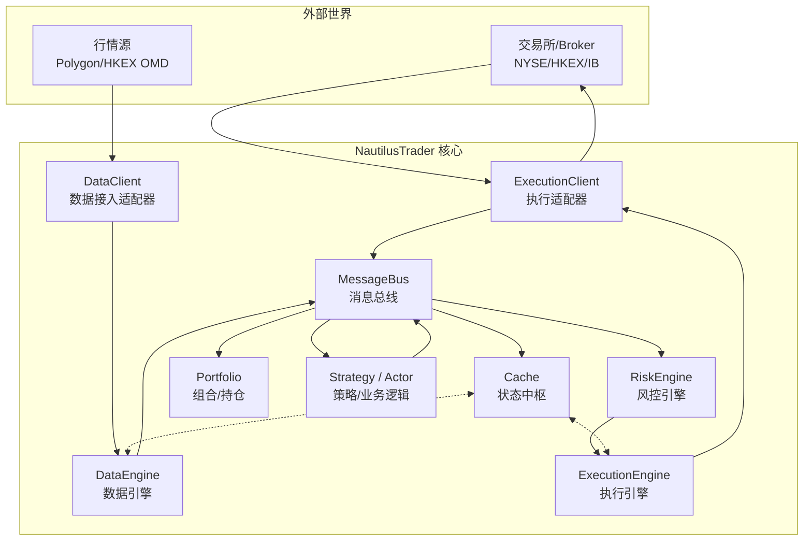

**关键设计原则**：
- `RiskEngine` 在 `ExecutionEngine` 上游 —— 命令必须先过风控才能发到交易所
- `Cache` 是全局只写一次的真相来源（Source of Truth），所有查询走 Cache
- `MessageBus` 是唯一通信通道，订阅/发布模式，组件间零直接依赖

> **源码入口**:
> - 消息体系: `crates/common/src/messages/mod.rs`
> - MessageBus: `crates/common/src/msgbus/mod.rs`
> - Cache: `crates/common/src/cache/mod.rs`

---

## 2. 领域模型层

### 2.1 核心值类型：Price / Quantity / Money

这是整个交易系统最底层的基石，设计上有三个关键决策：

#### 决策一：固定精度整数，禁止浮点数

```
Price 内部表示:
  标准模式:  i64  (64位整数)
  高精度模式: i128 (128位整数，feature = "high-precision")

例: 价格 $123.45，precision=2
  内部存储: 12345 (i64)
  FIXED_SCALAR: 1_000_000_000 (10^9)
  实际内部值: 12345 * 10^9 = 12_345_000_000_000
```

> **源码**: `crates/model/src/types/price.rs:1-80`
> **源码**: `crates/model/src/types/fixed.rs` — `FIXED_PRECISION`, `FIXED_SCALAR`

**为什么不用浮点**：`0.1 + 0.2 = 0.30000000000000004`，在金融系统中会导致撮合错误、保证金计算偏差。NautilusTrader 全程整数运算，Python API 层用 `str` 传递，与你的接口契约 **"所有金额字段使用 string 编码的 decimal，禁止浮点数"** 完全一致。

#### 决策二：不可变值类型（Immutable Value Types）

```rust
// Price / Quantity / Money 均为 Copy 类型
// 算术运算返回新实例，不修改原值
let p1 = Price::new(100.50, 2);
let p2 = Price::new(0.01, 2);
let p3 = p1 + p2;  // 返回新 Price(100.51)，p1 不变
```

#### 决策三：三种类型各司其职

| 类型 | 用途 | 正负 | 精度来源 |
|---|---|---|---|
| `Price` | 市场报价、订单价格 | 可为负（期差/基差） | 交易所规格 |
| `Quantity` | 数量、手数 | 恒正 | 交易所规格 |
| `Money` | 金额（含货币） | 可为负（亏损） | 货币精度 |

> **源码**: `crates/model/src/types/` 目录下各文件

---

### 2.2 金融工具模型

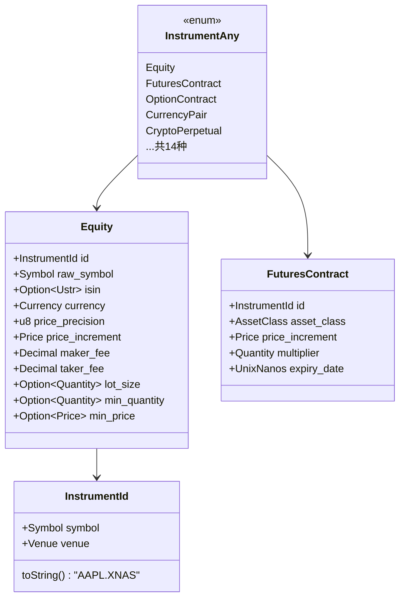

**对券商的关键字段**：

| 字段 | 用途 | 券商场景 |
|---|---|---|
| `price_increment` | 最小报价单位（Tick Size） | 港股 0.01/0.001，美股 $0.01 |
| `lot_size` | 最小交易单位 | 港股 100/200/500 手，美股 1 股 |
| `min_quantity` | 最小下单量 | 碎股支持时设为 1 |
| `maker_fee / taker_fee` | 费率 | 计算预估手续费 |
| `margin_init / margin_maint` | 保证金比例 | 融资融券业务 |

> **源码**: `crates/model/src/instruments/equity.rs`
> **源码**: `crates/model/src/instruments/futures_contract.rs`

---

### 2.3 订单类型体系

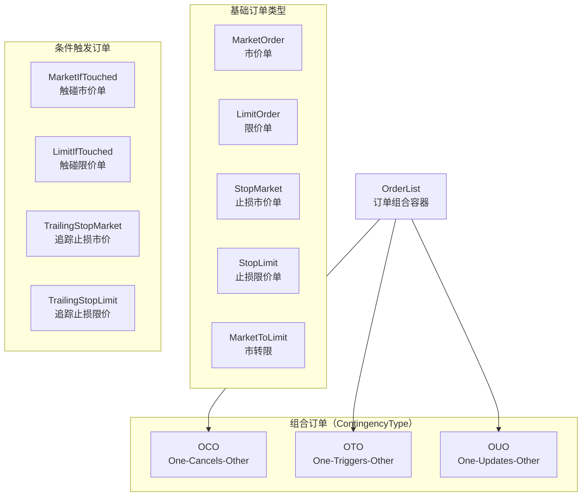

**零售券商常用订单类型**（美港股场景）：

| 订单类型 | 美股 | 港股 | 说明 |
|---|---|---|---|
| `MarketOrder` | ✓ | ✓ | 即时以最优价成交 |
| `LimitOrder` | ✓ | ✓ | 指定价格或更优价成交 |
| `StopMarket` | ✓ | 部分 | 触发后转市价单，常用于止损 |
| `StopLimit` | ✓ | 部分 | 触发后转限价单 |
| `TrailingStopMarket` | ✓ | ✗ | 追踪止损，价格跟随市场 |

**每个订单的完整字段**（以 LimitOrder 为例）：

```rust
// crates/model/src/orders/limit.rs
pub struct LimitOrder {
    // 身份
    pub trader_id: TraderId,
    pub strategy_id: StrategyId,
    pub instrument_id: InstrumentId,
    pub client_order_id: ClientOrderId,   // 客户端生成的唯一ID
    pub venue_order_id: Option<VenueOrderId>, // 交易所返回的ID

    // 订单参数
    pub order_side: OrderSide,      // Buy / Sell
    pub quantity: Quantity,          // 委托数量
    pub price: Price,                // 限价

    // 执行指令
    pub time_in_force: TimeInForce,  // GTC/DAY/IOC/FOK/GTD
    pub expire_time: Option<UnixNanos>,  // GTD 过期时间
    pub post_only: bool,             // 只做 Maker（拒绝 Taker）
    pub reduce_only: bool,           // 只减仓（期货场景）
    pub display_qty: Option<Quantity>, // 冰山单显示量

    // 状态追踪
    pub status: OrderStatus,
    pub filled_qty: Quantity,        // 已成交数量
    pub avg_px: Option<f64>,         // 平均成交价
    pub events: Vec<OrderEventAny>,  // 完整事件历史

    // 时间戳（纳秒）
    pub ts_init: UnixNanos,
    pub ts_last: UnixNanos,
}
```

> **TimeInForce 枚举**:
> - `GTC` — Good Till Cancelled，撤销前有效
> - `DAY` — 当日有效，收盘自动撤销
> - `IOC` — Immediate Or Cancel，立即成交剩余撤销
> - `FOK` — Fill Or Kill，全部成交或全部撤销
> - `GTD` — Good Till Date，指定日期前有效
> - `AT_THE_OPEN` / `AT_THE_CLOSE` — 开盘/收盘集合竞价

---

### 2.4 订单状态机（最核心）

这是整个交易系统正确性的基础，NautilusTrader 对每一个状态转换都做了严格的合法性验证。

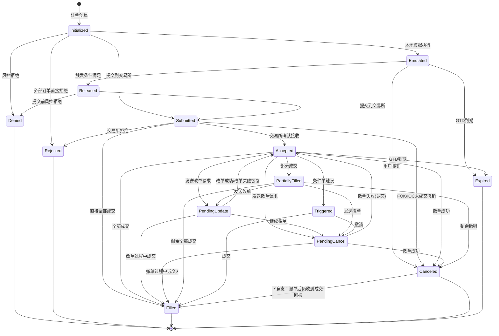

> ⚡ **竞态场景**（Real-world possibility）: 已标注为源码注释，`Canceled → Filled` 和 `PendingCancel → Filled` 是真实市场中存在的情况，NautilusTrader 专门处理了这个状态转换。

> **源码**: `crates/model/src/orders/mod.rs` — `impl OrderStatus { fn transition(...) }`

**状态分组**：

```rust
// is_open() —— 订单仍在交易所挂单中
Submitted | Accepted | Triggered | PendingUpdate | PendingCancel | PartiallyFilled

// is_closed() —— 终态，不可再变更
Denied | Rejected | Canceled | Expired | Filled

// is_cancellable() —— 可以发送撤单请求
Accepted | Triggered | PendingUpdate | PartiallyFilled
// 注意：PendingCancel 不在此列，防止重复撤单
```

---

### 2.5 订单事件体系

订单的每一次状态变化都由一个**不可变事件**驱动，事件永久记录在 `order.events` 列表中，形成完整的审计日志。

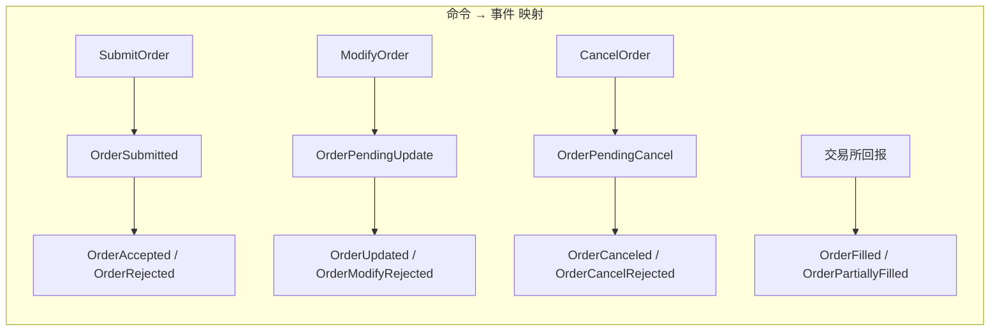

**完整事件列表**：

| 事件 | 触发方 | 说明 |
|---|---|---|
| `OrderInitialized` | 客户端 | 订单对象创建 |
| `OrderDenied` | 风控引擎 | Pre-trade 风控拒绝 |
| `OrderSubmitted` | 执行引擎 | 已提交给交易所 |
| `OrderAccepted` | 交易所 | 交易所确认接收 |
| `OrderRejected` | 交易所 | 交易所拒绝（含原因） |
| `OrderPendingUpdate` | 执行引擎 | 发出改单请求 |
| `OrderUpdated` | 交易所 | 改单成功 |
| `OrderModifyRejected` | 交易所 | 改单被拒 |
| `OrderPendingCancel` | 执行引擎 | 发出撤单请求 |
| `OrderCanceled` | 交易所 | 撤单成功 |
| `OrderCancelRejected` | 交易所 | 撤单被拒 |
| `OrderExpired` | 交易所 | GTD/DAY 到期 |
| `OrderTriggered` | 交易所 | 条件单触发 |
| `OrderFilled` | 交易所 | 成交（含成交价/量/手续费） |

> **源码**: `crates/model/src/events/order/mod.rs`
> **完整事件**: `OrderFilled` 含 `last_px`, `last_qty`, `commission`, `liquidity_side(Maker/Taker)`, `trade_id`

---

### 2.6 持仓模型

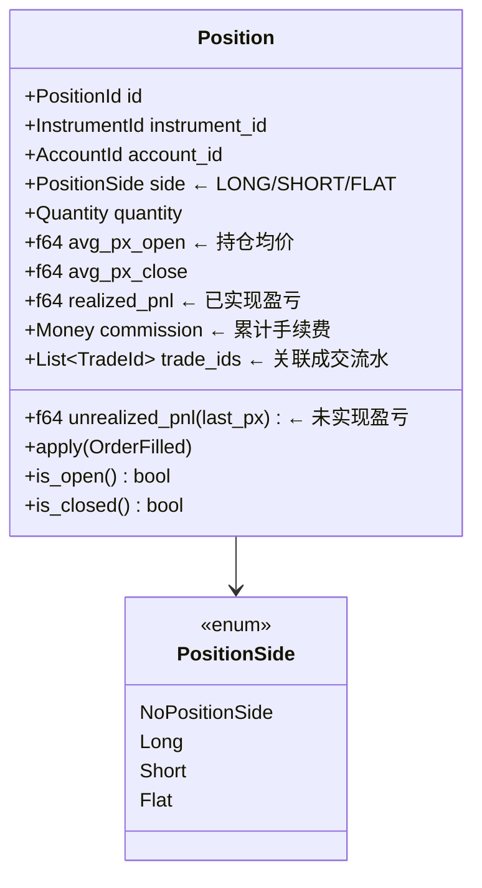

**持仓均价计算**（加权平均）：
```
新增买入：
  avg_px = (old_qty * old_avg_px + fill_qty * fill_px) / (old_qty + fill_qty)

减仓卖出：
  realized_pnl += (fill_px - avg_px_open) * fill_qty - commission
  quantity -= fill_qty
```

> **源码**: `crates/model/src/position.rs`

---

## 3. 执行引擎层

### 3.1 整体架构

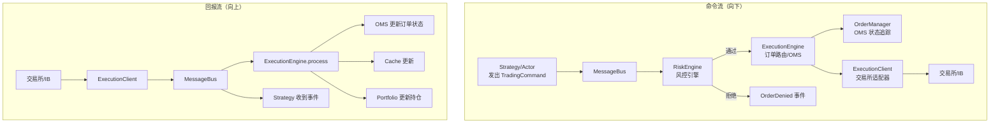

> **源码**: `crates/execution/src/engine/mod.rs`

---

### 3.2 风控引擎（Pre-Trade）

风控引擎是订单进入交易所之前的最后一道门，**同步执行**，通过则放行，拒绝则立即产生 `OrderDenied` 事件。

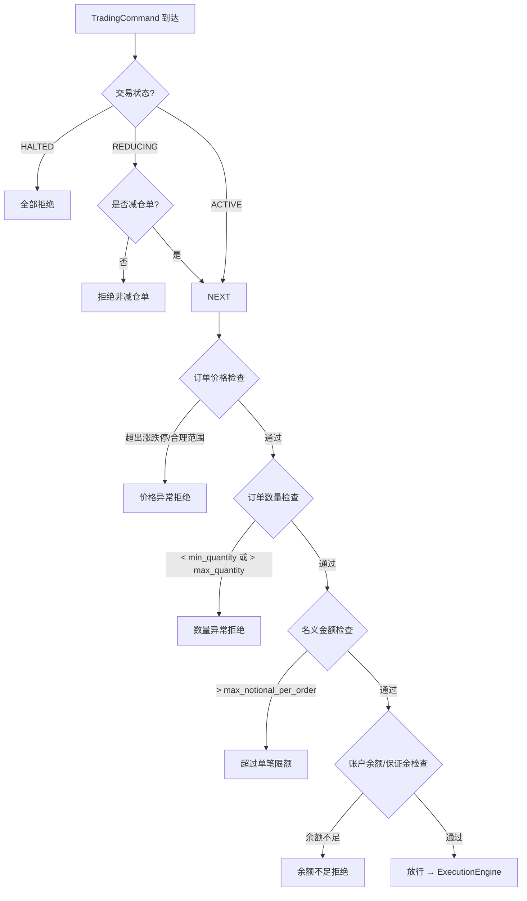

**风控配置参数** (`RiskEngineConfig`):

```rust
pub struct RiskEngineConfig {
    pub bypass: bool,                    // 是否跳过风控（仅测试用）
    pub max_order_submit_rate: Option<RateLimit>,    // 下单频率限制
    pub max_order_modify_rate: Option<RateLimit>,    // 改单频率限制
    pub max_notional_per_order: HashMap<InstrumentId, Decimal>, // 单笔名义额限制
}

// TradingState 枚举
pub enum TradingState {
    Active,    // 正常交易
    Halted,    // 完全暂停（紧急情况）
    Reducing,  // 只允许减仓
}
```

> **源码**: `crates/risk/src/engine/mod.rs` — `check_order()`, `check_order_price()`, `check_order_quantity()`, `check_orders_risk()`

**对零售券商的补充风控**（NautilusTrader 未包含，需自行实现）：

| 风控项 | 说明 | 实现位置建议 |
|---|---|---|
| PDT 规则 | 美股 Pattern Day Trader 检测 | AMS 或 RiskEngine 扩展 |
| 涨跌停板 | 港股价格限制 | RiskEngine price_check |
| 客户交易权限 | KYC 等级对应可交易品种 | AMS → Trading Engine gRPC |
| T+0/T+1 限制 | 港股当日买入不可当日卖出 | Position 检查 |
| 融资融券比例 | 按账户 margin tier | Account 模块 |

---

### 3.3 订单管理系统（OMS）

OMS 负责**跟踪每一笔订单的完整生命周期**，是整个执行引擎的状态核心。

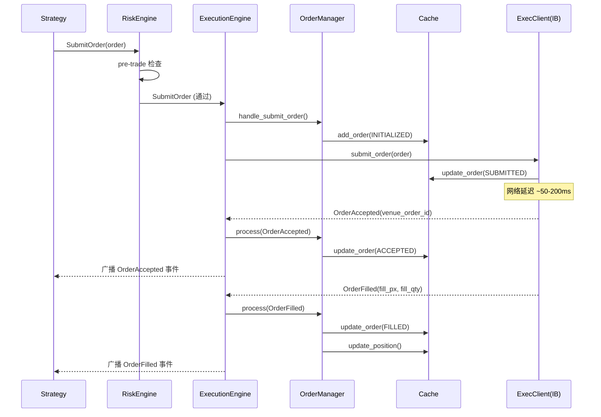

**OMS 核心职责**：

```rust
// crates/execution/src/order_manager/manager.rs 关键方法：

// 1. 注册新订单（提交时）
fn handle_submit_order(order: &OrderAny) {
    cache.add_order(order, INITIALIZED);
}

// 2. 处理交易所回报，驱动状态机
fn process_event(event: &OrderEventAny) {
    let order = cache.get_order(event.client_order_id);
    order.apply(event);          // 触发状态机 transition()
    cache.update_order(order);   // 持久化新状态
    // 若事件是 OrderFilled，同步更新 Position
}

// 3. 对账：系统重启后与交易所同步状态
fn reconcile_order_status_report(report: &OrderStatusReport) {
    // 比对本地状态 vs 交易所状态
    // 生成补偿事件使两者一致
}
```

> **源码**: `crates/execution/src/order_manager/manager.rs`
> **源码**: `crates/execution/src/reconciliation.rs`

---

### 3.4 执行客户端（ExecClient）

每个交易所/Broker 对应一个 `ExecutionClient` 实现，对外暴露统一接口：

```rust
// crates/common/src/clients.rs — ExecutionClient trait
pub trait ExecutionClient {
    async fn submit_order(&mut self, command: &SubmitOrder) -> anyhow::Result<()>;
    async fn modify_order(&mut self, command: &ModifyOrder) -> anyhow::Result<()>;
    async fn cancel_order(&mut self, command: &CancelOrder) -> anyhow::Result<()>;
    async fn cancel_all_orders(&mut self, command: &CancelAllOrders) -> anyhow::Result<()>;
    async fn generate_mass_status(&mut self, ...) -> anyhow::Result<()>;
}
```

对于零售券商，`ExecutionClient` 就是对 IB (Interactive Brokers) TWS API 的封装。它负责：
1. 将内部 `SubmitOrder` 命令转换为 IB 的 `placeOrder()` 调用
2. 将 IB 回调（`orderStatus`, `execDetails`）转换为内部 `OrderFilled` 等事件
3. 管理连接断线重连

---

### 3.5 关键流程：下单全链路

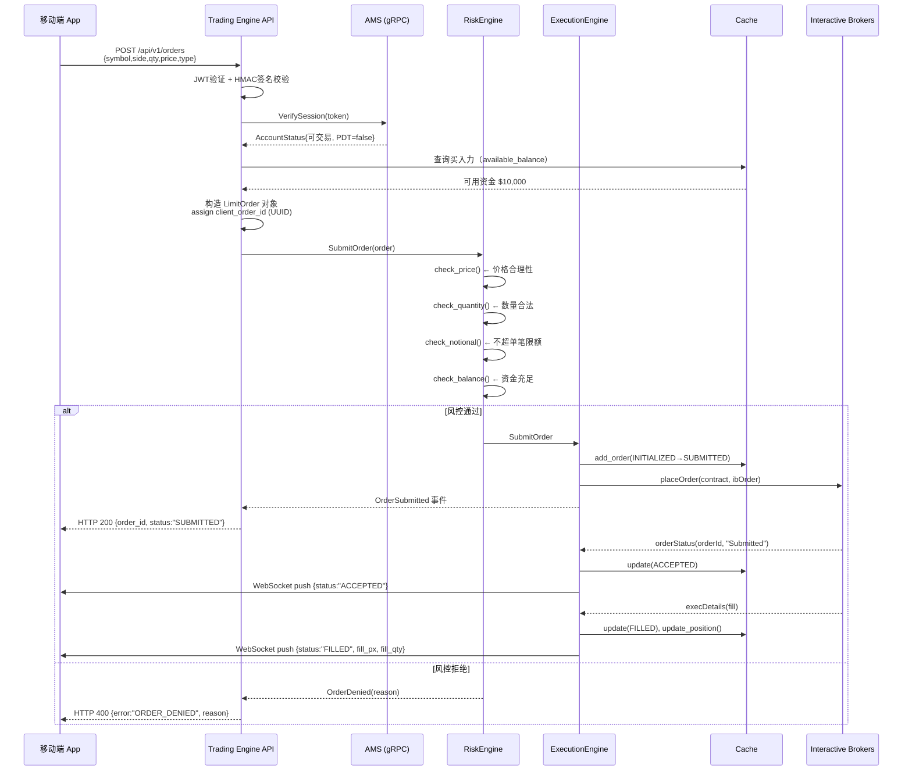

---

### 3.6 关键流程：撤单竞态处理

这是交易系统中最容易出 bug 的场景：**用户撤单的同时，交易所正好成交了**。

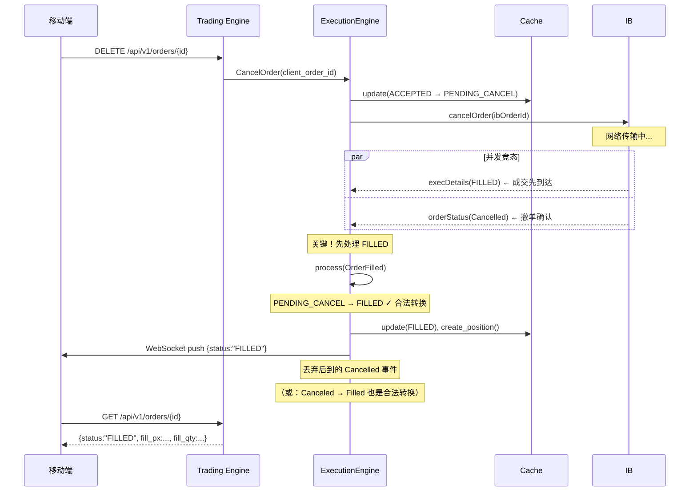

**状态机的竞态保护**（源码中的注释）：
```rust
// crates/model/src/orders/mod.rs
(Self::Canceled, OrderEventAny::Filled(_)) => Self::Filled,
// "Real world possibility" —— 已撤单后收到成交回报，合法转换

(Self::PendingCancel, OrderEventAny::Filled(_)) => Self::Filled,
// 撤单进行中收到成交回报，优先处理成交

(Self::PendingCancel, OrderEventAny::Accepted(_)) => Self::Accepted,
// 撤单请求失败，恢复为 Accepted，订单仍在场上
```

---

## 4. 数据引擎层

### 4.1 整体架构

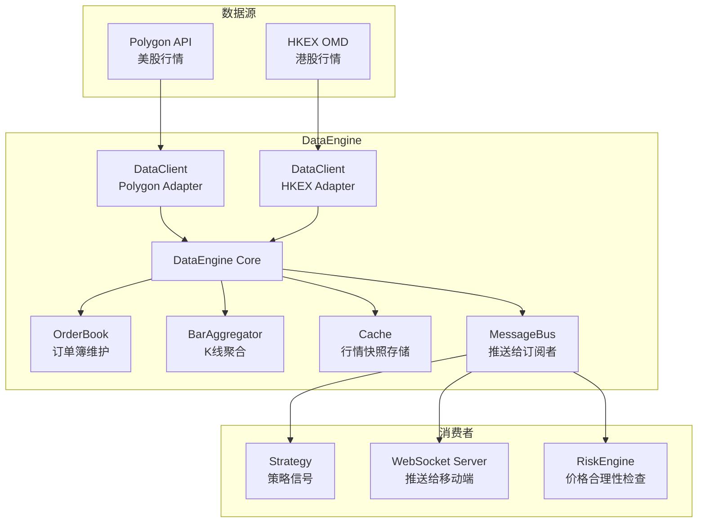

> **源码**: `crates/data/src/engine/mod.rs`

---

### 4.2 行情数据类型

NautilusTrader 定义了**完整的行情数据类型层次**：

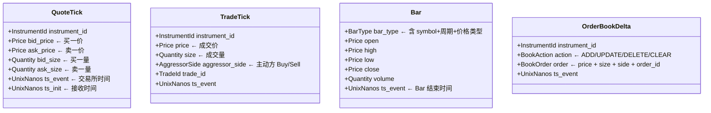

**BarType 的设计**（非常精巧）：

```
BarType = InstrumentId + BarSpecification + AggregationSource

BarSpecification = step + aggregation + price_type
例如:
  "AAPL.XNAS-1-MINUTE-LAST-EXTERNAL"   ← 1分钟K线，用最新价，来自外部
  "AAPL.XNAS-5-MINUTE-BID-INTERNAL"    ← 5分钟K线，用买价，内部聚合
  "AAPL.XNAS-1-VOLUME-MID-INTERNAL"    ← 按成交量聚合，1手一根K线
```

`AggregationSource` 区分了两种 K 线来源：
- `EXTERNAL` — 从数据源直接获取（如 Polygon 推送现成的 1min Bar）
- `INTERNAL` — 从 Tick 数据在本地聚合计算

> **源码**: `crates/model/src/data/bar.rs`

---

### 4.3 订单簿维护

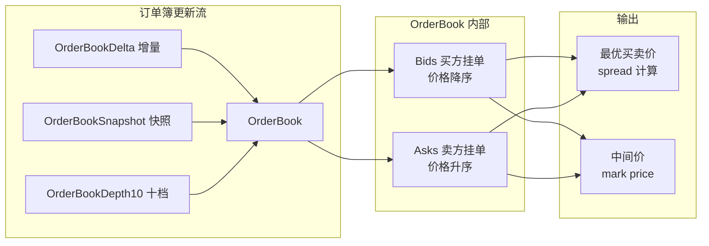

NautilusTrader 支持三种订单簿精度：
- `L1_MBP` — 仅 Top of Book（买一/卖一）
- `L2_MBP` — 多档聚合（按价位）
- `L3_MBO` — 逐单订单簿（机构级别）

零售券商通常使用 `L1_MBP` 或 `L2_MBP`（十档盘口）。

> **源码**: `crates/model/src/orderbook/`

---

### 4.4 K 线聚合

内部聚合是 NautilusTrader 的一个亮点：从 Tick 流实时生成任意周期 K 线。

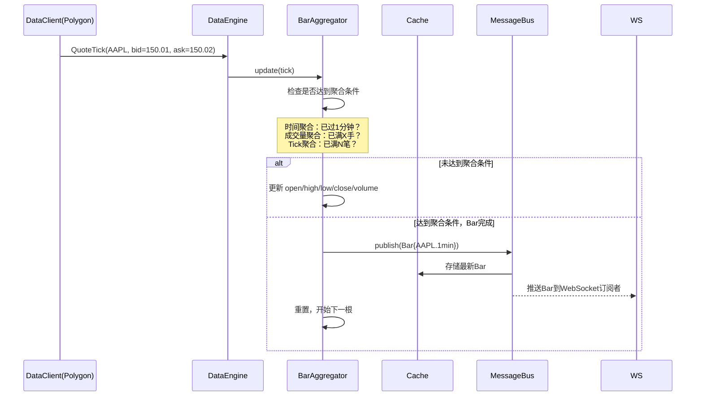

> **源码**: `crates/data/src/aggregation.rs`

---

### 4.5 Cache：系统状态中枢

`Cache` 是整个系统的**内存状态中枢**，所有查询操作不走数据库，直接从 Cache 读取，保证低延迟。

**Cache 存储的内容**：

```
行情数据:
  quotes[instrument_id] → 最新 QuoteTick
  trades[instrument_id] → 最新 TradeTick
  bars[bar_type]        → 最新 N 根 Bar
  order_books[instrument_id] → 实时订单簿

交易数据:
  orders[client_order_id]     → 所有订单（含历史）
  positions[position_id]      → 所有持仓
  accounts[account_id]        → 账户余额

金融工具:
  instruments[instrument_id]  → 合约规格
  currencies[code]            → 货币信息
```

**Cache 的写入规则**：
- 只有 `ExecutionEngine` 和 `DataEngine` 可以写入 Cache
- 策略/业务逻辑只能读取 Cache
- 每次写入同时可选持久化到 Redis / PostgreSQL

> **源码**: `crates/common/src/cache/mod.rs`
> **关键查询方法**: `client_order_ids_open()`, `positions_open()`, `calculate_unrealized_pnl()`

---

## 5. MessageBus：系统解耦的核心

```mermaid
graph LR
    subgraph "发布者"
        EE4[ExecutionEngine]
        DE4[DataEngine]
        EC4[ExecClient]
    end

    subgraph "MessageBus"
        MB4[主题路由表<br/>topic → [handlers]]
    end

    subgraph "订阅者"
        ST4[Strategy]
        RE4[RiskEngine]
        PF4[Portfolio]
        CA4[Cache]
        WS4[WebSocket推送层]
    end

    EE4 -- "publish('execution.OrderFilled')" --> MB4
    DE4 -- "publish('data.QuoteTick.AAPL')" --> MB4
    EC4 -- "publish('execution.OrderAccepted')" --> MB4

    MB4 -- "dispatch" --> ST4
    MB4 -- "dispatch" --> RE4
    MB4 -- "dispatch" --> PF4
    MB4 -- "dispatch" --> CA4
    MB4 -- "dispatch" --> WS4
```

**主题命名规范**（NautilusTrader 的约定）：
```
数据主题:
  data.QuoteTick.{instrument_id}
  data.TradeTick.{instrument_id}
  data.Bar.{bar_type}

执行主题:
  execution.{EventType}          ← 所有执行事件
  execution.OrderFilled          ← 特定事件
```

**对券商 WebSocket 推送的启示**：
可以在 MessageBus 上挂一个 `WebSocketBroadcaster`，订阅相关主题，将事件翻译为 JSON 推送给移动端，实现**执行引擎与推送层完全解耦**。

---

## 6. 券商适配要点

### 6.1 你的系统 vs NautilusTrader 覆盖范围

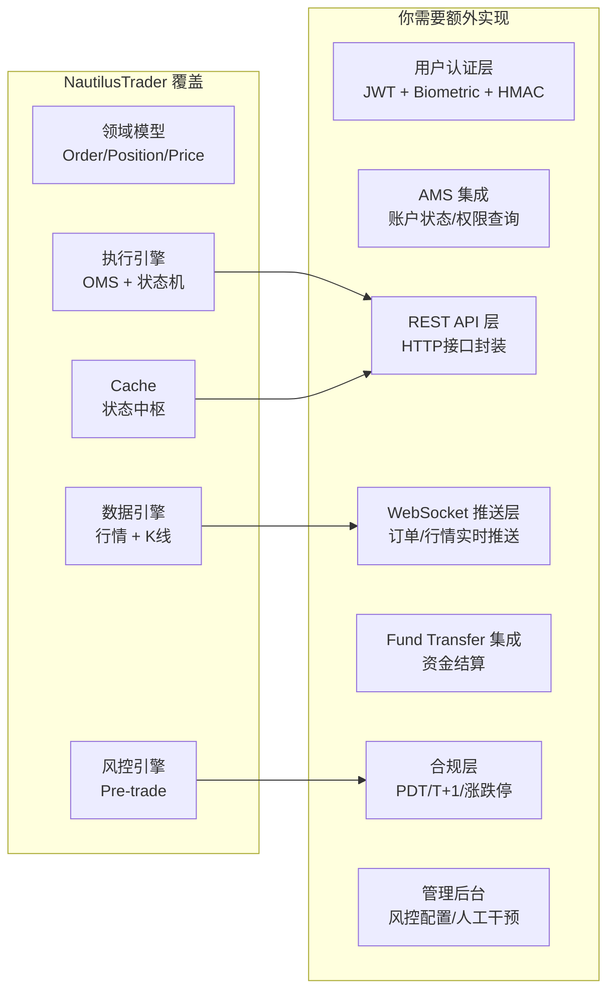

### 6.2 关键设计建议

#### 建议一：直接复用订单状态机设计

将 NautilusTrader 的 14 个状态和完整状态转换表直接移植到你的 Go/Java 实现中，不要自己简化。少一个状态（如 `PendingCancel`）就会在竞态场景下埋下 bug。

#### 建议二：Price/Quantity 用 int64 存储

```go
// Go 参考实现
type Price struct {
    raw       int64  // 内部整数表示
    precision uint8  // 小数精度
}

func (p Price) String() string {
    // 转换为 "150.01" 格式
}

// 禁止:
type WrongPrice struct {
    value float64  // ❌ 永远不要这样做
}
```

#### 建议三：订单事件要持久化为事件日志

每一个 `OrderEvent` 都应该写入数据库（PostgreSQL），而不只是更新订单状态字段。这既是审计要求，也是系统崩溃后恢复状态的基础。

#### 建议四：Cache 层要与数据库双写

```
OrderFilled 到来时:
  1. 更新内存 Cache（同步，< 1ms）
  2. 异步写入 PostgreSQL（用 Kafka/队列）
  3. 返回 HTTP 响应（基于内存状态）

查询接口:
  GET /positions → 读 Cache（< 1ms）
  GET /orders/history → 读 PostgreSQL（历史数据）
```

#### 建议五：与 IB (Interactive Brokers) 的集成参考

NautilusTrader 有完整的 IB 适配器实现（`nautilus_trader/adapters/interactive_brokers/`），你的 `ExecutionClient` 实现可以直接参考其：
- TWS API 连接管理和重连策略
- 订单字段到 IB Contract/Order 的映射
- `orderStatus` / `execDetails` 回调处理
- 账户余额同步（`AccountSummary`）

---

## 附录：源码路径速查

| 模块 | 路径 |
|---|---|
| 订单状态机 | `crates/model/src/orders/mod.rs` |
| 订单状态枚举 | `crates/model/src/enums.rs` |
| 订单事件体系 | `crates/model/src/events/order/mod.rs` |
| Price 类型 | `crates/model/src/types/price.rs` |
| Quantity 类型 | `crates/model/src/types/quantity.rs` |
| 股票合约模型 | `crates/model/src/instruments/equity.rs` |
| 期货合约模型 | `crates/model/src/instruments/futures_contract.rs` |
| 持仓模型 | `crates/model/src/position.rs` |
| 执行引擎 | `crates/execution/src/engine/mod.rs` |
| 订单管理器 | `crates/execution/src/order_manager/manager.rs` |
| 对账逻辑 | `crates/execution/src/reconciliation.rs` |
| 风控引擎 | `crates/risk/src/engine/mod.rs` |
| 数据引擎 | `crates/data/src/engine/mod.rs` |
| K线聚合 | `crates/data/src/aggregation.rs` |
| Cache | `crates/common/src/cache/mod.rs` |
| MessageBus | `crates/common/src/msgbus/mod.rs` |
| 消息类型 | `crates/common/src/messages/mod.rs` |
| IB 适配器 | `nautilus_trader/adapters/interactive_brokers/` |
