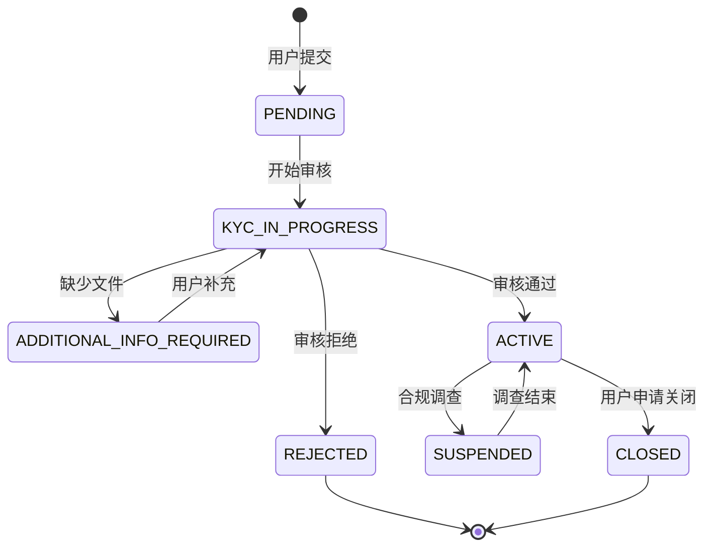
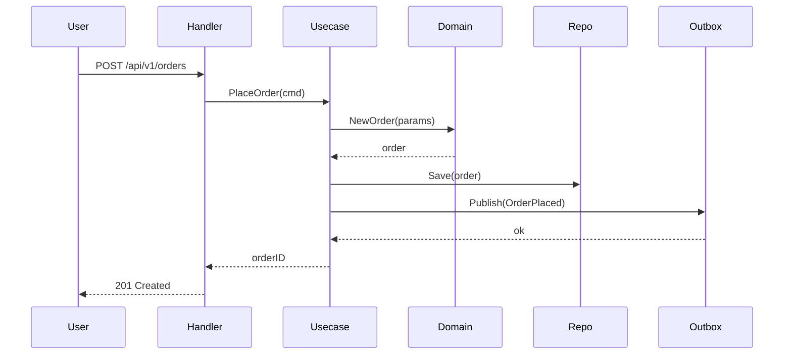
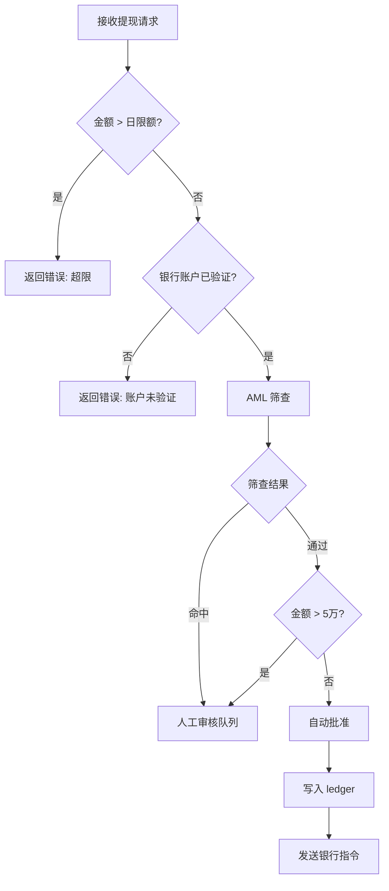
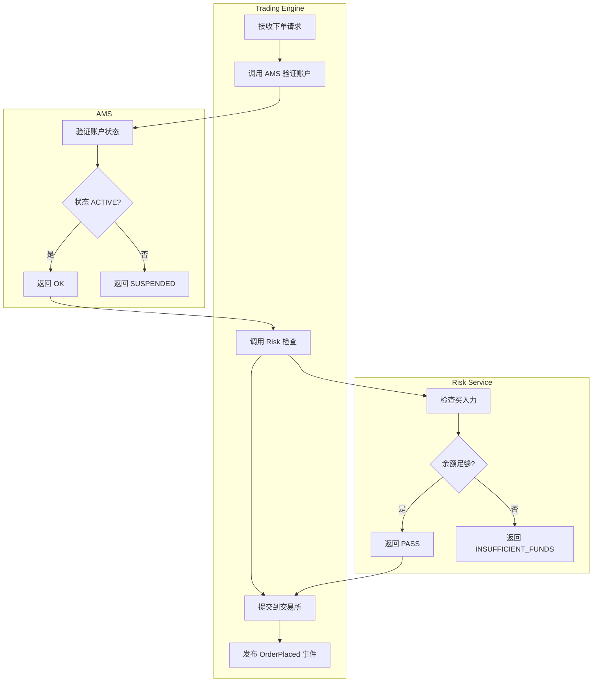

# 功能开发工作流规范

> 本文档是平台级工程流程标准。所有 domain engineer（ams-engineer、trading-engineer、fund-engineer、market-data-engineer 等）在收到 PRD 后，必须遵循本工作流。
>
> **适用范围**：中大型需求（新功能、功能重构、合规改造）。Bug fix 和小型改动可轻量化处理，但 Phase 6 验收不可省略。

---

## 总览

```
PRD（L1）
    │
    ▼
Step 1: PRD Tech Review          → 产出 Thread（记录技术问题和决策）
    │
    ▼
Step 1.5: Contract Definition    → 产出 api/{service}/v1/*.proto + docs/contracts/*.md
    │                               （前后端并行开工的前提）
    ▼
Step 2: Tech Spec                → 产出 services/{domain}/docs/specs/{feature}.md
    │                               （引用 Step 1.5 的 proto，设计内部实现）
    ▼
Step 3-8: 分 Phase 实现 + 验收   → 每个 Phase 结束：self-verify + Codex verify
    │
    ▼
全部 Phase 完成 → 触发 code-reviewer + security-engineer（按 CLAUDE.md 工作流链）
```

**核心原则**：Contract First → Spec Second → Code Third → Test Against Spec。
每一行代码都有对应的 spec 可以追溯；每个 Phase 都经过验收才能进入下一个。

---

## Step 1：PRD Tech Review

**目标**：以 Tech Lead 身份审阅 PRD，在实现前暴露技术风险、合规盲区和设计缺口。

### 1.1 Review 检查项

逐项检查，有问题的开 Thread 记录：

**业务逻辑完整性**
- [ ] 所有状态机的状态和转换是否完整（有无缺失的 terminal state、缺失的异常路径）
- [ ] 业务规则是否有歧义（「满足条件 A」——A 的边界是否清晰）
- [ ] 数字边界是否明确（金额上下限、数量精度、时间窗口）

**合规与安全**
- [ ] 涉及 PII 的字段是否都标注了加密要求（SSN、HKID、银行账号）
- [ ] 涉及资金的操作是否有 AML 筛查要求
- [ ] 审计日志覆盖是否完整（哪些操作需要写 `audit_events`）
- [ ] 幂等性要求是否明确（哪些接口需要 `Idempotency-Key`）

**跨域接口**
- [ ] 是否依赖其他服务的新字段或新接口（需要更新 `docs/contracts/`）
- [ ] 是否会影响下游服务的现有行为（Breaking change 风险）

**技术可行性**
- [ ] 性能要求是否与当前架构匹配（如实时性要求 vs 轮询架构）
- [ ] 是否有循环依赖风险（A 依赖 B，B 依赖 A）

### 1.2 Thread 记录格式

Review 意见写成 Thread，放在 PRD 所在域的 `docs/threads/` 下：

```
# 轻量 Thread（1-2 个问题，1-3 轮交互）
services/{domain}/docs/threads/YYYY-MM-{feature}-prd-review.md

# 重量 Thread（3+ 个角色、合规/架构决策、5+ 轮）
services/{domain}/docs/threads/YYYY-MM-{feature}-prd-review/_index.md
```

Thread 未 RESOLVED 前，**不进入 Step 1.5**。如果 PRD 属于 Surface PRD（存在 `mobile/docs/prd/`），Thread 放在 `mobile/docs/threads/`。

---

## Step 1.5：Contract Definition

**目标**：定义跨域接口契约（proto + Contract 文档），作为前后端并行开工的前提。

**适用条件**：功能涉及以下任一情况时必须执行此步骤：
- 新增或修改跨服务 gRPC/REST 接口
- 新增或修改 Kafka 事件消息体
- Mobile/Web 需要调用的后端 API

**不适用**：纯内部重构、不改变对外接口的优化、单服务内子域间调用（用 Wire 接口绑定，不需要 Contract）。

### 跨域协作说明

**Step 1.5 可能由非本域的 PRD 触发。**

例如：Mobile PM 写了 Surface PRD 要求新增"持仓查询"功能，Trading Engineer 在 Step 1 Tech Review 时发现需要新增接口，则：

1. Trading Engineer 在 Thread 中提出"需要新增 GetPositions RPC"
2. Thread RESOLVED 后，Trading Engineer 主导 Step 1.5：
   - 在 `api/trading/v1/trading.proto` 定义 GetPositions
   - 创建/更新 `docs/contracts/trading-to-mobile.md`
   - 运行 `buf generate` 生成 `docs/openapi/trading.json`
3. Mobile Engineer review proto 定义，确认满足需求
4. Contract 状态改为 APPROVED，双方并行开工

**执行位置**：Contract Definition 在 **Provider 域**执行（本例中是 Trading Engine），即使触发 PRD 在 Consumer 域（Mobile）。

**执行者与参与者**：

| PRD 类型 | Contract Definition 执行者 | 参与者 | 产物归属 |
|---------|--------------------------|-------|---------|
| Domain PRD（纯后端） | 该域 Engineer 独立执行 | 无需跨域参与 | `api/{service}/v1/` |
| Surface PRD（涉及后端接口） | **Provider 域 Engineer 主导** | Consumer 域 Engineer 参与 review | `api/{provider}/v1/` + `docs/contracts/` |
| 跨服务后端协作 | Provider 域 Engineer 主导 | Consumer 域 Engineer 参与 review | `api/{provider}/v1/` + `docs/contracts/` |

### 1.5.1 定义 Proto

在 repo 根的 `api/` 目录定义或修改 `.proto` 文件：

```
api/
├── {service}/v1/
│   ├── {service}.proto       # RPC 定义 + HTTP annotations
│   └── errors.proto           # 错误码枚举
└── events/v1/
    └── {service}_events.proto # Kafka 消息体
```

**Proto 编写规则**（详见 `api-contracts.md`）：
- 金额字段：`string`（decimal），禁止 `float`/`double`
- 时间字段：`google.protobuf.Timestamp`（UTC）
- HTTP 路由：用 `google.api.http` 注解
- 错误码：每个服务一个 `errors.proto`，append-only

**验收标准**：
```bash
cd api && buf lint           # 无 lint 错误
cd api && buf generate       # 生成成功
```

### 1.5.2 创建/更新 Contract 文档

在 `docs/contracts/` 创建或更新契约文档：

```markdown
# docs/contracts/{provider}-to-{consumer}.md
---
provider: services/trading-engine
consumer: [services/fund-transfer, mobile, admin-panel]
protocol: gRPC + REST
proto_file: api/trading/v1/trading.proto
version: 1
status: DRAFT
last_updated: 2026-03-18T15:30+08:00
---

## 接口列表
| RPC | 用途 | SLA |
|-----|------|-----|
| PlaceOrder | 下单 | < 200ms |

## 变更历史
- v1 (2026-03-18): 初始版本
```

**Contract 文档必含内容**：
- 接口清单（RPC 方法或 REST 端点）
- SLA 约定
- 变更历史（version + changelog）

### 1.5.3 生成 OpenAPI（供 Mobile/Web）

```bash
cd api && buf generate
# 输出：docs/openapi/{service}.json（gitignore，CI 重新生成）
```

Mobile（Flutter）和 Admin Panel（React）从 `docs/openapi/` 生成各自客户端代码，不直接消费 proto。

### 1.5.4 Breaking Change 检测

```bash
cd api && buf breaking --against '.git#branch=main'
```

如有 breaking change，必须在 Contract 文档中说明：
- 迁移计划（deprecated 日期 → 下线日期）
- 消费方影响评估
- 过渡期方案

### 1.5.5 多方 Review

Contract 定义完成后，必须经过以下角色 review：
- **Provider 工程师**：能实现吗？性能影响？
- **Consumer 工程师**（Mobile/Web/下游服务）：接口满足需求吗？
- **Product Manager**：业务语义正确吗？

Review 通过后，Contract 状态改为 `APPROVED`，进入 Step 2。

**Step 1.5 产物检查清单**：
```
[ ] api/{service}/v1/*.proto 可编译通过
[ ] buf lint 无错误
[ ] buf generate 成功输出 .pb.go 和 docs/openapi/
[ ] docs/contracts/{provider}-to-{consumer}.md 已创建/更新
[ ] Contract 文档 status: APPROVED
[ ] 如有 breaking change，已在 Contract 文档中说明迁移计划
```

---

## Step 2：Tech Spec 撰写

**目标**：把 PRD 的业务语言翻译为技术语言，产出 engineer 可直接执行的技术设计文档。

**前置条件**：Step 1.5 Contract Definition 已完成（如适用）。

### 2.1 文件位置

```
services/{domain}/docs/specs/{feature-name}.md
```

示例：
```
services/ams/docs/specs/kyc-pipeline.md
services/trading-engine/docs/specs/order-lifecycle.md
services/fund-transfer/docs/specs/withdrawal-workflow.md
```

### 2.2 Tech Spec 必含章节

```markdown
---
type: tech-spec
level: L3
status: DRAFT | ACTIVE | SUPERSEDED
created: YYYY-MM-DDTHH:MM+08:00
author: {agent-name}
implements:
  - {PRD 文件路径}
contracts:
  - {Step 1.5 定义的 contract 文件路径，如有}
depends_on:
  - {依赖的上游 proto 文件路径，如有}
code_paths:                                    # Spec-Code 漂移检测用
  - {实现代码的关键路径，如 src/internal/domain/order/}
  - {如 src/internal/app/place_order_usecase.go}
---

# {功能名称} Tech Spec

## 0. 活跃 Patch 检查
读取本域 `docs/patches.yaml` 中 `active` 区条目，筛选与本功能相关的 patch：

| Patch | 类型 | 关联度 | 本次处理 |
|-------|------|--------|---------|
| （无相关活跃 Patch） | — | — | — |

## 1. 背景与目标
- 实现什么业务需求（1-2 句话，引用 PRD）
- 不在本 spec 范围内的内容（明确 out-of-scope）

## 2. 领域模型
- 涉及的 Entity、Value Object、Aggregate（对应 ddd-patterns.md）
- **核心状态机（如有）**：必须用 **Mermaid state diagram**，包含：
  - 所有状态（含 terminal state）
  - 所有转换及触发条件
  - 异常路径（如 PENDING → FAILED）

**状态机示例（必须格式）**：



## 3. DB Schema 设计
- 新增/修改的表和字段（最终由 migration 文件落地）
- 字段类型规则：金额 DECIMAL(20,4)、时间 TIMESTAMP UTC、PII VARBINARY
- 索引设计：列出所有需要的索引及原因
- 约束设计：外键（或不用外键的理由）、唯一约束

## 4. API 接口引用

**本章节引用 Step 1.5 定义的 Contract，不在 Tech Spec 中重新定义接口。**

- **Contract 文档**：`docs/contracts/{provider}-to-{consumer}.md`
- **Proto 文件**：`api/{service}/v1/{service}.proto`
- **错误码**：`api/{service}/v1/errors.proto`

如 Step 1.5 未执行（纯内部重构），则本章节写"无对外接口变更"。

**Tech Spec 只需说明**：
- 本服务实现 Contract 中的哪些 RPC 方法
- 内部如何调用上游服务的接口（通过 gRPC client）
- 错误码映射逻辑（domain error → proto error code）

## 5. 核心流程

**主流程必须用 Mermaid 图**，根据场景选择图类型：

### 5.1 单服务内流程：Sequence Diagram 或 Flowchart

**Sequence Diagram（推荐用于有明确参与方的交互）**：



**Flowchart（推荐用于有复杂分支判断的流程）**：



### 5.2 跨服务流程：泳道图（Swimlane）

**用 Mermaid flowchart + subgraph 实现泳道**：



### 5.3 异常流程

**每个可能失败的步骤，必须说明失败后的处理**：

| 步骤 | 失败场景 | 处理方式 |
|------|---------|---------|
| AMS 验证账户 | 账户 SUSPENDED | 返回 422 ACCOUNT_SUSPENDED，不进入下一步 |
| Risk 检查 | 买入力不足 | 返回 422 INSUFFICIENT_BUYING_POWER |
| 提交交易所 | 网络超时 | 标记订单 PENDING_SUBMISSION，后台重试 3 次 |
| Outbox 写入 | DB 事务失败 | 整个操作回滚，返回 500 |

### 5.4 幂等性

- 哪些操作需要 Idempotency-Key：所有状态变更操作（下单、提现、KYC 提交）
- 如何检测重复：Redis SET NX（72 小时 TTL）或 DB unique index on `idempotency_key`
- 重复请求返回：原请求的结果（从缓存或 DB 查询），HTTP 200（不是 409）

## 6. Kafka 事件（如有）
- 发布哪些事件（topic、event_type、payload 字段）
- 消费哪些外部事件（来源服务、处理逻辑）

## 7. 安全与合规
- PII 字段列表及加密方式
- 审计日志：每个操作写什么 audit event
- 权限控制：哪些接口需要额外角色检查

## 8. Phase 任务拆解
（见 Step 3，在 Tech Spec 完成后填写）
```

### 2.3 "按需实现"的 Gap Analysis

每个 Phase 开始前，先对照 Tech Spec 做 Gap Analysis：

```
对于本 Phase 的每一项：
  - 已存在且符合规范 → SKIP（记录「已存在，无需修改」）
  - 已存在但需修改   → MODIFY（记录修改点）
  - 不存在           → CREATE（新建）
```

Gap Analysis 结果直接写在对应 Phase 的任务列表里，不需要单独文档。

---

## Step 3-8：分 Phase 实现

### Phase 总览

| Phase | 内容 | 层对应 | 验收重点 |
|-------|------|--------|---------|
| **Phase 1** | DB Schema | Infrastructure（持久化） | 字段类型、索引、合规约束 |
| **Phase 2** | Domain Layer | Domain（biz/domain） | Entity/VO/Repo 接口，零外部依赖 |
| **Phase 3** | Infrastructure Layer | Infrastructure（data/infra） | Repo 实现、DAO 转换、缓存 |
| **Phase 4** | Application Layer | Application（service/app） | Usecase 编排、事务边界、事件发布 |
| **Phase 5** | Transport Layer | Transport（server/handler） | Proto/Handler、输入校验、错误映射 |
| **Phase 6** | 集成验收 | 全栈 | 端到端流程、合规检查、性能 |

---

### Phase 1：DB Schema

**目标**：用 goose migration 文件落地 Tech Spec §3 的 DB 设计。

**Gap Analysis 检查点**：
- 所有需要的表是否已存在？字段类型是否符合规范？
- 需要的索引是否已创建？
- 如果表已存在，新增字段是否需要 migration？

**实现要求**：
- 使用 `/db-migrate` skill 生成 migration 文件（自动检测服务、强制 financial-services DDL 规则）
- 金额字段：`DECIMAL(20,4)`，禁止 `FLOAT` / `DOUBLE`
- 时间字段：`TIMESTAMP NOT NULL DEFAULT CURRENT_TIMESTAMP`，配合应用层强制 UTC
- PII 字段：`VARBINARY(512)`（加密后存储），字段名后缀 `_encrypted`
- Append-only 审计表：在 DB 用户层只授 INSERT 权限，不授 UPDATE/DELETE
- 每个 migration 文件必须有完整的 Down section

**Phase 1 验收 Checklist**：
```
Self-verify:
[ ] migration 文件可正常执行 Up（goose up）
[ ] migration 文件可正常执行 Down（goose down）
[ ] 所有金额字段类型为 DECIMAL(20,4)
[ ] 无 FLOAT/DOUBLE 类型用于金额
[ ] PII 字段为 VARBINARY，不是 VARCHAR
[ ] 审计/事件表无 UPDATE/DELETE 相关字段（无 updated_at）
[ ] 所有外键引用的表和字段存在
[ ] Tech Spec §3 的索引全部创建

Codex verify prompt 模板:
"Review the goose migration file for {feature} in {service}.
Verify: (1) all money columns use DECIMAL(20,4) not FLOAT, (2) PII columns
use VARBINARY, (3) audit/event tables have no updated_at, (4) indexes match
the query patterns in Tech Spec §3, (5) Down section is complete and safe.
Tech Spec: {path}  Migration file: {path}"
```

---

### Phase 2：Domain Layer

**目标**：实现 Tech Spec §2 的领域模型——Entity、Value Object、Aggregate、Repository 接口、Domain Service、Domain Event 定义。

**Gap Analysis 检查点**：
- 相关 Entity/VO 是否已存在？是否需要新增字段或方法？
- Repository 接口是否已定义？是否需要新增查询方法？
- 是否需要新的 Domain Service 或 Domain Event？

**实现要求**（参考 `ddd-patterns.md`）：
- Domain struct **不含任何 ORM tag**（`gorm:`、`db:` 等）
- Value Object 方法返回新实例，不修改原值
- Aggregate Root 保护所有不变量，外部只能通过方法修改状态
- Repository 接口定义在 domain 层，方法按业务命名（`FindByOrderID`），不是 CRUD
- Domain Event struct 放在 `domain/event/`，命名用过去式
- `biz/` 或 `domain/` 包**零 import**：不 import `gorm`、`redis`、`kafka`、`http` 等基础设施包

**Phase 2 验收 Checklist**：
```
Self-verify:
[ ] domain 包无基础设施 import（go list -deps 检查）
[ ] 所有 Value Object 的修改方法返回新实例
[ ] Aggregate Root 没有暴露内部子实体的直接修改入口
[ ] Repository 接口方法不返回 *gorm.DB 或其他 DB 类型
[ ] Domain Event 命名为过去式
[ ] 所有构造函数（NewXxx）返回 error，不 panic

Codex verify prompt 模板:
"Review the domain layer implementation for {feature} in {service}.
Verify: (1) no infrastructure imports (gorm/redis/kafka) in domain package,
(2) value objects are immutable (mutation methods return new instances),
(3) aggregate root protects all invariants, (4) repository interface methods
are named by business intent not CRUD, (5) domain events use past tense naming.
Domain layer path: {path}  Tech Spec §2: {path}"
```

---

### Phase 3：Infrastructure Layer

**目标**：实现 Phase 2 定义的 Repository 接口——DAO struct、ACL 转换函数、MySQL/Redis 实现。

**Gap Analysis 检查点**：
- Repository 接口的实现是否已存在？
- 现有实现是否需要新增方法以支持新 Usecase？
- 需要 Redis 缓存的 Aggregate 是否需要新增 Proxy？

**实现要求**：
- DAO struct（含 ORM tag）定义在 `infra/mysql/model.go` 或 `data/model/`，不暴露给 domain 层
- `ToEntity(dao) → domain.Xxx`：ACL 转换函数，处理类型映射（string decimal → `decimal.Decimal`）
- `ToDAO(entity) → *XxxGorm`：反向转换
- Repository 实现的 `FindByXxx` 方法：找不到返回 `domain.ErrXxxNotFound`，不返回 `nil, nil`
- 涉及缓存：用 Proxy 模式，实现相同的 domain Repository 接口

**Phase 3 验收 Checklist**：
```
Self-verify:
[ ] DAO struct 不在 domain 层出现
[ ] ToEntity 函数处理了所有字段的类型转换（特别是 decimal string → Decimal）
[ ] FindByXxx 找不到时返回 domain.ErrXxxNotFound（不是 nil, nil）
[ ] 所有 DB 操作使用参数化查询（无字符串拼接 SQL）
[ ] 缓存 Proxy 实现了与 MySQL Repo 相同的 Repository 接口

Codex verify prompt 模板:
"Review the infrastructure layer for {feature} in {service}.
Verify: (1) DAO structs not imported in domain package, (2) ToEntity handles
all type conversions including decimal strings, (3) FindByXxx returns
domain.ErrNotFound when record missing (not nil,nil), (4) all queries use
parameterized statements (no string concatenation), (5) cache proxy implements
the same domain repository interface.
Infra path: {path}  Domain interfaces: {path}"
```

---

### Phase 4：Application Layer

**目标**：实现 Tech Spec §5 的核心流程——Usecase 编排、事务边界、Outbox 事件发布。

**Gap Analysis 检查点**：
- 相关 Usecase 是否已存在？是否需要新增或修改逻辑？
- 事务边界是否需要调整（新增表操作是否需要纳入同一事务）？
- 是否需要新增 Outbox 事件？

**实现要求**：
- Application Service（Usecase）只负责编排：取数 → 调领域逻辑 → 持久化 → 发事件
- 业务规则（不变量检查、计算逻辑）不写在 Usecase 里，写在 Domain Layer
- 事务边界：业务写入 + Outbox 写入在同一 DB 事务（参考 `kafka-topology.md §3`）
- Outbox 写入使用完整 EventEnvelope（参考 `kafka-topology.md §5`），包含 `CorrelationID`（从 ctx 取 OTel trace ID）
- Usecase 方法只接收 Command/Query struct，不接收 proto 生成的类型

**Phase 4 验收 Checklist**：
```
Self-verify:
[ ] Usecase 不包含业务规则（不变量检查在 Domain Layer）
[ ] 业务写入和 Outbox 写入在同一事务
[ ] EventEnvelope 包含 event_id（UUID v4）、event_type（含版本）、correlation_id
[ ] Usecase 入参为 Command struct，不是 proto 类型
[ ] 所有 error 用 fmt.Errorf("operation %s: %w", id, err) 包装，无裸 return err

Codex verify prompt 模板:
"Review the application layer (usecase) for {feature} in {service}.
Verify: (1) business invariant checks are in domain layer not usecase,
(2) business write and outbox insert are in the same DB transaction,
(3) EventEnvelope has event_id (UUID), event_type (with version suffix),
correlation_id from context, (4) usecase input is Command struct not proto type,
(5) all errors wrapped with fmt.Errorf context.
Usecase path: {path}  Tech Spec §5: {path}  kafka-topology.md §3,§5: {path}"
```

---

### Phase 5：Transport Layer

**目标**：实现 gRPC handler 或 REST handler——输入校验、DTO 转换、错误码映射。

**Gap Analysis 检查点**：
- 对应的 proto 方法是否已定义？是否需要新增 RPC？
- Handler 是否需要新增路由？
- 是否需要更新 `docs/contracts/` 中的接口契约？

**实现要求**：
- Handler 只做三件事：输入校验 → 调用 Usecase → 映射输出。无业务逻辑
- 输入校验：allowlist 方式（只允许已知值），不用 blocklist
- 错误映射：domain error → gRPC status code（`codes.NotFound`、`codes.InvalidArgument` 等）
- Proto 新增字段遵守 `api-contracts.md` 的 Breaking Change 规则（不删字段、不改 field number）
- 如果接口变更影响下游服务，更新 `docs/contracts/{provider}-to-{consumer}.md`

**Phase 5 验收 Checklist**：
```
Self-verify:
[ ] Handler 无业务逻辑（无 if/switch 做业务判断）
[ ] 输入校验使用 allowlist（枚举允许值，不是过滤禁止值）
[ ] 所有 domain error 映射到正确的 gRPC status code
[ ] 新增 proto 字段使用新 field number（无复用旧编号）
[ ] 受影响的 docs/contracts/ 文件已更新版本号和 changelog

Codex verify prompt 模板:
"Review the transport layer (handler) for {feature} in {service}.
Verify: (1) handler contains no business logic, only input validation +
usecase call + response mapping, (2) input validation uses allowlist approach,
(3) all domain errors mapped to correct gRPC status codes, (4) proto changes
don't reuse field numbers, (5) docs/contracts/ updated if interface changed.
Handler path: {path}  Proto file: {path}  Contracts: {path}"
```

---

### Phase 6：集成验收

**目标**：端到端验证完整功能流程，对照 Tech Spec 做最终合规检查。

**实现要求**：
- 走通主流程（happy path）：从 Transport 层入口到 DB 写入 + Outbox 事件
- 走通关键异常流程（Tech Spec §5 列出的每个失败路径）
- 对照 Tech Spec §7 安全与合规章节逐项检查

**Phase 6 验收 Checklist**：
```
Self-verify:
[ ] 主流程端到端可运行（集成测试或手动验证）
[ ] Tech Spec §5 中每个异常路径都有对应处理（不是静默失败）
[ ] **实现的状态机与 Tech Spec §2 的 Mermaid state diagram 一致**（所有状态、转换、触发条件）
[ ] **实现的流程与 Tech Spec §5 的 Mermaid sequence/flowchart 一致**（参与方、调用顺序、分支逻辑）
[ ] 所有 PII 字段在 DB 中为加密值（非明文）
[ ] 日志中无 PII 明文（搜索 SSN、HKID、bank_account 等关键词）
[ ] 审计事件写入正确（每个状态变更都有对应 audit record）
[ ] 幂等性可验证（相同 Idempotency-Key 重复调用返回相同结果，无重复写入）

Codex verify prompt 模板:
"Perform a final integration review for {feature} in {service}.
Verify against Tech Spec: (1) main flow works end-to-end including DB write
and outbox event, (2) all error paths in Tech Spec §5 have explicit handling
(no silent failures), (3) state machine implementation matches the Mermaid
state diagram in Tech Spec §2 (all states, transitions, triggers), (4) flow
implementation matches the Mermaid sequence/flowchart in Tech Spec §5
(participants, call order, branches), (5) PII fields are stored encrypted in DB,
(6) no PII in logs (check for SSN/HKID/bank_account patterns), (7) audit events
written for every state change, (8) idempotency key prevents duplicate processing.
Tech Spec: {path}  Implementation paths: {paths}"
```
in logs (check for SSN/HKID/bank_account patterns), (5) audit events written
for every state change, (6) idempotency key prevents duplicate processing.
Tech Spec: {path}  Implementation paths: {paths}"
```

---

## Codex Verify 通用规则

### 上下文传递格式

每次调用 Codex verify 时，prompt 必须包含：

```
1. 验收目标（自然语言描述，列出具体 verify 点）
2. 相关文件路径列表：
   - Tech Spec 路径
   - 被验收的实现代码路径
   - 相关规范文档路径（如 ddd-patterns.md、kafka-topology.md 的具体章节）
```

### 结论处理规则

| Codex 输出 | engineer 行动 |
|-----------|-------------|
| PASS（所有 verify 点通过）| 记录结论，进入下一 Phase |
| FAIL（有 verify 点未通过）| 修复所有 FAIL 项，**重新** Codex verify，直到 PASS |
| 部分 PASS + 建议改进 | FAIL 项必须修复；纯建议项记录到 Tech Spec，由 PM/Tech Lead 决策 |

**不允许带 FAIL 项进入下一 Phase。**

---

## Tech Spec §8 任务拆解模板

Tech Spec 完成后，在 §8 章节填写 Phase 任务列表：

```markdown
## 8. Phase 任务拆解

### Phase 1: DB Schema
- [ ] [CREATE] accounts 表新增 kyc_tier 列（TINYINT, NOT NULL DEFAULT 0）
- [ ] [CREATE] kyc_documents 表
- [ ] [SKIP] users 表已存在且符合规范，无需修改

### Phase 2: Domain Layer
- [ ] [CREATE] vo/kyc_tier.go — KYCTier Value Object
- [ ] [MODIFY] entity/account.go — 新增 KYCTier 字段和 UpgradeKYCTier 方法
- [ ] [CREATE] domain/event/kyc_approved.go — KYCApprovedEvent

### Phase 3: Infrastructure Layer
- [ ] [CREATE] infra/mysql/kyc_document_repo.go
- [ ] [MODIFY] infra/mysql/account_repo.go — 新增 FindByKYCStatus 方法

### Phase 4: Application Layer
- [ ] [CREATE] app/submit_kyc_usecase.go
- [ ] [CREATE] app/review_kyc_usecase.go（compliance officer 审核）

### Phase 5: Transport Layer
- [ ] [MODIFY] api/grpc/ams.proto — 新增 SubmitKYC RPC
- [ ] [CREATE] handler/kyc_handler.go

### Phase 6: 集成验收
- [ ] 主流程：用户提交 KYC → 文件存储 → 状态变更 → Outbox 事件
- [ ] 异常流程：文件格式不支持、OCR 失败、Sanctions 命中
```

---

## 任务跟踪规范（Task Tracking）

> **核心原则**：Spec 是合同（静态），Tracker 是日志（动态）——分开存放。
>
> Tech Spec §8 定义"要做什么"（任务定义模板），`.tracker.md` 记录"做到哪了"（实时进度 + 验收证据）。

### 为什么需要 Tracker

Tech Spec §8 使用 Markdown checkbox，只有两态（未完成/已完成），无法表达：

| 缺失能力 | 影响 |
|---------|------|
| 任务进行中 / 被阻塞 | Orchestrator 无法判断是否需要干预 |
| 验收结果持久化 | Codex verify 的 PASS/FAIL 结果无处保存 |
| Phase 级整体进度 | 无法一眼看到"Phase 3 完成 60%" |
| 跨功能并行状态 | 一个域同时 3 个 feature，无汇总视图 |

将动态跟踪嵌在静态 Spec 中还会导致频繁"打勾提交"污染 git history。

### 文件结构

```
services/{domain}/docs/
  specs/
    {feature}.md                  # Tech Spec（静态，定稿后冻结 §8）
    {feature}.tracker.md          # Tracker（动态，实施期间持续更新）
  active-features.yaml            # 域级仪表盘（聚合所有 tracker 摘要）
```

**命名规则**：Tracker 文件名 = Spec 文件名 + `.tracker` 后缀。
例：`order-lifecycle.md` → `order-lifecycle.tracker.md`

### Tracker 生命周期

```
Step 2: Tech Spec 撰写
  └─ §8 完成静态任务定义（[CREATE]/[MODIFY]/[SKIP]标记）
       │
Step 3 开始实现时（且仅此时）：
  ├─ 从 §8 生成 {feature}.tracker.md（所有任务初始化为 ⏳ pending）
  ├─ §8 从此冻结，不再修改（静态归档）
  └─ 在 active-features.yaml 中新增条目
       │
Step 3-8 实施过程中：
  ├─ 工程师更新 tracker.md 中的任务状态
  ├─ 每个 Phase 完成后，追加验收记录到 tracker
  └─ Orchestrator 读 YAML frontmatter 判断进度和阻塞
       │
全部 Phase 完成（Phase 6 验收通过）：
  ├─ tracker.md 状态改为 completed
  ├─ active-features.yaml 中移入 completed 区
  └─ Tracker 文件永久保留（审计追溯用）
```

### 任务状态机

```
           ┌──────────────────────────────┐
           │                              │
  pending ──→ in_progress ──→ verification ──→ completed
               │      ↑         │
               │      │         │ failed
               │      └─────────┘
               │
               └──→ blocked (附 blocked_by 引用)
                      │
                      └──→ in_progress (阻塞解除后)
```

**5 个任务状态**，用 Emoji 标记（人类一眼识别 + 机器可解析）：

| 状态 | Emoji | 含义 | 触发条件 |
|------|-------|------|---------|
| `pending` | ⏳ | 未开始 | 初始状态 |
| `in_progress` | 🔄 | 进行中 | 工程师开始实现 |
| `blocked` | ⛔ | 被阻塞 | 依赖未就绪（附 `blocked_by` 说明） |
| `verification` | 🔍 | 验收中 | 实现完成，执行 self-verify / Codex verify |
| `completed` | ✅ | 验收通过 | 所有验收检查项 PASS |

**Phase 级状态自动推导**：

| 条件 | Phase 状态 |
|------|-----------|
| 所有任务 `completed` 或 `SKIP` | ✅ `completed` |
| 任一任务 `in_progress` 或 `verification` | 🔄 `in_progress` |
| 任一任务 `blocked`（且无任务 `in_progress`） | ⛔ `blocked` |
| 所有任务 `pending` | ⏳ `pending` |

**验收失败处理**：验收失败不是一个持久状态。`verification` → FAIL 后，任务回退到 `in_progress`，修复后重新进入 `verification`。失败记录保留在验收记录表中。

### Tracker 文件格式

````markdown
---
# ===== 机器可读摘要（Orchestrator 消费）=====
feature: kyc-pipeline
spec: docs/specs/kyc-pipeline.md
status: in_progress               # planned | in_progress | verification | completed | on_hold
current_phase: 2
total_phases: 6
assignee: ams-engineer
started: 2026-03-18T14:00+08:00
updated: 2026-03-20T09:30+08:00
progress:
  total: 12
  completed: 5
  in_progress: 2
  blocked: 0
  pending: 5
blockers: []
---

# KYC Pipeline — 实现跟踪

## Phase 1: DB Schema ✅ `completed`
> **准出标准**：goose up/down 通过，金额字段 DECIMAL(20,4)，PII 字段 VARBINARY

| # | 任务 | 类型 | 状态 | 备注 |
|---|------|------|------|------|
| P1-01 | accounts 表新增 kyc_tier 列 | CREATE | ✅ completed | commit: a1b2c3d |
| P1-02 | kyc_documents 表 | CREATE | ✅ completed | commit: e4f5g6h |
| P1-03 | users 表已合规 | SKIP | ✅ completed | — |

**验收记录**：
| 检查项 | 结果 | 时间 | 证据 |
|--------|------|------|------|
| goose up/down | ✅ pass | 03-18 15:30 | 2 migrations applied, rollback clean |
| 金额字段类型 | ✅ pass | 03-18 15:30 | 全部 DECIMAL(20,4) |
| PII 字段类型 | ✅ pass | 03-18 15:30 | id_number_encrypted VARBINARY(512) |
| Codex verify | ✅ pass | 03-18 16:00 | 无 findings |

---

## Phase 2: Domain Layer 🔄 `in_progress`
> **准出标准**：domain 包零基础设施 import，VO 不可变，Aggregate 保护不变量

| # | 任务 | 类型 | 状态 | 备注 |
|---|------|------|------|------|
| P2-01 | vo/kyc_tier.go | CREATE | ✅ completed | |
| P2-02 | entity/account.go 新增字段 | MODIFY | ✅ completed | |
| P2-03 | event/kyc_approved.go | CREATE | 🔄 in_progress | |
| P2-04 | repo interface: KYCDocumentRepo | CREATE | 🔄 in_progress | |

**验收记录**：
（Phase 未完成，暂无验收）

---

## Phase 3: Infrastructure Layer ⏳ `pending`
## Phase 4: Application Layer ⏳ `pending`
## Phase 5: Transport Layer ⏳ `pending`
## Phase 6: 集成验收 ⏳ `pending`
````

### Tracker YAML Frontmatter 字段说明

| 字段 | 类型 | 必填 | 说明 |
|------|------|------|------|
| `feature` | string | ✅ | 功能标识符（与 Spec 文件名对应） |
| `spec` | string | ✅ | 对应 Tech Spec 的相对路径 |
| `status` | enum | ✅ | `planned` / `in_progress` / `verification` / `completed` / `on_hold` |
| `current_phase` | int | ✅ | 当前正在执行的 Phase 编号（1-6） |
| `total_phases` | int | ✅ | Phase 总数（通常为 6） |
| `assignee` | string | ✅ | 负责的 domain engineer agent 名称 |
| `started` | datetime | ✅ | 开始实现的时间（ISO 8601 + 时区） |
| `updated` | datetime | ✅ | 最后更新时间 |
| `progress.total` | int | ✅ | 任务总数 |
| `progress.completed` | int | ✅ | 已完成任务数 |
| `progress.in_progress` | int | ✅ | 进行中任务数 |
| `progress.blocked` | int | ✅ | 被阻塞任务数 |
| `progress.pending` | int | ✅ | 未开始任务数 |
| `blockers` | list | ✅ | 阻塞项列表（空列表 `[]` 表示无阻塞） |
| `blockers[].task` | string | ⚠️ | 被阻塞的任务编号或描述 |
| `blockers[].blocked_by` | string | ⚠️ | 阻塞来源（通常是跨功能/跨域依赖） |
| `blockers[].since` | datetime | ⚠️ | 阻塞开始时间 |

### 验收记录格式

每个 Phase 完成验收后，在该 Phase 区块下追加验收记录表：

```markdown
**验收记录**：
| 检查项 | 结果 | 时间 | 证据 |
|--------|------|------|------|
| {检查项名称} | ✅ pass / ❌ fail | MM-DD HH:MM | {简要证据} |
```

**记录规则**：
- 验收记录是 **append-only**：失败后修复再验收，两次记录都保留
- `检查项` 来自对应 Phase 的验收 Checklist（本文档中定义）
- `证据` 简明扼要：commit hash、测试数量、错误描述等
- Codex verify 的结果作为最后一行

**失败 → 修复 → 重试的记录示例**：

```markdown
| 检查项 | 结果 | 时间 | 证据 |
|--------|------|------|------|
| 零基础设施 import | ❌ fail | 03-19 10:00 | domain/order.go 引用了 gorm.Model |
| 零基础设施 import | ✅ pass | 03-19 11:30 | 移除 gorm 依赖，改用纯 struct |
| Codex verify | ✅ pass | 03-19 12:00 | 无 findings |
```

### 域级仪表盘（active-features.yaml）

每个域在 `docs/` 下维护一份 `active-features.yaml`，作为该域所有功能的实现进度汇总：

```yaml
# services/{domain}/docs/active-features.yaml
# 更新时机: 功能开始实现时新增, Phase 推进时更新, 功能完成时移入 completed

active:
  - feature: kyc-pipeline
    spec: docs/specs/kyc-pipeline.md
    tracker: docs/specs/kyc-pipeline.tracker.md
    status: in_progress
    phase: 2/6
    progress: 5/12 tasks
    assignee: ams-engineer
    blockers: 0
    started: 2026-03-18

  - feature: auth-architecture
    spec: docs/specs/auth-architecture.md
    tracker: docs/specs/auth-architecture.tracker.md
    status: planned
    phase: 0/6
    assignee: unassigned
    started: null

completed:
  - feature: account-onboarding
    spec: docs/specs/account-onboarding.md
    tracker: docs/specs/account-onboarding.tracker.md
    completed: 2026-03-15
```

**维护规则**：
- 功能进入 Step 3（开始实现）时，在 `active` 区新增条目
- 每个 Phase 推进时，更新 `phase` 和 `progress` 字段
- 功能全部 Phase 完成后，从 `active` 移入 `completed`
- 此文件可由 CI 脚本自动扫描各 `.tracker.md` 的 frontmatter 生成
- AI Orchestrator 在路由任务时先读此文件，即可知全域实现进度和阻塞

### Tracker 更新时机

| 事件 | 更新内容 | 更新者 |
|------|---------|-------|
| 开始一个任务 | 该任务状态 → 🔄 `in_progress` | domain engineer |
| 任务被阻塞 | 该任务状态 → ⛔ `blocked`，追加 blockers 条目 | domain engineer |
| 阻塞解除 | 该任务状态 → 🔄 `in_progress`，移除 blockers 条目 | domain engineer |
| 任务实现完成 | 该任务状态 → 🔍 `verification` | domain engineer |
| Self-verify 通过 | 启动 Codex verify | domain engineer |
| Codex verify PASS | 该任务状态 → ✅ `completed`，追加验收记录 | domain engineer |
| Codex verify FAIL | 该任务状态 → 🔄 `in_progress`，追加失败验收记录 | domain engineer |
| Phase 所有任务完成 | Phase 状态标记 ✅，更新 frontmatter `current_phase` | domain engineer |
| 全部 Phase 完成 | frontmatter `status` → `completed`，更新 `active-features.yaml` | domain engineer |

**YAML frontmatter 更新频率**：每个 Phase 推进时更新一次（而非每个任务），避免过度频繁的 commit。

---

## 紧急修复与 Patch 管理

> **核心原则**：Bug fix 和 workaround 不走完整 6-Phase 流程，但**临时方案的知识不能蒸发**。
>
> 修复代码的质量由 Code Review 保障；知识的留存由 Patch Registry + 代码标记保障；
> 后续迭代的衔接由 Orchestrator 的主动提醒保障。

### 适用范围

本章节覆盖生产上线后发现的以下场景：
- 代码实现 Bug（逻辑错误、边界未覆盖）
- 设计/Spec 缺陷（状态机遗漏、业务规则不完整）
- 临时绕行方案（正式修复风险太高，先用 workaround 顶住）
- 技术债发现（修 Bug 时顺带发现的结构性问题）

**不适用**：新功能开发、功能重构、合规改造 → 走标准 Step 1-8 流程。

### 分类决策流程

```
发现 Bug / 生产问题
  │
  ▼
紧急程度评估
  │
  ├─ P0 生产事故（资金/合规/数据损坏）
  │   → 立即修复 → Code Review → 热部署
  │   → 事后 24h 内补：patches.yaml + 代码标记 + 回更 Spec（如适用）
  │
  └─ P1/P2 非紧急
      → 正常分支修复
      │
      ▼
  这段代码未来需要被替换吗？
      │
      ├─ 否（最终方案）
      │   │
      │   ├─ Spec 没问题 → Category A
      │   │   Fix → Code Review → Done
      │   │
      │   └─ Spec 有误 → Category B
      │       Fix → Code Review → 回更 Spec（revision 记录）
      │
      └─ 是（临时方案）
          │
          ├─ 有代码改动 → Category C
          │   Fix → Code Review → patches.yaml 条目 + 代码标记
          │
          └─ 仅发现问题 → Category D
              patches.yaml 条目（无代码改动）
```

### 四类修复对照表

| 类别 | 场景 | 流程 | Patch Registry | 代码标记 | Spec 回更 |
|------|------|------|:-:|:-:|:-:|
| **A: 简单 Bug** | 代码 typo、off-by-one、null 检查缺失 | Fix → Review → Done | ❌ | ❌ | ❌ |
| **B: Spec 缺陷** | 状态机遗漏、边界条件未定义 | Fix → Review → 回更 Spec | ❌ | ❌ | ✅ |
| **C: 临时方案** | 正式修复太复杂，先用 workaround 顶住 | Fix → Review → Registry + 标记 | ✅ | ✅ | ⚠️ 视情况 |
| **D: 技术债发现** | 修 Bug 时发现的结构性问题，暂不改 | 仅登记 | ✅ | ❌ | ❌ |

**关键判断**：问自己——**"这段代码未来需要被替换吗？"** 是 → C/D（必须进 Registry），否 → A/B。

### Category B：Spec 回更规范

当 Bug 根因是 Spec 设计缺陷时，修复后**必须回更 Tech Spec**：

```yaml
# 在 Tech Spec 的 frontmatter revisions 中追加
revisions:
  - rev: 4
    date: 2026-04-02T14:30+08:00
    author: trading-engineer
    type: bugfix                  # bugfix 类型，区别于 thread 触发的变更
    summary: "§2 状态机补充：并发 fill 场景下 OPEN→PARTIALLY_FILLED 转换的原子性要求"
    commit: a1b2c3d
```

Spec 是 Source of Truth。如果 Spec 本身有误，必须更新到正确状态，而不是只改代码。

### 代码标记规范（Layer 1）

在代码中使用标准化标记，确保 grep / IDE 搜索可发现：

**格式**：`// {TYPE}(PATCH-{NNN}): {一句话描述}`

| 标记类型 | 含义 | 示例 |
|---------|------|------|
| `HOTFIX` | 紧急修复，已是最终方案但值得标注 | `// HOTFIX(PATCH-003): 结算延迟兜底` |
| `WORKAROUND` | 临时方案，有更好的正式修复方案 | `// WORKAROUND(PATCH-007): 状态锁串行化` |
| `TECH_DEBT` | 技术债务，当前可工作但需要重构 | `// TECH_DEBT(PATCH-012): 应改用 Repository 模式` |

**Go 示例**：

```go
// WORKAROUND(PATCH-007): 订单状态跳跃 — 临时用状态锁串行化 fill 事件处理
// Root cause: 交易所 10ms 内连续返回两笔 fill，第二笔覆盖第一笔
// Proper fix: 引入 Event Sourcing，用事件序列号保证处理顺序
// Remove after: order-lifecycle Phase 4 完成
func (a *OrderAggregate) handleFill(event FillEvent) error {
    a.mu.Lock()         // WORKAROUND(PATCH-007)
    defer a.mu.Unlock() // WORKAROUND(PATCH-007)
    // ...
}
```

**Dart 示例**：

```dart
// WORKAROUND(PATCH-008): WebSocket 重连后偶发报价丢失
// 临时方案: 重连后强制刷新一次 REST 快照
// Proper fix: 服务端实现 seq-based gap detection
// Review date: 2026-04-15
await _forceRefreshQuoteSnapshot(); // WORKAROUND(PATCH-008)
```

**规则**：
- 标记必须出现在 workaround 代码的**入口处**（函数头部或关键行旁）
- 多处使用同一 workaround 时，入口处写完整注释，其他位置用行内短标记
- `PATCH-{NNN}` 编号与 `patches.yaml` 中的 `id` 一致
- Code Review 时，发现新增 `WORKAROUND` / `TECH_DEBT` 标记但无 `patches.yaml` 条目 → FAIL

### Patch Registry 格式（Layer 2）

每个域在 `docs/` 下维护一份 `patches.yaml`：

```yaml
# services/{domain}/docs/patches.yaml
# 维护规则:
#   - Category C/D 修复时新增条目到 active 区
#   - 正式修复后移入 resolved 区（保留审计追溯）
#   - Orchestrator 路由任务前读取本文件检查相关 patch

active:
  - id: PATCH-007
    type: workaround              # hotfix | workaround | tech_debt
    severity: high                # critical | high | medium | low
    title: "订单状态转换跳过 PARTIALLY_FILLED 直接到 FILLED"
    root_cause: |
      当交易所在 10ms 内连续返回两笔 fill（合计 = 全部数量）时，
      第二笔 fill 的事件处理覆盖了第一笔，导致状态从 OPEN 直接
      跳到 FILLED，跳过了 PARTIALLY_FILLED 状态。
    workaround: |
      在 handleFill 中加入 mutex 状态锁，确保同一订单的 fill 事件
      串行处理。临时方案，会降低高频交易场景下的吞吐量。
    proper_fix: |
      引入 Event Sourcing，用事件序列号保证处理顺序。
      需要重构 order aggregate 的事件处理模型。
    affected_files:
      - src/internal/domain/order/aggregate.go
      - src/internal/infra/kafka/order_consumer.go
    affected_specs:
      - docs/specs/domains/01-order-management.md   # §2 状态机需补充并发场景
    created: 2026-04-02T14:30+08:00
    created_by: trading-engineer
    commit: "fix: serialize fill events to prevent state skip (a1b2c3d)"
    review_trigger:
      type: feature               # date | feature | metric
      condition: "order-lifecycle Phase 4 开始时"
    tags: [order-state-machine, concurrency, event-processing]

  - id: PATCH-012
    type: tech_debt
    severity: medium
    title: "AML 筛查结果未写入独立审计表"
    root_cause: |
      初版实现将 AML 筛查结果混在 transfer_records 表的 JSON 字段中，
      不符合 SEC 17a-4 的独立审计追溯要求。
    workaround: null
    proper_fix: |
      新建 aml_screening_results 表（append-only），
      每次筛查写入独立记录，关联 transfer_id。
    affected_files:
      - src/internal/infra/mysql/transfer_repo.go
    affected_specs:
      - docs/specs/fund-transfer-system.md
    created: 2026-04-05T09:00+08:00
    created_by: fund-engineer
    commit: null
    review_trigger:
      type: date
      condition: "2026-04-30 前必须处理（合规审计前）"
    tags: [aml, compliance, audit, sec-17a-4]

resolved:
  - id: PATCH-003
    type: workaround
    title: "结算延迟导致余额计算错误"
    resolved_date: 2026-04-10T16:00+08:00
    resolved_by: trading-engineer
    resolution: |
      在 order-lifecycle Phase 4 中引入 settlement-aware position cache，
      正式替换了临时方案。
    resolved_commit: "feat: settlement-aware position cache (e4f5g6h)"
    spec_updated: true
```

### Patch Registry 字段说明

| 字段 | 类型 | 必填 | 说明 |
|------|------|------|------|
| `id` | string | ✅ | 唯一编号 `PATCH-{NNN}`，域内递增 |
| `type` | enum | ✅ | `hotfix` / `workaround` / `tech_debt` |
| `severity` | enum | ✅ | `critical` / `high` / `medium` / `low` |
| `title` | string | ✅ | 一句话描述问题 |
| `root_cause` | text | ✅ | 根因分析（为什么出了这个问题） |
| `workaround` | text | ⚠️ | 临时方案描述（`tech_debt` 类型可为 null） |
| `proper_fix` | text | ✅ | 正式修复方案（即使暂时不做，也要写清楚） |
| `affected_files` | list | ✅ | 受影响的代码文件（grep 可定位） |
| `affected_specs` | list | ⚠️ | 受影响的 Spec 文件（如有） |
| `created` | datetime | ✅ | 创建时间（ISO 8601 + 时区） |
| `created_by` | string | ✅ | 创建者（agent 名称） |
| `commit` | string | ⚠️ | 修复提交信息（`tech_debt` 可为 null） |
| `review_trigger` | object | ✅ | 何时应处理此 patch |
| `review_trigger.type` | enum | ✅ | `date`（到期日）/ `feature`（某功能开发时）/ `metric`（某指标触发时） |
| `review_trigger.condition` | string | ✅ | 具体触发条件描述 |
| `tags` | list | ✅ | 标签（用于关联搜索） |

### 工作流集成点（Layer 3）

#### 集成点 1：Tech Spec §0 活跃 Patch 检查

在 Tech Spec 必含章节（§1 之前）新增 §0：

```markdown
## 0. 活跃 Patch 检查

在撰写 Tech Spec 前，读取本域 `docs/patches.yaml` 中 `active` 区所有条目，
筛选 `tags` 或 `affected_specs` 与本功能相关的 patch。

| Patch | 类型 | 关联度 | 本次处理 |
|-------|------|--------|---------|
| PATCH-007 | workaround | 订单状态机并发 — 直接相关 | ✅ 在 Phase 4 正式修复 |
| PATCH-012 | tech_debt | AML 审计表 — 不相关 | ❌ 跳过 |

标记为"本次处理"的 patch，其 `proper_fix` 应纳入对应 Phase 的任务列表。
```

**规则**：
- 如无活跃 patch 或无相关 patch，§0 写"无相关活跃 Patch"即可
- 标记为"本次处理"的 patch，完成后在 `patches.yaml` 中移入 `resolved` 区

#### 集成点 2：Orchestrator 路由前检查

Orchestrator 在向域工程师分发实现任务前，自动执行：

```
读取 services/{domain}/docs/patches.yaml
  │
  ├─ review_trigger.type == "feature"
  │   └─ condition 匹配当前任务？
  │       → 在任务描述中附加提醒：
  │         "注意：PATCH-007（订单状态并发）的 review_trigger
  │          指向本功能，请在 Phase 4 中一并修复。"
  │
  ├─ review_trigger.type == "date"
  │   └─ condition 已到期或即将到期（7 天内）？
  │       → 升级提醒给 Tech Lead / PM
  │
  └─ severity == "critical"
      └─ 存在未解决的 critical patch？
          → 警告：建议优先处理此 patch 再开新功能
```

#### 集成点 3：Code Review 检查项

Code Reviewer 在审查包含 Bug 修复的 PR 时，增加以下检查：

```
发现新增 WORKAROUND / TECH_DEBT 代码标记？
  │
  ├─ 有对应的 patches.yaml 条目？→ ✅ PASS
  │
  └─ 没有？→ ❌ FAIL，要求补充 Registry 条目后再合并

发现删除了 WORKAROUND / HOTFIX 代码标记？
  │
  ├─ patches.yaml 中对应条目已移入 resolved？→ ✅ PASS
  │
  └─ 没有？→ ❌ FAIL，要求同步更新 patches.yaml
```

#### 集成点 4：定期 Patch Review

建议每两周（或每个 Sprint 结束时）执行一次 Patch Review：

```
扫描所有域的 docs/patches.yaml
  │
  ├─ severity == "critical" 且 active 超过 7 天？→ 🔴 必须立即安排修复
  │
  ├─ review_trigger.type == "date" 且已到期？→ 🟡 安排到下个 Sprint
  │
  ├─ active 条目总数 > 10？→ 🟡 技术债积累过多，需要专项清理
  │
  └─ resolved 区有 spec_updated == false？→ 🟡 Spec 尚未同步更新
```

---

## Spec-Code 漂移检测（Drift Detection）

> **核心原则**：Spec 是 Source of Truth。如果 Spec 说的和代码做的不一致，以 Spec 为准修正代码，或以代码为准修正 Spec——但**不允许静默漂移**。
>
> SDD 体系的长期存亡取决于 Spec 和代码的一致性。没有漂移检测的 SDD 最终会退化为"一堆过时文档 + 实际靠代码"的传统模式。

### 为什么漂移会发生

即使有完善的流程，漂移仍然不可避免：

| 场景 | 漂移路径 |
|------|---------|
| Category A Bug 修复 | 工程师认为"太小了不值得更新 Spec" → 代码行为偏离 Spec |
| Category C Workaround | 临时方案改变了行为但 Spec 仍描述正式方案 → 实际 vs 文档不符 |
| 依赖方接口变更 | 上游服务改了行为但没通知下游更新 Spec → 隐式漂移 |
| 重构优化 | 性能优化调整了内部流程但 Spec 图表未同步 → 流程图过时 |
| 时间流逝 | 3 个月后没人记得哪些 Spec 还准确 → 整体信任度下降 |

**在金融监管环境下的后果**：审计师读 Spec 对照代码发现不一致 → 合规 finding → 可能导致业务限制。

### 三层漂移检测机制

```
┌────────────────────────────────────────────────────────────┐
│  Layer 1: 结构化锚点（code_paths）                          │
│  Spec frontmatter 声明关联代码路径，建立可追溯的绑定关系      │
├────────────────────────────────────────────────────────────┤
│  Layer 2: 变更时触发检查（Change-Triggered）                │
│  Code Review 时检查：改了代码 → 关联 Spec 是否需要同步更新？  │
├────────────────────────────────────────────────────────────┤
│  Layer 3: 定期 Freshness Audit（Periodic）                 │
│  每月/每 Sprint 执行一次全域 Spec 新鲜度审计                 │
└────────────────────────────────────────────────────────────┘
```

### Layer 1：结构化锚点（code_paths）

在 Tech Spec 的 frontmatter 中新增 `code_paths` 字段，声明该 Spec 对应的实现代码路径：

```yaml
---
type: tech-spec
implements:
  - services/trading-engine/docs/prd/order-lifecycle.md
code_paths:                                    # 该 Spec 的实现代码锚点
  - src/internal/domain/order/                 # 整个目录
  - src/internal/app/place_order_usecase.go    # 单个文件
  - src/internal/infra/kafka/order_consumer.go
  - src/migrations/20260318_create_orders.sql
---
```

**规则**：
- `code_paths` 在 Phase 6 集成验收时填写（此时代码结构已确定）
- 路径可以是目录（覆盖整个模块）或具体文件（精确到关键实现）
- 路径是相对于服务域根目录的（如 `services/trading-engine/` 下的相对路径）
- 当代码文件重命名或迁移时，必须同步更新 `code_paths`

**用途**：
- Code Review 时快速查找"改了这个文件，关联的 Spec 是哪个？"（反向查找）
- Freshness Audit 时检查"这个 Spec 的 code_paths 下最近有变更吗？Spec 有没有同步更新？"
- Orchestrator 分发任务时提供上下文"要改这块代码，先读这份 Spec"

### Layer 2：变更时触发检查

在 Code Review 流程中增加漂移检查项：

```
Code Reviewer 收到 PR
  │
  ▼
扫描 PR 涉及的文件路径
  │
  ▼
反向查找：哪些 Spec 的 code_paths 包含这些路径？
  │
  ├─ 找到关联 Spec
  │   │
  │   ├─ PR 同时修改了 Spec？→ ✅ PASS（代码和 Spec 同步更新）
  │   │
  │   ├─ PR 未修改 Spec，但变更不影响 Spec 描述的行为？
  │   │   → ✅ PASS（内部重构、性能优化等不改变行为的变更）
  │   │   → 需要 PR 描述中注明"不影响 Spec 行为"
  │   │
  │   └─ PR 未修改 Spec，且变更可能影响 Spec 描述的行为？
  │       → ⚠️ WARN — Reviewer 必须判断：
  │         ├─ 确实需要更新 Spec → 要求 PR 追加 Spec 修改
  │         └─ 不需要更新 → PR 描述中注明理由
  │
  └─ 未找到关联 Spec
      │
      ├─ 文件在已有服务的 code 目录中？
      │   → ⚠️ 可能缺少 code_paths 绑定，提醒补充
      │
      └─ 新文件 / 测试文件 / 配置文件？→ ✅ 无需关联
```

**Code Review Checklist 追加项**：

```markdown
## Spec 漂移检查
- [ ] 已确认 PR 涉及的代码路径是否有关联 Spec（通过 code_paths 反向查找）
- [ ] 如有关联 Spec：行为变更已同步更新到 Spec / 非行为变更已在 PR 描述中注明
- [ ] 如无关联 Spec：确认不需要 Spec 覆盖 / 已提醒补充 code_paths
```

### Layer 3：定期 Freshness Audit

每月（或每个 Sprint 结束时）执行 Spec 新鲜度审计。

#### 审计维度

| 维度 | 检查方法 | 漂移信号 |
|------|---------|---------|
| **时间差** | 比较 Spec 最后修改时间 vs code_paths 下文件的最后修改时间 | 代码改了 30+ 天但 Spec 未动 → ⚠️ |
| **状态机一致性** | 对比 Spec §2 Mermaid 状态图中的状态枚举 vs 代码中的状态常量定义 | 状态数量或名称不匹配 → 🔴 |
| **API 一致性** | 对比 Spec §4 引用的 proto RPC 方法 vs 实际 proto 文件 | 方法数量或签名不匹配 → 🔴 |
| **Patch 影响** | 检查 patches.yaml 中 affected_specs 指向的 Spec 是否已实际更新 | spec_updated == false → 🟡 |
| **Spec 覆盖度** | 检查服务域的 src/internal/ 中是否有代码目录不被任何 Spec 的 code_paths 覆盖 | 无 Spec 覆盖的代码区域 → ⚠️ |

#### 审计输出格式

```markdown
# Spec Freshness Audit Report — Trading Engine
# 审计日期: 2026-04-15

## 🔴 Critical Drift（代码行为与 Spec 不一致）

| Spec | 漂移点 | 详情 |
|------|--------|------|
| order-lifecycle.md §2 | 状态枚举不匹配 | Spec 定义 8 个状态，代码有 9 个（多了 PENDING_CANCEL） |
| risk-checks.md §5 | 流程分支缺失 | Spec 未描述 "市价单+港股" 的风控分支，代码已实现 |

## 🟡 Warning（可能漂移，需要人工确认）

| Spec | 信号 | 详情 |
|------|------|------|
| smart-order-routing.md | 时间差 45 天 | code_paths 下 3 个文件近期修改，Spec 45 天未更新 |
| settlement.md | Patch 未回更 | PATCH-003 的 affected_specs 包含此文件，但 spec_updated=false |

## ✅ Fresh（Spec 与代码一致）

| Spec | 最后同步 | code_paths 覆盖 |
|------|---------|----------------|
| order-state-machine.md | 2026-04-10 | 4/4 路径已覆盖 |

## 📊 域级统计

| 指标 | 值 |
|------|-----|
| Spec 总数 | 8 |
| 🔴 Critical Drift | 2 |
| 🟡 Warning | 2 |
| ✅ Fresh | 4 |
| 新鲜度得分 | 50% (4/8) |
| code_paths 覆盖率 | 75% (覆盖 src/ 中 75% 的代码目录) |
```

#### 审计后处理

```
审计发现漂移
  │
  ├─ 🔴 Critical Drift
  │   → 必须在 7 天内修复（更新 Spec 或修正代码）
  │   → 创建 patches.yaml 条目（type: tech_debt, severity: high）
  │   → 影响资金/合规路径的漂移：升级给合规官
  │
  ├─ 🟡 Warning
  │   → 工程师确认：是真漂移还是误报
  │   → 真漂移 → 同 Critical Drift 处理
  │   → 误报 → 更新 code_paths 或 Spec 最后审核时间
  │
  └─ ✅ Fresh
      → 无需行动
```

### Spec 状态扩展

Tech Spec 的 `status` 字段从 3 态扩展为 5 态，支持漂移标记：

| 状态 | 含义 | 触发条件 |
|------|------|---------|
| `DRAFT` | 草稿 | 新建时 |
| `ACTIVE` | 生效且与代码一致 | Phase 6 验收通过后 |
| `DRIFTED` | 生效但与代码可能不一致 | Freshness Audit 发现漂移时 |
| `SUPERSEDED` | 已被新 Spec 取代 | 功能重构时 |
| `ARCHIVED` | 归档（功能已下线） | 功能废弃时 |

```yaml
---
status: DRIFTED                    # Freshness Audit 标记
drift_detected: 2026-04-15T10:00+08:00
drift_details: "§2 状态机缺少 PENDING_CANCEL 状态"
---
```

**规则**：
- `DRIFTED` 状态的 Spec **仍然有效**，但表示需要人工确认并修复不一致
- 修复后将 `status` 改回 `ACTIVE`，删除 `drift_detected` 和 `drift_details` 字段
- 目标：域内所有 Spec 的新鲜度得分 ≥ 80%（`ACTIVE` 占比）

---

## 参考文档

| 文档 | 路径 | 关联 Phase |
|------|------|-----------|
| DDD 战术模式 | `docs/specs/platform/ddd-patterns.md` | Phase 2, 3 |
| Go 服务架构规范 | `docs/specs/platform/go-service-architecture.md` | Phase 2-5 |
| Kafka 拓扑规范 | `docs/specs/platform/kafka-topology.md` | Phase 4 |
| API 契约规范 | `docs/specs/platform/api-contracts.md` | Phase 5 |
| 测试策略 | `docs/specs/platform/testing-strategy.md` | Phase 2-6 |
| DB Migration Skill | `.claude/skills/db-migrate/` | Phase 1 |
| Scaffold Verify Skill | `.claude/skills/scaffold-verify/` | Phase 6 |
| Financial Coding Standards | `.claude/rules/financial-coding-standards.md` | Phase 1, 2 |
| Security & Compliance Rules | `.claude/rules/security-compliance.md` | Phase 2, 6 |
| SDD Spec Organization | `docs/SPEC-ORGANIZATION.md` | Step 1, 2 |
| 任务跟踪规范 | 本文档「任务跟踪规范」章节 | Step 3-8 |
| Patch 管理规范 | 本文档「紧急修复与 Patch 管理」章节 | 生产运维 |
| Spec-Code 漂移检测 | 本文档「Spec-Code 漂移检测」章节 | 持续维护 |
