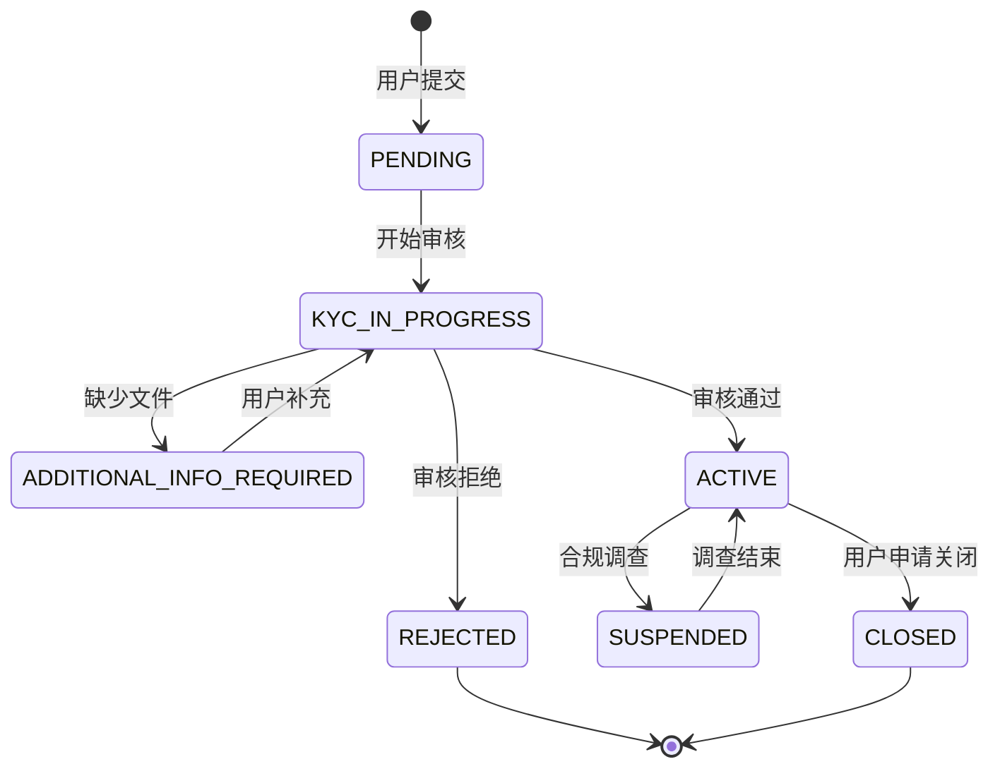
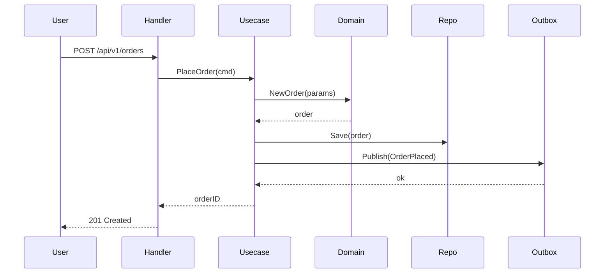
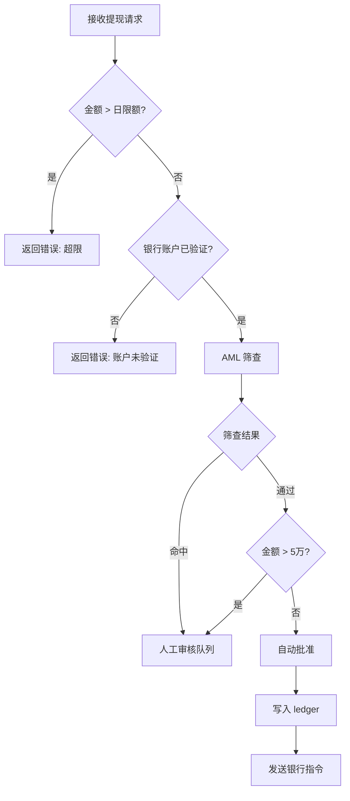
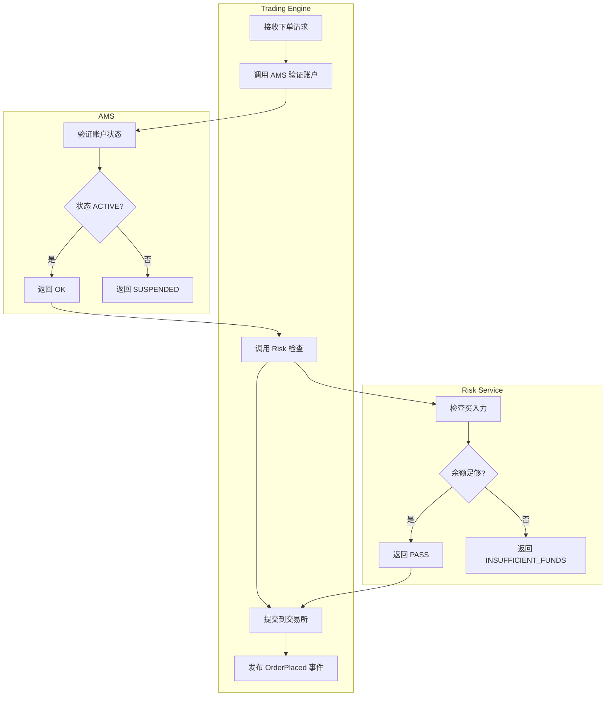

# 功能开发工作流规范

> 本文档是平台级工程流程标准。所有 domain engineer（ams-engineer、trading-engineer、fund-engineer、market-data-engineer 等）在收到 PRD 后，必须遵循本工作流。
>
> **适用范围**：中大型需求（新功能、功能重构、合规改造）。Bug fix 和小型改动可轻量化处理，但 Phase 6 验收不可省略。

---

## 总览

```
PRD（L1）
    │
    ▼
Step 1: PRD Tech Review          → 产出 Thread（记录技术问题和决策）
    │
    ▼
Step 1.5: Contract Definition    → 产出 api/{service}/v1/*.proto + docs/contracts/*.md
    │                               （前后端并行开工的前提）
    ▼
Step 2: Tech Spec                → 产出 services/{domain}/docs/specs/{feature}.md
    │                               （引用 Step 1.5 的 proto，设计内部实现）
    ▼
Step 3-8: 分 Phase 实现 + 验收   → 每个 Phase 结束：self-verify + Codex verify
    │
    ▼
全部 Phase 完成 → 触发 code-reviewer + security-engineer（按 CLAUDE.md 工作流链）
```

**核心原则**：Contract First → Spec Second → Code Third → Test Against Spec。
每一行代码都有对应的 spec 可以追溯；每个 Phase 都经过验收才能进入下一个。

---

## Step 1：PRD Tech Review

**目标**：以 Tech Lead 身份审阅 PRD，在实现前暴露技术风险、合规盲区和设计缺口。

### 1.1 Review 检查项

逐项检查，有问题的开 Thread 记录：

**业务逻辑完整性**
- [ ] 所有状态机的状态和转换是否完整（有无缺失的 terminal state、缺失的异常路径）
- [ ] 业务规则是否有歧义（「满足条件 A」——A 的边界是否清晰）
- [ ] 数字边界是否明确（金额上下限、数量精度、时间窗口）

**合规与安全**
- [ ] 涉及 PII 的字段是否都标注了加密要求（SSN、HKID、银行账号）
- [ ] 涉及资金的操作是否有 AML 筛查要求
- [ ] 审计日志覆盖是否完整（哪些操作需要写 `audit_events`）
- [ ] 幂等性要求是否明确（哪些接口需要 `Idempotency-Key`）

**跨域接口**
- [ ] 是否依赖其他服务的新字段或新接口（需要更新 `docs/contracts/`）
- [ ] 是否会影响下游服务的现有行为（Breaking change 风险）

**技术可行性**
- [ ] 性能要求是否与当前架构匹配（如实时性要求 vs 轮询架构）
- [ ] 是否有循环依赖风险（A 依赖 B，B 依赖 A）

### 1.2 Thread 记录格式

Review 意见写成 Thread，放在 PRD 所在域的 `docs/threads/` 下：

```
# 轻量 Thread（1-2 个问题，1-3 轮交互）
services/{domain}/docs/threads/YYYY-MM-{feature}-prd-review.md

# 重量 Thread（3+ 个角色、合规/架构决策、5+ 轮）
services/{domain}/docs/threads/YYYY-MM-{feature}-prd-review/_index.md
```

Thread 未 RESOLVED 前，**不进入 Step 1.5**。如果 PRD 属于 Surface PRD（存在 `mobile/docs/prd/`），Thread 放在 `mobile/docs/threads/`。

---

## Step 1.5：Contract Definition

**目标**：定义跨域接口契约（proto + Contract 文档），作为前后端并行开工的前提。

**适用条件**：功能涉及以下任一情况时必须执行此步骤：
- 新增或修改跨服务 gRPC/REST 接口
- 新增或修改 Kafka 事件消息体
- Mobile/Web 需要调用的后端 API

**不适用**：纯内部重构、不改变对外接口的优化、单服务内子域间调用（用 Wire 接口绑定，不需要 Contract）。

### 跨域协作说明

**Step 1.5 可能由非本域的 PRD 触发。**

例如：Mobile PM 写了 Surface PRD 要求新增"持仓查询"功能，Trading Engineer 在 Step 1 Tech Review 时发现需要新增接口，则：

1. Trading Engineer 在 Thread 中提出"需要新增 GetPositions RPC"
2. Thread RESOLVED 后，Trading Engineer 主导 Step 1.5：
   - 在 `api/trading/v1/trading.proto` 定义 GetPositions
   - 创建/更新 `docs/contracts/trading-to-mobile.md`
   - 运行 `buf generate` 生成 `docs/openapi/trading.json`
3. Mobile Engineer review proto 定义，确认满足需求
4. Contract 状态改为 APPROVED，双方并行开工

**执行位置**：Contract Definition 在 **Provider 域**执行（本例中是 Trading Engine），即使触发 PRD 在 Consumer 域（Mobile）。

**执行者与参与者**：

| PRD 类型 | Contract Definition 执行者 | 参与者 | 产物归属 |
|---------|--------------------------|-------|---------|
| Domain PRD（纯后端） | 该域 Engineer 独立执行 | 无需跨域参与 | `api/{service}/v1/` |
| Surface PRD（涉及后端接口） | **Provider 域 Engineer 主导** | Consumer 域 Engineer 参与 review | `api/{provider}/v1/` + `docs/contracts/` |
| 跨服务后端协作 | Provider 域 Engineer 主导 | Consumer 域 Engineer 参与 review | `api/{provider}/v1/` + `docs/contracts/` |

### 1.5.1 定义 Proto

在 repo 根的 `api/` 目录定义或修改 `.proto` 文件：

```
api/
├── {service}/v1/
│   ├── {service}.proto       # RPC 定义 + HTTP annotations
│   └── errors.proto           # 错误码枚举
└── events/v1/
    └── {service}_events.proto # Kafka 消息体
```

**Proto 编写规则**（详见 `api-contracts.md`）：
- 金额字段：`string`（decimal），禁止 `float`/`double`
- 时间字段：`google.protobuf.Timestamp`（UTC）
- HTTP 路由：用 `google.api.http` 注解
- 错误码：每个服务一个 `errors.proto`，append-only

**验收标准**：
```bash
cd api && buf lint           # 无 lint 错误
cd api && buf generate       # 生成成功
```

### 1.5.2 创建/更新 Contract 文档

在 `docs/contracts/` 创建或更新契约文档：

```markdown
# docs/contracts/{provider}-to-{consumer}.md
---
provider: services/trading-engine
consumer: [services/fund-transfer, mobile, admin-panel]
protocol: gRPC + REST
proto_file: api/trading/v1/trading.proto
version: 1
status: DRAFT
last_updated: 2026-03-18T15:30+08:00
---

## 接口列表
| RPC | 用途 | SLA |
|-----|------|-----|
| PlaceOrder | 下单 | < 200ms |

## 变更历史
- v1 (2026-03-18): 初始版本
```

**Contract 文档必含内容**：
- 接口清单（RPC 方法或 REST 端点）
- SLA 约定
- 变更历史（version + changelog）

### 1.5.3 生成 OpenAPI（供 Mobile/Web）

```bash
cd api && buf generate
# 输出：docs/openapi/{service}.json（gitignore，CI 重新生成）
```

Mobile（Flutter）和 Admin Panel（React）从 `docs/openapi/` 生成各自客户端代码，不直接消费 proto。

### 1.5.4 Breaking Change 检测

```bash
cd api && buf breaking --against '.git#branch=main'
```

如有 breaking change，必须在 Contract 文档中说明：
- 迁移计划（deprecated 日期 → 下线日期）
- 消费方影响评估
- 过渡期方案

### 1.5.5 多方 Review

Contract 定义完成后，必须经过以下角色 review：
- **Provider 工程师**：能实现吗？性能影响？
- **Consumer 工程师**（Mobile/Web/下游服务）：接口满足需求吗？
- **Product Manager**：业务语义正确吗？

Review 通过后，Contract 状态改为 `APPROVED`，进入 Step 2。

**Step 1.5 产物检查清单**：
```
[ ] api/{service}/v1/*.proto 可编译通过
[ ] buf lint 无错误
[ ] buf generate 成功输出 .pb.go 和 docs/openapi/
[ ] docs/contracts/{provider}-to-{consumer}.md 已创建/更新
[ ] Contract 文档 status: APPROVED
[ ] 如有 breaking change，已在 Contract 文档中说明迁移计划
```

---

## Step 2：Tech Spec 撰写

**目标**：把 PRD 的业务语言翻译为技术语言，产出 engineer 可直接执行的技术设计文档。

**前置条件**：Step 1.5 Contract Definition 已完成（如适用）。

### 2.1 文件位置

```
services/{domain}/docs/specs/{feature-name}.md
```

示例：
```
services/ams/docs/specs/kyc-pipeline.md
services/trading-engine/docs/specs/order-lifecycle.md
services/fund-transfer/docs/specs/withdrawal-workflow.md
```

### 2.2 Tech Spec 必含章节

```markdown
---
type: tech-spec
level: L3
status: DRAFT | ACTIVE | SUPERSEDED
created: YYYY-MM-DDTHH:MM+08:00
author: {agent-name}
implements:
  - {PRD 文件路径}
contracts:
  - {Step 1.5 定义的 contract 文件路径，如有}
depends_on:
  - {依赖的上游 proto 文件路径，如有}
---

# {功能名称} Tech Spec

## 1. 背景与目标
- 实现什么业务需求（1-2 句话，引用 PRD）
- 不在本 spec 范围内的内容（明确 out-of-scope）

## 2. 领域模型
- 涉及的 Entity、Value Object、Aggregate（对应 ddd-patterns.md）
- **核心状态机（如有）**：必须用 **Mermaid state diagram**，包含：
  - 所有状态（含 terminal state）
  - 所有转换及触发条件
  - 异常路径（如 PENDING → FAILED）

**状态机示例（必须格式）**：



## 3. DB Schema 设计
- 新增/修改的表和字段（最终由 migration 文件落地）
- 字段类型规则：金额 DECIMAL(20,4)、时间 TIMESTAMP UTC、PII VARBINARY
- 索引设计：列出所有需要的索引及原因
- 约束设计：外键（或不用外键的理由）、唯一约束

## 4. API 接口引用

**本章节引用 Step 1.5 定义的 Contract，不在 Tech Spec 中重新定义接口。**

- **Contract 文档**：`docs/contracts/{provider}-to-{consumer}.md`
- **Proto 文件**：`api/{service}/v1/{service}.proto`
- **错误码**：`api/{service}/v1/errors.proto`

如 Step 1.5 未执行（纯内部重构），则本章节写"无对外接口变更"。

**Tech Spec 只需说明**：
- 本服务实现 Contract 中的哪些 RPC 方法
- 内部如何调用上游服务的接口（通过 gRPC client）
- 错误码映射逻辑（domain error → proto error code）

## 5. 核心流程

**主流程必须用 Mermaid 图**，根据场景选择图类型：

### 5.1 单服务内流程：Sequence Diagram 或 Flowchart

**Sequence Diagram（推荐用于有明确参与方的交互）**：



**Flowchart（推荐用于有复杂分支判断的流程）**：



### 5.2 跨服务流程：泳道图（Swimlane）

**用 Mermaid flowchart + subgraph 实现泳道**：



### 5.3 异常流程

**每个可能失败的步骤，必须说明失败后的处理**：

| 步骤 | 失败场景 | 处理方式 |
|------|---------|---------|
| AMS 验证账户 | 账户 SUSPENDED | 返回 422 ACCOUNT_SUSPENDED，不进入下一步 |
| Risk 检查 | 买入力不足 | 返回 422 INSUFFICIENT_BUYING_POWER |
| 提交交易所 | 网络超时 | 标记订单 PENDING_SUBMISSION，后台重试 3 次 |
| Outbox 写入 | DB 事务失败 | 整个操作回滚，返回 500 |

### 5.4 幂等性

- 哪些操作需要 Idempotency-Key：所有状态变更操作（下单、提现、KYC 提交）
- 如何检测重复：Redis SET NX（72 小时 TTL）或 DB unique index on `idempotency_key`
- 重复请求返回：原请求的结果（从缓存或 DB 查询），HTTP 200（不是 409）

## 6. Kafka 事件（如有）
- 发布哪些事件（topic、event_type、payload 字段）
- 消费哪些外部事件（来源服务、处理逻辑）

## 7. 安全与合规
- PII 字段列表及加密方式
- 审计日志：每个操作写什么 audit event
- 权限控制：哪些接口需要额外角色检查

## 8. Phase 任务拆解
（见 Step 3，在 Tech Spec 完成后填写）
```

### 2.3 "按需实现"的 Gap Analysis

每个 Phase 开始前，先对照 Tech Spec 做 Gap Analysis：

```
对于本 Phase 的每一项：
  - 已存在且符合规范 → SKIP（记录「已存在，无需修改」）
  - 已存在但需修改   → MODIFY（记录修改点）
  - 不存在           → CREATE（新建）
```

Gap Analysis 结果直接写在对应 Phase 的任务列表里，不需要单独文档。

---

## Step 3-8：分 Phase 实现

### Phase 总览

| Phase | 内容 | 层对应 | 验收重点 |
|-------|------|--------|---------|
| **Phase 1** | DB Schema | Infrastructure（持久化） | 字段类型、索引、合规约束 |
| **Phase 2** | Domain Layer | Domain（biz/domain） | Entity/VO/Repo 接口，零外部依赖 |
| **Phase 3** | Infrastructure Layer | Infrastructure（data/infra） | Repo 实现、DAO 转换、缓存 |
| **Phase 4** | Application Layer | Application（service/app） | Usecase 编排、事务边界、事件发布 |
| **Phase 5** | Transport Layer | Transport（server/handler） | Proto/Handler、输入校验、错误映射 |
| **Phase 6** | 集成验收 | 全栈 | 端到端流程、合规检查、性能 |

---

### Phase 1：DB Schema

**目标**：用 goose migration 文件落地 Tech Spec §3 的 DB 设计。

**Gap Analysis 检查点**：
- 所有需要的表是否已存在？字段类型是否符合规范？
- 需要的索引是否已创建？
- 如果表已存在，新增字段是否需要 migration？

**实现要求**：
- 使用 `/db-migrate` skill 生成 migration 文件（自动检测服务、强制 financial-services DDL 规则）
- 金额字段：`DECIMAL(20,4)`，禁止 `FLOAT` / `DOUBLE`
- 时间字段：`TIMESTAMP NOT NULL DEFAULT CURRENT_TIMESTAMP`，配合应用层强制 UTC
- PII 字段：`VARBINARY(512)`（加密后存储），字段名后缀 `_encrypted`
- Append-only 审计表：在 DB 用户层只授 INSERT 权限，不授 UPDATE/DELETE
- 每个 migration 文件必须有完整的 Down section

**Phase 1 验收 Checklist**：
```
Self-verify:
[ ] migration 文件可正常执行 Up（goose up）
[ ] migration 文件可正常执行 Down（goose down）
[ ] 所有金额字段类型为 DECIMAL(20,4)
[ ] 无 FLOAT/DOUBLE 类型用于金额
[ ] PII 字段为 VARBINARY，不是 VARCHAR
[ ] 审计/事件表无 UPDATE/DELETE 相关字段（无 updated_at）
[ ] 所有外键引用的表和字段存在
[ ] Tech Spec §3 的索引全部创建

Codex verify prompt 模板:
"Review the goose migration file for {feature} in {service}.
Verify: (1) all money columns use DECIMAL(20,4) not FLOAT, (2) PII columns
use VARBINARY, (3) audit/event tables have no updated_at, (4) indexes match
the query patterns in Tech Spec §3, (5) Down section is complete and safe.
Tech Spec: {path}  Migration file: {path}"
```

---

### Phase 2：Domain Layer

**目标**：实现 Tech Spec §2 的领域模型——Entity、Value Object、Aggregate、Repository 接口、Domain Service、Domain Event 定义。

**Gap Analysis 检查点**：
- 相关 Entity/VO 是否已存在？是否需要新增字段或方法？
- Repository 接口是否已定义？是否需要新增查询方法？
- 是否需要新的 Domain Service 或 Domain Event？

**实现要求**（参考 `ddd-patterns.md`）：
- Domain struct **不含任何 ORM tag**（`gorm:`、`db:` 等）
- Value Object 方法返回新实例，不修改原值
- Aggregate Root 保护所有不变量，外部只能通过方法修改状态
- Repository 接口定义在 domain 层，方法按业务命名（`FindByOrderID`），不是 CRUD
- Domain Event struct 放在 `domain/event/`，命名用过去式
- `biz/` 或 `domain/` 包**零 import**：不 import `gorm`、`redis`、`kafka`、`http` 等基础设施包

**Phase 2 验收 Checklist**：
```
Self-verify:
[ ] domain 包无基础设施 import（go list -deps 检查）
[ ] 所有 Value Object 的修改方法返回新实例
[ ] Aggregate Root 没有暴露内部子实体的直接修改入口
[ ] Repository 接口方法不返回 *gorm.DB 或其他 DB 类型
[ ] Domain Event 命名为过去式
[ ] 所有构造函数（NewXxx）返回 error，不 panic

Codex verify prompt 模板:
"Review the domain layer implementation for {feature} in {service}.
Verify: (1) no infrastructure imports (gorm/redis/kafka) in domain package,
(2) value objects are immutable (mutation methods return new instances),
(3) aggregate root protects all invariants, (4) repository interface methods
are named by business intent not CRUD, (5) domain events use past tense naming.
Domain layer path: {path}  Tech Spec §2: {path}"
```

---

### Phase 3：Infrastructure Layer

**目标**：实现 Phase 2 定义的 Repository 接口——DAO struct、ACL 转换函数、MySQL/Redis 实现。

**Gap Analysis 检查点**：
- Repository 接口的实现是否已存在？
- 现有实现是否需要新增方法以支持新 Usecase？
- 需要 Redis 缓存的 Aggregate 是否需要新增 Proxy？

**实现要求**：
- DAO struct（含 ORM tag）定义在 `infra/mysql/model.go` 或 `data/model/`，不暴露给 domain 层
- `ToEntity(dao) → domain.Xxx`：ACL 转换函数，处理类型映射（string decimal → `decimal.Decimal`）
- `ToDAO(entity) → *XxxGorm`：反向转换
- Repository 实现的 `FindByXxx` 方法：找不到返回 `domain.ErrXxxNotFound`，不返回 `nil, nil`
- 涉及缓存：用 Proxy 模式，实现相同的 domain Repository 接口

**Phase 3 验收 Checklist**：
```
Self-verify:
[ ] DAO struct 不在 domain 层出现
[ ] ToEntity 函数处理了所有字段的类型转换（特别是 decimal string → Decimal）
[ ] FindByXxx 找不到时返回 domain.ErrXxxNotFound（不是 nil, nil）
[ ] 所有 DB 操作使用参数化查询（无字符串拼接 SQL）
[ ] 缓存 Proxy 实现了与 MySQL Repo 相同的 Repository 接口

Codex verify prompt 模板:
"Review the infrastructure layer for {feature} in {service}.
Verify: (1) DAO structs not imported in domain package, (2) ToEntity handles
all type conversions including decimal strings, (3) FindByXxx returns
domain.ErrNotFound when record missing (not nil,nil), (4) all queries use
parameterized statements (no string concatenation), (5) cache proxy implements
the same domain repository interface.
Infra path: {path}  Domain interfaces: {path}"
```

---

### Phase 4：Application Layer

**目标**：实现 Tech Spec §5 的核心流程——Usecase 编排、事务边界、Outbox 事件发布。

**Gap Analysis 检查点**：
- 相关 Usecase 是否已存在？是否需要新增或修改逻辑？
- 事务边界是否需要调整（新增表操作是否需要纳入同一事务）？
- 是否需要新增 Outbox 事件？

**实现要求**：
- Application Service（Usecase）只负责编排：取数 → 调领域逻辑 → 持久化 → 发事件
- 业务规则（不变量检查、计算逻辑）不写在 Usecase 里，写在 Domain Layer
- 事务边界：业务写入 + Outbox 写入在同一 DB 事务（参考 `kafka-topology.md §3`）
- Outbox 写入使用完整 EventEnvelope（参考 `kafka-topology.md §5`），包含 `CorrelationID`（从 ctx 取 OTel trace ID）
- Usecase 方法只接收 Command/Query struct，不接收 proto 生成的类型

**Phase 4 验收 Checklist**：
```
Self-verify:
[ ] Usecase 不包含业务规则（不变量检查在 Domain Layer）
[ ] 业务写入和 Outbox 写入在同一事务
[ ] EventEnvelope 包含 event_id（UUID v4）、event_type（含版本）、correlation_id
[ ] Usecase 入参为 Command struct，不是 proto 类型
[ ] 所有 error 用 fmt.Errorf("operation %s: %w", id, err) 包装，无裸 return err

Codex verify prompt 模板:
"Review the application layer (usecase) for {feature} in {service}.
Verify: (1) business invariant checks are in domain layer not usecase,
(2) business write and outbox insert are in the same DB transaction,
(3) EventEnvelope has event_id (UUID), event_type (with version suffix),
correlation_id from context, (4) usecase input is Command struct not proto type,
(5) all errors wrapped with fmt.Errorf context.
Usecase path: {path}  Tech Spec §5: {path}  kafka-topology.md §3,§5: {path}"
```

---

### Phase 5：Transport Layer

**目标**：实现 gRPC handler 或 REST handler——输入校验、DTO 转换、错误码映射。

**Gap Analysis 检查点**：
- 对应的 proto 方法是否已定义？是否需要新增 RPC？
- Handler 是否需要新增路由？
- 是否需要更新 `docs/contracts/` 中的接口契约？

**实现要求**：
- Handler 只做三件事：输入校验 → 调用 Usecase → 映射输出。无业务逻辑
- 输入校验：allowlist 方式（只允许已知值），不用 blocklist
- 错误映射：domain error → gRPC status code（`codes.NotFound`、`codes.InvalidArgument` 等）
- Proto 新增字段遵守 `api-contracts.md` 的 Breaking Change 规则（不删字段、不改 field number）
- 如果接口变更影响下游服务，更新 `docs/contracts/{provider}-to-{consumer}.md`

**Phase 5 验收 Checklist**：
```
Self-verify:
[ ] Handler 无业务逻辑（无 if/switch 做业务判断）
[ ] 输入校验使用 allowlist（枚举允许值，不是过滤禁止值）
[ ] 所有 domain error 映射到正确的 gRPC status code
[ ] 新增 proto 字段使用新 field number（无复用旧编号）
[ ] 受影响的 docs/contracts/ 文件已更新版本号和 changelog

Codex verify prompt 模板:
"Review the transport layer (handler) for {feature} in {service}.
Verify: (1) handler contains no business logic, only input validation +
usecase call + response mapping, (2) input validation uses allowlist approach,
(3) all domain errors mapped to correct gRPC status codes, (4) proto changes
don't reuse field numbers, (5) docs/contracts/ updated if interface changed.
Handler path: {path}  Proto file: {path}  Contracts: {path}"
```

---

### Phase 6：集成验收

**目标**：端到端验证完整功能流程，对照 Tech Spec 做最终合规检查。

**实现要求**：
- 走通主流程（happy path）：从 Transport 层入口到 DB 写入 + Outbox 事件
- 走通关键异常流程（Tech Spec §5 列出的每个失败路径）
- 对照 Tech Spec §7 安全与合规章节逐项检查

**Phase 6 验收 Checklist**：
```
Self-verify:
[ ] 主流程端到端可运行（集成测试或手动验证）
[ ] Tech Spec §5 中每个异常路径都有对应处理（不是静默失败）
[ ] **实现的状态机与 Tech Spec §2 的 Mermaid state diagram 一致**（所有状态、转换、触发条件）
[ ] **实现的流程与 Tech Spec §5 的 Mermaid sequence/flowchart 一致**（参与方、调用顺序、分支逻辑）
[ ] 所有 PII 字段在 DB 中为加密值（非明文）
[ ] 日志中无 PII 明文（搜索 SSN、HKID、bank_account 等关键词）
[ ] 审计事件写入正确（每个状态变更都有对应 audit record）
[ ] 幂等性可验证（相同 Idempotency-Key 重复调用返回相同结果，无重复写入）

Codex verify prompt 模板:
"Perform a final integration review for {feature} in {service}.
Verify against Tech Spec: (1) main flow works end-to-end including DB write
and outbox event, (2) all error paths in Tech Spec §5 have explicit handling
(no silent failures), (3) state machine implementation matches the Mermaid
state diagram in Tech Spec §2 (all states, transitions, triggers), (4) flow
implementation matches the Mermaid sequence/flowchart in Tech Spec §5
(participants, call order, branches), (5) PII fields are stored encrypted in DB,
(6) no PII in logs (check for SSN/HKID/bank_account patterns), (7) audit events
written for every state change, (8) idempotency key prevents duplicate processing.
Tech Spec: {path}  Implementation paths: {paths}"
```
in logs (check for SSN/HKID/bank_account patterns), (5) audit events written
for every state change, (6) idempotency key prevents duplicate processing.
Tech Spec: {path}  Implementation paths: {paths}"
```

---

## Codex Verify 通用规则

### 上下文传递格式

每次调用 Codex verify 时，prompt 必须包含：

```
1. 验收目标（自然语言描述，列出具体 verify 点）
2. 相关文件路径列表：
   - Tech Spec 路径
   - 被验收的实现代码路径
   - 相关规范文档路径（如 ddd-patterns.md、kafka-topology.md 的具体章节）
```

### 结论处理规则

| Codex 输出 | engineer 行动 |
|-----------|-------------|
| PASS（所有 verify 点通过）| 记录结论，进入下一 Phase |
| FAIL（有 verify 点未通过）| 修复所有 FAIL 项，**重新** Codex verify，直到 PASS |
| 部分 PASS + 建议改进 | FAIL 项必须修复；纯建议项记录到 Tech Spec，由 PM/Tech Lead 决策 |

**不允许带 FAIL 项进入下一 Phase。**

---

## Tech Spec §8 任务拆解模板

Tech Spec 完成后，在 §8 章节填写 Phase 任务列表：

```markdown
## 8. Phase 任务拆解

### Phase 1: DB Schema
- [ ] [CREATE] accounts 表新增 kyc_tier 列（TINYINT, NOT NULL DEFAULT 0）
- [ ] [CREATE] kyc_documents 表
- [ ] [SKIP] users 表已存在且符合规范，无需修改

### Phase 2: Domain Layer
- [ ] [CREATE] vo/kyc_tier.go — KYCTier Value Object
- [ ] [MODIFY] entity/account.go — 新增 KYCTier 字段和 UpgradeKYCTier 方法
- [ ] [CREATE] domain/event/kyc_approved.go — KYCApprovedEvent

### Phase 3: Infrastructure Layer
- [ ] [CREATE] infra/mysql/kyc_document_repo.go
- [ ] [MODIFY] infra/mysql/account_repo.go — 新增 FindByKYCStatus 方法

### Phase 4: Application Layer
- [ ] [CREATE] app/submit_kyc_usecase.go
- [ ] [CREATE] app/review_kyc_usecase.go（compliance officer 审核）

### Phase 5: Transport Layer
- [ ] [MODIFY] api/grpc/ams.proto — 新增 SubmitKYC RPC
- [ ] [CREATE] handler/kyc_handler.go

### Phase 6: 集成验收
- [ ] 主流程：用户提交 KYC → 文件存储 → 状态变更 → Outbox 事件
- [ ] 异常流程：文件格式不支持、OCR 失败、Sanctions 命中
```

---

## 参考文档

| 文档 | 路径 | 关联 Phase |
|------|------|-----------|
| DDD 战术模式 | `docs/specs/platform/ddd-patterns.md` | Phase 2, 3 |
| Go 服务架构规范 | `docs/specs/platform/go-service-architecture.md` | Phase 2-5 |
| Kafka 拓扑规范 | `docs/specs/platform/kafka-topology.md` | Phase 4 |
| API 契约规范 | `docs/specs/platform/api-contracts.md` | Phase 5 |
| DB Migration Skill | `.claude/skills/db-migrate/` | Phase 1 |
| Scaffold Verify Skill | `.claude/skills/scaffold-verify/` | Phase 6 |
| Financial Coding Standards | `.claude/rules/financial-coding-standards.md` | Phase 1, 2 |
| Security & Compliance Rules | `.claude/rules/security-compliance.md` | Phase 2, 6 |
| SDD Spec Organization | `docs/SPEC-ORGANIZATION.md` | Step 1, 2 |
