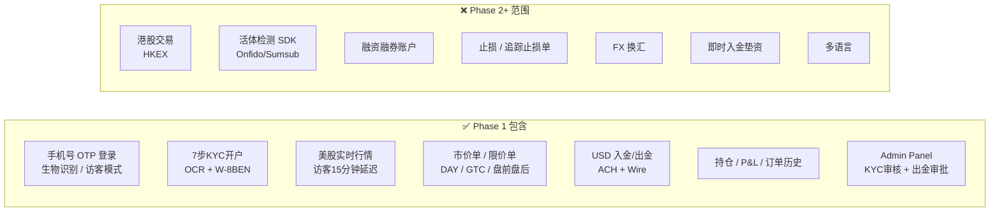
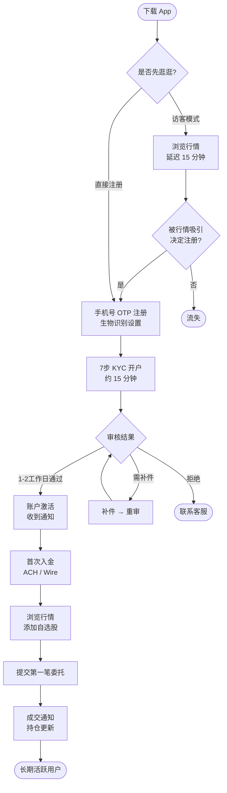
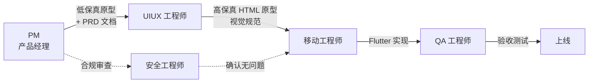

# PRD 总览 — 环球通证券 App (Phase 1 MVP)

> **文档状态**: Phase 1 正式版
> **版本**: v2.2
> **日期**: 2026-03-20
> **变更说明**: v2.2 — 补充 Out of Scope 缺失项（账户注销/关户、KYC年度复核、月结单/税务报表的 Phase 2 说明）；合规摘要表补充 FINRA Rule 2232（交易确认书）和市价单价格保护条目；PDT 说明更新为现金账户实际约束

> **原型索引**：[查看所有低保真原型](prototypes/README.md)

---

## 一、产品定位

面向中国大陆及香港零售投资者的跨境证券经纪移动应用，聚焦"让普通投资者以最低门槛合规参与美股投资"。

| 维度 | 内容 |
|------|------|
| 目标用户 | 有海外投资需求的中国大陆（+86）/ 香港（+852）居民 |
| 核心价值 | 合规开户 · 实时行情 · 便捷交易 · 快速出入金 |
| Phase 1 市场 | 美股（NYSE / NASDAQ）；港股保留入口，显示"敬请期待" |
| 监管框架 | Phase 1：SEC / FINRA（美国）；Phase 2 追加 SFC / AMLO（香港）|

---

## 二、目标用户画像

### 用户 A：大陆进取型投资者（主力）

- **背景**：30-45 岁，有一定 A 股经验，想配置美股资产
- **痛点**：不了解美股开户流程，担心被骗，对英文界面和税务表格感到陌生
- **目标**：顺利开户、成功买入第一支美股
- **关键体验**：开户流程清晰、中文全程引导、W-8BEN 傻瓜式填写

### 用户 B：香港成熟投资者

- **背景**：已有港股经验，想同时参与美股市场
- **痛点**：需要管理两个市场的持仓和资金，界面习惯绿涨红跌
- **目标**：同时看港股和美股行情，在同一平台管理
- **关键体验**：港股入口（Phase 2 全面开放）、颜色配色可切换

### 用户 C：访客探索者

- **背景**：还没决定是否开户，先看看 App 再说
- **痛点**：不想注册就强迫提供信息
- **目标**：先体验行情界面，了解平台
- **关键体验**：访客模式下无打扰浏览，转化率关键节点

---

## 三、产品目标（Phase 1 OKR）

| 目标 | 关键结果 | 衡量周期 |
|------|---------|---------|
| 完成开户转化漏斗 | 下载 → 注册 → KYC 通过率 ≥ 50% | 上线后 3 个月 |
| 首次入金率 | KYC 通过用户 7 日内入金率 ≥ 60% | 上线后 3 个月 |
| 交易活跃度 | 入金用户 30 日内完成至少 1 笔交易 ≥ 70% | 上线后 3 个月 |
| 用户留存 | 注册用户 30 日留存 ≥ 40% | 上线后 3 个月 |
| 合规零事故 | 0 次 AML / KYC 监管处罚 | 持续 |

---

## 四、Phase 1 功能范围

### 包含（In Scope）

- 手机号 OTP 登录（+86 / +852）+ 生物识别快捷登录 + 访客模式
- 7 步在线 KYC 开户（含 OCR 证件识别、W-8BEN 签署）
- 美股实时行情（注册用户）+ 15 分钟延迟行情（访客）
- 市价单 / 限价单，DAY / GTC 有效期，盘前盘后（仅限价单）
- 入金：USD ACH / Wire；出金：USD ACH / Wire
- 银行卡管理（最多 5 张，同名验证，微存款验证）
- 持仓 P&L、订单历史（CSV 导出）
- Admin Panel：KYC 审核工作台、出金审批、用户管理、订单监控

### 不包含（Out of Scope → Phase 2+）

- 港股交易（行情入口保留，点击显示"敬请期待"）
- 活体检测 SDK（Onfido / Sumsub / Jumio）
- 融资融券账户（Margin Account）
- 即时入金（平台垫资）
- 止损 / 止损限价 / 追踪止损订单
- 委托修改（Phase 1 仅支持撤单重下）
- FX 换汇
- **账户注销 / 关户流程**（含清仓检查、全额出金、数据归档，Phase 2 设计）
- **KYC 年度复核**（持续 CDD，Phase 2）
- **月结单 / 季报 / 税务报表**（FINRA Rule 2231 要求，Phase 2 输出完整文档；Phase 1 通过 CSV 导出交易历史作为过渡方案）
- 交易确认书 PDF 导出（SEC Rule 10b-10；Phase 1 使用 App 通知替代，详见 PRD-04 §十一；Phase 2 实现完整 PDF 文档）
- 交易确认书 / 月度对账单（页面占位"敬请期待"）
- 多语言（Phase 1 仅中文简体）

---

## 五、PRD 模块索引

| 编号 | 模块 | 文件 | 核心范围 | 低保真原型 |
|------|------|------|----------|-----------|
| 01 | 登录与认证 | [01-auth.md](01-auth.md) | 手机号 OTP、生物识别、访客模式、设备管理 | [原型](prototypes/01-auth/index.html) |
| 02 | KYC / 开户 | [02-kyc.md](02-kyc.md) | 7 步开户、OCR、W-8BEN、审核工作台 | [原型](prototypes/02-kyc/index.html) |
| 03 | 行情 | [03-market.md](03-market.md) | 行情列表、股票详情、K 线、搜索、Watchlist | [行情](prototypes/03-market/index.html) · [详情](prototypes/03-market/stock-detail.html) · [搜索](prototypes/03-market/search.html) |
| 04 | 交易 | [04-trading.md](04-trading.md) | 委托下单、订单管理、盘前盘后、PDT | [下单](prototypes/04-trading/order-entry.html) · [确认](prototypes/04-trading/order-confirm.html) · [列表](prototypes/04-trading/order-list.html) |
| 05 | 出入金 | [05-funding.md](05-funding.md) | 银行卡绑定、入金/出金流程、AML 合规 | [资金](prototypes/05-funding/index.html) · [入金](prototypes/05-funding/deposit.html) · [出金](prototypes/05-funding/withdraw.html) · [绑卡](prototypes/05-funding/bank-bind.html) |
| 06 | 持仓与组合 | [06-portfolio.md](06-portfolio.md) | 资产概览、持仓列表、P&L、结算资金 | [持仓](prototypes/06-portfolio/index.html) · [详情](prototypes/06-portfolio/position-detail.html) |
| 07 | 跨模块交互 | [07-cross-module.md](07-cross-module.md) | 模块触发、通知体系、全局异常 | [通知/错误](prototypes/07-cross-module/index.html) |
| 08 | 设置与个人中心 | [08-settings-profile.md](08-settings-profile.md) | 安全设置、推送通知、颜色偏好、个人资料 | [个人中心](prototypes/08-settings-profile/index.html) · [设置](prototypes/08-settings-profile/settings.html) · [资料](prototypes/08-settings-profile/profile.html) |

---

## 六、用户核心旅程

> **低保真原型起点**：[从冷启动开始体验完整旅程](prototypes/01-auth/index.html)（依次跳转：登录 → KYC → 行情 → 下单 → 持仓 → 资金）

**各阶段对应低保真原型：**

| 旅程阶段 | 原型文件 |
|---------|---------|
| 冷启动 / OTP 登录 | [01-auth/index.html](prototypes/01-auth/index.html) |
| KYC 7步开户 | [02-kyc/index.html](prototypes/02-kyc/index.html) |
| 行情浏览 / 搜索 | [03-market/index.html](prototypes/03-market/index.html) |
| 股票详情 / K线 | [03-market/stock-detail.html](prototypes/03-market/stock-detail.html) |
| 委托下单 | [04-trading/order-entry.html](prototypes/04-trading/order-entry.html) |
| 订单管理 | [04-trading/order-list.html](prototypes/04-trading/order-list.html) |
| 入金 | [05-funding/deposit.html](prototypes/05-funding/deposit.html) |
| 持仓总览 | [06-portfolio/index.html](prototypes/06-portfolio/index.html) |

---

## 七、KYC 等级与资金限额

| 等级 | 开通条件 | 单笔限额 | 日限额 | 月限额 |
|------|---------|---------|--------|--------|
| Tier 1 | KYC 提交中 / 审核中 | $5,000 | $10,000 | $50,000 |
| Tier 2 | KYC 全部通过 + W-8BEN 签署 | $50,000 | $100,000 | $500,000 |
| Tier 3（Phase 2） | 机构 / 高净值客户 | 另定 | 另定 | 另定 |

---

## 八、关键合规要求摘要

| 合规项 | 要求 | 影响模块 |
|--------|------|---------|
| KYC 实名认证 | SEC / FINRA 强制 | PRD-02 |
| W-8BEN 税务申报 | IRS 要求，非美居民签署 | PRD-02、PRD-08 |
| AML 筛查（OFAC） | 所有出入金操作强制筛查 | PRD-05 |
| 同名账户原则 | 入出金只允许同名银行账户 | PRD-05 |
| T+1 结算告知 | 卖出资金需 T+1 后可提现 | PRD-05、PRD-06 |
| PDT 规则披露 | FINRA Rule 4210；Phase 1 现金账户不受约束，但提供教育页面 | PRD-04 |
| 交易确认书 | FINRA Rule 2232；成交后 24 小时内发送（Phase 1：App 通知替代；Phase 2：完整 PDF） | PRD-04 |
| 延迟行情标注 | SEC Reg NMS，访客行情必须标注 | PRD-03 |
| 最优执行披露 | SEC Reg NMS Rule 606 | PRD-04 |
| 市价单价格保护 | FINRA 最优执行要求；常规时段 ±5%，盘前盘后 ±3% | PRD-04 |
| 审计日志 7 年 | SEC Rule 17a-4 | 全模块 |

---

## 九、关键外部依赖

| 依赖项 | Phase 1 方案 | 状态 |
|--------|-------------|------|
| 美股实时行情 | Polygon.io | 授权谈判中 |
| 交易执行通道 | FIX Protocol，经纪商对接 | UAT 认证中 |
| 银行卡验证 | 微存款验证 | 已确认方案 |
| KYC OCR 服务 | 第三方 OCR（Mindee 等，评估中）| 供应商待确认 |
| 短信 OTP 通道 | 供应商待确认 | **本周内确认** |
| 港股行情 | HKEX OMD | Phase 2 |
| 活体检测 | Onfido / Sumsub / Jumio | Phase 2 评估中 |
| Plaid 银行快捷验证 | Plaid | Phase 2 |

---

## 十、设计协作说明

### 低保真原型 → 高保真设计工作流

- **PM 输出**：低保真原型（`mobile/docs/prd/prototypes/`）+ PRD 文档 → 体现页面结构、业务逻辑、关键状态
- **UIUX 工程师输出**：高保真 HTML 原型（`mobile/prototypes/`）→ 体现视觉设计、交互细节
- **PM 不介入**：视觉颜色选择、动效设计、像素尺寸
- **UIUX 不介入**：业务规则定义、合规要求、功能范围决策

---

## 十一、版本锁定声明

Phase 1 产品需求基线于 **2026-03-14** 锁定（v2.0）。

- 所有 PRD 变更须经 PM 评审，影响工程实现的变更需 PM + Tech Lead 双签
- Phase 2/3 需求持续收集，不影响 Phase 1 开发推进
- 合规相关变更（AML、KYC 规则调整）随时优先处理，不受版本锁定限制
