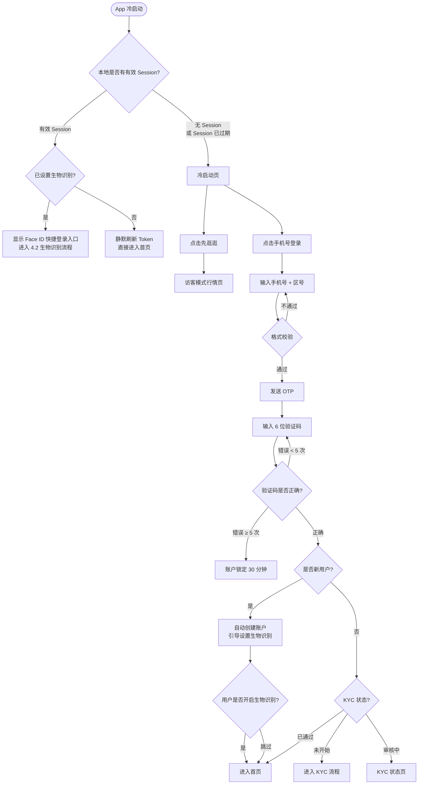
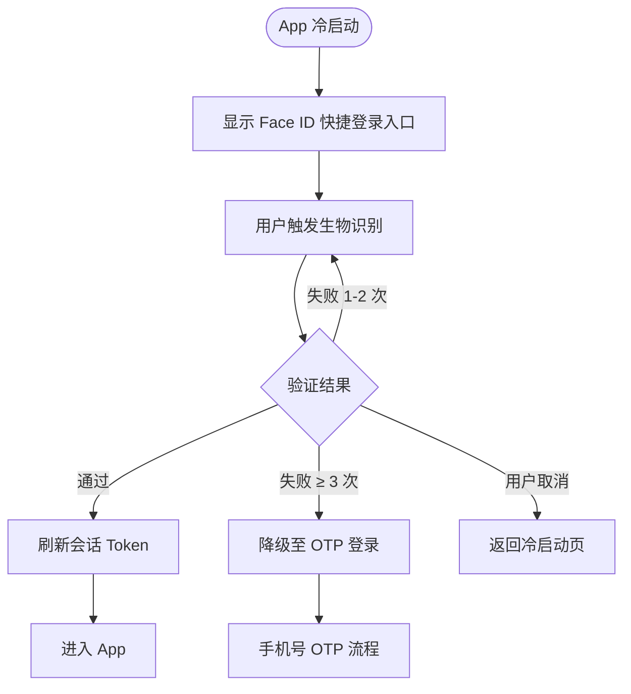
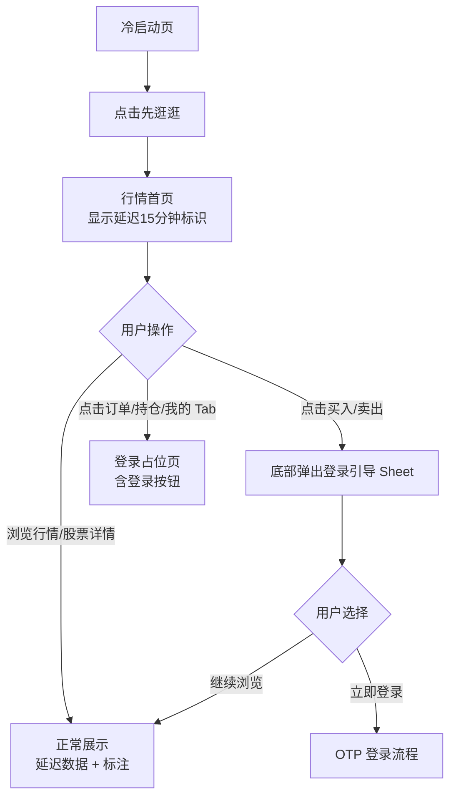
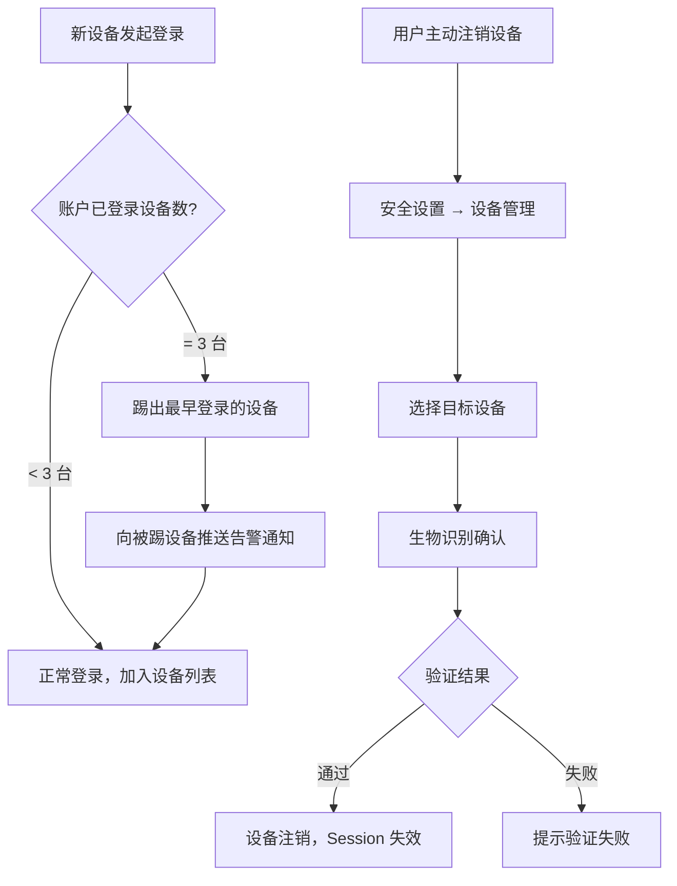
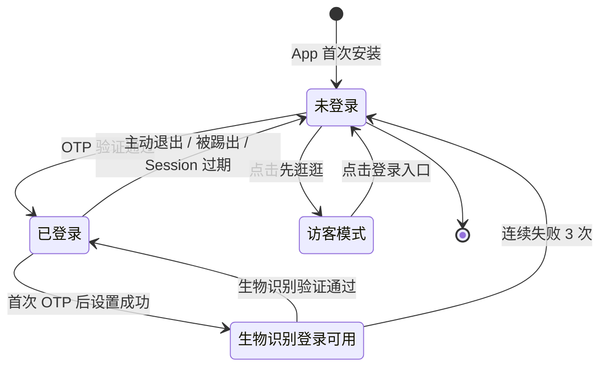

# PRD-01：登录与认证模块

> **文档状态**: Phase 1 正式版
> **版本**: v2.1
> **日期**: 2026-03-15
> **变更说明**: v2.1 修复 — 补充"已登录用户再次冷启动"流程分支；澄清登录与注册合并为单一入口的产品决策；补充 App 后台唤醒与 Session 状态判断规则

> **低保真原型**：[查看原型](prototypes/01-auth/index.html)（冷启动 · OTP 登录 · 生物识别 · 访客模式 · 设备管理）

---

## 一、背景与问题

### 1.1 用户痛点

目标用户（中国大陆 / 香港零售投资者）在使用海外经纪商时面临：

- **注册门槛高**：需要邮箱+密码，部分用户不习惯或忘记密码
- **登录体验差**：每次打开 App 都需要完整的账密输入
- **安全感缺失**：不确定账户是否被他人登录

### 1.2 业务价值

- 手机号 OTP 是国内用户最熟悉的验证方式，降低注册弃单率
- 生物识别快捷登录提升日活频次（目标：日均打开 ≥ 2 次）
- 访客模式降低获客成本，用户可先体验行情再决定注册

---

## 二、目标用户与场景

| 用户 | 场景 |
|------|------|
| 首次下载用户 | 想快速注册开始看行情，不想填写繁琐的账号密码 |
| 已有账户用户 | 每天打开 App 查行情、下单，希望一键进入 |
| 谨慎型用户 | 担心账号安全，关注是否在其他设备被登录 |
| 访客 | 还未决定注册，先体验行情再说 |

---

## 三、功能范围

| 功能 | Phase 1 | Phase 2 | 优先级 |
|------|---------|---------|--------|
| 手机号 + OTP 登录 | ✅ | - | Must |
| 生物识别快捷登录（Face ID / 指纹） | ✅ 首次 OTP 后引导设置 | - | Must |
| 访客模式（延迟行情） | ✅ | - | Must |
| 设备管理（最多 3 台并发） | ✅ | - | Must |
| 推送通知（新设备登录告警） | ✅ | - | Must |
| 邮箱 + 密码登录 | ❌ | ✅ | - |
| 找回密码 | ❌（Phase 1 无密码概念） | ✅ | - |
| 第三方授权登录（微信/Google） | ❌ | ✅ | - |

---

## 四、核心用户流程

### 4.1 首次登录 / 注册主流程

> **原型参考**：[冷启动 → OTP 登录](prototypes/01-auth/index.html)

**再次冷启动说明（已登录用户）：**

| 场景 | 行为 |
|------|------|
| Session 有效 + 已设置生物识别 | 显示冷启动页 + Face ID 快捷入口，用户触发后直接进入 App（不显示行情首页） |
| Session 有效 + 未设置生物识别 | 静默刷新 Token，直接进入上次所在页面（默认行情首页） |
| Session 即将过期（15 分钟内）| App 后台静默刷新，用户无感知 |
| Session 已过期 + 后台刷新失败 | 返回冷启动页，弹出"登录已过期，请重新登录" Sheet |
| 用户主动退出登录后 | 始终进入冷启动页，不保留任何已登录状态 |

### 4.2 生物识别登录流程

> **原型参考**：[生物识别登录](prototypes/01-auth/index.html)（点击页面顶部"生物识别登录"标签）

### 4.3 访客模式流程

### 4.4 设备管理流程

---

## 五、登录状态生命周期

---

## 六、业务规则

### 6.1 OTP 发送规则

| 规则 | 说明 |
|------|------|
| 发送间隔 | 同一手机号 60 秒内只能发送 1 次 |
| 发送上限 | 1 小时内最多 5 次；超限后需等待至下一小时 |
| 有效期 | OTP 5 分钟内有效，过期需重新发送 |
| 错误上限 | 同一 OTP 请求最多错误 5 次，超限锁定账号 30 分钟 |
| 区号支持 | Phase 1：+86（中国大陆，11 位）、+852（香港，8 位） |
| 自动填充 | iOS 系统原生识别短信 OTP；Android 通过 SMS Retriever API（无需 READ_SMS 权限）自动填充 |

### 6.2 生物识别规则

| 规则 | 说明 |
|------|------|
| 开启条件 | 设备已注册 Face ID 或指纹；仅在首次 OTP 登录后引导设置 |
| 跳过重提 | 最多提醒 3 次，第 3 次跳过后不再主动提示，用户可在设置中手动开启 |
| 失败降级 | 连续失败 3 次，自动切换到 OTP 登录 |
| 安全绑定 | 生物识别与当前设备绑定；若设备更换指纹/面容，已绑定记录失效，需重新注册 |
| 登录保护 | 生物识别仅在设备解锁状态下可用（App 后台超过 15 分钟需重新验证） |

### 6.3 设备管理规则

| 规则 | 说明 |
|------|------|
| 并发上限 | 同一账户最多 3 台设备同时在线 |
| 超限策略 | 第 4 台设备登录时，自动踢出"最早登录时间"的设备，并向该设备发送推送通知 |
| 注销确认 | 远程注销他人设备需在**当前设备**完成生物识别验证（防误操作） |
| 设备显示 | 设备名、平台、最后活跃时间；当前设备标注"本机" |

### 6.4 访客模式规则

| 页面 | 访客是否可用 | 限制说明 |
|------|------------|---------|
| 行情首页 | ✅ | 价格显示"延迟 15 分钟"标识，不可隐藏 |
| 股票详情 | ✅ | 数据延迟；买/卖按钮替换为登录引导 |
| 搜索 | ✅ | 功能完整可用 |
| 订单管理 | ❌ | 显示登录占位页 |
| 持仓 | ❌ | 显示登录占位页 |
| 我的 | ❌ | 显示登录占位页 |

> **合规要求**：延迟行情必须在显著位置标注"Delayed 15 minutes"，不可以任何形式隐藏或缩小（SEC 合规）。

### 6.5 登录与注册的产品决策

**Phase 1 决策：登录与注册合并为单一手机号入口。**

用户只需输入手机号 + OTP，系统自动判断是否为新用户：
- 手机号**未注册** → 自动创建账户（新用户），随即进入生物识别引导
- 手机号**已注册** → 直接登录（老用户），按 KYC 状态跳转

**UIUX 设计说明（面向 UIUX 工程师）：**

冷启动页可以设计"登录"和"注册"两个视觉入口（改善用户理解），但二者指向**完全相同的手机号 OTP 流程**，只是 CTA 文案不同。不需要两套独立页面。参考旧高保真原型（`mobile/prototypes/login.html`）的三按钮布局：
- "手机号登录"→ 进入 OTP 流程（已有账户路径）
- "注册"→ 同样进入 OTP 流程（新用户路径，系统自动识别）
- "先逛逛"→ 访客模式

UIUX 工程师在产出高保真原型时，可选择保留该三按钮设计或合并为单一 CTA，视视觉方案决定，**功能逻辑不变**。

### 6.6 进入首页的默认 Tab

用户登录后进入首页，默认显示**行情 Tab**（首次进入）。再次唤醒时：
- 若 App 在后台时间 ≤ 30 分钟：恢复上次所在页面
- 若 App 在后台时间 > 30 分钟：回到行情首页

---

## 七、合规要求

| 要求 | 适用规定 | 说明 |
|------|---------|------|
| 身份绑定 | SEC/FINRA 账户认证要求 | 登录手机号须与 KYC 认证手机号一致 |
| 延迟行情标注 | SEC Regulation NMS | 非实时数据必须明确标注延迟时间 |
| 审计记录 | FINRA Rule 4511、SEC 17a-4 | 所有登录/登出/失败事件记录可审计日志，保留 7 年 |
| 多设备管理 | FINRA Rule 4370（业务连续性） | 提供账户安全控制手段，防止未授权访问 |
| 账号锁定 | NIST SP 800-63B 认证指南 | 多次失败后锁定，防止暴力破解 |

---

## 八、异常与边界场景

| 场景 | 用户感知 | 处理方式 |
|------|---------|---------|
| OTP 发送失败（网络问题） | "验证码发送失败，请稍后重试" + 30 秒后重发按钮 | 不消耗发送次数 |
| OTP 超时（5 分钟） | "验证码已过期，请重新获取" + 自动清空输入框 | 用户重新发送 |
| OTP 输入错误 | "验证码不正确，还可重试 N 次"（剩余 1 次时字体加粗警示） | 超限锁定 |
| 账号被锁定 | "登录失败次数过多，请 30 分钟后重试"（显示剩余时间） | 不提供客服解锁入口（防社工） |
| 生物识别失败 | "验证未通过，请使用验证码登录" | 自动切换 OTP 流程 |
| 网络断开 | 顶部横幅："连接已断开，正在重试..." | 自动重连，输入内容保留 |
| 被远程踢出 | 推送通知："您已在新设备登录，旧设备已退出" | 该设备下次打开 App 需重新登录 |
| 新设备告警 | 推送通知："您的账号已在新设备登录，如非本人请立即联系客服" | 设备管理页可查看 |
| 生物识别已变更（指纹更换） | 首次打开时检测到变更，提示"设备安全信息已变更，请重新设置" | 清除旧生物识别绑定，引导重新注册 |

---

## 九、推送通知

| 触发事件 | 推送内容 | 优先级 |
|---------|---------|--------|
| 新设备首次登录 | "您的账号已在 [设备名] 登录，如非本人操作请立即联系客服" | 高 |
| 设备被远程注销 | "您的账号已在另一台设备注销本机登录" | 高 |
| 账号被锁定 | "多次登录失败，账号已暂时锁定，请 30 分钟后重试" | 普通 |

---

## 十、成功指标

| 指标 | 目标 | 测量方式 |
|------|------|---------|
| 注册转化率 | 进入手机号输入页 → OTP 验证通过 ≥ 80% | 埋点漏斗分析 |
| 登录成功率 | 生物识别登录成功率 ≥ 95% | 用户行为日志 |
| 生物识别开启率 | 首次登录后开启生物识别 ≥ 60% | 功能使用率统计 |
| OTP 送达时间 | 95% 的 OTP 在 10 秒内送达 | SMS 通道监控 |
| 访客转注册率 | 访客用户 7 日内注册率 ≥ 25% | 用户路径分析 |

---

## 十一、验收标准

| 场景 | 验收标准 |
|------|---------|
| 首次登录 | 从冷启动到进入首页 ≤ 3 步操作（输入手机号 → 输入 OTP → 进入） |
| 生物识别登录 | Face ID 触发到进入 App ≤ 2 秒 |
| OTP 送达 | 95% 的 OTP ≤ 10 秒内送达 |
| 访客延迟标识 | 所有行情数据旁必须显示"延迟 15 分钟"标识，设计评审必须确认可见性 |
| 设备超限通知 | 新设备登录后，被踢出设备 ≤ 30 秒内收到推送 |
| 错误提示完整性 | 所有错误场景均有明确的中文用户提示，无白屏或静默失败 |
| 账号锁定恢复 | 锁定 30 分钟后自动解锁，无需人工干预 |

---

## 十二、依赖与风险

| 项目 | 说明 |
|------|------|
| 短信通道 | Phase 1 短信供应商待确认（影响 OTP 送达率 KPI） |
| 生物识别 SDK | 依赖设备端硬件支持，低端 Android 设备可能不支持 |
| 访客行情延迟 | 依赖 Market Data 服务提供 15 分钟延迟数据接口（见 PRD-03） |
| 设备推送 | 依赖推送服务（FCM/APNs）稳定性（见 PRD-07 跨模块） |
| 待确认 | 访客模式下 Watchlist 是否允许本地临时保存（不登录无法同步） |
