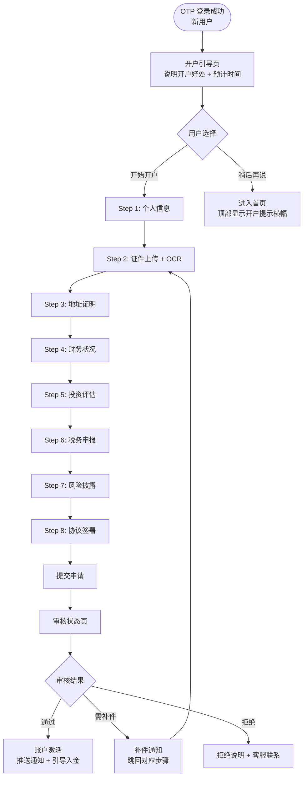
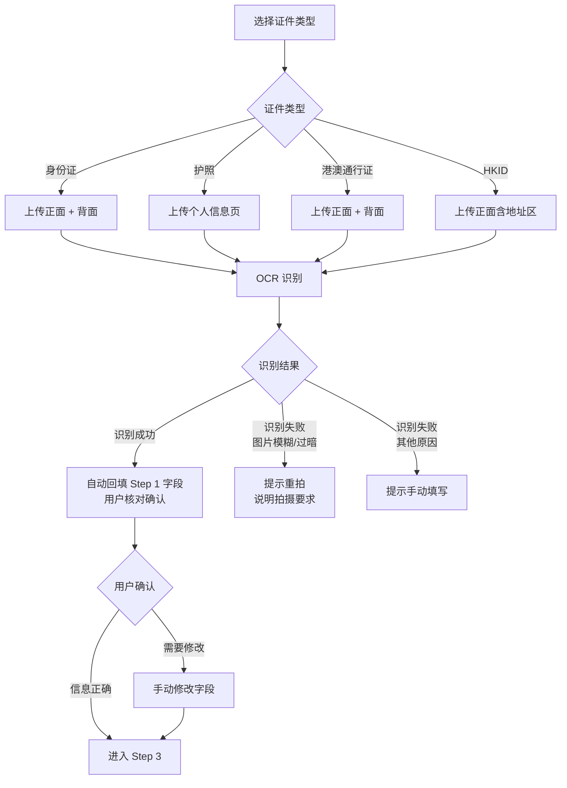
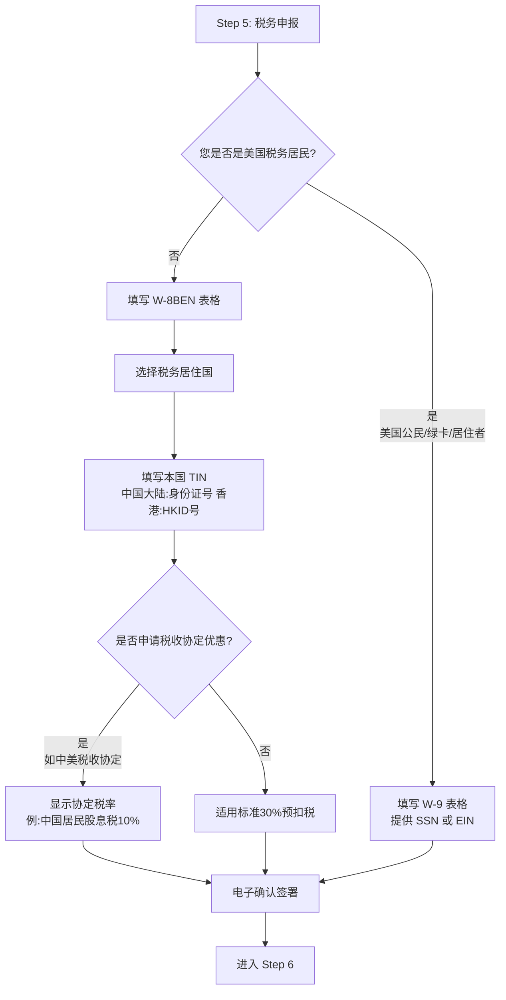
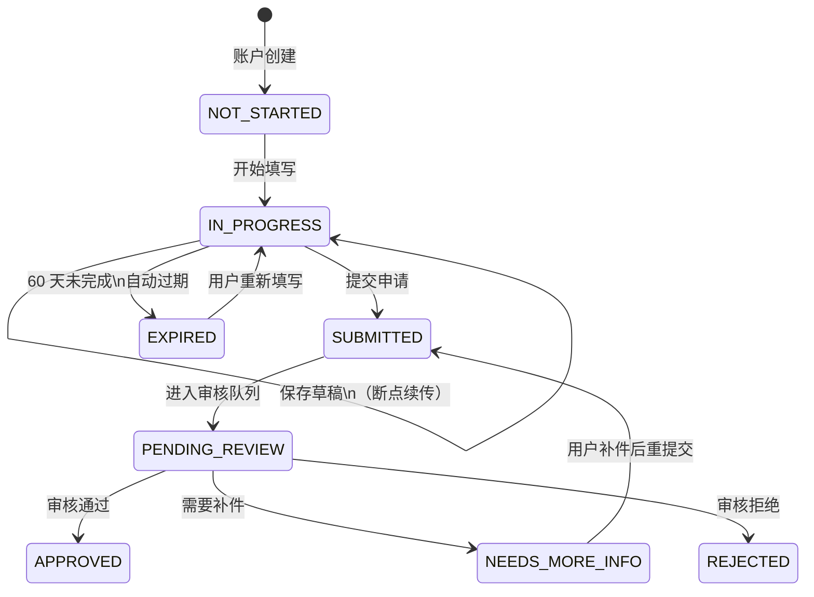

> **低保真原型**：[查看原型](prototypes/02-kyc/index.html)（8步开户全流程 · OCR 识别 · W-8BEN · 审核状态）

---

## 一、背景与问题

### 1.1 用户痛点

- 海外证券开户流程繁琐，用户不清楚需要准备哪些材料
- 多次往返补件，审核进度不透明，用户容易放弃
- 税务表格（W-8BEN）专业术语多，普通用户看不懂

### 1.2 业务价值

KYC 是合规准入门槛，同时也是用户从"行情浏览者"转化为"真实交易者"的关键节点。流程体验直接决定开户完成率，进而影响首次入金率。

### 1.3 监管依据

| 监管要求 | 适用规定 |
|---------|---------|
| 身份验证 | SEC/FINRA KYC 规定；SFC KYC 指引（Phase 2 追加） |
| 税务申报 | IRS W-8BEN（非美国税务居民）/ W-9（美国税务居民） |
| 反洗钱筛查 | BSA、FINRA Rule 3310、AMLO Part 4A（Phase 2） |
| 风险披露 | FINRA Rule 2010、SEC Regulation BI |
| 数据保留 | KYC 记录保留至账户关闭后 6 年 |

---

## 二、目标用户与场景

| 用户类型 | 场景描述 |
|---------|---------|
| 中国大陆居民（主力） | 持身份证，首次投资美股，对 W-8BEN 完全陌生 |
| 香港居民 | 持 HKID，可能已有境外账户经验 |
| 在美华人 | 持护照或绿卡，需要填写 W-9（美国税务居民） |
| 补件用户 | 首次提交被退回，需要重新上传特定材料 |

---

## 三、功能范围

| 功能 | Phase 1 | Phase 2 | 优先级 |
|------|---------|---------|--------|
| 8 步在线开户流程 | ✅ | - | Must |
| 证件图片上传 + OCR 自动识别 | ✅ 基础 OCR | - | Must |
| 地址证明上传（POA） | ✅ | - | Must |
| W-8BEN 税务申报（非美国居民） | ✅ | - | Must |
| W-9 税务申报（美国税务居民） | ✅ | - | Must |
| 风险披露文件阅读确认 | ✅ | - | Must |
| 协议在线签署 | ✅ 打字输入姓名 | ✅ 电子签名 SDK | Must |
| KYC 审核进度追踪 | ✅ | - | Must |
| 补件流程 | ✅ | - | Must |
| 活体检测 | ❌（人工审核替代） | ✅ Onfido / Sumsub / Jumio | Should |
| W-8BEN 到期续签 | ✅ 通知提醒 | - | Must |
| 融资融券开户 | ❌ | ✅ | - |
| 机构开户 | ❌ | ✅ | - |

---

## 四、核心用户流程

### 4.1 开户总流程

> **业务规则参考**：
> - KYC 供应商集成详情见 [KYC 流程规格 § KYC 供应商选型决策](../../../services/ams/docs/prd/kyc-flow.md#1-kyc-供应商选型决策)
> - 制裁筛查规则见 [AML 合规规格 § 制裁筛查](../../../services/ams/docs/prd/aml-compliance.md#3-制裁筛查规格)

> **原型参考**：[开户总流程](prototypes/02-kyc/index.html)（页面顶部可切换各步骤）

### 4.2 Step 1：个人信息

> **原型参考**：[Step 1 - 基本信息](prototypes/02-kyc/index.html)（顶部导航切换到步骤 1）

**收集字段：**

| 字段 | 必填 | 说明 |
|------|------|------|
| 英文姓名（名 / 姓） | ✅ | 必须与证件一致，仅允许英文字母 |
| 中文姓名 | 选填 | 用于显示 |
| 出生日期 | ✅ | 年龄需满 18 岁 |
| 国籍 | ✅ | 下拉国家列表 |
| 证件类型 | ✅ | 身份证 / 护照 / 港澳通行证 / HKID |
| 就业状况 | ✅ | 在职 / 自雇 / 退休 / 学生 / 其他 |
| 职业 / 雇主（在职时） | ✅ | 就业状态影响后续财务信息显示 |
| 是否政治敏感人士（PEP） | ✅ | 默认否；勾选后触发人工审核 |
| 是否证券公司内部人员 | ✅ | 默认否；勾选后触发人工审核 |

**业务规则：**
- PEP / 内部人员勾选 → 不可走自动审核，强制进入人工合规审核（额外 2-3 个工作日）
- 英文姓名在 Step 7 协议签署时将被二次比对

### 4.3 Step 2：证件上传与 OCR

> **原型参考**：[Step 2 - 证件上传](prototypes/02-kyc/index.html)（切换到步骤 2）

**图片质量要求（用户可感知）：**
- 证件四角完整，不遮挡
- 光线均匀，无反光
- 无模糊、不抖动
- 文件大小 ≤ 10MB（支持 JPG / PNG）
- 不接受过期证件

**OCR 说明：** OCR 自动识别结果仅作辅助填写，用户可手动修改。最终以用户确认的内容为准。

### 4.4 Step 3：地址证明

> **原型参考**：[Step 3 - 地址证明](prototypes/02-kyc/index.html)（切换到步骤 3）

**收集字段：**

| 字段 | 必填 | 说明 |
|------|------|------|
| 常驻地址（英文）— 街道 | ✅ | 与地址证明文件一致 |
| 常驻地址（英文）— 城市/省份 | ✅ | |
| 邮政编码 | ✅ | |
| 地址证明文件 | ✅ | 近 3 个月银行账单 / 水电费账单（PDF、JPG，≤ 10MB） |

**业务规则：**
- 地址证明文件必须为近 3 个月内出具
- 文件上显示的地址须与用户填写的常驻地址一致（人工审核比对）
- 地址须与常驻国/地区一致（SFC KYC 指引要求）
- 不接受：截图、非官方文件、无日期的账单

### 4.5 Step 4：财务状况

> **原型参考**：[Step 4 - 财务状况](prototypes/02-kyc/index.html)（切换到步骤 4 或点击顶部进度"财务"）

| 字段 | 选项 |
|------|------|
| 年收入（USD 等值） | < $30K / $30K–$75K / $75K–$200K / $200K–$500K / > $500K |
| 总净资产（USD） | < $50K / $50K–$200K / $200K–$1M / $1M–$5M / > $5M |
| 流动净资产（USD） | 与总净资产相同选项（不得超过总净资产，实时校验） |
| 资金来源（多选） | 工资薪金 / 经营收入 / 投资收益 / 遗产赠与 / 房产出租 / 其他 |

**业务规则：**
- 流动净资产不得超过总净资产（前端实时提示）
- 资金来源至少选 1 项
- 净资产 ≥ $25,000 USD 才满足 Pattern Day Trader（PDT）基本条件

### 4.6 Step 5：投资评估

| 字段 | 选项 |
|------|------|
| 股票投资年限 | 无经验 / 1–3 年 / 3–5 年 / 5–10 年 / 10 年以上 |
| 年均交易频次 | 极少（< 5 次）/ 偶尔（5–20 次）/ 频繁（> 20 次）|
| 了解的投资产品（多选） | 股票 / ETF / 债券 / 期权 / 期货 / 外汇 |
| 投资目标 | 资本保全 / 稳定收益 / 资本增值 / 高风险高回报 |
| 风险承受能力 | 保守型 / 稳健型 / 平衡型 / 进取型 |

**业务规则：**
- 系统根据以上回答自动计算风险等级（R1–R5，内部使用）
- Phase 1 美股交易不因风险等级限制（数据存档备用）
- Phase 2 期权/融资产品将依据此分级限制交易权限

### 4.7 Step 6：税务申报

> **原型参考**：[Step 6 - 税务申报](prototypes/02-kyc/index.html)（切换到步骤 6 – W-8BEN 页面）

**W-8BEN 核心说明（用户版）：**
- W-8BEN 是美国税务局（IRS）要求的表格，证明您不是美国税务居民
- 签署后适用税收协定优惠税率（如中美协定：股息税从 30% 降至 10%）
- **有效期 3 年**：到期前 90 天系统会提醒续签，到期未续签则股息将恢复 30% 标准扣税

### 4.8 Step 7：风险披露

> **原型参考**：[Step 7 - 风险披露](prototypes/02-kyc/index.html)（切换到步骤 7）

**5 份必读文件：**

| 编号 | 文件名 | 核心内容 |
|------|--------|---------|
| 1 | 证券风险声明书 | 投资风险通用说明 |
| 2 | 美国市场风险说明 | NYSE/NASDAQ 特有风险 |
| 3 | 香港市场风险说明 | Phase 2 激活 |
| 4 | PDT 规则说明 | $25K 最低权益要求、4 次日内交易规则 |
| 5 | 最优执行说明 | 订单路由原则 |

**交互规则：**
- 5 份文件全部需滚动至底部或展开阅读，"已阅读全部"勾选框才可点击
- 勾选框未勾选时，"下一步"按钮保持禁用状态
- 文件支持中英文切换

### 4.9 Step 8：协议签署

**5 份协议（全部必选）：**

| 协议 | 说明 |
|------|------|
| 客户协议 | 核心服务条款 |
| 隐私政策 | 数据处理说明 |
| 电子通讯协议 | 授权以电子方式接收文件 |
| 交易所数据协议 | 非专业投资者声明（降低行情数据费用） |
| 反洗钱声明 | AML 合规声明 |

**签署方式（Phase 1）：**
- 在文本框中打字输入完整法定英文姓名（不区分大小写，去除首尾空格）
- 系统比对签名与 Step 1 填写的英文姓名是否一致，不一致则提示错误
- 勾选"本人已阅读并同意上述所有协议"后，点击"提交申请"

---

## 五、KYC 审核状态机

**用户感知的审核状态页：**

> **原型参考**：[审核状态页](prototypes/02-kyc/index.html)（点击顶部"审核状态"链接，或点击"模拟审核结果"按钮）

| 状态 | 页面展示 |
|------|---------|
| 审核中（PENDING_REVIEW） | 进度时间轴（5个节点）+ "预计 1–2 个工作日" |
| 需补件（NEEDS_MORE_INFO） | 具体原因说明 + 直接跳转到对应补件步骤的入口 |
| 已通过（APPROVED） | 账号 UID + 开户成功确认 + "立即入金"按钮 |
| 已拒绝（REJECTED） | 拒绝原因概述 + 客服联系方式 |

**审核进度时间轴节点：**
1. 申请已提交
2. 身份核验
3. 人工审核
4. 合规审批
5. 账户已激活

---

## 六、业务规则

### 6.1 断点续传

用户可随时关闭 App，下次打开自动跳转至上次进行到的步骤。草稿数据在服务端保存，不依赖本地缓存。

### 6.2 开户超时

- IN_PROGRESS 状态超过 60 天无操作 → 自动标记为 EXPIRED
- 到期前 7 天：App 内顶部横幅提示"您的开户草稿将在 X 天后过期，请尽快完成"

**EXPIRED 后用户重新进入的体验：**

用户打开 App 进入 KYC 页时，显示过期提示页（非直接清空重来）：

| 元素 | 内容 |
|------|------|
| 提示标题 | "开户草稿已过期" |
| 提示说明 | "由于超过 60 天未操作，您的开户资料已过期。您可以选择重新填写，部分信息将为您预填。" |
| 操作按钮 | [重新开始] |
| 数据保留策略 | 非敏感信息（姓名、出生日期、国籍、就业状况）**预填保留**；证件图片、财务信息、签名等**清空**，须重新上传/填写 |
| 进度恢复 | 从 Step 1 重新开始，但表单中已预填可保留的字段 |

### 6.3 PEP / 内部人员处理

| 情况 | 处理方式 |
|------|---------|
| 勾选 PEP（政治敏感人士） | 强制进入人工合规审核，审核周期延长至 2–3 个工作日，合规专员负责 |
| 勾选证券公司内部人员 | 同 PEP，额外记录雇主名称、职位，合规备案 |

### 6.4 W-8BEN 有效期管理

| 时间节点 | 动作 |
|---------|------|
| 到期前 90 天 | App 内弹出提醒 + 推送通知，引导用户进入"税务信息"重新签署 |
| 到期前 30 天 | 再次推送通知 |
| 到期当天 | 股息扣税率自动切换回 30%；App 内显示税务到期警告横幅 |
| 用户续签后 | 立即恢复协定税率，新有效期从续签日起算 3 年 |

### 6.5 审核 SLA

| 类型 | 目标时间 |
|------|---------|
| 普通 KYC 申请 | 1 个工作日内完成审核 |
| PEP / 内部人员标记申请 | 2–3 个工作日 |
| 补件后重审 | 1 个工作日 |
| SLA 超时预警 | 超过 20 小时未处理，Admin Panel 标红预警 |

---

## 七、合规要求

| 要求 | 适用规定 |
|------|---------|
| 实名身份验证 | SEC/FINRA KYC 强制要求；Phase 2 追加 SFC KYC 指引 |
| AML 筛查 | 提交时自动触发 OFAC 制裁名单比对；命中则人工审核处理 |
| 投资者适当性 | FINRA Rule 2010；Step 4 投资评估结果存档用于合规审计 |
| W-8BEN / W-9 | IRS 要求；所有美股账户必须完成税务声明方可交易 |
| 风险披露阅读确认 | SEC Reg BI；5 份文件必须确认已读，服务端校验 |
| 协议电子签署 | ESIGN Act；签署时间戳、IP 地址记录至审计日志 |
| 数据保留 | KYC 文件保留至账户关闭后 6 年 |

> **相关 Domain PRD**：
> - KYC 流程细节见 [kyc-flow.md](../../../services/ams/docs/prd/kyc-flow.md)
> - AML 合规规则见 [aml-compliance.md](../../../services/ams/docs/prd/aml-compliance.md)

---

## 八、异常与边界场景

| 场景 | 用户感知 | 处理 |
|------|---------|------|
| OCR 识别失败 | "无法识别证件信息，请重新拍摄或手动填写" | 允许手动填写，记录失败原因 |
| 证件过期 | "证件已过期，请上传有效期内的证件" | 阻止提交 |
| 图片过大/格式不支持 | "请上传 JPG 或 PNG 格式，文件 ≤ 10MB" | 前端提示，不上传 |
| 流动净资产超过总净资产 | "流动净资产不可超过总净资产" | 实时校验，红色提示 |
| 签名与姓名不匹配 | "签名与您填写的英文姓名不符，请检查" | 提示，不允许提交 |
| 用户补件后再次被拒 | 再次发送补件通知，说明新原因 | 最多支持 3 次补件机会 |
| 提交后 App 崩溃 | 重新进入 App 显示"审核中"状态 | 幂等提交，不重复进队 |

---

## 九、Admin Panel — KYC 审核工作台

> **注**：Admin Panel 界面设计由运营工程师负责，此处仅定义 PM 所需的功能范围。

### 审核队列需要展示：
- 按提交时间排序（FIFO），超 20 小时未处理标红
- 可按状态 / 国籍 / 证件类型 / 提交日期 / PEP 标记过滤

### 审核工作台需要具备：
- 用户填写的所有结构化信息（8 步全部内容）
- 证件图片查看（可缩放、旋转）
- OFAC 筛查结果与风险信号展示
- 操作按钮：通过 / 需补件（填写原因）/ 拒绝（选择拒绝类型）
- 内部审核备注（不对用户展示）
- 审核历史记录（只追加）

### 操作权限：

| 操作 | 所需角色 |
|------|---------|
| 审核通过 / 要求补件 | KYC Reviewer |
| 拒绝开户 | KYC Senior Reviewer |
| PEP 专项审核 | Compliance Officer |

---

## 十、成功指标

| 指标 | 目标 | 测量 |
|------|------|------|
| 开户完成率 | 开始填写 → 提交审核 ≥ 70% | 漏斗分析 |
| 首次审核通过率 | 提交后首次通过率 ≥ 80% | 审核结果统计 |
| 平均开户时长 | 用户完成 7 步 ≤ 15 分钟 | 行为日志 |
| 审核 SLA 达标率 | 1 个工作日内完成率 ≥ 95% | 审核时效统计 |
| W-8BEN 续签率 | 到期前 30 天内续签率 ≥ 85% | 续签漏斗 |

---

## 十一、依赖与风险

| 项目 | 说明 |
|------|------|
| OCR 服务 | 第三方 OCR 供应商（Mindee / 其他），识别率直接影响首次通过率 |
| 活体检测（Phase 2） | Onfido / Sumsub / Jumio 评估中，Phase 1 人工审核替代存在人力成本 |
| OFAC 数据源 | 每日更新，延迟更新可能导致漏筛 |
| 待确认 | 补件机会次数（当前定为 3 次）是否满足合规要求，需法务确认 |
| 待确认 | W-8BEN PDF 是否需要支持用户在 App 内下载，影响文件服务设计 |

---

## 附录 A：与 AMS Domain PRD 的职责分工

### 本 PRD（Surface）的范围
- ✅ 用户看到的 7 步开户界面和交互流程
- ✅ 错误提示文案（如"证件过期"、"签名不匹配"）
- ✅ 用户可操作的状态（"审核中" → "已通过" → "已拒绝"）
- ✅ 推送通知时机和文案

### AMS Domain PRD 的范围
- ✅ 内部状态机（11 个状态从 `APPLICATION_SUBMITTED` 到 `ACTIVE`）
- ✅ 审核规则矩阵（PEP 自动升级至 EDD、SLA 定义）
- ✅ 供应商集成（Sumsub 选型、Webhook 处理）
- ✅ W-8BEN 续签工作流和数据库设计
- ✅ Non-HK PEP 分类标准和 EDD 流程
- ✅ 制裁筛查规则（OFAC、HK UNATMO）
- ✅ Admin Panel 审核队列和工作流

### 跨 PRD 查询指南

| 用户问题 | 查 Surface PRD | 还要查 Domain PRD |
|---------|--------------|-----------------|
| "为什么开户需要上传证件？" | PRD-02 §1.2 业务价值 | ✓ kyc-flow.md § 各用户群体开户路径 |
| "审核要多久？" | PRD-02 §5（用户显示状态） | ✓ kyc-flow.md § 5.3 状态聚合规则 + § 6.5 审核 SLA |
| "PEP 的审核流程是什么？" | PRD-02 §4.2（"触发人工审核"） | ✓ aml-compliance.md § 4.2-4.4 PEP 分类与 EDD |
| "W-8BEN 到期后怎么续签？" | PRD-02 §4.6（提醒时间） | ✓ kyc-flow.md § 10 W-8BEN 续签工作流 |
| "补件如何操作？" | PRD-02 §4 & § 8（需补件状态） | ✓ kyc-flow.md § 5.2 状态转换触发器 |

---

## 附录 B：审核状态术语对照表

### 用户看到的状态（Surface）vs 系统内部状态（Domain）

| 用户显示状态 | 含义 | 对应的 Domain 状态（AMS 内部） |
|-------------|------|---------------------------|
| 未开始 | 用户尚未点击开始 | `NOT_STARTED` |
| 填写中 | 用户正在填写表单 | `IN_PROGRESS` |
| 已提交 | 用户提交了申请 | `APPLICATION_SUBMITTED` |
| 审核中 | 系统正在审核（包括 Sumsub、OFAC、PEP 检查、EDD 等） | `KYC_UNDER_REVIEW` + `KYC_MANUAL_REVIEW` + `SANCTIONS_SCREENING` + `AML_PEP_REVIEW` + `PENDING_EDD` |
| 需补件 | 审核发现问题，需用户重新上传或补充信息 | `KYC_MANUAL_REVIEW`（RejectType = RETRY） |
| 已通过 | 账户完全激活，可开始交易 | `ACTIVE` |
| 已拒绝 | 审核最终不通过，无法重试 | `KYC_REJECTED` (RejectType = FINAL) 或 `ACCOUNT_BLOCKED` |
| 草稿已过期 | 60 天未完成，需重新开始 | `EXPIRED` |

**说明**：
- 用户 API 返回的是左列状态（Surface 状态）
- Admin Panel 和后端日志中会看到右列详细状态（Domain 状态）
- 详见 Domain PRD kyc-flow.md § 5.3"状态聚合规则"
