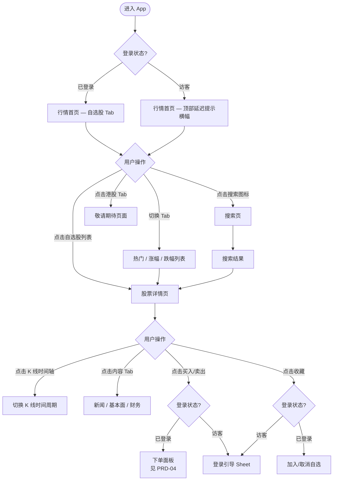
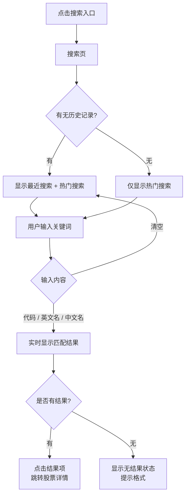
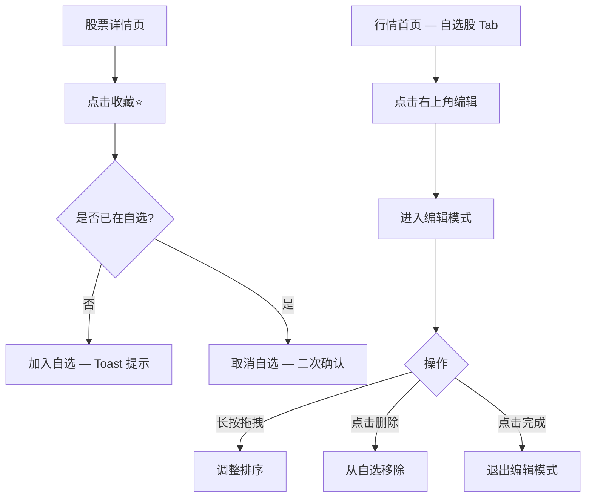

# PRD-03：行情模块

> **文档状态**: Phase 1 正式版
> **版本**: v2.3
> **日期**: 2026-03-20
> **变更说明**: v2.3 — 采纳 market-data-engineer v2.2 评审意见（C3/Q1/Q2）：大盘指数改为 ETF 替代（SPY/QQQ/DIA）以规避指数授权合规风险；确认流通股数数据源为 Polygon.io Fundamental API；明确中文/拼音搜索覆盖范围为 Phase 1 Top 1000 美股

> **低保真原型**：[行情首页](prototypes/03-market/index.html) · [股票详情 + K线](prototypes/03-market/stock-detail.html) · [搜索](prototypes/03-market/search.html)

---

## 一、背景与问题

### 1.1 用户痛点

- 国内用户习惯看 A 股行情，美股行情界面对他们陌生
- 关心的几只自选股分散在不同平台，缺乏统一管理
- 盘前/盘后行情与常规时段混淆，不清楚当前是什么交易时段

### 1.2 业务价值

行情是 App 的高频入口——用户每天开盘前、开盘中、收盘后都会打开查看。高质量的行情体验直接驱动日活，并通过"买入"跳转带来交易转化。

### 1.3 数据权限

| 数据类型 | 访客 | 注册用户（任意 KYC 状态） |
|---------|------|----------------------|
| 股票报价 | 延迟 15 分钟，**必须标注** | 实时 |
| K 线历史数据 | 延迟 15 分钟 | 实时 |
| 基本面 / 财务数据 | ✅ 可查看 | ✅ 可查看 |
| 新闻资讯 | ✅ 可查看 | ✅ 可查看 |
| Watchlist（自选股） | ❌ 需登录 | ✅ |

> **数据源**：美股（NYSE/NASDAQ）— Polygon.io（Phase 1）；港股（HKEX）— Phase 2 开放

---

## 二、目标用户与场景

| 用户 | 场景 |
|------|------|
| 日常关注者 | 每天上午开盘前查看自选股行情，决定是否操作 |
| 研究型用户 | 看中某支股票后，在详情页研究 K 线、基本面、财报 |
| 临时查价 | 搜索某个代码，快速查看当前价格 |
| 新注册用户 | 先逛行情熟悉界面，慢慢决定是否入金交易 |

---

## 三、功能范围

| 功能 | Phase 1 | Phase 2 | 优先级 |
|------|---------|---------|--------|
| 自选股（Watchlist）管理 | ✅ | - | Must |
| 行情列表（热门 / 涨幅 / 跌幅） | ✅ | - | Must |
| 股票详情页 | ✅ | - | Must |
| K 线图（分时 / 日 / 周 / 月） | ✅ | - | Must |
| 基本面数据 | ✅ | - | Must |
| 全局搜索 | ✅ | - | Must |
| 盘前 / 盘后行情显示 | ✅ | - | Must |
| 财报日历 / 财务数据 | ✅ 基础 | ✅ 深度 | Should |
| 港股行情 | ❌ 显示"敬请期待" | ✅ | - |
| 行情警报（价格提醒） | ❌ | ✅ | - |
| 期权链 | ❌ | ✅ | - |
| 股票对比 | ❌ | ✅ | - |

---

## 四、核心用户流程

### 4.1 行情浏览主流程

> **原型参考**：[行情首页](prototypes/03-market/index.html)

### 4.2 搜索流程

> **原型参考**：[搜索页](prototypes/03-market/search.html)

### 4.3 Watchlist 管理流程

---

## 五、页面详细设计

### 5.1 行情首页

> **原型参考**：[行情首页](prototypes/03-market/index.html)

**页面结构（从上到下）：**
1. 搜索栏（全宽，点击进入搜索页）
2. 大盘指数横向滚动卡片（使用 ETF 作为指数代理）：
   - **SPY**（追踪 S&P 500）
   - **QQQ**（追踪 Nasdaq-100）
   - **DIA**（追踪 DJIA）
   - 2800.HK（追踪恒生指数，Phase 2）
   - UI 标注格式：ETF 代码 + 价格 + "追踪 XXX" 副标题
3. Tab 栏：自选 | 热门 | 涨幅榜 | 跌幅榜 | 港股（敬请期待）
4. 股票列表

**股票列表卡片信息：**

| 字段 | 说明 |
|------|------|
| 股票代码 | 大写，美股 1–5 位字母 |
| 公司名称 | 英文简称（中文名 Phase 2） |
| 当前价格 | 4 位小数 |
| 涨跌额 | ±X.XX |
| 涨跌幅 | ±X.XX% |
| 颜色规则 | 大陆用户默认红涨绿跌；港澳用户默认绿涨红跌；平盘显示灰色 |

**涨幅榜 / 跌幅榜筛选条件：**
- 仅显示当日成交量 > 100 万股的标的（排除低流动性股票）
- 按当日涨跌幅实时排序

### 5.2 股票详情页

> **原型参考**：[股票详情](prototypes/03-market/stock-detail.html)

**页面结构（从上到下）：**
1. 导航栏（代码 + 收藏按钮）
2. 价格英雄区（当前价、涨跌、交易时段标识）
3. K 线区（时间轴选择 + 图表）
4. 关键数据网格（今开、昨收、最高、最低、成交量、成交额、市值、**换手率**）

   > **换手率计算口径**：`换手率 = 当日成交量 ÷ 流通股数 × 100%`，精度 2 位小数
   > - `流通股数` 数据源：**Polygon.io Fundamental API**（首选）；若不可用则评估第三方财务数据供应商
   > - 更新频率：每日收盘后更新一次

5. 最优买卖价（**Phase 1 仅展示 Level 1：最佳买一价 / 最佳卖一价**；Level 2 深度盘口 Phase 2 规划）
6. 我的持仓快速查看（仅已登录且有持仓时显示）
7. 公司简介（可展开）
8. 底部：买入 / 卖出按钮（访客显示登录引导）

**K 线时间轴选项：**

| 时间轴 | 含义 | 显示范围 |
|--------|------|---------|
| 分时 | 当日每分钟 K 线 | **仅常规交易时段（09:30–16:00 ET），约 390 条**；盘前/盘后价格通过实时 WebSocket 推送展示，不进入分时K线 |
| 5日 | 近 5 个交易日分钟 K 线 | — |
| 1月 | 近 1 个月日 K 线 | — |
| 3月 | 近 3 个月日 K 线 | — |
| 1年 | 近 1 年日 K 线 | — |
| 全部 | 全历史日 K 线 | — |

**交易时段显示规则：**

| 时段 | 显示标识 |
|------|---------|
| 盘前（04:00–09:30 ET） | 价格区显示"盘前" + 相对昨收涨跌幅 |
| 常规时段（09:30–16:00 ET） | "盘中"标识，实时价格 |
| 盘后（16:00–20:00 ET） | 价格区显示"盘后" + 相对收盘涨跌幅 |
| 休市（周末 / 美股节假日） | "休市"标识，显示最后收盘价 |
| 交易暂停（Trading Halt） | "暂停交易"红色标签（交易所临时暂停）；买入/卖出按钮禁用，提示"该股票交易暂时中止，请稍后查看" |

### 5.3 搜索页

> **原型参考**：[搜索页](prototypes/03-market/search.html)

**搜索匹配规则（用户视角）：**

| 输入 | 匹配示例 |
|------|---------|
| 股票代码（精确或前缀） | "AAPL" → Apple；"AA" → AAPL、AA、AAL… |
| 英文公司名 | "Apple" → AAPL；"Tesla" → TSLA |
| 中文公司名 | "苹果" → AAPL；"特斯拉" → TSLA |
| 拼音首字母 | "pg" → 苹果 |

**搜索触发规则：**
- 客户端 **debounce 300ms**：用户停止输入 300ms 后才发起搜索请求，避免每次击键都触发
- **最少输入字符**：股票代码搜索 ≥ 1 个字符；中文 / 拼音搜索 ≥ 2 个字符
- **中文名/拼音搜索覆盖范围**：Phase 1 覆盖 **Top 1000 美股**（按市值排序，包含所有主流中概股）；Phase 2 扩展至全部美股
- 访客模式搜索结果中的价格旁须显示"延迟"徽标，与行情列表保持一致

**无搜索结果时提示：**
> "未找到 '[关键词]' 相关股票"
> 提示用户：美股代码由 1–5 位字母组成，可尝试搜索完整公司名

**搜索历史管理：**
- 本地存储最近 10 条搜索记录
- 用户可一键清除全部历史

---

## 六、业务规则

### 6.1 访客模式行情规则

- 访客使用的行情数据**必须延迟 15 分钟**（合规硬要求）
- 技术实现方式：服务端维护全局"15 分钟前行情快照"（Ring Buffer / Redis），访客连接从快照读取，**每 5 秒推送一次**（无需 sub-second 实时推送；延迟行情用户无法感知秒级差异）
- 延迟标识必须在**每一处**价格数据旁显著展示，不可设计为可忽视的小字或隐藏
- 用户登录后，页面实时切换为实时行情（无需刷新）
- Watchlist 在访客模式下完全禁用（点击触发登录引导）

### 6.2 港股入口规则（Phase 1）

- 行情 Tab 栏中保留"港股"入口，点击显示"敬请期待"占位页
- 搜索结果不包含港股标的
- 股票列表不显示港股数据

### 6.3 自选股规则

| 规则 | 说明 |
|------|------|
| 数量上限 | **100 只**（后端 API 强制约束，超出返回 `WATCHLIST_FULL` 错误；Phase 2 可评估扩展） |
| 数据同步 | 登录后服务端存储，多端同步；访客本地临时存储（退出后清除） |
| 添加方式 | 股票详情页收藏图标；搜索结果项长按菜单 |
| 删除方式 | 自选列表编辑模式左滑删除，或详情页再次点击收藏图标 |
| 分组 | Phase 2 支持自定义分组（Phase 1 单一列表） |

### 6.4 颜色设置规则

- 用户注册时根据手机号区号自动设置默认配色（+86 → 红涨绿跌；+852 → 绿涨红跌）
- 用户可在"我的 → 偏好设置"手动更改
- 平盘（0.00%）始终显示灰色，与颜色设置无关

---

## 七、合规要求

| 要求 | 适用规定 |
|------|---------|
| 延迟行情必须标注 | SEC Regulation NMS；Polygon.io 数据授权协议 |
| 非专业投资者行情授权 | 交易所数据协议（SIAC/UTP/CTA）；用户在 KYC Step 7 签署非专业投资者声明后获授权 |
| 财务数据来源披露 | 数据来源（Polygon.io）须在详情页注明，不可歪曲数据来源 |
| 盘前盘后风险提示 | 在盘前盘后时段，股票详情页底部显示"盘前/盘后交易流动性较低，价差可能较大"提示 |

---

## 八、异常与边界场景

| 场景 | 用户感知 | 处理 |
|------|---------|------|
| 行情 WebSocket 断连 | 价格停止更新，顶部显示"行情连接断开，正在重连..." | 自动重连，成功后恢复实时更新 |
| 数据源服务异常 | 显示最后已知数据 + "行情数据更新中断"提示 | 不展示错误数据 |
| 搜索无结果（美股范围）| "未找到相关美股股票，请确认代码或名称是否正确（美股代码为 1-5 位字母）" | 不展示空白页面 |
| **搜索港股标的**（如输入"腾讯"、"0700"、"港交所"）| 显示提示："港股行情即将开放，您可先浏览美股行情" + [浏览美股] 按钮 | Phase 1 搜索范围仅限美股，不直接返回无结果；识别为港股标的时给出引导性提示，而非冷冰冰的"未找到" |
| 自选股列表为空 | 空状态插画 + "去搜索添加"引导按钮 | — |
| 股票停牌 | 价格区显示"停牌"，买入/卖出按钮禁用，提示"该股票当前处于停牌状态" | — |
| 港股 Tab 点击 | 显示"港股交易即将开放，敬请期待"占位页 | — |
| Polygon.io 数据延迟超过 5 分钟 | 价格旁显示"数据更新延迟"标识，附数据时间戳 | 工程告警同时触发 |

---

## 九、成功指标

| 指标 | 目标 | 测量方式 |
|------|------|---------|
| 行情页日活比例 | 登录用户日均打开行情页 ≥ 2 次 | 页面 PV/UV 统计 |
| K 线图加载速度 | 切换时间轴 ≤ 1 秒展示数据 | 性能监控 |
| 搜索到详情转化 | 搜索 → 点击结果进入详情 ≥ 60% | 漏斗分析 |
| 自选股添加率 | 注册用户 7 日内添加至少 1 只自选股 ≥ 50% | 行为日志 |
| 行情 → 买入跳转率 | 股票详情页 → 点击买入/卖出 ≥ 15% | 按钮点击率 |

---

## 十、依赖与风险

| 项目 | 说明 |
|------|------|
| Polygon.io 授权 | 本周启动授权谈判，延误将影响 Phase 1 上线时间 |
| 交易所非专业投资者协议 | 用户需签署非专业投资者声明（KYC Step 7）方可获取完整行情授权 |
| 港股数据（Phase 2） | HKEX OMD 接入需要额外时间与成本评估 |
| ~~待确认~~ | ~~中文公司名与拼音搜索的覆盖率目标~~ → **已确认**：Phase 1 覆盖 Top 1000 美股 |
