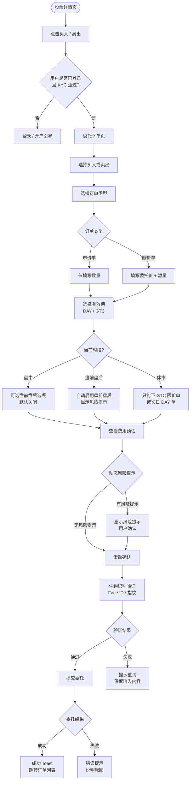
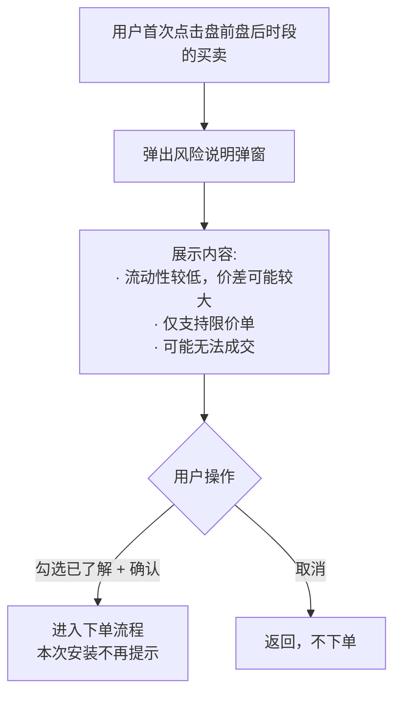
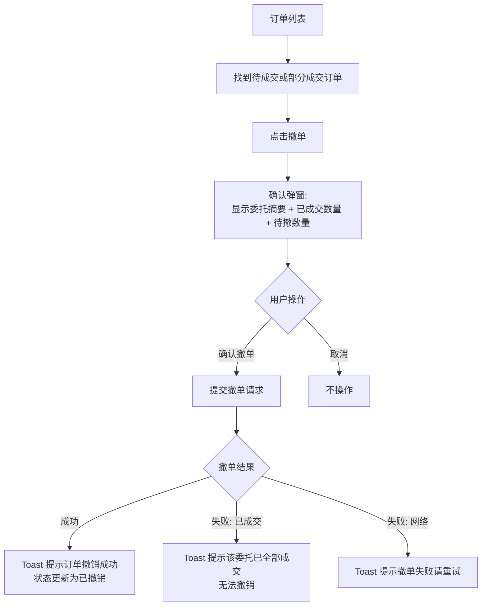
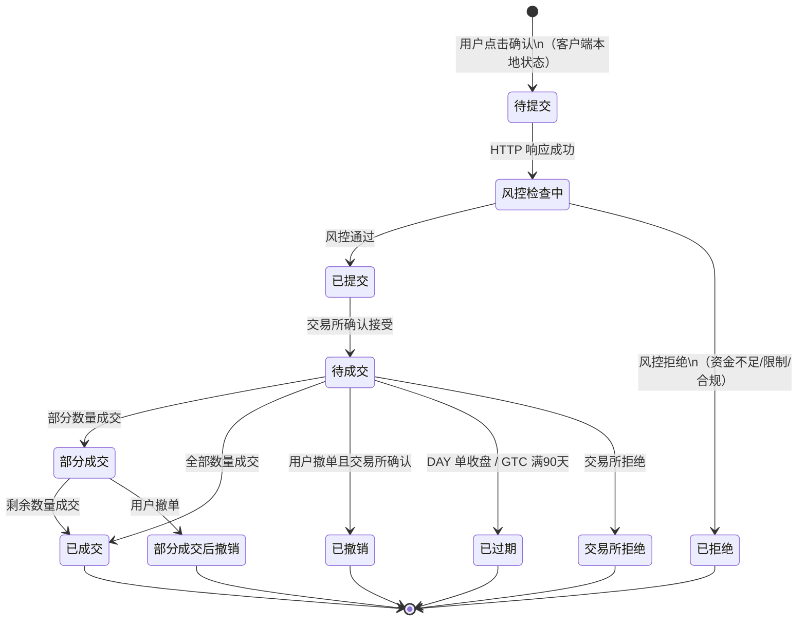

# PRD-04：交易模块

> **文档状态**: Phase 1 正式版
> **版本**: v2.0
> **日期**: 2026-03-14
> **变更说明**: v2.0 整改 — 移除接口规格、数据模型、GTC 调度器伪代码，改用 Mermaid 流程图与状态图，补充用户旅程与业务规则

> **低保真原型**：[下单面板](prototypes/04-trading/order-entry.html) · [订单确认](prototypes/04-trading/order-confirm.html) · [订单列表](prototypes/04-trading/order-list.html)

---

## 一、背景与问题

### 1.1 用户痛点

- 首次美股下单流程陌生，不清楚市价单与限价单的区别
- 盘前盘后时段容易搞混，担心在不希望的时段成交
- 下单后不知道订单是否成功，缺乏及时反馈
- 限价单长时间挂单后忘记撤销，超时后不知情

### 1.2 业务价值

下单是 App 最核心的转化行为，直接产生交易收入（手续费/通道费）。下单流程越简洁、反馈越及时，用户频繁交易的意愿越强。

### 1.3 交易权限前置条件

| 条件 | 说明 |
|------|------|
| 账户 KYC 状态 | 必须为 `APPROVED`（Tier 1 或 Tier 2） |
| 账户类型 | Phase 1 仅现金账户（Cash Account） |
| 最小委托数量 | 1 股（Phase 1 不支持碎股 / 零股） |
| 交易市场 | Phase 1 仅美股（NYSE / NASDAQ） |

---

## 二、目标用户与场景

| 用户 | 场景 |
|------|------|
| 散户投资者 | 看好某支股票，快速买入一定数量 |
| 有策略的用户 | 设置限价单等待理想价格，不想盯盘 |
| 持仓用户 | 盈利后部分卖出，锁定收益 |
| 谨慎型用户 | 下单前反复确认金额和方向，担心误操作 |

---

## 三、功能范围

| 功能 | Phase 1 | Phase 2 | 优先级 |
|------|---------|---------|--------|
| 市价单（Market Order） | ✅ | - | Must |
| 限价单（Limit Order） | ✅ | - | Must |
| DAY / GTC 有效期 | ✅ | - | Must |
| 盘前 / 盘后交易（仅限价单） | ✅ | - | Must |
| 生物识别下单确认 | ✅ | - | Must |
| 撤单 | ✅ | - | Must |
| 订单列表与历史 | ✅ | - | Must |
| 成交明细导出（CSV） | ✅ | - | Should |
| 止损单 / 止损限价单 | ❌ | ✅ | - |
| 追踪止损 | ❌ | ✅ | - |
| 委托修改（修改价格/数量） | ❌（仅撤单重下） | ✅ | - |
| 碎股 / 零股 | ❌ | ✅ | - |
| IOC / FOK | ❌ | ✅ | - |

---

## 四、核心用户流程

### 4.1 下单主流程

> **原型参考**：[下单面板](prototypes/04-trading/order-entry.html) → [订单确认](prototypes/04-trading/order-confirm.html)

### 4.2 盘前 / 盘后首次确认流程

### 4.3 撤单流程

> **原型参考**：[订单列表 — 撤单操作](prototypes/04-trading/order-list.html)

---

## 五、订单状态生命周期

**订单状态的用户感知标识：**

| 状态 | 标识颜色 | 显示文字 |
|------|---------|---------|
| 风控检查中 | 蓝色（加载动画） | 审核中 |
| 待成交 | 蓝色 | 待成交 |
| 部分成交 | 橙色 | 部分成交 |
| 已成交 | 绿色 | 已成交 |
| 已撤销 | 灰色 | 已撤销 |
| 部分成交后撤销 | 橙色 | 部分成交后撤销 |
| 已过期 | 灰色 | 已过期 |
| 已拒绝 | 红色 | 已拒绝 |
| 交易所拒绝 | 红色 | 交易所拒绝 |

---

## 六、委托下单页详细设计

> **原型参考**：[下单面板](prototypes/04-trading/order-entry.html)

### 6.1 页面信息区

- 股票代码 + 公司名称
- 当前价格（实时更新）+ 涨跌幅
- 当前交易时段标识（常规 / 盘前 / 盘后 / 休市）
- 买入方向：显示可用现金；卖出方向：显示当前可卖股数（仅已结算部分）

### 6.2 订单类型说明

| 类型 | 用户说明 |
|------|---------|
| 市价单 | 以当前市场最优价格立即成交，适合追求速度；实际成交价可能与显示价格有差异（特别是在波动剧烈时） |
| 限价单 | 仅在价格达到您指定的价格时成交，适合有价格要求的投资者；若市价未触及委托价，订单将持续挂单 |

**市价单提示：** 系统会对市价单设置价格保护区间（常规时段 ±5%，盘前盘后 ±3%），防止在流动性差时以极端价格成交。用户无需操作，自动生效。

### 6.3 数量输入规则

| 场景 | 规则 |
|------|------|
| 买入 — "最大"计算 | 可用资金 ÷ 委托价（取整），市价单用最新卖价估算 |
| 卖出 — "最大"计算 | 当前已结算持仓数量（未结算部分不可卖） |
| 卖出时持仓摘要 | 展示：持有总股数 / 可卖数量 / 待结算数量及结算日期 / 持仓均价 / 当前浮动盈亏 |
| 快捷选择 | 25 / 50 / 100 / 最大（卖出时追加"1/4 / 1/2 / 3/4"选项） |

### 6.4 有效期规则

| 选项 | 说明 | 注意 |
|------|------|------|
| 当日有效（DAY） | 当日收盘时自动过期取消 | 盘前盘后时段下单选 DAY，过期时间延至 20:00 ET |
| 长期有效（GTC） | 最多有效 90 天 | 到期前 3 天 / 1 天推送通知提醒；到期后自动取消 |

### 6.5 费用预估展示

| 费用项 | 买入 | 卖出 |
|--------|------|------|
| 佣金 | $0.00（免佣） | $0.00（免佣） |
| 交易所费用 | 约 $0.30 | 约 $0.30 |
| SEC 费用 | — | 按成交金额 × 0.0000278 计算 |
| FINRA 费用 | — | 按股数 × $0.000166，上限 $8.30 |
| 预计总金额 | 委托金额 + 费用 | 委托金额 − 费用 |

> 以上费用为预估，以实际成交时的费用为准

### 6.6 动态风险提示触发条件

| 触发条件 | 提示方式 |
|---------|---------|
| 单只持仓占总资产比例 > 20% | 黄色警告横幅（非阻断） |
| 单笔委托金额 > $10,000 | 弹出二次确认弹窗 |
| 限价与当前市价偏离 > 5% | 黄色警告（"委托价与市价偏离 X%，请确认"） |
| 盘前 / 盘后下单 | 黄色横幅说明流动性风险 |
| 第一次盘前盘后下单 | 单独弹窗，需勾选确认 |

---

## 七、订单确认页设计

> **原型参考**：[订单确认页](prototypes/04-trading/order-confirm.html)

确认页展示完整委托摘要，让用户最后核对后再提交：

**确认页必须展示：**
- 委托方向（买入 / 卖出）+ 股票代码
- 订单类型 + 委托价格（市价单显示"市价"）
- 委托数量 + 有效期
- 费用明细 + 预计总金额
- 最优执行披露（说明订单路由原则，不接受 PFOF）
- 确认方式：滑动 + 生物识别（Face ID / 指纹）

**确认方式说明：**

| 场景 | 要求 |
|------|------|
| 默认 | 滑动解锁 + 生物识别 |
| 生物识别不可用 | 仅滑动解锁 |
| 用户在"交易设置"关闭生物识别 | 仅滑动解锁 |

---

## 八、订单管理页设计

> **原型参考**：[订单列表](prototypes/04-trading/order-list.html)

### 8.1 列表 Tab 分类

待成交 | 已成交 | 已撤销 / 已过期 | 全部

### 8.2 列表卡片信息

- 股票代码 + 方向（买入/卖出）+ 订单类型标签
- 委托价格 + 委托数量
- 已成交数量 / 未成交数量
- 委托时间
- 状态标识
- 撤单按钮（仅"待成交"和"部分成交"状态显示）

### 8.3 订单详情（点击卡片展开）

| 信息区块 | 内容 |
|---------|------|
| 订单信息 | 委托类型、委托价、数量、有效期、订单号 |
| 成交明细 | 成交时间、成交数量、成交均价、交易所 |
| 费用明细 | 逐项费用 + 合计 |
| 状态时间轴 | 委托创建 → 风控通过 → 送往交易所 → 确认接受 → 成交/撤销/过期 |

### 8.4 交易历史

- 时间过滤：今天 / 本周 / 本月 / 自定义日期范围
- 按日期分组显示，每日显示当日交易汇总（总买入额 / 总卖出额 / 当日盈亏）
- 支持导出 CSV（含成交明细，用于报税）

---

## 九、PDT 规则（Pattern Day Trader）

> **监管要求**：FINRA Rule 4210，不可绕过

| 项目 | 说明 |
|------|------|
| Phase 1（现金账户） | 不受 PDT 规则约束，但 App 内提供 PDT 教育内容 |
| Phase 2（融资账户） | 5 个交易日内日内交易次数 ≥ 4 次 → 触发 PDT；账户权益须维持 ≥ $25,000 |
| 前端处理 | "设置 → 交易规则 → PDT 说明"页面；不提供绕过按钮 |
| 拦截方式 | Phase 2 工程师在交易引擎层实现，PM 不参与技术实现 |

---

## 十、交易设置

用户可在"我的 → 交易设置"中调整以下默认值：

| 设置项 | 默认值 | 选项 |
|--------|--------|------|
| 默认订单类型 | 限价单 | 市价单 / 限价单 |
| 默认有效期 | 当日有效（DAY） | DAY / GTC |
| 下单确认方式 | 滑动 + 生物识别 | 滑动 + 生物识别 / 仅滑动 |
| 大额提醒阈值 | $10,000 | $5,000 / $10,000 / $20,000 |
| 价格偏离警告 | 5% | 3% / 5% / 10% / 关闭 |
| 允许盘前盘后交易 | 关闭 | 开启 / 关闭（首次开启需确认风险） |

---

## 十一、合规要求

| 要求 | 适用规定 |
|------|---------|
| 最优执行披露 | SEC Reg NMS Rule 606；在确认页明确说明订单路由原则 |
| 不接受 PFOF | SEC Reg NMS；确认页须明确告知 |
| PDT 规则告知 | FINRA Rule 4210；用户在 KYC Step 6 阅读 PDT 风险披露文件 |
| 交易确认书 | FINRA Rule 2232；成交后 24 小时内发送确认书（Phase 1 使用 App 通知替代，Phase 2 完整文档） |
| 下单生物识别 | 安全规定；所有委托须经生物识别或密码二次确认 |
| 交易审计记录 | SEC Rule 17a-4；所有委托、成交、撤单记录保留 7 年 |

---

## 十二、异常与边界场景

| 场景 | 用户感知 | 处理 |
|------|---------|------|
| 可用资金不足 | "可用资金不足，当前可用 $X.XX"，显示入金入口 | 阻断提交 |
| 持仓不足（卖出） | "持仓不足，当前可卖 X 股（已结算）" | 阻断提交 |
| 市场休市 | "当前市场已休市" + 显示下次开市时间 | 提示，不阻断挂单 |
| 股票停牌 | "该股票交易暂时中止，请稍后再试" | 阻断提交 |
| 网络超时 | "网络连接超时，请在订单列表确认委托状态" | 重要：不要让用户重复提交 |
| 风控拒绝 | "委托被审核拒绝，如有疑问请联系客服" + 拒绝原因 | 不自动重试 |
| 撤单已成交 | "该委托已全部成交，无法撤单" | 刷新显示最新状态 |
| GTC 单即将过期 | 到期前 3 天和 1 天推送通知 | 用户点击可进入该订单详情 |

---

## 十三、成功指标

| 指标 | 目标 | 测量方式 |
|------|------|---------|
| 下单转化率 | 进入下单页 → 完成提交 ≥ 70% | 漏斗分析 |
| 确认页放弃率 | 确认页放弃率 ≤ 15% | 按钮点击分析 |
| 撤单成功率 | 撤单请求成功率 ≥ 95% | 成功/失败日志 |
| 错误提示满意度 | 每条错误用户可理解原因（NPS 调研） | 用户调研 |
| 成交通知及时率 | 成交后 ≤ 5 秒推送到 App | 推送延迟监控 |

---

## 十四、依赖与风险

| 项目 | 说明 |
|------|------|
| FIX 协议对接 | 依赖经纪商/做市商 FIX 协议接入，UAT 测试周期可能影响上线 |
| 市价单价格保护（Collar） | 工程师实现，PM 确认用户提示文案即可 |
| GTC 到期通知 | 依赖推送服务（见 PRD-07），需确认 GTC 90 天上限是否符合当地监管要求（法务确认） |
| 待确认 | 碎股支持时间节点（Phase 2），影响小额用户参与度 |
| 待确认 | 成交确认书的具体交付形式（Phase 1 App 通知是否满足 FINRA Rule 2232）需法务确认 |
