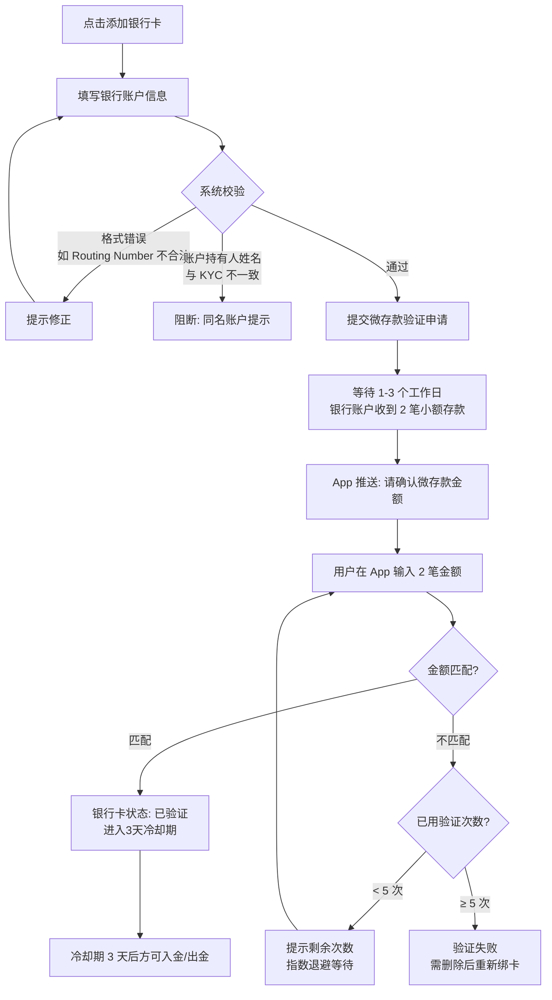
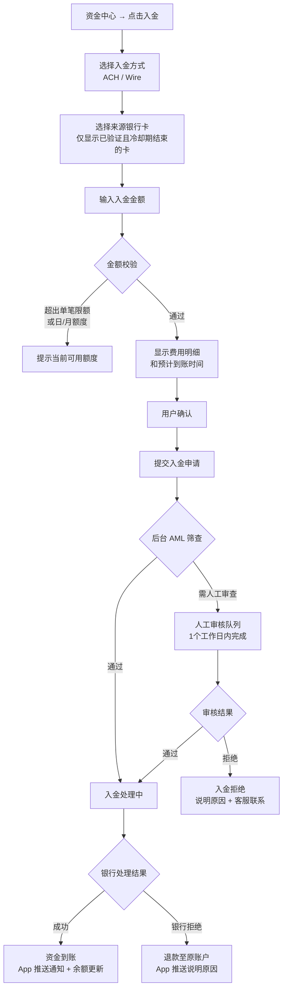
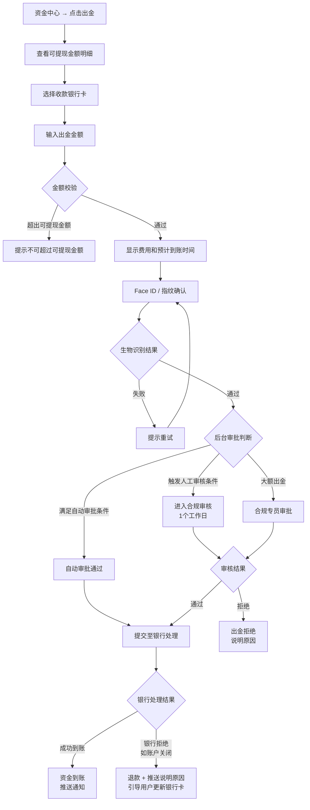
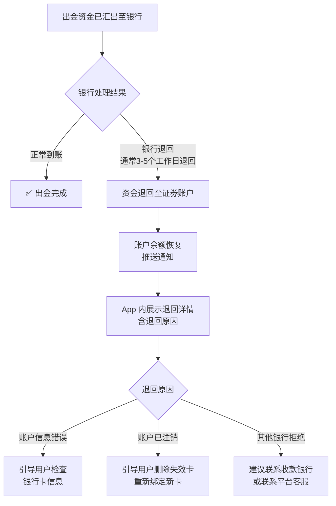

# PRD-05：出入金模块

> **文档状态**: Phase 1 正式版
> **版本**: v2.1
> **日期**: 2026-03-15
> **变更说明**: v2.0 整改 — 移除接口规格、数据模型、ACH Return Code 矩阵、对账规格（归入工程师文档），改用 Mermaid 流程图，保留产品逻辑与合规规则

> **低保真原型**：[资金中心](prototypes/05-funding/index.html) · [入金流程](prototypes/05-funding/deposit.html) · [出金流程](prototypes/05-funding/withdraw.html) · [绑定银行卡](prototypes/05-funding/bank-bind.html)

---

## 一、背景与问题

### 1.1 用户痛点

- 不了解美股出入金流程（国内用户习惯即时转账，ACH 需要 3-5 天难以接受）
- 绑卡流程繁琐，微存款验证等待时间长
- 出金被拒但不知道原因，客服响应慢
- 不清楚哪部分资金可以提现（待结算资金 vs 可用资金容易混淆）

### 1.2 业务价值

出入金是留存用户的关键环节：**入金**决定用户能否真正参与交易，**出金**体验决定用户是否信任平台长期留存。

### 1.3 监管背景

出入金是监管最严格的模块，涉及反洗钱、同名账户、结算周期等多项强制要求。设计时每个步骤都需要考虑合规约束。

---

## 二、目标用户与场景

| 用户 | 场景 |
|------|------|
| 新开户用户 | 开户成功后，首次入金准备开始交易 |
| 活跃交易者 | 频繁在银行账户与证券账户之间转移资金 |
| 需要提款的用户 | 股票卖出后想把钱取回银行账户 |
| 大额资金用户 | 单次入金或出金金额较大，担心被限制或延误 |

---

## 三、功能范围

| 功能 | Phase 1 | Phase 2/3 | 优先级 |
|------|---------|----------|--------|
| USD 入金（ACH 转账） | ✅ | - | Must |
| USD 入金（Wire 电汇） | ✅ | - | Must |
| USD 出金（ACH 转账） | ✅ | - | Must |
| USD 出金（Wire 电汇） | ✅ | - | Must |
| 银行卡绑定与管理 | ✅ | - | Must |
| 微存款验证 | ✅ | - | Must |
| 资金流水记录 | ✅ | - | Must |
| 可提现金额计算与展示 | ✅ | - | Must |
| HKD 入出金（FPS/CHATS） | ❌ | ✅ Phase 2 | - |
| FX 换汇 | ❌ | ✅ Phase 2 | - |
| 即时入金（平台垫资） | ❌ | ✅ Phase 3 | - |
| Plaid 快捷银行验证 | ❌ | ✅ Phase 2 | - |

---

## 四、核心用户流程

### 4.1 银行卡绑定流程

> **原型参考**：[绑定银行卡](prototypes/05-funding/bank-bind.html)



### 4.2 入金流程

> **原型参考**：[入金流程](prototypes/05-funding/deposit.html)



### 4.3 出金流程

> **原型参考**：[出金流程](prototypes/05-funding/withdraw.html)



---

## 五、资金中心页面设计

> **原型参考**：[资金中心](prototypes/05-funding/index.html)

### 5.1 资产余额展示

**余额卡片区**（页面顶部视觉核心，参考旧高保真 `mobile/prototypes/funding.html` 的双货币卡片设计）：

**USD 账户区块（Phase 1 主体）：**

| 字段 | 说明 |
|------|------|
| 账户总资产 | 可用现金 + 待结算资金 + 持仓市值（按当前价格） |
| 可用现金 | 可立即用于交易或出金的资金 |
| 待结算资金 | 卖出股票后尚未结算的资金（US 股 T+1，不可提现） |
| 可提现金额 | 可用现金 − 冻结的出金申请金额 |

> **用户教育**：明确告知"已卖出股票的资金需 T+1 到账后才可提现"，避免用户误解

**HKD 账户区块（Phase 1 占位展示）：**

Phase 1 余额卡片内须保留 HKD 账户区块，展示规则如下：

| 元素 | 内容 |
|------|------|
| 区块标题 | "港元账户 HKD" |
| 余额显示 | "HK$—"（破折号，不显示数字） |
| 状态标签 | "即将开放"（Pill 标签，非可点击）|
| 说明文字 | "港股交易功能将在下一版本推出" |
| 点击行为 | 整个区块不可交互，点击无操作 |

> **设计决策**：保留 HKD 占位区块（而非完全隐藏）是为了：① 传达平台的跨境愿景；② 让用户提前感知"港股即将来"；③ Phase 2 切换时用户感知自然，减少认知落差。UIUX 工程师在高保真实现时，HKD 区块视觉上应相对 USD 区块弱化（如降低不透明度）。

### 5.2 KYC 限额展示

| 内容 | 展示方式 |
|------|---------|
| 当前 KYC 等级 | Tier 1 / Tier 2 标签 |
| 今日已用 / 日限额 | 进度条 + 数字（如：$5,000 / $100,000） |
| 本月已用 / 月限额 | 进度条 + 数字 |
| 单笔限额 | 文字说明 |

### 5.3 银行卡列表

- 已绑定卡列表，最多 5 张
- 每张卡显示：银行名称 + 账号后 4 位 + 账户类型 + 验证状态
- 验证状态：已验证 / 验证中（等待微存款）/ 冷却期（剩 X 天）/ 验证失败
- 操作：设为默认入/出金账户 / 删除（软删除，保留审计记录）

### 5.4 近期流水

- 最近 10 条资金记录（入金 / 出金 / 股票交易）
- 每条：操作类型 + 金额 + 时间 + 状态
- "查看全部"跳转完整流水页面

---

## 六、业务规则

### 6.1 同名账户原则（核心合规规则）

- 用户**只能**向自己名下的银行账户入金和出金
- 银行账户持有人姓名须与 KYC 认证的法定姓名一致（不区分大小写，忽略细微格式差异）
- 禁止向第三方账户转账
- 例外：联名账户中用户为账户持有人之一时可允许（需法务确认）

### 6.2 可提现金额计算

```
可提现金额 = 总现金余额 - 待结算资金（卖出未到T+1）- 冻结的出金申请 - 保证金占用（Phase 1 = 0）
```

- 美股卖出：T+1 结算（2024 年 5 月起）
- 港股卖出：T+2 结算（Phase 2）
- 界面必须同时展示"总现金"与"可提现金"，并解释差额原因

### 6.3 银行卡冷却期规则

| 绑卡天数 | 入金 | 出金 |
|---------|------|------|
| 0–3 天（冷却期） | ❌ 禁止 | ❌ 禁止 |
| 3–7 天 | ✅ 允许 | ✅ 允许（可能触发人工审核） |
| 7 天以上 | ✅ 正常 | ✅ 正常 |

### 6.4 出金审批规则

| 条件 | 处理方式 |
|------|---------|
| 满足以下**全部**条件 | 自动审批 |
| — 金额 ≤ Tier 日限额 | |
| — 银行卡绑定 > 3 天 | |
| — 无 AML 标记 | |
| — 风险评分：低 | |

| 满足以下**任一**条件 | 人工审核（1 个工作日）|
|------|---------|
| — 金额 > $50,000 USD 单笔 | |
| — 当日累计出金 > 日限额 80% | |
| — 银行卡绑定 3–7 天 | |
| — 账户注册 < 30 天 | |
| — 风险评分：中或高 | |

| 大额出金 | 合规专员审批 |
|------|---------|
| — 单笔 > $200,000 USD | |
| — 触发可疑活动报告（SAR） | |

### 6.5 KYC 等级限额

| 等级 | 单笔限额 | 日限额 | 月限额 |
|------|---------|--------|--------|
| Tier 1（KYC 提交中） | $5,000 | $10,000 | $50,000 |
| Tier 2（KYC 通过） | $50,000 | $100,000 | $500,000 |

---

## 七、入金方式说明

| 方式 | 手续费 | 预计到账 | 适合场景 |
|------|--------|---------|---------|
| ACH 转账 | 免费 | 3–5 个工作日 | 日常入金，金额不急 |
| Wire 电汇 | $25/笔（银行端可能另收费）| 当日（工作日 14:00 ET 前）| 大额或紧急入金 |

> **Phase 1 入金限制说明**（需在入金页显著展示）：入金后资金需等待银行确认到账（3–5 天），期间不可交易或提现。用户需提前规划资金时间。

---

## 八、出金方式说明

| 方式 | 手续费 | 预计到账 |
|------|--------|---------|
| ACH 转账 | 免费 | 3–5 个工作日 |
| Wire 电汇 | $25/笔 | 当日（工作日 14:00 ET 前） |

---

## 九、合规要求

| 要求 | 适用规定 | 用户感知 |
|------|---------|---------|
| 同名账户原则 | 内部合规 Rule 1 | 绑卡时自动填充 KYC 姓名，不可修改 |
| AML 筛查（强制，所有金额） | BSA、OFAC SDN、AMLO | 用户无感知，后台自动执行 |
| 大额交易报告（CTR） | FinCEN（> $10,000）/ JFIU（> HK$120,000） | 用户无感知，合规自动申报 |
| 分拆交易检测（Structuring） | BSA Section 5324 | 用户无感知；异常时账户冻结 + 客服通知 |
| Travel Rule | FinCEN > $3,000 USD | 用户无感知，系统自动传递发/收款方信息 |
| 结算感知提现 | T+1 结算（美股） | 界面显示"可提现金"与"待结算金"区分 |
| 银行卡数量限制 | 内部安全规则 | 最多 5 张，超限后添加按钮禁用 |
| 出金账户仅限已绑定账户 | 内部合规 Rule 1 | 出金账户下拉仅显示已验证的自己名下账户 |
| 记录保留 | SEC 17a-4、SFO | 所有入出金记录保留 7 年 |

---

## 十、异常与边界场景

| 场景 | 用户感知 | 处理 |
|------|---------|------|
| 入金银行账户被关闭 | 收到银行拒绝通知 | 资金退回原账户，App 推送说明原因，引导更新银行卡 |
| 超出日限额 | "今日出金额度已用完，剩余额度：$XX,XXX" | 提示明日可再次出金 |
| 银行卡验证最终失败 | "验证失败次数已达上限，请删除后重新绑卡" | 软删除保留审计记录，用户可重新绑同一卡 |
| 出金冻结（AML 触发） | "出金申请需人工审核，预计 1 个工作日" | 告知原因（合规审核），不提供绕过入口 |
| 账户余额不足 | "可提现金额不足，当前可提 $X.XX" | 解释原因（如有待结算资金） |
| 微存款超时未验证（14 天）| 推送提醒 "您的银行卡验证即将过期" | 14 天后作废，需重新绑卡 |

### 出金被银行退回：完整处理闭环

出金申请已被平台受理并转至银行，但银行随后将该笔资金退回（如：收款账户已注销、信息错误、银行系统拒绝）。



**退回通知内容：**

| 元素 | 内容 |
|------|------|
| 推送标题 | "出金退款已到账" |
| 推送正文 | "$[金额] 出金申请已被退回，资金已返还至您的证券账户。请在 App 中查看详情。" |
| App 内流水记录 | 状态标记为"已退回"，显示退回时间、退回原因（银行提供的错误码/说明）|
| 资金可用时间 | 退款到账后**立即可用**（可再次出金或交易）|
| 后续引导 | 根据退回原因，提示用户相应操作（见上方流程图）|

---

## 十一、成功指标

| 指标 | 目标 | 测量方式 |
|------|------|---------|
| 首次入金完成率 | 开户后 7 天内完成入金 ≥ 60% | 用户路径分析 |
| 入金成功率 | 提交入金申请后银行确认到账率 ≥ 97% | 银行回执统计 |
| 银行卡绑定完成率 | 开始绑卡 → 验证成功 ≥ 75% | 漏斗分析 |
| 出金 SLA 达标率 | 自动审批出金 1 个工作日内处理完成 ≥ 99% | 出金时效统计 |
| 出金申诉率 | 用户因出金问题联系客服 ≤ 2% | 客服工单分类 |

---

## 十二、依赖与风险

| 项目 | 说明 |
|------|------|
| ACH / Wire 银行通道 | 依赖 Clearing House 或第三方支付中介，需确认对接方 |
| AML 筛查服务 | OFAC 名单每日更新，延迟更新可能导致漏筛 |
| 微存款服务 | 发送微存款依赖 ACH 通道正常运营 |
| Plaid（Phase 2） | 即时银行验证，需接入 Plaid，减少绑卡等待时间 |
| 待确认 | 出金的 Wire 手续费（$25）是否由平台补贴，影响用户体验与成本核算 |
| 待确认 | 港澳用户 HKD 出入金时间节点（Phase 2 详细规划） |
