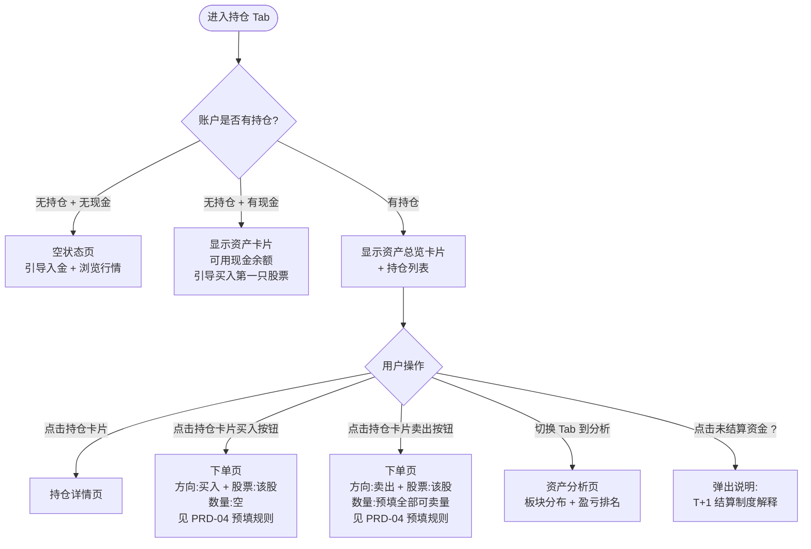
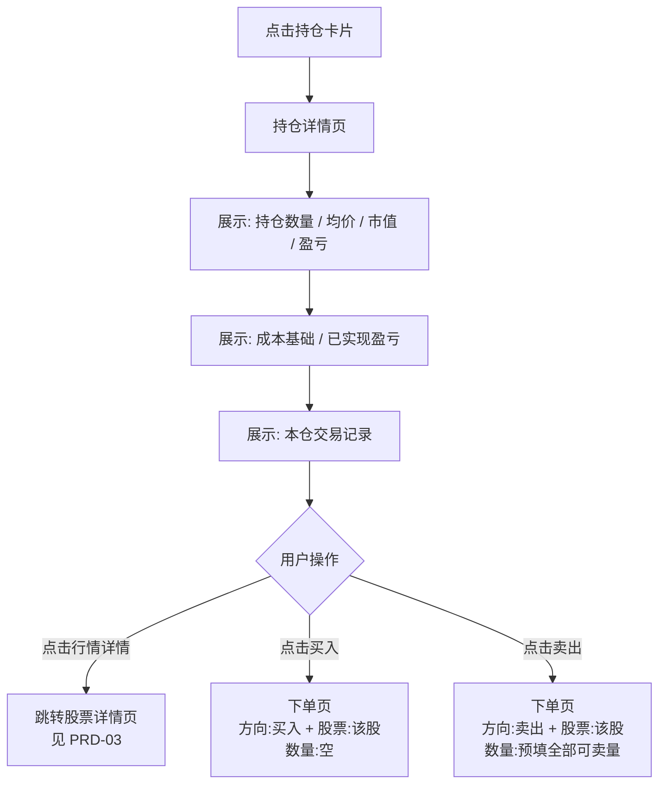

# PRD-06：持仓与组合模块

> **文档状态**: Phase 1 正式版
> **版本**: v2.1
> **日期**: 2026-03-15
> **变更说明**: v2.0 整改 — 移除接口规格与数据模型，改用 Mermaid 流程图，补充业务规则与用户场景

> **低保真原型**：[资产总览 + 持仓列表](prototypes/06-portfolio/index.html) · [持仓详情](prototypes/06-portfolio/position-detail.html)

---

## 一、背景与问题

### 1.1 用户痛点

- 不清楚"总资产"里各部分的含义（可用现金 vs 待结算 vs 持仓市值）
- 卖出股票后以为可以立刻提现，不了解 T+1 结算制度
- 持有多只股票时，不知道哪只表现最好/最差
- 担心某只股票持仓比例过高但没有感知

### 1.2 业务价值

持仓页是用户"感受账户价值"的核心界面。清晰展示盈亏状态可提高用户粘性，合理的风险提示可降低投诉率。

---

## 二、目标用户与场景

| 用户 | 场景 |
|------|------|
| 长期持有者 | 每天查看总资产变化，了解持仓整体盈亏 |
| 波段操作者 | 关注每只股票的当日涨跌和浮动盈亏 |
| 刚卖出的用户 | 想了解卖出后资金何时可以提现 |
| 分析型用户 | 想了解自己的资产在哪些板块，集中度是否过高 |

---

## 三、功能范围

| 功能 | Phase 1 | Phase 2 | 优先级 |
|------|---------|---------|--------|
| 总资产概览（USD） | ✅ | - | Must |
| 持仓列表（美股） | ✅ | - | Must |
| 持仓列表（港股） | ❌ | ✅ | - |
| 浮动盈亏（未实现 P&L） | ✅ | - | Must |
| 已实现盈亏（成交历史） | ✅ | - | Must |
| 资产板块分析 | ✅ 基础版 | ✅ 增强版 | Should |
| 持仓集中度预警 | ✅ | - | Should |
| 持仓详情页 | ✅ | - | Must |
| 双货币展示（USD + HKD） | ❌ | ✅ | - |
| 组合报告 / PDF 导出 | ❌ | ✅ | - |

---

## 四、核心用户流程

### 4.1 持仓浏览流程

> **原型参考**：[资产总览 + 持仓列表](prototypes/06-portfolio/index.html)



### 4.2 持仓详情流程

> **原型参考**：[持仓详情](prototypes/06-portfolio/position-detail.html)



---

## 五、页面详细设计

### 5.1 资产总览卡片

> **原型参考**：[资产概览区](prototypes/06-portfolio/index.html)（顶部深色卡片区域）

| 字段 | 定义 | 用户说明 |
|------|------|---------|
| 账户总资产 | 可用现金 + 待结算资金 + 持仓市值 | 所有资产的全貌 |
| 今日盈亏 | 当日持仓价格变化 + 当日已实现盈亏 | 今天赚了多少 / 亏了多少 |
| 累计盈亏 | 所有持仓的累计未实现盈亏 + 历史已实现盈亏合计 | 自入场以来的总表现 |
| 可用现金 | 可立即买入股票或申请出金的现金 | 口袋里的钱 |
| 待结算资金 | 卖出股票后 T+1 日前不可用的资金 | 需等待确认的资金 |

**待结算资金说明（点击`?`图标弹出）：**
> "美股实行 T+1 结算制度——您卖出股票所得的资金，将在下一个工作日完成清算后才可提现或再次购买。例如：今日卖出，明日结算，明日可用。"

### 5.2 持仓列表卡片

每条持仓展示：

| 字段 | 说明 |
|------|------|
| 股票代码 + 公司名 | 如 AAPL · Apple Inc. |
| 持有股数 | 整数 |
| 持仓均价 | 买入的加权平均成本 |
| 当前价格 | 实时行情 |
| 持仓市值 | 当前价 × 持有股数 |
| 浮动盈亏（金额 + 百分比） | 颜色随涨跌方向 |
| 今日涨跌 | 当日价格变化 |
| 占比 | 该持仓市值 / 持仓总市值 |
| 快捷按钮 | [买入] [卖出] |

**集中度预警触发：**
- 单只股票持仓市值 > 总持仓市值的 30% 时，该卡片顶部显示 ⚠️ 警示横幅
- 提示文字："[代码] 占您持仓的 XX%，集中度较高"

### 5.3 持仓列表排序规则

- 默认：按持仓市值从大到小排列
- 可切换：按浮动盈亏绝对值 / 按今日涨跌幅 / 按添加时间

### 5.4 资产分析 Tab

**板块分布：**
- 展示各 GICS 板块（Technology / Consumer Discretionary 等）
- 字段：板块名称 + 持仓市值 + 占总持仓比例
- 视觉：横向进度条（Phase 1）；饼图（Phase 2）

**P&L 排行：**
- 列出所有持仓，按浮动盈亏绝对值排序（盈利排上，亏损排下）
- 显示：排名 / 代码 / 浮动盈亏金额 / 浮动盈亏百分比

---

## 六、业务规则

### 6.1 平均成本计算（FIFO 原则）

采用加权平均成本法，每次买入后重新计算：

```
新均价 = (原持仓 × 原均价 + 新买数量 × 成交价) / 新总持仓数量
```

示例：已持 100 股 @ $180，再买 50 股 @ $190，新均价 = (100×180 + 50×190) / 150 = **$183.33**

### 6.2 已结算 vs 未结算股数

| 分类 | 说明 | 对交易的影响 |
|------|------|------------|
| 已结算股数 | T+1 后可随时卖出 | 可委托卖出 |
| 未结算股数 | 买入后 T+1 日前 | 不可委托卖出（卖出委托页显示不可用） |

下单页卖出时必须展示：
```
持有：150 股
可卖出：100 股（已结算）
未结算：50 股（预计 2026-03-15 结算后可卖）
```

### 6.3 价格刷新规则

| 场景 | 行为 |
|------|------|
| 交易时段内（盘中/盘前/盘后） | WebSocket 实时推送，持仓市值和盈亏自动计算更新 |
| 休市期间 | 显示最后收盘价，不实时更新；顶部标注"数据截至 [日期] 收盘" |

### 6.4 持仓为空的情况

| 情况 | 展示 |
|------|------|
| 账户无现金且无持仓 | 引导入金 + 引导浏览行情 |
| 账户有现金但无持仓 | 展示可用资金 + 引导买入第一只股票（推荐热门股） |

---

## 七、合规要求

| 要求 | 适用规定 |
|------|---------|
| 待结算资金说明 | SEC T+1 结算制度；界面必须明确区分可用资金与待结算资金 |
| Wash Sale 规则提示 | IRS Wash Sale Rule；卖出亏损后 30 天内买回相同股票，亏损不可抵税；在已实现盈亏记录中标注 |
| 成本基础记录 | IRS 报税要求；持仓均价须准确记录，用于报税参考（Phase 2 出具 1099-B） |
| 集中度提示 | 内部风险管理；平台可提示但不强制限制（Phase 1 现金账户无杠杆风险） |

---

## 八、异常与边界场景

| 场景 | 用户感知 | 处理 |
|------|---------|------|
| 行情断连（持仓页） | 持仓价格停止更新 + 顶部提示"行情连接断开" | 价格保持最后已知值，不显示错误数字 |
| 未结算股数尝试卖出 | 卖出页显示灰色禁用 + "未结算，X 日后可卖" | 阻止提交，提示结算日期 |
| 持仓因公司行动变化（拆股/分红） | 均价自动调整 + 推送通知说明 | Phase 1 人工触发调整，Phase 2 自动处理 |
| Wash Sale 标记 | 已实现盈亏记录中标注 ⚠️"该笔交易可能涉及 Wash Sale 规则，请咨询税务顾问" | 不自动计算税务影响 |

---

## 九、成功指标

| 指标 | 目标 | 测量方式 |
|------|------|---------|
| 持仓页日活 | 交易日持仓用户日均查看 ≥ 1 次 | 页面 PV/UV |
| 快捷买卖使用率 | 从持仓页直接发起买卖 ≥ 20% | 买卖入口来源统计 |
| 集中度预警点击率 | 触发预警的用户点击了解详情 ≥ 30% | 点击事件分析 |
| 未结算说明理解率 | 用户查看 T+1 说明后不再联系客服咨询 | 客服工单减少率 |

---

## 十、依赖与风险

| 项目 | 说明 |
|------|------|
| 实时行情 WebSocket | 依赖 Market Data 服务（见 PRD-03），断连时持仓市值无法实时更新 |
| 公司行动处理 | 拆股、配股、分红等公司行动需要同步调整持仓均价（Phase 1 人工处理，Phase 2 自动化） |
| Wash Sale 计算 | Phase 1 仅标注提示，不自动计算税务影响；Phase 2 可提供完整 1099-B 报告 |
| 待确认 | 集中度预警阈值（30%）是否合适，可能需要用户研究验证 |
