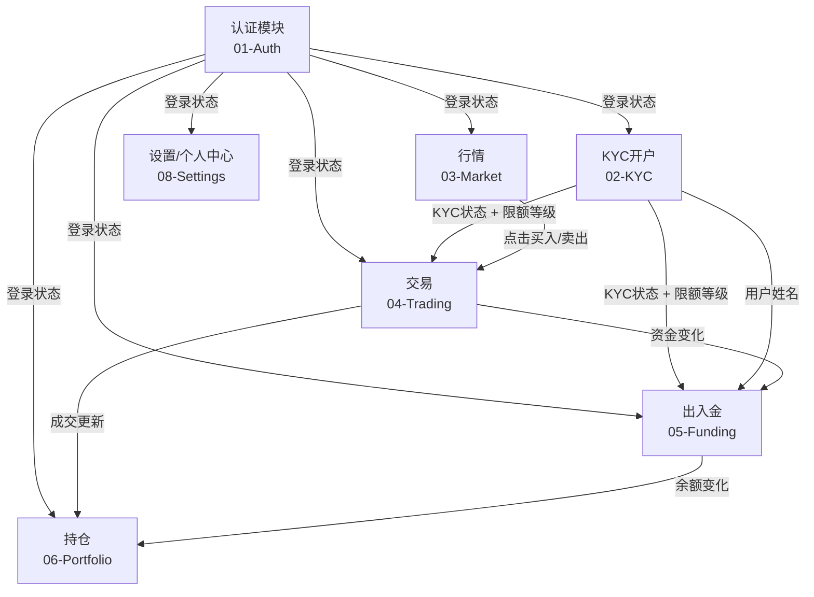
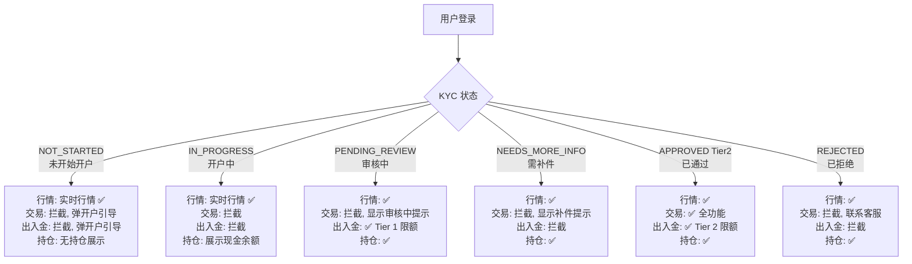
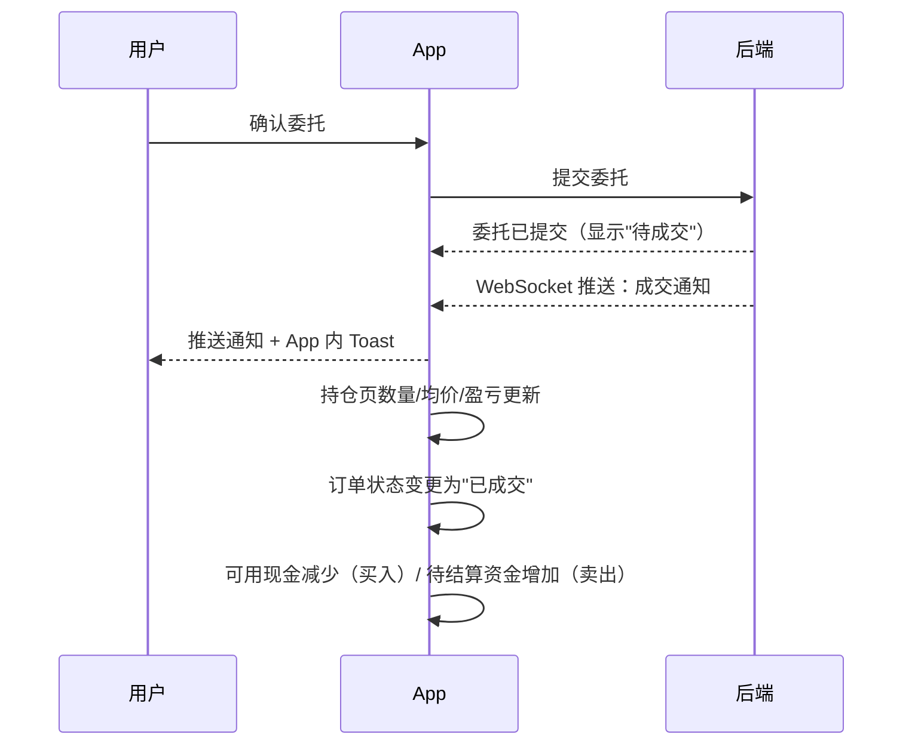
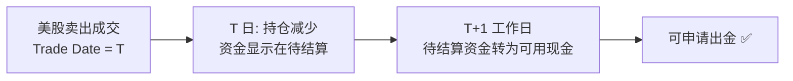
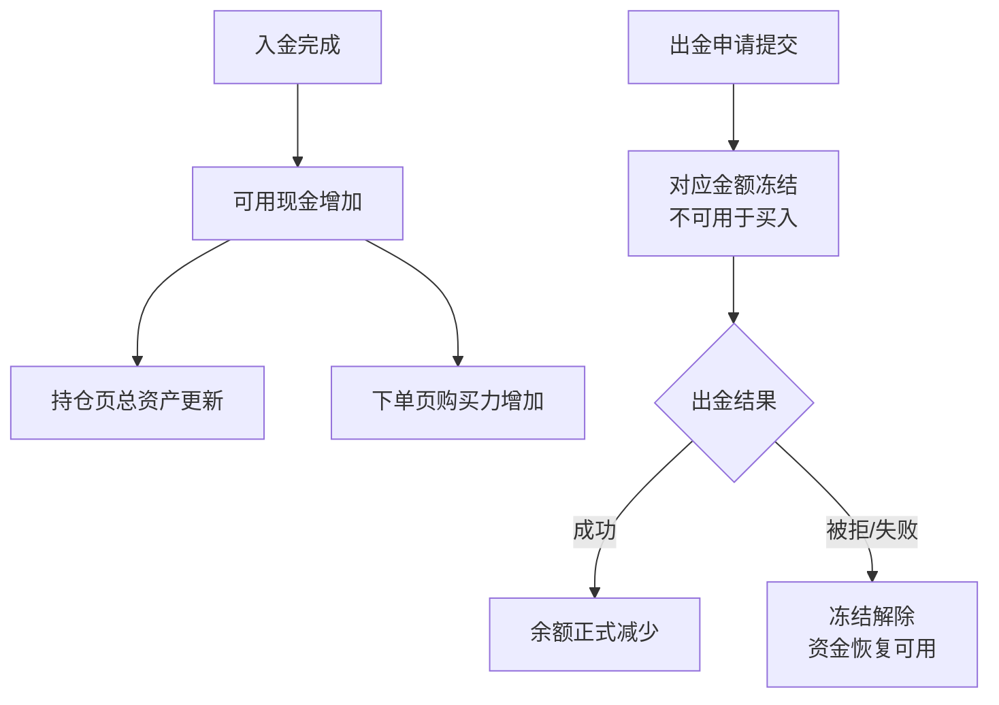
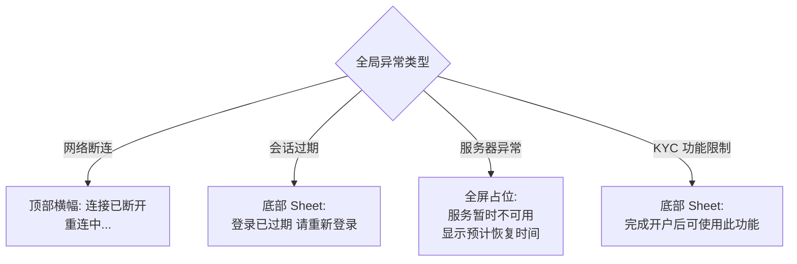

# PRD-07：跨模块交互规格

> **文档状态**: Phase 1 正式版
> **版本**: v2.1
> **日期**: 2026-03-15
> **变更说明**: v2.0 整改 — 移除代码伪码、Ledger 条目类型、数据库一致性规格（归入工程师文档），改用 Mermaid 图，聚焦产品层的模块触发逻辑与用户感知

> **低保真原型**：[消息通知 + 全局错误状态](prototypes/07-cross-module/index.html)

---

## 一、文档目的

本文档定义各功能模块之间的用户可感知触发关系：一个模块发生了什么，会如何影响其他模块的界面状态、可用权限和用户体验。供工程师理解产品意图，不规定实现方式。

---

## 二、模块依赖关系总图

---

## 三、认证状态 → 所有模块

### 3.1 登录状态变化的触发效果

| 触发事件 | 所有模块响应 |
|---------|------------|
| 用户登录成功 | 清除访客模式标识；加载用户个人数据（自选股、持仓、订单等） |
| 用户主动退出登录 | 清除本地缓存数据；所有模块返回访客/冷启动状态 |
| Token 自动刷新失败（会话过期） | 全局弹出"登录已过期"Sheet，引导重新登录；当前页面冻结（不允许操作） |
| 设备被远程踢出 | App 立即退出到冷启动页，显示"您已在新设备登录"提示 |

### 3.2 KYC 状态 → 各功能权限

**KYC 引导弹窗（任何模块触发拦截时展示）：**

| 状态 | 弹窗文案 | 操作按钮 |
|------|---------|---------|
| NOT_STARTED / IN_PROGRESS | "完成开户后即可开始交易，仅需约 15 分钟" | [立即开户] [稍后再说] |
| PENDING_REVIEW | "您的开户申请正在审核中，预计 1–2 个工作日完成" | [查看进度] [关闭] |
| NEEDS_MORE_INFO | "您的开户申请需要补充材料，请查看详情" | [去补件] [关闭] |
| REJECTED | "您的开户申请未通过，如有疑问请联系客服" | [联系客服] [关闭] |

---

## 四、行情 → 交易 / 持仓：跳转参数

### 4.1 股票详情页 → 下单页

从股票详情页点击"买入"或"卖出"进入下单页时，预填以下信息：

| 参数 | 来源 | 用途 |
|------|------|------|
| 股票代码 | 当前浏览的股票 | 下单标的预填，不可修改 |
| 委托方向 | 用户点击"买入"或"卖出" | 预选买/卖方向 |
| 当前市价参考 | 行情实时价格 | 限价单默认价格的参考 |
| 当前交易时段 | 行情模块计算 | 决定可用订单类型 |

> 数量不预填（用户需主动输入），详见 PRD-04 第 4.1 节"入口来源与预填规则"。

**交易时段对订单类型的限制：**

| 时段 | 可用订单类型 |
|------|------------|
| 常规交易时段（09:30–16:00 ET） | 市价单 + 限价单 |
| 盘前（04:00–09:30 ET） | 仅限价单（首次进入需确认风险） |
| 盘后（16:00–20:00 ET） | 仅限价单（首次进入需确认风险） |
| 休市（周末 / 节假日） | 禁止提交委托；仅展示行情 |
| 交易暂停（Trading Halt） | 买入/卖出按钮禁用，显示暂停原因 |

### 4.2 股票详情页 → 持仓详情（行情内嵌持仓区块）

股票详情页展示"个人持仓快速查看区"（仅已登录且有该股持仓时显示），区块内包含持仓摘要（股数、均价、浮动盈亏）。

| 交互 | 行为 |
|------|------|
| 点击持仓区块 | 跳转至持仓详情页（该股 position-detail），展示完整持仓信息 |
| 点击持仓区块内"买入"按钮 | 进入下单页，方向=买入，数量=空（同股票详情页买入行为）|
| 点击持仓区块内"卖出"按钮 | 进入下单页，方向=卖出，数量=预填全部可卖量 |
| 无持仓时 | 不显示此区块 |

> **原型参考**：[股票详情页持仓区块](prototypes/03-market/stock-detail.html)（页面中部"我的持仓"卡片）

---

## 五、交易 → 持仓：成交后的界面更新

> **原型参考**：[消息通知页（成交通知演示）](prototypes/07-cross-module/index.html)

**成交通知文案：**

| 场景 | 通知文案 |
|------|---------|
| 买入全部成交 | "已买入 AAPL 100 股，成交均价 $182.52" |
| 卖出全部成交 | "已卖出 TSLA 50 股，成交均价 $245.00，本次盈亏 +$500.00" |
| 部分成交 | "NVDA 委托部分成交：已成交 80 股，剩余 20 股等待成交" |
| 委托被拒绝 | "AAPL 委托被拒绝：[原因，如资金不足]" |
| 委托撤销成功 | "撤单成功：AAPL 限价委托 100 股已撤销，资金已解冻" |
| GTC 委托到期 | "AAPL GTC 委托（100 股 @ $180.00）已到期自动撤销" |

**T+1 结算对用户的影响（用户感知）：**

---

## 六、出入金 → 持仓：资金联动

**用户感知的余额变化时机：**

| 事件 | 用户看到的变化时机 |
|------|-----------------|
| 提交入金申请 | 无变化（仍等待银行处理） |
| 银行确认入金到账 | 可用现金增加 + 推送通知 |
| 提交出金申请 | 可提现金减少（被冻结），总资产不变 |
| 出金成功到账 | 可用现金减少 + 推送通知 |
| 出金被拒退款 | 冻结解除，余额恢复 + 推送通知 |

---

## 七、KYC → 出入金

### 7.1 姓名同名验证

银行卡绑定时，"账户持有人姓名"字段从 KYC 认证信息自动填充，**用户不可修改**。系统校验银行账户持卡人姓名与 KYC 法定姓名一致性（允许细微格式差异，如名字顺序、中间名省略）。

### 7.2 W-8BEN 生效对股息税的影响

- KYC 完成 W-8BEN 签署后，用户持有的美股所产生的股息预扣税率从 30%（默认）降至 10%（中美税收协定）
- W-8BEN 到期（3 年后）：股息税率自动恢复 30%；持仓页和个人中心显示警告提示

### 7.3 KYC Tier → 出入金限额实时校验

用户提交出入金申请时，系统根据当前 KYC Tier 实时校验：
- 本次金额 ≤ 单笔限额
- 今日累计金额 + 本次 ≤ 日限额
- 本月累计金额 + 本次 ≤ 月限额

超出时展示清晰提示（当前限额、已用额度、如何提升等级）。

---

## 八、全局异常状态

> **原型参考**：[全局错误状态演示](prototypes/07-cross-module/index.html)（点击顶部"全局错误状态"切换）

### 8.1 四种全局错误场景

### 8.2 各场景用户体验规则

| 异常类型 | 触发时机 | 展示方式 | 用户操作 |
|---------|---------|---------|---------|
| 网络断连 | 设备网络不可用 | 顶部悬浮横幅（不覆盖内容）| 等待自动重连；手动"重试" |
| 会话过期 | Token 刷新失败 | 底部 Sheet（不可关闭）| 必须重新登录 |
| 服务器异常 | API 返回 5xx | 当前页面内联错误 + 重试按钮 | 稍后重试；联系客服 |
| 功能 KYC 限制 | 未开户用户触碰交易/出入金 | 底部 Sheet（可关闭）| 去开户 / 稍后再说 |

### 8.3 网络断连期间的行为限制

| 操作 | 断网期间 |
|------|---------|
| 新下委托 | 禁止提交，按钮灰化 + "网络不可用" |
| 查看行情 | 显示最后缓存数据 + 时间戳标注 |
| 查看持仓/订单 | 显示最后缓存数据 |
| 出入金操作 | 禁止提交，提示待网络恢复后操作 |
| WebSocket 行情推送 | 停止；重连后自动恢复订阅 |

### 8.4 股票交易暂停（Trading Halt）

| 位置 | 展示 |
|------|------|
| 行情列表 | 该股票卡片显示"暂停"标签 |
| 股票详情页 | 顶部红色横幅："[代码] 交易暂时中止"，显示暂停时间 |
| 下单页 | 买入/卖出按钮禁用，显示暂停提示 + "恢复时提醒我"按钮 |
| 已有委托 | 已在队列中的委托继续挂单，等待恢复后处理 |

---

## 九、消息通知体系

> **原型参考**：[消息通知页](prototypes/07-cross-module/index.html)（默认展示）

### 9.1 通知分类与优先级

| 分类 | 事件 | 推送文案 | 优先级 |
|------|------|---------|--------|
| 交易 | 委托全部成交 | "已买入/卖出 [代码] [X]股 @ $[均价]" | 高 |
| 交易 | 委托部分成交 | "[代码] 委托部分成交：[X]/[Y] 股" | 普通 |
| 交易 | 委托被拒绝 | "[代码] 委托被拒绝：[原因]" | 高 |
| 交易 | GTC 委托即将到期 | "[代码] GTC 委托将在 3 天后到期，请确认是否继续" | 低 |
| 资金 | 入金到账 | "$[金额] 已成功存入您的账户，立即开始交易" | 高 |
| 资金 | 出金成功 | "$[金额] 已转至 [银行]****[后4位]" | 高 |
| 资金 | 微存款待验证 | "您的银行卡微存款已到账，请前往 App 完成验证" | 普通 |
| 账户安全 | 新设备登录 | "您的账号已在新设备 [设备名] 登录，如非本人请立即联系客服" | 高（不可关闭）|
| 开户 | KYC 审核通过 | "开户成功！您的账户已激活，立即入金开始交易" | 高 |
| 开户 | KYC 需补件 | "您的开户申请需要补充材料，请在 App 查看详情" | 高 |
| 开户 | W-8BEN 到期提醒 | "您的 W-8BEN 将在 [X] 天后到期，请及时续签以享受优惠税率" | 普通 |

### 9.2 通知权限管理

用户可在"我的 → 推送通知"中按类别开关：

| 开关类别 | 包含事件 | 是否可关闭 |
|---------|---------|----------|
| 交易通知 | 成交、拒绝、撤单、到期 | ✅ 可关闭 |
| 资金通知 | 入金、出金、微存款验证 | ✅ 可关闭 |
| 开户通知 | KYC 结果、W-8BEN | ✅ 可关闭 |
| 安全通知 | 新设备登录、账户异常 | ❌ 不可关闭 |

### 9.3 App 内消息中心

- 所有推送通知同步显示在"我的 → 消息"列表
- 支持按分类（交易 / 资金 / 账户）筛选
- 已读/未读状态；支持全部标记已读
- 消息保留 90 天

---

## 十、深度链接（通知点击跳转）

| 通知场景 | 点击后打开 |
|---------|----------|
| 委托成交通知 | 该笔订单详情页 |
| 入金/出金完成 | 资金中心页 |
| KYC 通过 | 持仓页（首次开户后引导入金） |
| KYC 补件通知 | KYC 补件对应步骤页 |
| 新设备登录告警 | 安全设置 → 设备管理页 |
| 微存款到账通知 | 银行卡验证页 |
| GTC 委托到期提醒 | 该笔委托详情页 |
| W-8BEN 到期提醒 | 税务信息页 |

---

## 十一、成功指标

| 指标 | 目标 | 测量方式 |
|------|------|---------|
| 成交推送到达率 | ≥ 98%（FCM/APNs 送达） | 推送平台统计 |
| 成交推送及时率 | 成交后 ≤ 10 秒推送到 App | 时间戳比对 |
| 通知点击率 | 交易通知点击率 ≥ 40% | 通知平台统计 |
| 全局错误场景覆盖 | 100% 的异常有用户可理解提示 | QA 场景覆盖验证 |

---

## 十二、依赖与风险

| 项目 | 说明 |
|------|------|
| 推送服务（FCM/APNs） | 推送供应商稳定性直接影响成交通知体验 |
| WebSocket 连接稳定性 | 频繁断连影响持仓实时更新体验 |
| 节假日日历维护 | T+1 结算日计算依赖美国节假日日历，需每年更新 |
| 待确认 | 消息保留期（90 天）是否满足用户需要，是否需要允许用户导出 |
