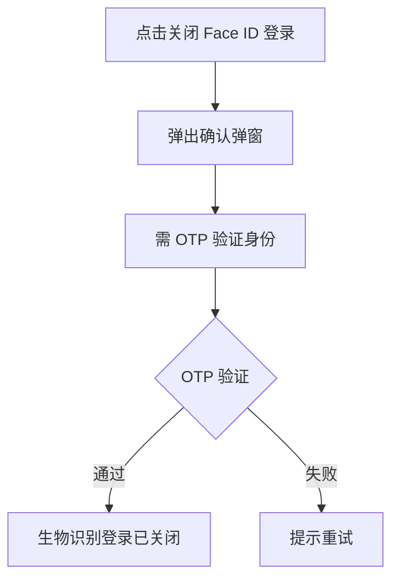
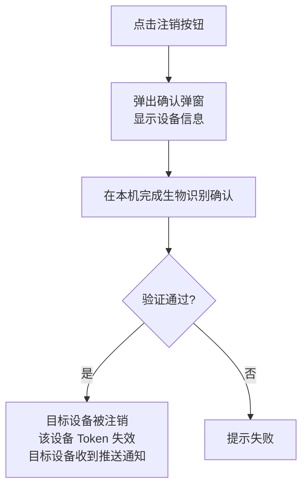
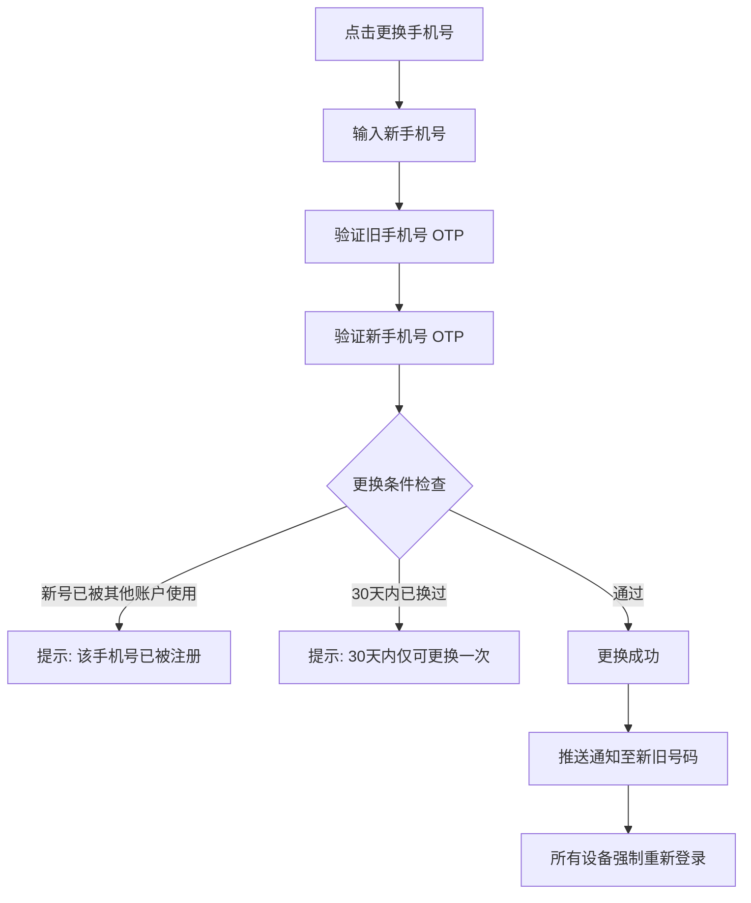
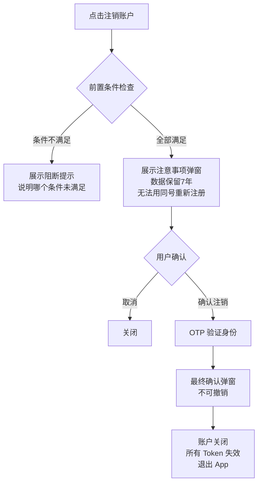

# PRD-08：设置与个人中心模块

> **文档状态**: Phase 1 正式版
> **版本**: v2.0
> **日期**: 2026-03-14
> **变更说明**: v2.0 整改 — 移除接口规格与数据模型，改用 Mermaid 流程图，保留产品功能范围与业务规则

> **低保真原型**：[个人中心](prototypes/08-settings-profile/index.html) · [安全设置](prototypes/08-settings-profile/settings.html) · [个人资料](prototypes/08-settings-profile/profile.html)

---

## 一、背景与问题

### 1.1 用户痛点

- 在证券 App 中找不到常用设置（如换手机号、管理设备）
- 不清楚自己的 KYC 等级是什么、影响什么
- 被陌生设备登录后，不知道如何快速处理
- 看不懂已签署的 W-8BEN 税务文件

### 1.2 业务价值

"我的"是用户信任度的信号点——账户信息清晰、安全管理便捷，可显著降低账户安全类投诉；合理引导 W-8BEN 续签可避免用户因税率变化流失。

---

## 二、目标用户与场景

| 用户 | 场景 |
|------|------|
| 安全意识强的用户 | 定期查看登录设备，发现异常立即处理 |
| 换手机的用户 | 需要更换登录手机号 |
| 税务关注用户 | 查看 W-8BEN 状态、了解税率 |
| 习惯 A 股的用户 | 更改涨跌颜色为红涨绿跌 |
| 想注销账户的用户 | 清仓后申请注销 |

---

## 三、功能范围

| 功能区 | 功能项 | Phase 1 | Phase 2 | 优先级 |
|--------|-------|---------|---------|--------|
| 个人中心 | 用户信息 + KYC 等级展示 | ✅ | - | Must |
| 个人中心 | 资产摘要快捷卡 | ✅ | - | Must |
| 个人资料 | KYC 信息查看（只读） | ✅ | - | Must |
| 个人资料 | W-8BEN 查看 / 续签 | ✅ | - | Must |
| 安全设置 | 生物识别开启/关闭 | ✅ | - | Must |
| 安全设置 | 登录设备管理 | ✅ | - | Must |
| 安全设置 | 更换手机号 | ✅ | - | Must |
| 安全设置 | 注销账户 | ✅（有前置条件）| - | Should |
| 安全设置 | 账户锁定（紧急冻结）| ✅ | - | Must |
| 通用设置 | 涨跌颜色方案 | ✅ | - | Must |
| 通用设置 | 推送通知管理 | ✅ | - | Must |
| 通用设置 | 语言设置 | Phase 1 仅中文 | ✅ 多语言 | - |
| 交易设置 | 默认订单类型 / TIF / 确认方式等 | ✅ | - | Must |
| 帮助支持 | 帮助中心 / 联系客服 | ✅ | - | Should |

---

## 四、"我的"主页设计

> **原型参考**：[个人中心](prototypes/08-settings-profile/index.html)

### 4.1 页面结构（从上到下）

1. **用户卡片**：头像 + 用户名 + KYC 等级徽标（Tier 1 / Tier 2）
2. **资产摘要快捷卡**：总资产 + 今日盈亏 + [入金] [出金] 快捷按钮
3. **功能入口菜单**（分组）：

| 分组 | 菜单项 |
|------|-------|
| 资金 | 银行卡管理、资金流水、交易确认书（Phase 2 占位）|
| 账户 | 个人资料、安全设置、通用设置、交易设置 |
| 消息 | 消息通知中心（Phase 2 占位）|
| 帮助 | 帮助中心、联系客服、关于 |
| — | 退出登录（红色）|

### 4.2 KYC 等级徽标说明

| 等级 | 徽标样式 | 含义 |
|------|---------|------|
| Tier 1 | 灰色 · 橙色边框 | KYC 提交中/审核中，可入金但额度受限 |
| Tier 2 | 绿色 · 已认证 ✅ | KYC 完全通过，享完整功能 |

点击徽标跳转 KYC 状态页（已通过则跳转个人资料页）。

---

## 五、个人资料页

> **原型参考**：[个人资料页](prototypes/08-settings-profile/profile.html)

### 5.1 信息展示（全部只读）

| 字段 | 脱敏规则 |
|------|---------|
| 姓名 | 全显 |
| 证件号码 | 中间隐藏（如 110101****0001） |
| 手机号 | 中间隐藏（如 +86 138****8888） |
| 邮箱 | 本地部分隐藏（如 zh***@gmail.com） |
| 开户日期 / 账户类型 / 账号 | 全显 |
| KYC 等级 | 全显 |

**为什么只读？**
- KYC 字段经过官方核验，不可自助修改
- 如需修改，在页面内显示"联系客服"入口

### 5.2 税务信息区

| 字段 | 展示 |
|------|------|
| 税务身份 | 非美国税务居民 / 美国税务居民 |
| W-8BEN 状态 | 有效（显示到期日）/ 已过期 / 未签署 |
| W-8BEN 操作 | [查看表单]（内嵌 PDF）/ [申请续签]（到期前 90 天激活）|
| 预扣税率 | 10%（协定税率）/ 30%（已过期或未申请协定）|

**W-8BEN 到期提示场景：**
- 到期前 90 天起：页面顶部黄色横幅 + 推送通知
- 到期后：页面顶部红色横幅（税率变为 30%），[立即续签] 按钮常驻

---

## 六、安全设置页

> **原型参考**：[安全设置](prototypes/08-settings-profile/settings.html)

### 6.1 生物识别管理

| 设置项 | 说明 |
|--------|------|
| 登录快捷验证（Face ID / 指纹） | 开启后，下次打开 App 可用生物识别代替 OTP |
| 下单生物识别确认 | 开启后，每次委托下单需要生物识别二次确认 |
| 出金生物识别确认 | **不可关闭**，出金强制要求生物识别确认 |

**关闭生物识别登录流程：**

### 6.2 登录设备管理

**设备列表显示：**
- 设备名称 + 平台 + 上次活跃时间
- 当前设备标注"本机"
- 其他设备显示"注销"按钮

**远程注销他人设备流程：**

### 6.3 更换手机号

> 高敏感操作，全程需要多重验证

### 6.4 账户注销

**前置条件（所有条件必须同时满足）：**

| 条件 | 说明 |
|------|------|
| 无持仓 | 持仓市值 = $0 |
| 无余额 | 可用现金 = $0 |
| 无待处理资金 | 无未完成的入金 / 出金申请 |
| 无未成交委托 | 无待成交订单 |

**注销流程：**

**注销后的数据处理（对用户说明）：**
> "注销后，您的账户将被关闭。根据法规要求，您的账户数据将被保留 7 年用于合规审计，不会被用于任何商业目的。注销后无法使用相同手机号重新注册。"

### 6.5 账户紧急锁定

针对"非本人操作"的紧急场景：

- 入口：安全设置 → 锁定账户
- 效果：立即冻结所有交易、出入金操作
- 解锁：需通过客服人工核验身份（1–3 个工作日）
- 锁定前显示明确警告："锁定后需联系客服才能解锁，可能影响您 1–3 个工作日的正常交易"

---

## 七、通用设置页

### 7.1 涨跌颜色方案

| 选项 | 涨色 | 跌色 | 默认规则 |
|------|------|------|---------|
| 红涨绿跌 | 红色 | 绿色 | +86（大陆）用户默认 |
| 绿涨红跌 | 绿色 | 红色 | +852（香港）用户默认 |

- 更改**立即生效**，全 App 同步
- 平盘（0.00%）始终显示灰色，不受此设置影响

### 7.2 推送通知管理

| 类别 | 是否可关闭 |
|------|----------|
| 交易通知（成交、撤单、拒绝、GTC 到期） | ✅ 可关闭 |
| 资金通知（入金、出金、微存款验证） | ✅ 可关闭 |
| 开户通知（KYC 结果、W-8BEN 提醒） | ✅ 可关闭 |
| 系统公告（维护、时间变更） | ✅ 可关闭 |
| 安全通知（新设备登录、异常活动） | ❌ **不可关闭** |

### 7.3 语言

Phase 1 仅支持中文（简体），不提供切换选项。界面显示语言设置入口，标注"目前仅支持中文，更多语言即将支持"。

---

## 八、交易设置页

（与 PRD-04 交易设置章节保持一致，此处为"我的"中的设置入口说明）

| 设置项 | 默认值 | 选项 |
|--------|--------|------|
| 默认订单类型 | 限价单 | 市价单 / 限价单 |
| 默认有效期 | 当日（DAY） | DAY / GTC |
| 委托确认方式 | 滑动 + 生物识别 | 滑动 + 生物识别 / 仅滑动 |
| 大额委托提醒阈值 | $10,000 | $5,000 / $10,000 / $20,000 |
| 价格偏离警告 | 5% | 3% / 5% / 10% / 关闭 |
| 允许盘前盘后交易 | 关闭 | 开启（首次需确认风险）/ 关闭 |

---

## 九、帮助与支持

| 入口 | 说明 |
|------|------|
| 帮助中心 | H5 页面（内嵌 WebView），包含常见问题、操作指引 |
| 联系客服 | Phase 1：在线聊天（工作时间 09:00–18:00 ET）；非工作时间显示工作时间说明 |
| 关于我们 | App 版本号、法律声明、隐私政策链接 |

---

## 十、合规要求

| 要求 | 适用规定 |
|------|---------|
| 个人信息展示脱敏 | PII 保护规则；证件号、手机号必须部分隐藏 |
| 账户注销数据保留 | SEC 17a-4、SFO；注销后数据仍需保留 7 年 |
| 更换手机号审计 | FINRA Rule 4511；所有变更记录审计日志 |
| W-8BEN 到期提醒 | IRS 要求；到期未续签恢复 30% 扣税 |
| 安全通知不可关闭 | 内部安全规则；新设备登录等告警必须触达用户 |

---

## 十一、异常与边界场景

| 场景 | 用户感知 | 处理 |
|------|---------|------|
| 注销条件不满足 | "您还有持仓/未提现资金，请处理后再申请注销" + 跳转对应页 | 逐项说明未满足的条件 |
| 更换手机号：号码已被注册 | "该手机号已绑定其他账户，请使用其他号码" | 阻断，不泄露账户信息 |
| 30天内重复换号 | "更换手机号每 30 天仅可操作一次，下次可操作日期：XXXX-XX-XX" | 阻断 |
| W-8BEN 过期，用户未续签 | 持仓页和个人中心顶部红色横幅提示 | 不影响交易，但股息税率变为 30% |
| 账户锁定后尝试操作 | "账户已锁定，如需解锁请联系客服" | 所有核心功能禁用 |

---

## 十二、成功指标

| 指标 | 目标 | 测量方式 |
|------|------|---------|
| 安全设置使用率 | 注册用户 30 日内查看设备管理 ≥ 30% | 页面 UV 统计 |
| 生物识别开启率 | 已开通账户用户生物识别开启 ≥ 60% | 功能使用率 |
| W-8BEN 续签及时率 | 到期前 30 天内续签 ≥ 85% | 续签行为分析 |
| 账户安全投诉率 | 因安全问题联系客服 ≤ 1% | 客服工单分类 |

---

## 十三、依赖与风险

| 项目 | 说明 |
|------|------|
| KYC 字段修改流程 | Phase 1 只读，需客服处理；Phase 2 可能开放自助修改（需法务确认） |
| W-8BEN 在线续签 | 需要和 KYC 流程共用税务申报步骤 |
| 多语言支持（Phase 2） | 需要设计翻译工作流，内容较多 |
| 待确认 | 注销账户后是否允许使用相同手机号重新注册（当前设计为不允许，需法务确认是否合理）|
