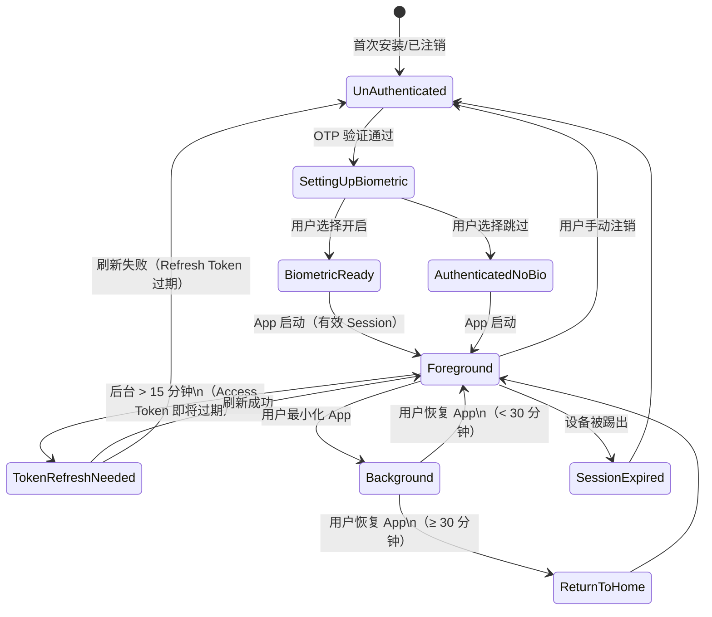

# Session 刷新策略

## 一、概述

移动应用在后台运行期间需要智能管理会话生命周期，避免：
- **用户体验差**：频繁要求重新登录
- **安全风险**：长期有效的令牌被盗用
- **数据一致性**：设备被踢出但用户继续使用旧 token

本文定义 App 冷启动/唤醒、Token 刷新、过期处理的完整逻辑。

---

## 二、核心定义

### 2.1 App 生命周期状态

```
App 启动时的状态判断逻辑：

┌─────────────────────────────────────┐
│ App 从后台返回前台（Foreground）    │
└──────────────┬──────────────────────┘
               ↓
    检查本地是否存在有效 Session
               ├─ Session 存在且未过期：查询 last_background_time
               │                ├─ < 30 分钟：静默刷新，进入上次页面
               │                └─ ≥ 30 分钟：刷新后进入行情首页
               │
               ├─ Session 存在但即将过期（< 15 分钟）：静默刷新
               │
               ├─ Session 已过期：返回冷启动页（清除所有会话）
               │
               └─ 无 Session（新安装或首次打开）：返回冷启动页
```

### 2.2 关键时间边界

| 定义 | 时间 | 用途 |
|------|------|------|
| **Access Token 有效期** | 15 分钟 | 短期身份凭证，频繁刷新 |
| **Refresh Token 有效期** | 7 天 | 长期凭证，用于获取新 access token |
| **静默刷新边界** | 即将过期 15 分钟内 | 主动检测并刷新 |
| **App 后台时间 Tier 1** | ≤ 30 分钟 | 恢复上次页面 |
| **App 后台时间 Tier 2** | > 30 分钟 | 返回行情首页（下一级别） |
| **强制重新登录边界** | Refresh Token 过期或被吊销 | 返回冷启动页 |

---

## 三、会话状态转换

### 3.1 完整状态机



### 3.2 关键状态定义

| 状态 | 条件 | 用户看到 | 行为 |
|------|------|---------|------|
| **Foreground** | App 在前台，Session 有效 | 正常 App | 正常使用 |
| **Background** | App 在后台，< 30min | —— | 异步刷新 token |
| **TokenRefreshNeeded** | Access Token 将过期 | —— | 拦截首个请求，刷新 token |
| **ReturnToHome** | App 后台 > 30min，返回 | 行情首页 | 刷新 token，回到默认页 |
| **SessionExpired** | Refresh Token 过期或被吊销 | "登录已过期，请重新登录" | 返回冷启动页 |
| **UnAuthenticated** | 无 Session | 冷启动页 | 等待 OTP 登录 |

---

## 四、App 状态变化流程

### 4.1 冷启动流程（App 从未启动或已注销）

```
App 启动
  ↓
检查本地 Session
  ├─ RefreshToken 不存在 → UnAuthenticated
  └─ RefreshToken 存在 → 继续
  ↓
检查 RefreshToken 有效性
  ├─ 过期（expires_at < NOW）→ UnAuthenticated
  └─ 有效 → 继续
  ↓
检查 AccessToken 有效性
  ├─ 有效（expires_at > NOW）→ Foreground
  └─ 过期 → 触发刷新（见 4.3）
  ↓
[显示冷启动页]
┌────────────────────┐
│  首页（登录入口）  │
│ [手机号登录]      │
│ [先逛逛]          │
│ [生物识别]         │
└────────────────────┘
```

### 4.2 已登录用户 App 再次冷启动（后台唤醒）

```
用户本地 Session：
  ├─ AccessToken: exp = 2026-04-01 10:45:00
  ├─ RefreshToken: exp = 2026-04-08 10:30:00
  ├─ LastBackgroundTime: 2026-04-01 10:35:00
  └─ CurrentTime: 2026-04-01 10:40:00（后台 5 分钟）
  ↓
App 启动
  ├─ 检查 RefreshToken：有效 ✓
  ├─ 检查 AccessToken：仍有效（exp > now） ✓
  ├─ 计算后台时长：5 分钟 < 30 分钟 → Tier 1
  └─ 决策：直接进入上次页面（无需 UI 加载）
  ↓
[后台异步，5 秒内完成]
  ├─ 调用 GET /auth/session/refresh（可选，优化：提前刷新）
  ├─ AccessToken 距过期 < 15 分钟？
  │   ├─ 是：发起刷新（见 4.3）
  │   └─ 否：跳过，继续使用当前 token
  └─ 继续加载页面内容
  ↓
用户恢复 App 后
  ├─ 如果后台刷新已完成：继续用新 token
  ├─ 如果后台刷新进行中：等待刷新完成（通常 < 2s）
  ├─ 如果后台刷新失败：首个 API 请求拦截，同步刷新
  └─ 如果已过期：弹出"登录已过期"提示，跳转冷启动页
```

**场景对照 Mobile PRD**：

| PRD 场景（§ 4.1） | Session 状态 | 本规范行为 |
|-----------------|----------|----------|
| Session 有效 + 已设置生物识别 | BiometricReady | 显示冷启动页 + Face ID 快捷入口 |
| Session 有效 + 未设置生物识别 | AuthenticatedNoBio | 静默刷新 Token，直接进入上次页面 |
| Session 即将过期（15 分钟内） | TokenRefreshNeeded | App 后台静默刷新，用户无感知 |
| Session 已过期 + 后台刷新失败 | SessionExpired | 返回冷启动页，弹出"登录已过期" |
| 用户主动退出登录 | UnAuthenticated | 始终进入冷启动页 |

### 4.3 Token 刷新流程（使用 Refresh Token）

```
触发条件：
  ├─ AccessToken 即将过期（< 15 分钟）
  ├─ 或用户显式调用刷新接口
  ├─ 或 API 返回 401 + reason="TOKEN_EXPIRED"
  └─ 或 App 从后台唤醒
  ↓
客户端发送：
  POST /api/v1/auth/token/refresh
  {
    "refresh_token": "rt-uuid",
    "device_id": "device-uuid"
  }
  
  Headers:
    X-Device-ID: device-uuid
    X-Idempotency-Key: uuid-v4（防重复提交）
  ↓
后端验证：
  ├─ 1. 提取 RefreshToken 的 jti（JWT ID）
  ├─ 2. 查询 Redis session:{device_id}
  ├─ 3. 检查 session.refresh_token_hash 是否匹配（防重放）
  ├─ 4. 检查 Refresh Token 是否在黑名单（已注销）
  ├─ 5. 验证 Token Claims（account_id, device_id, iat, exp）
  └─ 继续或返回 401 INVALID_REFRESH_TOKEN
  ↓
生成新 Access Token & Refresh Token：
  ├─ 新 AccessToken：
  │   ├─ exp = NOW + 15 minutes
  │   ├─ claims = {account_id, device_id, ...}
  │   └─ 签名使用 RS256 私钥
  │
  ├─ 新 RefreshToken：
  │   ├─ exp = NOW + 7 days
  │   ├─ jti = UUID v4（新 ID）
  │   ├─ single_use = true（单次使用）
  │   └─ 签名使用 RS256 私钥
  │
  └─ 注销旧 Refresh Token：
      ├─ 添加 jti 到 Redis 黑名单（TTL = 7 days）
      └─ 防止重放攻击
  ↓
更新 Redis session：
  ├─ Redis Key: session:{device_id}
  ├─ 更新字段：
  │   ├─ refresh_token_hash = SHA256(new_rt)
  │   ├─ refresh_token_iat = new_rt.iat
  │   ├─ refresh_token_exp = new_rt.exp
  │   └─ last_refresh_at = NOW
  ├─ TTL = 7 days（与 Refresh Token 过期时间同步）
  └─ 使用 Lua 脚本保证原子性
  ↓
响应客户端：
  {
    "access_token": "new-jwt-access",
    "refresh_token": "new-rt-uuid",
    "expires_in": 900,  // 15 分钟（秒）
    "token_type": "Bearer"
  }
  ↓
客户端保存：
  ├─ 新 AccessToken 存储到内存（或 secure storage）
  ├─ 新 RefreshToken 存储到 Keychain / EncryptedSharedPreferences
  ├─ 刷新本地 token_expires_at = NOW + 15 min
  └─ 继续首个 API 请求（自动使用新 token）
```

**注意：Refresh Token 单次使用设计**

这是一个安全特性，防止令牌泄露时被多次重用：
- 每次刷新颁发新的 Refresh Token
- 旧 Refresh Token 立即失效
- 若客户端再次使用旧 RT → 401 INVALID_REFRESH_TOKEN → 要求重新登录

### 4.4 被踢出设备的强制下线

```
后端检测到设备被踢出：
  ├─ devices.status = 'REMOTELY_KICKED'
  ├─ 将设备的所有 Refresh Token 加入黑名单
  └─ 发布 Kafka 事件：device.kicked
  ↓
被踢设备的客户端：
  ├─ 未来的 Token 刷新请求（若尝试）
  │   ├─ 调用 POST /auth/token/refresh
  │   ├─ 后端检查设备状态 = REMOTELY_KICKED
  │   └─ 返回 401 + reason="DEVICE_KICKED"
  │
  └─ 下次 API 请求（AccessToken 仍有效，但设备状态已变更）
      ├─ 中间件检查 devices.status（见 device-management.md § 4.4）
      ├─ 返回 401 + reason="DEVICE_KICKED"
      └─ 客户端清除会话，提示"该设备已在其他地点注销"
  ↓
[无需推送立即告知，用户下次使用 App 时发现]
（推送通知由 push-notification.md 单独处理）
```

---

## 五、客户端实现指南

### 5.1 本地 Session 存储结构（Dart）

```dart
// lib/models/session.dart

class LocalSession {
  final String? accessToken;
  final String? refreshToken;
  final DateTime accessTokenExpiresAt;
  final DateTime refreshTokenExpiresAt;
  final String deviceId;
  final DateTime? lastBackgroundTime;
  
  LocalSession({
    required this.accessToken,
    required this.refreshToken,
    required this.accessTokenExpiresAt,
    required this.refreshTokenExpiresAt,
    required this.deviceId,
    this.lastBackgroundTime,
  });
  
  // 检查 AccessToken 是否有效
  bool get isAccessTokenValid {
    return accessToken != null && 
           accessTokenExpiresAt.isAfter(DateTime.now());
  }
  
  // 检查是否需要刷新（< 15 分钟）
  bool get needsRefresh {
    if (!isAccessTokenValid) return true;
    final now = DateTime.now();
    final expiresIn = accessTokenExpiresAt.difference(now);
    return expiresIn.inMinutes < 15;
  }
  
  // 检查 RefreshToken 是否有效
  bool get isRefreshTokenValid {
    return refreshToken != null &&
           refreshTokenExpiresAt.isAfter(DateTime.now());
  }
  
  // 检查是否需要返回首页
  bool get shouldReturnHome {
    if (lastBackgroundTime == null) return false;
    final now = DateTime.now();
    final backgroundDuration = now.difference(lastBackgroundTime!);
    return backgroundDuration.inMinutes > 30;
  }
}
```

### 5.2 App 生命周期处理（Dart + Flutter）

```dart
// lib/services/session_manager.dart

class SessionManager extends WidgetsBindingObserver {
  final authService = AuthService();
  
  @override
  void didChangeAppLifecycleState(AppLifecycleState state) {
    switch (state) {
      case AppLifecycleState.resumed:
        _handleAppResume();
      case AppLifecycleState.paused:
      case AppLifecycleState.detached:
      case AppLifecycleState.inactive:
        _handleAppBackground();
      case AppLifecycleState.hidden:
        break;
    }
  }
  
  // App 从后台返回前台
  Future<void> _handleAppResume() async {
    final session = await getLocalSession();
    
    if (session == null || !session.isRefreshTokenValid) {
      // Session 过期，返回冷启动页
      _navigateToAuth();
      return;
    }
    
    // 记录后台持续时长
    final backgroundDuration = DateTime.now()
        .difference(session.lastBackgroundTime ?? DateTime.now());
    
    // 异步刷新 token（若需要）
    if (session.needsRefresh) {
      _silentRefresh();
    }
    
    // 决策：返回哪个页面
    if (backgroundDuration.inMinutes > 30) {
      _navigateToHome();
    } else {
      _navigateToLastPage();
    }
  }
  
  // App 进入后台
  void _handleAppBackground() async {
    final session = await getLocalSession();
    // 记录进入后台的时间
    await saveLastBackgroundTime(DateTime.now());
  }
  
  // 静默刷新 Token
  Future<void> _silentRefresh() async {
    try {
      final newToken = await authService.refreshToken();
      await saveLocalSession(newToken);
    } catch (e) {
      // 刷新失败，标记 Session 过期
      // 首个 API 请求时会处理 401
    }
  }
}
```

### 5.3 HTTP 拦截器（处理 401）

```dart
// lib/services/http_client.dart

class AMSHttpClient extends Dio {
  final authService = AuthService();
  
  AMSHttpClient() {
    // Token 刷新拦截器
    interceptors.add(
      InterceptorsWrapper(
        onRequest: (options, handler) {
          final session = authService.getLocalSession();
          if (session?.isAccessTokenValid ?? false) {
            options.headers['Authorization'] = 'Bearer ${session!.accessToken}';
          }
          return handler.next(options);
        },
        onError: (error, handler) async {
          // 401 错误处理
          if (error.response?.statusCode == 401) {
            final reason = error.response?.data['error_code'];
            
            if (reason == 'TOKEN_EXPIRED' || reason == 'INVALID_TOKEN') {
              // 尝试刷新 Token
              try {
                await authService.refreshToken();
                
                // 重试原始请求
                final session = authService.getLocalSession();
                error.requestOptions.headers['Authorization'] = 
                    'Bearer ${session!.accessToken}';
                return handler.resolve(
                    await dio.fetch(error.requestOptions));
              } catch (e) {
                // 刷新失败 → 清除会话，导航到冷启动页
                await authService.logout();
                // 显示 SnackBar："登录已过期，请重新登录"
                return handler.reject(error);
              }
            } else if (reason == 'DEVICE_KICKED') {
              // 设备被踢出 → 清除会话，显示告警
              await authService.logout();
              // 显示 SnackBar："该设备已在其他地点登录"
              return handler.reject(error);
            }
          }
          return handler.next(error);
        },
      ),
    );
  }
}
```

---

## 六、后端实现要点

### 6.1 Token 刷新端点（Go）

```go
// internal/transport/http/auth_handlers.go

func (h *AuthHandler) RefreshToken(w http.ResponseWriter, r *http.Request) {
    ctx := r.Context()
    
    var req struct {
        RefreshToken string `json:"refresh_token"`
        DeviceID     string `json:"device_id"`
    }
    
    if err := json.NewDecoder(r.Body).Decode(&req); err != nil {
        h.respondError(w, 400, "INVALID_REQUEST", err.Error())
        return
    }
    
    // 1. 验证 Refresh Token 签名
    refreshTokenClaims, err := h.jwtService.VerifyToken(req.RefreshToken)
    if err != nil {
        h.respondError(w, 401, "INVALID_REFRESH_TOKEN", "Invalid or expired token")
        return
    }
    
    accountID := refreshTokenClaims.AccountID
    deviceID := refreshTokenClaims.DeviceID
    
    // 2. 检查 Redis session
    session, err := h.sessionStore.Get(ctx, deviceID)
    if err != nil {
        h.respondError(w, 401, "SESSION_NOT_FOUND", err.Error())
        return
    }
    
    // 3. 验证 Refresh Token 哈希（防重放）
    rtHash := sha256.Sum256([]byte(req.RefreshToken))
    if hex.EncodeToString(rtHash[:]) != session.RefreshTokenHash {
        h.respondError(w, 401, "TOKEN_MISMATCH", 
            "Refresh token does not match session")
        return
    }
    
    // 4. 检查设备状态（是否被踢出）
    device, err := h.deviceRepo.FindByID(ctx, deviceID)
    if err != nil || device.Status != "ACTIVE" {
        h.respondError(w, 401, "DEVICE_KICKED", 
            "Device is no longer active")
        return
    }
    
    // 5. 生成新 AccessToken + RefreshToken
    newAccessToken, err := h.jwtService.IssueAccessToken(
        accountID, deviceID, 15*time.Minute)
    if err != nil {
        h.respondError(w, 500, "TOKEN_GENERATION_FAILED", err.Error())
        return
    }
    
    newRefreshToken, newJTI, err := h.jwtService.IssueRefreshToken(
        accountID, deviceID, 7*24*time.Hour, true) // single_use=true
    if err != nil {
        h.respondError(w, 500, "TOKEN_GENERATION_FAILED", err.Error())
        return
    }
    
    // 6. 更新 Redis session（原子操作）
    newRTHash := sha256.Sum256([]byte(newRefreshToken))
    err = h.sessionStore.UpdateRefreshToken(ctx, deviceID,
        hex.EncodeToString(newRTHash[:]), 7*24*time.Hour)
    if err != nil {
        h.respondError(w, 500, "SESSION_UPDATE_FAILED", err.Error())
        return
    }
    
    // 7. 加入黑名单（旧 Refresh Token）
    oldJTI := refreshTokenClaims.ID
    h.tokenBlacklist.Add(ctx, oldJTI, 7*24*time.Hour)
    
    // 8. 返回新 tokens
    w.Header().Set("Content-Type", "application/json")
    json.NewEncoder(w).Encode(map[string]interface{}{
        "access_token": newAccessToken,
        "refresh_token": newRefreshToken,
        "expires_in": 900,
        "token_type": "Bearer",
    })
    
    // 9. 发布审计日志
    h.auditLog.Log(ctx, "TOKEN_REFRESHED", map[string]interface{}{
        "account_id": accountID,
        "device_id": deviceID,
        "old_jti": oldJTI,
        "new_jti": newJTI,
    })
}
```

### 6.2 Token 验证中间件

```go
// internal/transport/http/middleware/jwt_auth.go

func JWTAuthMiddleware(jwtService JWTService) func(http.Handler) http.Handler {
    return func(next http.Handler) http.Handler {
        return http.HandlerFunc(func(w http.ResponseWriter, r *http.Request) {
            token := extractBearerToken(r)
            
            if token == "" {
                respondError(w, 401, "MISSING_TOKEN", "Missing authorization token")
                return
            }
            
            claims, err := jwtService.VerifyToken(token)
            if err != nil {
                respondError(w, 401, "INVALID_TOKEN", err.Error())
                return
            }
            
            // 检查是否在黑名单（针对已注销的 token）
            if jwtService.IsTokenBlacklisted(r.Context(), claims.ID) {
                respondError(w, 401, "TOKEN_REVOKED", "Token has been revoked")
                return
            }
            
            // 将 claims 存储到 context
            ctx := context.WithValue(r.Context(), "claims", claims)
            next.ServeHTTP(w, r.WithContext(ctx))
        })
    }
}
```

---

## 七、测试用例矩阵

| 场景 | 初始状态 | 操作 | 预期结果 | 验收标准 |
|------|---------|------|--------|---------|
| 30分钟内返回 | Session 有效 | 后台 15 分钟，返回 App | 进入上次页面 | 无需重新登录 |
| 30分钟后返回 | Session 有效 | 后台 45 分钟，返回 App | 进入行情首页 | 行情首页加载 |
| Token 即将过期 | AT exp 12 min | 后台刷新 | 新 AT 颁发 | 后续请求无 401 |
| Refresh Token 过期 | RT exp | 返回 App，尝试刷新 | 401 SESSION_EXPIRED | 返回冷启动页 |
| 设备被踢出 | Device status=KICKED | 尝试 API 请求 | 401 DEVICE_KICKED | 清除会话 |
| Token 单次使用 | 旧 RT 黑名单 | 再次使用旧 RT 刷新 | 401 TOKEN_REVOKED | 拒绝刷新 |

---

## 八、Changelog

| 版本 | 日期 | 变更 |
|------|------|------|
| v1.0 | 2026-04-01 | 初版发布：App 生命周期、Token 刷新、后台唤醒策略 |

---

## 参考资料

- `auth-architecture.md` — JWT 体系、Token 生命周期
- `device-management.md` — 设备被踢出流程
- `../../mobile/docs/prd/01-auth.md § 4.1` — Mobile PRD 冷启动要求
- `../../.claude/rules/financial-coding-standards.md` — 时间戳 UTC 要求
