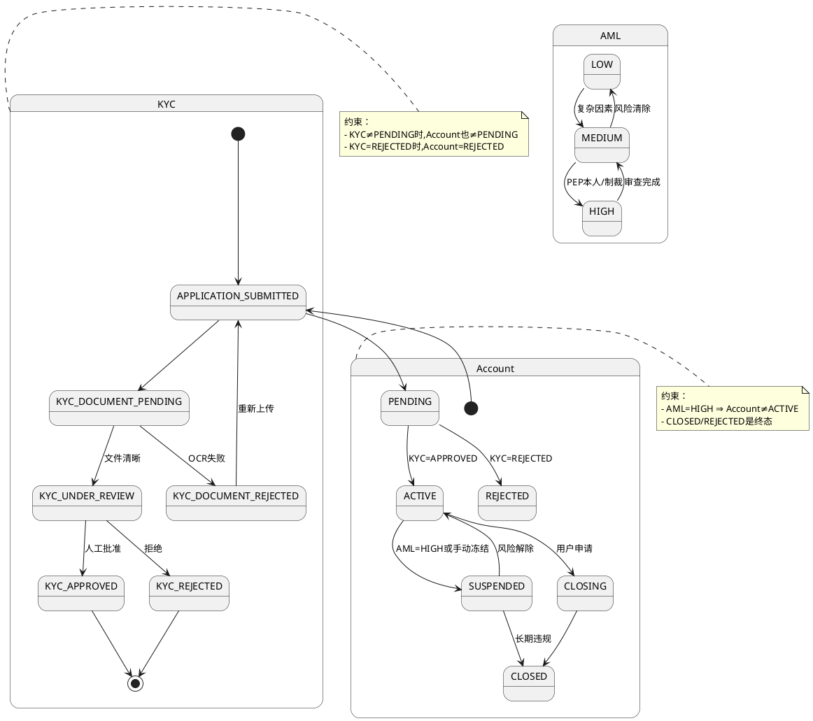

# 三向状态机关系规范

> **版本**: v1.0
> **日期**: 2026-03-31
> **作者**: AMS Engineer + Product Manager
> **状态**: Final — Ready for Implementation
>
> 本文档定义三个独立状态机（KYC、Account Lifecycle、AML Risk）之间的转换规则、有效状态元组、不变量约束，以及 Role-Based Visibility。

---

## 目录

1. [三个状态机定义](#1-三个状态机定义)
2. [有效状态元组](#2-有效状态元组)
3. [转换规则与依赖](#3-转换规则与依赖)
4. [不变量约束（Invariants）](#4-不变量约束invariants)
5. [Role-Based 可见性](#5-role-based-可见性)
6. [转换触发事件](#6-转换触发事件)
7. [Go 实现 — 状态验证器](#7-go-实现--状态验证器)
8. [SQL 约束](#8-sql-约束)
9. [PlantUML 状态图](#9-plantuml-状态图)

---

## 1. 三个状态机定义

### 1.1 KYC 工作流状态

```
KYC 状态代表用户身份验证进度

APPLICATION_SUBMITTED
    │ 用户提交基本信息 + 文件
    ▼
KYC_DOCUMENT_PENDING
    │ 等待 Sumsub OCR 结果
    ├─ OCR 失败 ──► KYC_DOCUMENT_REJECTED (需重新提交)
    │
    ▼
KYC_UNDER_REVIEW
    │ 人工审核（高风险、文件不清晰等）
    ├─ 拒绝 ──► KYC_REJECTED (终态)
    │
    ▼
KYC_APPROVED
    │ KYC 通过，可进行交易
    ▼
```

**枚举值**:
```go
const (
    KYCStatusApplicationSubmitted = "APPLICATION_SUBMITTED"
    KYCStatusDocumentPending      = "KYC_DOCUMENT_PENDING"
    KYCStatusUnderReview          = "KYC_UNDER_REVIEW"
    KYCStatusApproved             = "KYC_APPROVED"
    KYCStatusRejected             = "KYC_REJECTED"
)
```

### 1.2 Account Lifecycle 状态

```
Account 状态代表账户交易权限

APPLICATION_SUBMITTED
    │
    ▼
PENDING (KYC 进行中，无交易权限)
    │
    ├─ KYC 批准 ──► ACTIVE
    │
    └─ KYC 拒绝 ──► REJECTED (终态，无法逆转)

ACTIVE (正常，所有功能可用)
    │
    ├─ 合规冻结/异常交易 ──► SUSPENDED (限制交易/出入金)
    │
    └─ 用户主动申请 ──► CLOSING
                    │
                    ▼
                CLOSED (最终，历史数据保留)

SUSPENDED
    │
    ├─ 异常解除 ──► ACTIVE
    │
    └─ 长期违规 ──► CLOSED
```

**枚举值**:
```go
const (
    AccountStatusApplicationSubmitted = "APPLICATION_SUBMITTED"
    AccountStatusPending              = "PENDING"
    AccountStatusActive               = "ACTIVE"
    AccountStatusSuspended            = "SUSPENDED"
    AccountStatusRejected             = "REJECTED"
    AccountStatusClosing              = "CLOSING"
    AccountStatusClosed               = "CLOSED"
)
```

### 1.3 AML Risk 评分状态

```
AML Risk 是动态的，不是状态机，而是评分转移

LOW → MEDIUM → HIGH
 ▲               │
 └───────────────┘
     (风险解除)

LOW:    正常用户，无风险标记
MEDIUM: 有复杂因素（非居民、资金来源复杂、PEP 关联），需额外审核
HIGH:   高风险（PEP 本人、制裁、异常交易），需立即冻结
```

**评分值**:
```go
const (
    AMLRiskLow    = "LOW"
    AMLRiskMedium = "MEDIUM"
    AMLRiskHigh   = "HIGH"
)
```

---

## 2. 有效状态元组

### 2.1 完整的有效组合矩阵

| # | KYC | Account | AML Risk | 说明 | 可交易 | 可出金 |
|---|-----|---------|----------|------|--------|--------|
| 1 | APPROVED | ACTIVE | LOW | 🟢 完全激活 | ✅ | ✅ |
| 2 | APPROVED | ACTIVE | MEDIUM | ⚠️ 需人工审核 | ✅ | ⚠️ (审核) |
| 3 | APPROVED | ACTIVE | HIGH | 🔴 冻结，待审查 | ❌ | ❌ |
| 4 | PENDING | PENDING | — | 🟡 KYC 进行中 | ❌ | ❌ |
| 5 | APPROVED | SUSPENDED | * | 🔴 冻结 | ❌ | ❌ |
| 6 | REJECTED | REJECTED | — | ❌ 终态 | ❌ | ❌ |
| 7 | APPROVED | CLOSING | * | 🟡 关账过程 | ❌ | ⚠️ |
| 8 | APPROVED | CLOSED | * | ✅ 终态（数据保留） | ❌ | ❌ |

**规则**:
```
有效状态元组检查清单：
├─ KYC=PENDING → Account 必须 PENDING/REJECTED
├─ KYC=APPROVED → Account 可以 ACTIVE/SUSPENDED/CLOSING/CLOSED
├─ KYC=REJECTED → Account 必须 REJECTED
├─ Account=CLOSED → KYC 任意值（历史账户）
├─ Account=ACTIVE 且 AML=HIGH → 自动转入 SUSPENDED (异常)
└─ Account=SUSPENDED 且 AML=LOW → 可回归 ACTIVE (条件解除)
```

---

## 3. 转换规则与依赖

### 3.1 KYC 状态转换

```
APPLICATION_SUBMITTED → KYC_DOCUMENT_PENDING
  触发：用户提交文件到 Sumsub
  验证：文件格式、大小合法

KYC_DOCUMENT_PENDING → {KYC_UNDER_REVIEW | KYC_DOCUMENT_REJECTED}
  触发：Sumsub Webhook 返回 OCR 结果
  规则：
    ├─ 高清晰度文件 ──► KYC_UNDER_REVIEW (人工审核)
    ├─ OCR 失败/不清晰 ──► KYC_DOCUMENT_REJECTED (允许重新上传)
    └─ 文件缺失/格式错误 ──► KYC_DOCUMENT_REJECTED

KYC_UNDER_REVIEW → {KYC_APPROVED | KYC_REJECTED}
  触发：合规人员手动审批
  规则：
    ├─ 文件真实、身份确认 ──► KYC_APPROVED
    ├─ 文件伪造/欺诈迹象 ──► KYC_REJECTED (不可逆)
    └─ 需补充资料 ──► 回到 APPLICATION_SUBMITTED (允许重新开户)

KYC_REJECTED → (终态，不可转移)

KYC_APPROVED → (稳定，仅变更为 REJECTED 如欺诈检测)
```

### 3.2 Account 状态转换

```
APPLICATION_SUBMITTED → PENDING
  触发：用户完成基本注册
  验证：邮箱确认、电话验证

PENDING → {ACTIVE | REJECTED}
  触发：KYC 状态变更
  规则：
    ├─ KYC=APPROVED → Account=ACTIVE
    └─ KYC=REJECTED → Account=REJECTED

ACTIVE → {SUSPENDED | CLOSING}
  触发：
    ├─ Compliance 手动冻结 ──► SUSPENDED (原因: AML_HIGH, SAR_FILED, etc.)
    ├─ 异常交易检测 ──► SUSPENDED
    └─ 用户申请关户 ──► CLOSING

SUSPENDED → {ACTIVE | CLOSED}
  触发：
    ├─ AML 风险解除 ──► ACTIVE (风险从 HIGH → MEDIUM)
    └─ 人工审核通过 ──► ACTIVE
    └─ 长期违规 ──► CLOSED

CLOSING → CLOSED
  触发：等待期过后（如 7 天，处理最后的出金请求）
  验证：所有持仓清空，余额为零

CLOSED/REJECTED → (终态，数据永久保留)
```

### 3.3 AML Risk 转换

```
LOW ──{PEP 关联 / 非居民}──► MEDIUM
MEDIUM ──{PEP 本人 / 制裁命中}──► HIGH
HIGH ──{EDD 完成，风险解除}──► MEDIUM
MEDIUM ──{风险清除}──► LOW

自动触发：
├─ ComplyAdvantage Webhook 命中 ──► HIGH
├─ 制裁列表新增 ──► HIGH
├─ 异常交易模式 ──► MEDIUM → HIGH
└─ 人工审核解除 ──► * → MEDIUM
```

---

## 4. 不变量约束（Invariants）

### 4.1 数据库级约束

```sql
-- 约束 1: KYC 与 Account 的隐含约束
CHECK (
    (kyc_status = 'APPROVED' AND account_status IN ('ACTIVE', 'SUSPENDED', 'CLOSING', 'CLOSED'))
    OR (kyc_status = 'PENDING' AND account_status = 'PENDING')
    OR (kyc_status = 'REJECTED' AND account_status = 'REJECTED')
    OR account_status IN ('CLOSING', 'CLOSED')  -- 历史账户无 KYC 要求
)

-- 约束 2: HIGH 风险自动冻结
CHECK (
    NOT (aml_risk_score = 'HIGH' AND account_status = 'ACTIVE')
)

-- 约束 3: CLOSED 和 REJECTED 是终态
CHECK (
    account_status IN ('APPLICATION_SUBMITTED', 'PENDING', 'ACTIVE', 'SUSPENDED', 'CLOSING')
    OR (account_status = 'CLOSED' AND closed_at IS NOT NULL)
    OR (account_status = 'REJECTED' AND rejected_at IS NOT NULL)
)

-- 约束 4: 状态转换时间戳单调递增
CHECK (
    application_submitted_at <= pending_at
    AND pending_at <= active_at
    AND active_at <= suspended_at
    AND suspended_at <= closed_at
)
```

### 4.2 应用层约束

```go
type StateTransitionValidator struct {
    oldKYC     string
    oldAccount string
    oldAML     string
    newKYC     string
    newAccount string
    newAML     string
}

func (v *StateTransitionValidator) Validate() error {
    // 1. 检查是否为有效元组
    if !isValidStateTuple(v.newKYC, v.newAccount, v.newAML) {
        return fmt.Errorf("invalid state tuple: KYC=%s, Account=%s, AML=%s",
            v.newKYC, v.newAccount, v.newAML)
    }

    // 2. 检查转换是否允许
    if !isAllowedTransition(v.oldKYC, v.newKYC) {
        return fmt.Errorf("KYC: %s → %s not allowed", v.oldKYC, v.newKYC)
    }

    if !isAllowedTransition(v.oldAccount, v.newAccount) {
        return fmt.Errorf("Account: %s → %s not allowed", v.oldAccount, v.newAccount)
    }

    // 3. 检查相关约束
    if v.newAML == AMLRiskHigh && v.newAccount == AccountStatusActive {
        return fmt.Errorf("cannot be ACTIVE with HIGH AML risk")
    }

    if isTerminalState(v.oldAccount) && v.newAccount != v.oldAccount {
        return fmt.Errorf("cannot transition from terminal state %s", v.oldAccount)
    }

    return nil
}
```

---

## 5. Role-Based 可见性

### 5.1 字段级别访问控制

```
┌─────────────────────┬──────────┬─────────┬──────────────┬────────────┐
│ 字段                 │ Customer │ Ops     │ Compliance   │ Admin      │
├─────────────────────┼──────────┼─────────┼──────────────┼────────────┤
│ kyc_status          │ ✅ 自己  │ ✅ 全部 │ ✅ 全部      │ ✅ 全部    │
│ account_status      │ ✅ 自己  │ ✅ 全部 │ ✅ 全部      │ ✅ 全部    │
│ aml_risk_score      │ ❌       │ ⚠️ 脱敏 │ ✅ 全部      │ ✅ 全部    │
│ sar_filing_count    │ ❌       │ ❌      │ ✅ 仅自己    │ ✅ 全部    │
│ sar_last_filed_at   │ ❌       │ ❌      │ ✅ 仅自己    │ ✅ 全部    │
│ aml_flags (JSON)    │ ❌       │ ⚠️ 脱敏 │ ✅ 全部      │ ✅ 全部    │
└─────────────────────┴──────────┴─────────┴──────────────┴────────────┘
```

**脱敏规则**:
```go
// Ops 看到脱敏版本
{
  "kyc_status": "APPROVED",
  "account_status": "ACTIVE",
  "aml_risk_score": "MEDIUM",  // ✅ 显示，但隐藏具体因素
  "aml_flags": "[REDACTED]",   // ❌ 完全隐藏 SAR 信息
}

// Compliance 看到完整版本
{
  "kyc_status": "APPROVED",
  "account_status": "ACTIVE",
  "aml_risk_score": "MEDIUM",
  "aml_flags": {
    "pep_status": "NON_HK_PEP",
    "high_risk_country": false,
    "sanctions_hit": null,
    "sar_filed": true,
    "sar_filed_at": "2026-03-20T10:00:00Z",
    "sar_count": 1,
  }
}
```

---

## 6. 转换触发事件

每次转换产生不可变审计事件：

```go
type StateTransitionEvent struct {
    EventID          string
    AccountID        string
    OldKYCStatus     string
    NewKYCStatus     string
    OldAccountStatus string
    NewAccountStatus string
    OldAMLRisk       string
    NewAMLRisk       string
    Actor            string           // user_id or "system"
    ActorType        string           // CUSTOMER, COMPLIANCE_OFFICER, ADMIN, SYSTEM
    Reason           string           // 转换原因代码
    ReasonDetails    string           // 具体说明
    Timestamp        time.Time        // UTC
}

// 例如：KYC 批准导致账户激活
StateTransitionEvent{
    EventID: "evt-xxx",
    AccountID: "acc-yyy",
    OldKYCStatus: "UNDER_REVIEW",
    NewKYCStatus: "APPROVED",
    OldAccountStatus: "PENDING",
    NewAccountStatus: "ACTIVE",
    Actor: "comp-officer-001",
    ActorType: "COMPLIANCE_OFFICER",
    Reason: "KYC_APPROVED",
    ReasonDetails: "All identity documents verified, no fraud indicators",
    Timestamp: time.Now().UTC(),
}
```

---

## 7. Go 实现 — 状态验证器

```go
// internal/account/state_machine.go

package account

import "fmt"

type StateValidator struct {
    allowedTransitions map[string]map[string]bool
}

func NewStateValidator() *StateValidator {
    return &StateValidator{
        allowedTransitions: map[string]map[string]bool{
            "KYC": {
                "APPLICATION_SUBMITTED": {"KYC_DOCUMENT_PENDING": true},
                "KYC_DOCUMENT_PENDING":  {"KYC_UNDER_REVIEW": true, "KYC_DOCUMENT_REJECTED": true},
                "KYC_UNDER_REVIEW":      {"KYC_APPROVED": true, "KYC_REJECTED": true},
                "KYC_APPROVED":          {},
                "KYC_REJECTED":          {},
            },
            "ACCOUNT": {
                "APPLICATION_SUBMITTED": {"PENDING": true},
                "PENDING":               {"ACTIVE": true, "REJECTED": true},
                "ACTIVE":                {"SUSPENDED": true, "CLOSING": true},
                "SUSPENDED":             {"ACTIVE": true, "CLOSED": true},
                "CLOSING":               {"CLOSED": true},
                "CLOSED":                {},
                "REJECTED":              {},
            },
        },
    }
}

func (sv *StateValidator) ValidateTransition(
    oldKYC, newKYC,
    oldAccount, newAccount,
    oldAML, newAML string) error {

    // 1. 检查有效的状态元组
    if !sv.isValidTuple(newKYC, newAccount, newAML) {
        return fmt.Errorf("invalid state tuple")
    }

    // 2. 检查 KYC 转换
    if oldKYC != newKYC {
        if !sv.isAllowedTransition("KYC", oldKYC, newKYC) {
            return fmt.Errorf("KYC: %s → %s not allowed", oldKYC, newKYC)
        }
    }

    // 3. 检查 Account 转换
    if oldAccount != newAccount {
        if !sv.isAllowedTransition("ACCOUNT", oldAccount, newAccount) {
            return fmt.Errorf("Account: %s → %s not allowed", oldAccount, newAccount)
        }
    }

    // 4. 不变量检查
    if newAML == "HIGH" && newAccount == "ACTIVE" {
        return fmt.Errorf("cannot be ACTIVE with HIGH AML risk")
    }

    return nil
}

func (sv *StateValidator) isValidTuple(kyc, account, aml string) bool {
    // ... 实现有效元组检查
    return true
}

func (sv *StateValidator) isAllowedTransition(machine, from, to string) bool {
    transitions, exists := sv.allowedTransitions[machine]
    if !exists {
        return false
    }

    allowed, exists := transitions[from]
    return exists && allowed
}
```

---

## 8. SQL 约束

```sql
ALTER TABLE accounts ADD CONSTRAINT chk_valid_state_tuple
CHECK (
    (kyc_status = 'APPROVED' AND account_status IN ('ACTIVE', 'SUSPENDED', 'CLOSING', 'CLOSED'))
    OR (kyc_status IN ('APPLICATION_SUBMITTED', 'KYC_DOCUMENT_PENDING', 'KYC_UNDER_REVIEW')
        AND account_status IN ('APPLICATION_SUBMITTED', 'PENDING'))
    OR (kyc_status = 'REJECTED' AND account_status = 'REJECTED')
    OR (account_status IN ('CLOSING', 'CLOSED'))
);

ALTER TABLE accounts ADD CONSTRAINT chk_aml_high_not_active
CHECK (NOT (aml_risk_score = 'HIGH' AND account_status = 'ACTIVE'));

ALTER TABLE accounts ADD CONSTRAINT chk_terminal_states
CHECK (
    (account_status != 'CLOSED' OR closed_at IS NOT NULL)
    AND (account_status != 'REJECTED' OR rejected_at IS NOT NULL)
);
```

---

## 9. PlantUML 状态图



---

## 总结

本规范定义了：
- ✅ 三个独立状态机的完整转换图
- ✅ 有效状态元组的穷举矩阵
- ✅ 跨状态机的不变量约束
- ✅ Role-based 字段级可见性
- ✅ 事件审计与追踪
- ✅ 数据库级与应用层双重约束
- ✅ Go 状态验证器实现

**Implementation Priority**:
1. Go StateValidator（1 天）
2. SQL 约束迁移（0.5 天）
3. 审计事件发布（1 天）
4. Role-based 访问控制（1 天）
