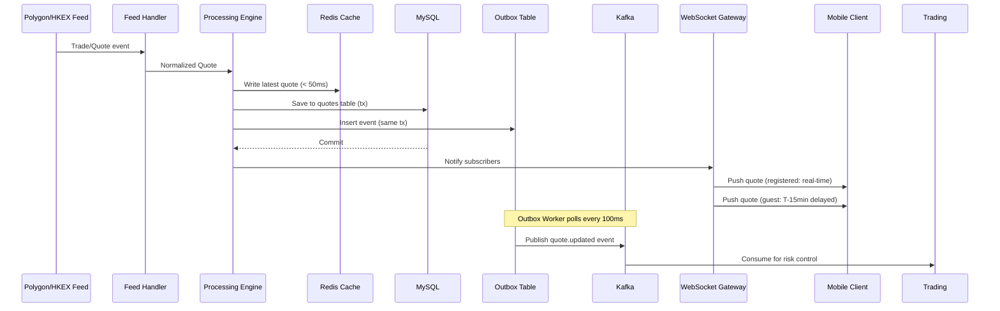

# Service Overview -- Market Data

## 1. Architecture Narrative

Market Data Service provides real-time and historical market data for US (NYSE/NASDAQ) and HK (HKEX) equities. The service ingests quotes from external feeds (Polygon API for US, HKEX feed for HK), processes them through a high-throughput pipeline, caches in Redis for sub-second access, and distributes via WebSocket (mobile clients), Kafka (internal services), and REST APIs.

### Core Capabilities

- **Real-time quote ingestion**: Feed handlers connect to Polygon/HKEX, normalize to internal format
- **Sub-second caching**: Redis stores latest quotes with < 50ms write latency (P99)
- **Dual-track WebSocket push**: Registered users get real-time (tick-level), guests get 15-min delayed (5s interval)
- **K-line aggregation**: Tick data → OHLCV bars (1min/5min/15min/30min/1h/1D/1W/1M)
- **Search & discovery**: FULLTEXT search on symbol/name (English + Pinyin), hot rankings cache
- **Watchlist management**: User-scoped favorites with 100-symbol limit

## 2. Data Flow Pipeline

## 3. Subdomain Mapping

### 3.1 Quote Subdomain (Complex DDD)

- **Domain**: Quote entity, MarketStatus entity, StaleDetector service, QuoteUpdatedEvent
- **Application**: UpdateQuote, GetQuote, GetMarketStatus use cases
- **Infrastructure**: MySQL QuoteRepository, Redis QuoteCacheRepository, Kafka OutboxRepository
- **Transport**: HTTP handlers, gRPC handlers, WebSocket gateway

### 3.2 KLine Subdomain (Degenerate)

- **Domain**: KLine entity, KLineRepository interface
- **Application**: AggregateKLine, GetKLines use cases
- **Infrastructure**: MySQL KLineRepository
- **Transport**: HTTP handler

### 3.3 Watchlist Subdomain (Degenerate)

- **Domain**: WatchlistItem entity, WatchlistRepository interface
- **Application**: AddToWatchlist, RemoveFromWatchlist, GetWatchlist use cases
- **Infrastructure**: MySQL WatchlistRepository
- **Transport**: HTTP handler

### 3.4 Search Subdomain (Degenerate)

- **Domain**: Stock entity, SearchRepository, HotSearchRepository interfaces
- **Application**: SearchStocks, GetHotSearch use cases
- **Infrastructure**: MySQL SearchRepository, Redis HotSearchRepository
- **Transport**: HTTP handler

## 4. Dual-Track Push Model

### 4.1 Registered Users (Real-Time)

- WebSocket auth with valid JWT → `user_type=registered`
- Subscribe → immediate snapshot from Redis LocalQuoteCache
- Subsequent updates: tick-level push (no throttling)
- Message includes `"delayed": false`
- Latency target: < 500ms end-to-end (P99)

### 4.2 Guest Users (15-Min Delayed)

- WebSocket auth with no token or `user_type=guest`
- Subscribe → snapshot from DelayedQuoteRingBuffer[T-15min]
- Subsequent updates: 5-second interval push from RingBuffer
- Message includes `"delayed": true`
- UI displays "Delayed 15 min" label

### 4.3 Reauth Flow

- Guest user logs in → sends `reauth` message with new JWT
- Server validates token → switches connection to `registered`
- Immediate real-time snapshot push (catch-up)
- Mobile displays 500ms price transition animation

## 5. References

- **Full system design**: `docs/specs/market-data-system.md` (v2.1)
- **REST API spec**: `docs/specs/market-api-spec.md` (v2.1)
- **WebSocket protocol**: `docs/specs/websocket-spec.md` (v2.1)
- **Data flow details**: `docs/specs/data-flow.md` (v2.1)
- **Business rules**: `docs/specs/business-rules.md` (v1.0)
